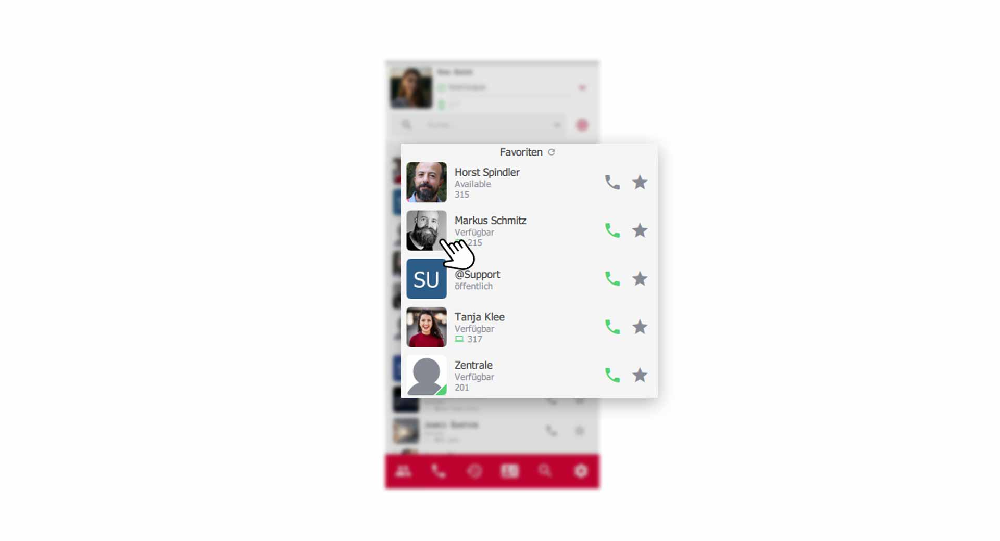
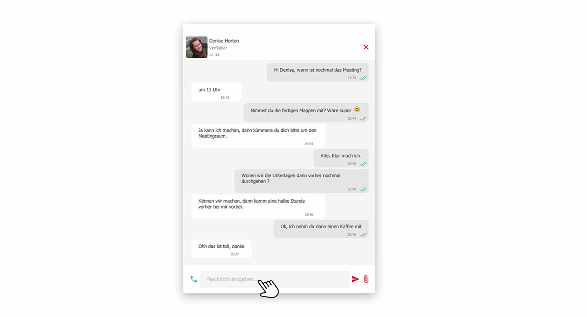
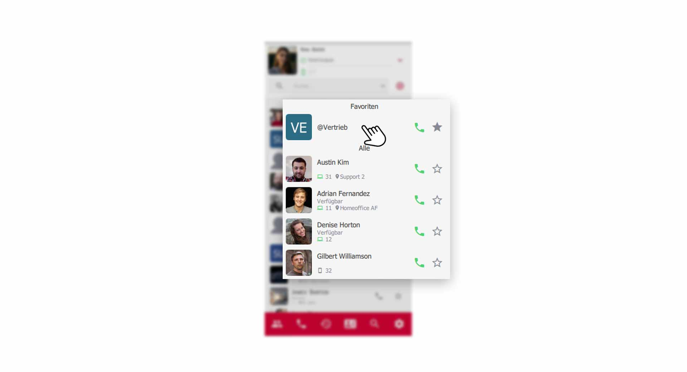
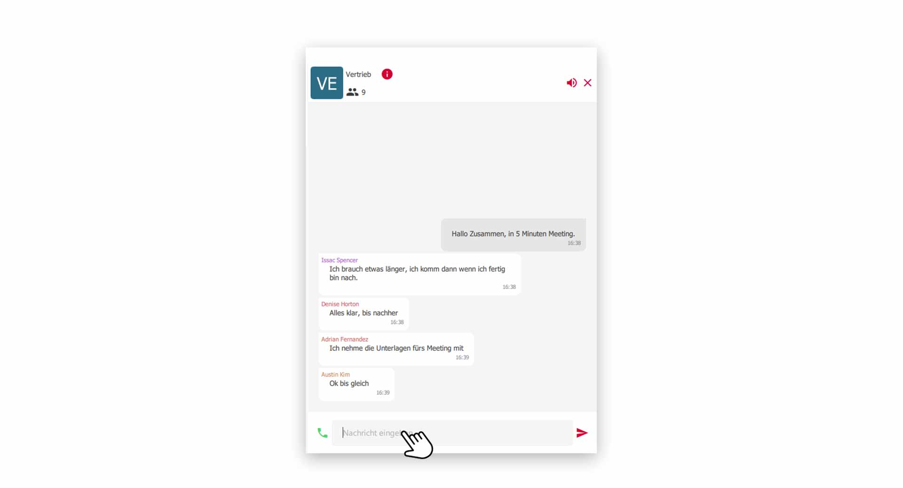
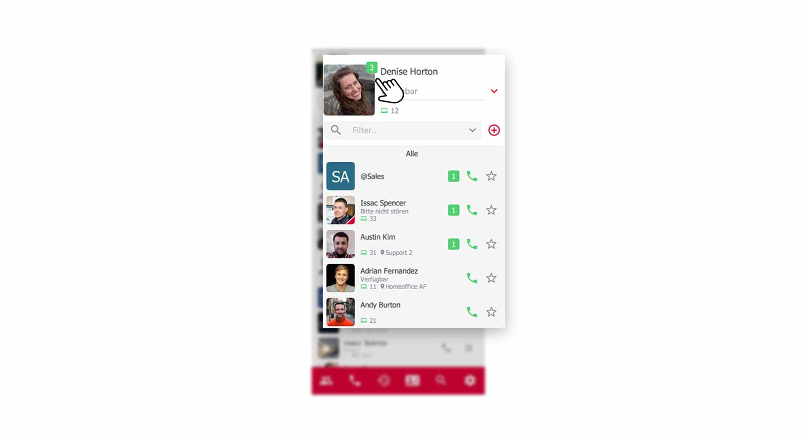

 


## Mit Kollegen chatten

Schnell Informationen mit einem Kollegen austauschen, ist heutzutage ein unverzichtbares Werkzeug in der Geschäftskommunikation geworden. Im pascom Client klicken Sie ganz einfach in der **Kontaktliste** auf einen Kollegen um die Chat-Konversation zu öffnen.

*Chat-Konversation öffnen aus der Kontaktliste heraus*
 

*Chat-Konversation geöffnet*
 

### Chat Nachricht verfassen

1. Geben Sie im unteren **Eingabefeld** Ihre Nachricht ein und senden Sie die Nachricht mit Klick auf den **roten Sendepfeil** oder durch drücken der **Enter-Taste**.

## Gruppen-Chat mit mehreren Kollegen

Für Gruppen-Chat-Räume benötigen Sie zuerst eine pascom Gruppe die Sie mit folgender [Anleitung](Link zu pascom Gruppen) erstellen können.

Klicken Sie in Ihrer Kontaktliste auf die **Gruppe** um die Chat-Konversation zu öffnen.

*Gruppen-Chat öffnen über die Kontaktliste*
 

Der dynamische Kontentbereich bzw. das Ansichtsfenster zeigt Ihnen dann die Chat-Konversation der Gruppe an.

*Gruppen-Chat mit mehreren Teilnehmern*
 

1. Verfassen Sie wie gewohnt Ihre Nachricht im **Eingabefeld** und senden Sie diese mit Klick auf den **roten Sendepfeil** oder durch drücken der **Enter-Taste**.

## Chat schließen

1. Schließen Sie die aktuelle Chat-Konversation rechts oben mit Klick auf das **rote X-Symbol**. 

{}
Schließen Sie eine Chat-Konversation und haben bereits eine Nachricht verfasst, jedoch noch nicht abgeschickt, so speichert der pascom Client das bereits Geschriebene und Sie können später die Bearbeitung fortsetzten. So lässt sich zwischen Chat-Konversationen hin-und her springen.
{}

## Chat Benachrichtigungen

Ist der Konversations-Bereich nicht im Fokus, und Sie erhalten eine neue Nachricht, so erscheint in der **Kontaktliste am Profilbild** und am jeweiligen **Kontakt** eine Hinweismeldung. Am Profilbild erkennen Sie immer die gesamten, noch nicht gelesenen, Nachrichten. Kontakte mit neuen Nachrichten, rutschen in der Kontaktliste automatisch nach oben, sofern die Sortierung so eingestellt wurde.

*Chat-Hinweismeldung in der Kontaktliste*
 

