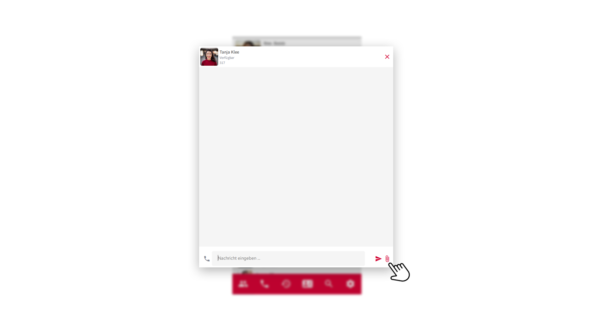
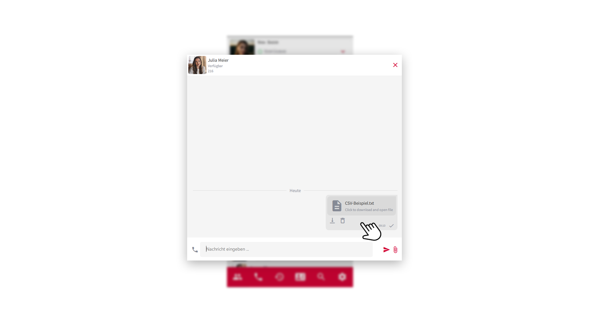
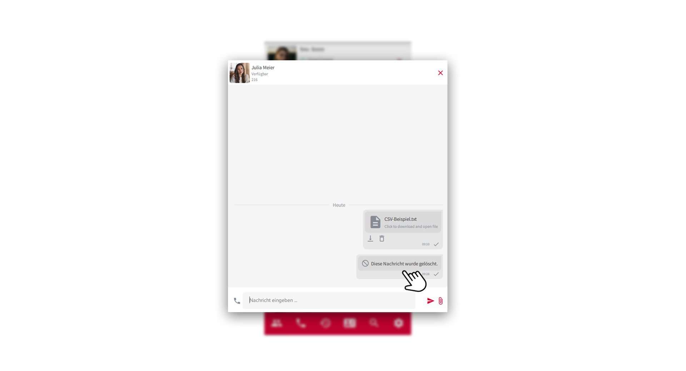
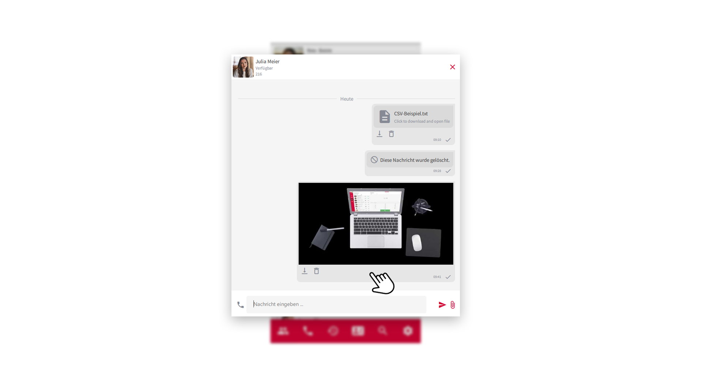

 


## Mit Kollegen chatten

Schnell Informationen mit einem Kollegen austauschen, ist heutzutage ein unverzichtbares Werkzeug in der Geschäftskommunikation geworden. Im pascom Client klicken Sie ganz einfach in der **Kontaktliste** auf einen Kollegen um die Chat-Konversation zu öffnen.

*Chat-Konversation öffnen aus der Kontaktliste heraus*
 

*Chat-Konversation geöffnet*
 

### Chat Nachricht verfassen

1. Geben Sie im unteren **Eingabefeld** Ihre Nachricht ein und senden Sie die Nachricht mit Klick auf den **roten Sendepfeil** oder durch drücken der **Enter-Taste**.

## Gruppen-Chat mit mehreren Kollegen

Für Gruppen-Chat-Räume benötigen Sie zuerst eine pascom Gruppe die Sie mit folgender [Anleitung]() erstellen können.

Klicken Sie in Ihrer Kontaktliste auf die **Gruppe** um die Chat-Konversation zu öffnen.

*Gruppen-Chat öffnen über die Kontaktliste*
 

Der dynamische Kontentbereich bzw. das Ansichtsfenster zeigt Ihnen dann die Chat-Konversation der Gruppe an.

*Gruppen-Chat mit mehreren Teilnehmern*
 

1. Verfassen Sie wie gewohnt Ihre Nachricht im **Eingabefeld** und senden Sie diese mit Klick auf den **roten Sendepfeil** oder durch drücken der **Enter-Taste**.

## Chat schließen

1. Schließen Sie die aktuelle Chat-Konversation rechts oben mit Klick auf das **rote X-Symbol**. 

{}
Schließen Sie eine Chat-Konversation und haben bereits eine Nachricht verfasst, jedoch noch nicht abgeschickt, so speichert der pascom Client das bereits Geschriebene und Sie können später die Bearbeitung fortsetzten. So lässt sich zwischen Chat-Konversationen hin-und her springen.
{}

## Chat Benachrichtigungen

Ist der Konversations-Bereich nicht im Fokus, und Sie erhalten eine neue Nachricht, so erscheint in der **Kontaktliste am Profilbild** und am jeweiligen **Kontakt** eine Hinweismeldung. Am Profilbild erkennen Sie immer die gesamten, noch nicht gelesenen, Nachrichten. Kontakte mit neuen Nachrichten, rutschen in der Kontaktliste automatisch nach oben, sofern die Sortierung so eingestellt wurde.

*Chat-Hinweismeldung in der Kontaktliste*
 

## Dateien versenden (Filesharing)

Der Client bietet Ihnen die Möglichkeit mit Ihren Kollegen Dateien auszutauschen. 

1. Klicken Sie in der aktuellen Chat-Konversation auf die  und wählen Sie die Datei aus, welche Sie versenden möchten.

*Filesharing über Dateiauswahl*
 

## Dateitransfer - Das Rendering-Feature

Dateien, Bilder und Dokumente welche Sie im pascom Client mit anderen Nutzern teilen, werden nachvollziehbar in der Chathistorie angezeigt. Somit haben Sie die volle Kontrolle über den Dateitransfer.

1. Dokumente und Dateien werden beim Transfer wie folgt angezeigt.

*Dokumente und Dateien im pascom Client*
 

2. Über das **Download-Symbol** können Sie die Datei ganz einfach herunterladen. Über das **Mülleimer-Symbol** löschen Sie die Datei. Im Chatfenster wird weiterhin angezeigt, das diese Datei entfernt wurde.

*Gelöschte Dateien im pascom Client*
 

3. Bilder, welche Sie im pascom Client teilen, werden gerendert und als Vorschau im Chatfenster angezeigt.

*Bilder mit Vorschau im pascom Client*
 

### Nützliche Hinweise zum Dateitransfer

1. Wo finde ich meine heruntergeladenen Bilder und Dateien?
 
Im **Download-Ordner** des Betriebssystem.

2. Wie groß dürfen meine Dateien sein?
 
**Dateigröße max. 100 MB**.

3. Warum haben Bilder nicht die originale Auflösung?
 
Bilder werden bei der Übertragung komprimiert, um den Datentransfer zu beschleunigen. Möchten Sie Ihren Kollegen Bilder in Ihrer **Originalauflösung** zukommen lassen, müssen Sie das Bild vorher mit einem **ZIP-Programm** komprimieren.

4. Warum haben transparente PNG-Bilder einen schwarzen Hintergrund in der Vorschau?
 
Aufgrund der Komprimierung werden **transparente PNG-Bilder** für das Vorschaubild im pascom Client in ein kleineres **JPG-Bildformat** konvertiert. **KEINE SORGE**: Laden Sie das Bild auf Ihren Computer herunter, hat es sein ursprüngliches Format.
 

