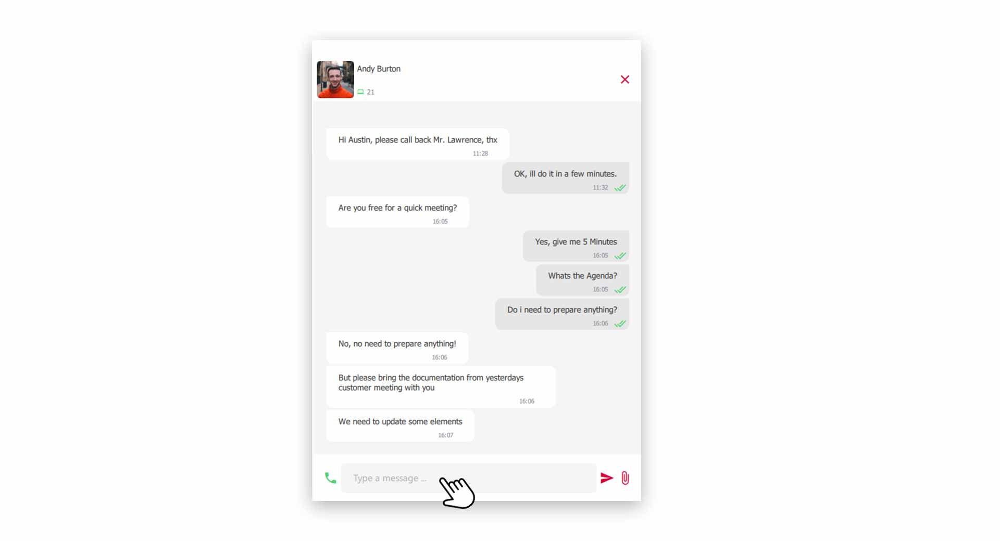
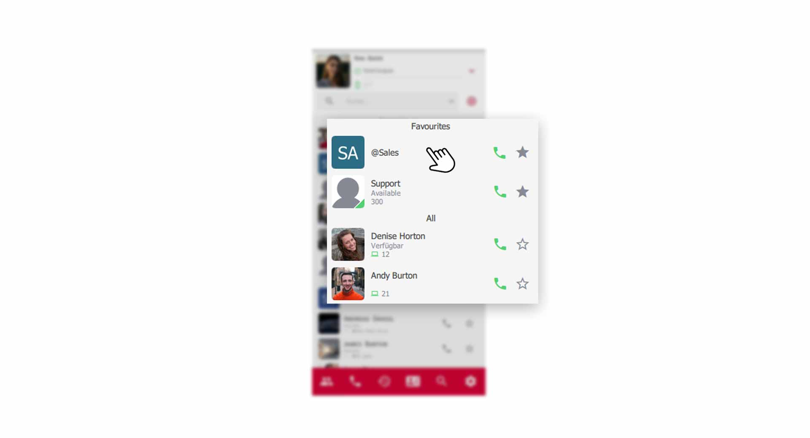
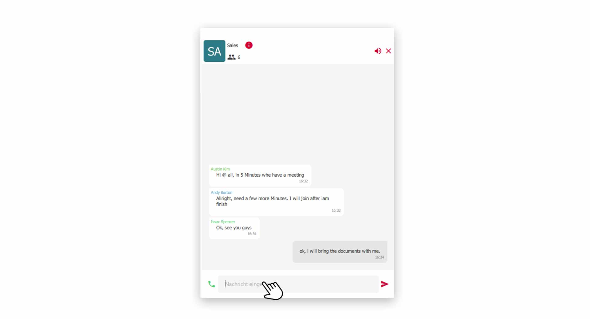



## Chat with colleagues

Quickly exchanging information with a colleague has become an indispensable tool in business communication today. In the pascom client, simply click on a colleague in the **contact list** to open the chat conversation window.

*Open chat conversation from the contact list*
 

*Chat conversation open*
 

### Type a Chat message

1. Enter your message in the lower **input field** and send the message by clicking on the **red send arrow** or by pressing the **enter key**.

## Group chat with several colleagues

For group chat rooms you first need a pascom group which you can create with the following [tutorial]().

Click on the **Group** in your contact list to open the chat conversation.

*Open group chat via the contact list*
 

The dynamic content area or view window will then show you the chat conversation of the group.

*Group chat with multiple participants*
 

1. Type your message as usual in the **input field** and send it by clicking on the **red send arrow** or by pressing the **enter key**.

## Close a Chat

1. Close the current chat conversation by clicking on the **red X symbol** in the upper right corner. 

{}
If you close a chat conversation and have already written a message but have not yet sent it, the pascom client saves what you have already written and you can continue editing it later. This allows you to jump back and forth between chat conversations.
{}

## Chat Notifications

If the conversation area is not in focus and you receive a new message, a notification message appears in the **contact list** at the **profile picture** and at the respective **contact**. The profile picture always shows you the complete, not yet read, messages. Contacts with new messages will automatically move up in the contact list, if the sorting is set that way.

*Chat notification message in the contact list*
 

