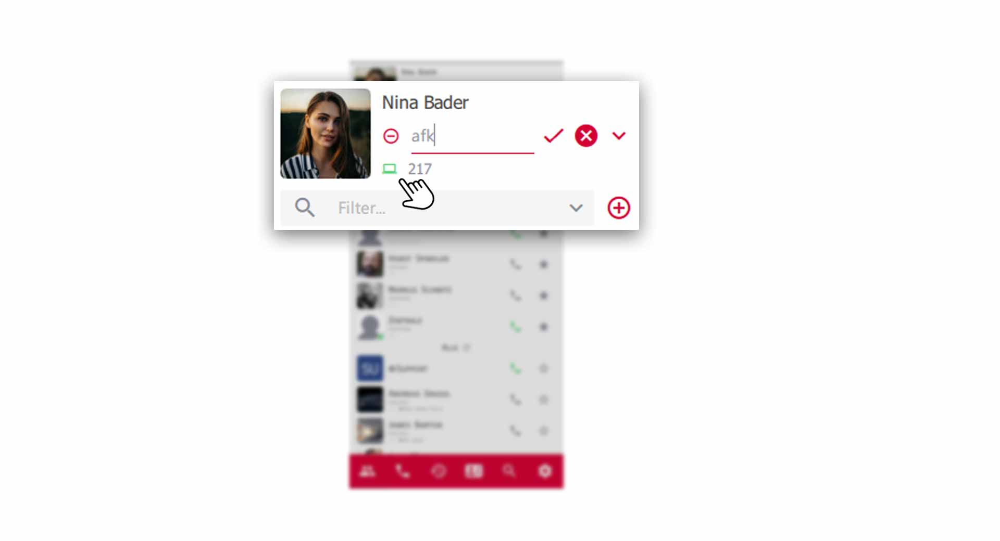
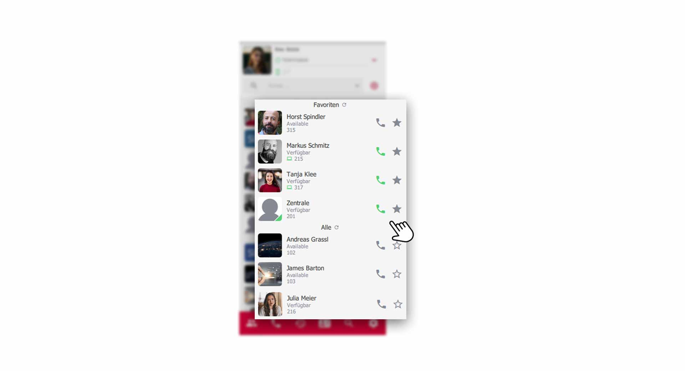
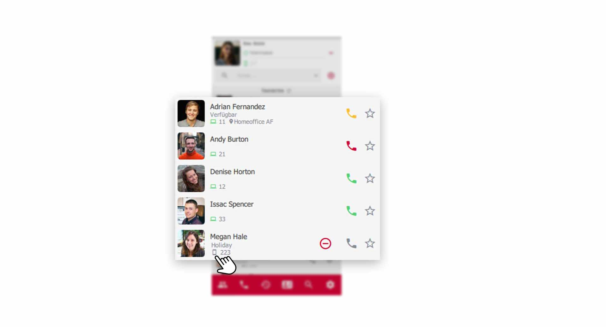
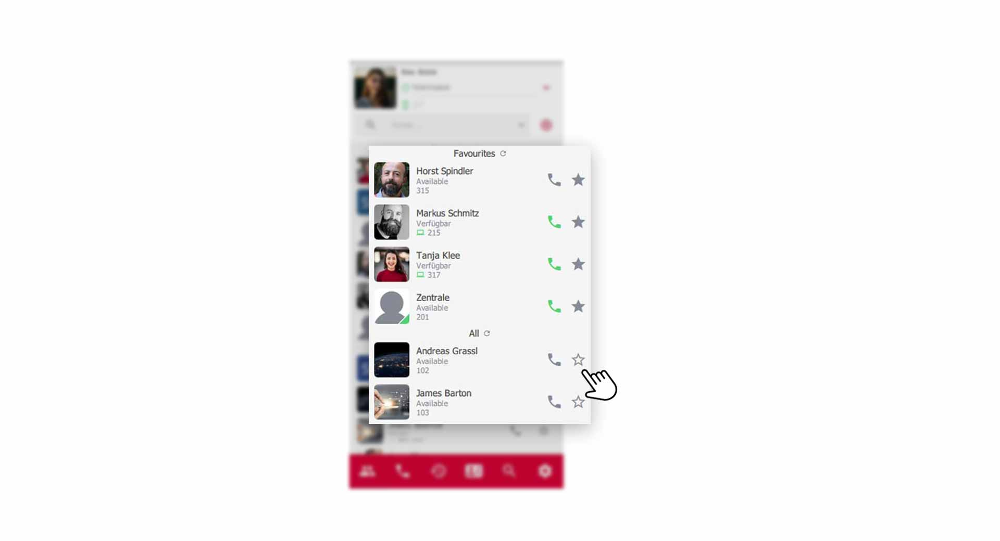

 


## Mein Profil

Das eigene Profil, bietet sehr gute Einstellungen, um seinen Kollegen visuell mitzuteilen, wie es gerade um die eigene Erreichbarkeit steht.

### Ihren Präsenzstatus einstellen

Klicken Sie zum Einstellen Ihres Präsenzstatus auf das Dopdownfeld in Ihrem Profil. Daraufhin öffnen sich zwei Auswahlmöglichkeiten.

*Auswahl Präsenzstatus*
 

1. **grün** = Verfügbar 
2. **rot** = Nicht stören

### Präsentzstatus individualisieren

Sie können auch eigene Meldungen für den jeweiligen Präsenzstatus hinterlegen. Teilen Sie Ihren Kollegen im **"Bitte-nicht-stören"** Modus mit, dass Sie z.B. im Urlaub sind oder ein wichtiges Meeting haben. 

Klicken Sie dazu einfach auf die Zeile des Präsenzstatus und geben Ihre eigene Meldung ein. Abschließend speichern Sie mit Klick auf den Check-Haken.

*Eigene Präsenzstatus-Meldung*
 

### Welches Gerät wird gerade genutzt ?

Der Präsenzstatus zeigt Ihren Kollegen welches Gerät Sie gerade benutzen. Sitzen Sie am Computer und nutzen den **pascom Desktop Client** so haben Sie ein **Computer-Symbol**. Nutzen Sie die pascom Mobile App, so wird ein **Handy-Symbol** angezeigt. Daneben finden Sie Ihre interne Durchwahl. 

*Engerätepräsenz*
 

### Wählen Sie Ihren Arbeitsplatz

Zeigen Sie Ihren Kollegen, wo Sie sich gerade befinden. Ihr Systemadministrator kann Ihnen Arbeitsplätze einrichten, welche vordefinierte Einstellungen bieten. So können Sie mit einem einzelnen Klick ein komplett neues Setup übernehmen. z.B. Home-Office, Vertrieb etc.

Klicken Sie dazu neben dem Endgerätestatus auf das Standortsymbol und wählen Ihren Arbeitsplatz aus. 

*Arbeitsplatz auswählen*
 

## Ihre Kontaktliste

In der Kontaktliste finden Sie alle Ihre Kollegen, pascom Gruppen, Warteschlangen und Ihre Favoriten. Zudem sehen Sie von jedem Kollegen den Präsenzstatus sowie das genutzte Gerät. Ihre Kollegen rufen Sie einfach aus der Kontaktliste heraus an. 

*Kontaktliste im Überblick*
 

### Der Ruf- und Präsentzstatus Ihrer Kollegen

Wie Sie weiter oben bereits erfahren haben, teilt der Präsentzstatus anderen Benutzern mit, wie es gerade um die Erreichbarkeit steht. Der Rufstatus hingegen zeigt Ihnen genau, ob jemand angerufen werden kann oder gerade telefoniert.

*Ruf- und Präsentzstatus der Kontaktliste*
 

**Rufstatus des Höhrersymbols**  
- **rot** = Benutzer telefoniert gerade  
- **gelb** = Benutzer wird gerade angerufen  
- **grün** = Benutzer ist frei und kann angerufen werden  

 

*Präsenzstatus in der Kontaktliste*
 

**Präsenzstatus erklärt**  
- **grün** = Benutzer ist am pascom Client angemeldet (Desktop oder Mobil)  
- **grau** = Benutzer hat den pascom Client geschlossen (Desktop oder Mobil) 

### Wo befindet sich mein Kollege?

Neben dem Endgerätestatus sehen Sie den Arbeitsplatz Ihres Kollegen und wissen daher genau, wo dieser sich gerade befindet.

*Arbeitsplätze in der Kontaktliste*
 

## Favoriten anlegen

Kollegen mit denen Sie häufiger interagieren müssen, können über das **Stern-Symbol** markiert werden, welche dann in den oberen **Favoriten-Bereich** wandern. So sind wichtige Kontakte in der Kontaktliste immer ganz oben angepinnt.

*Favoriten in der Kontaktliste*
 
