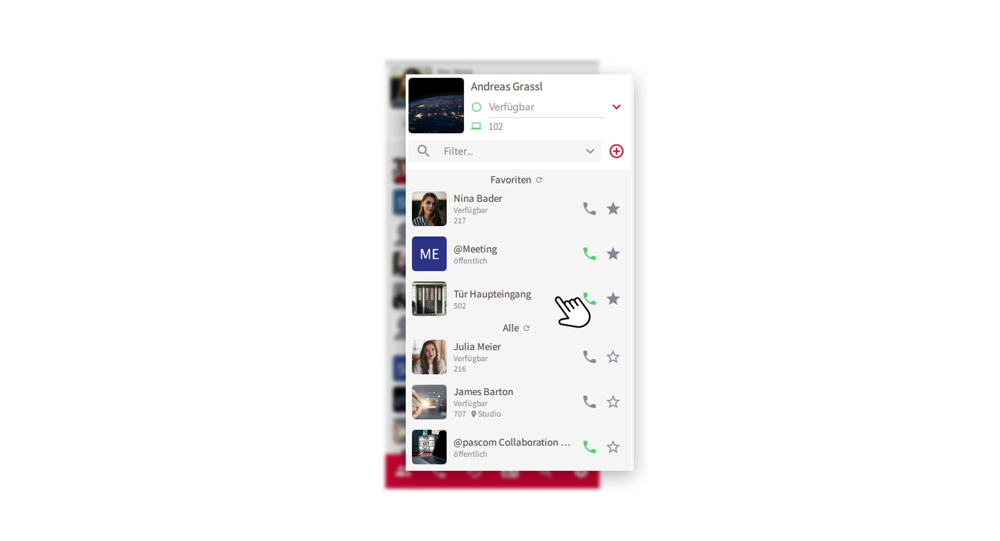
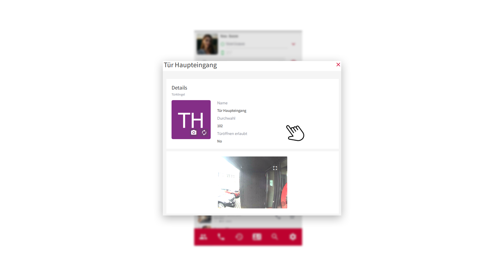
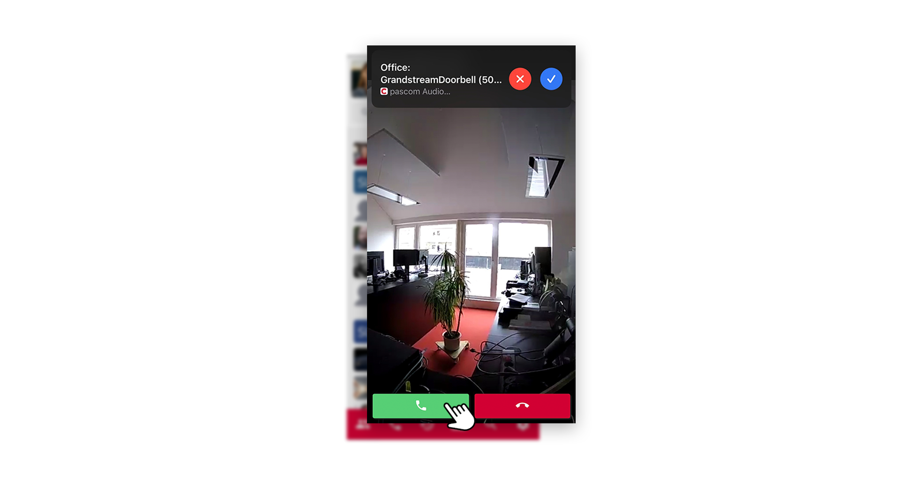
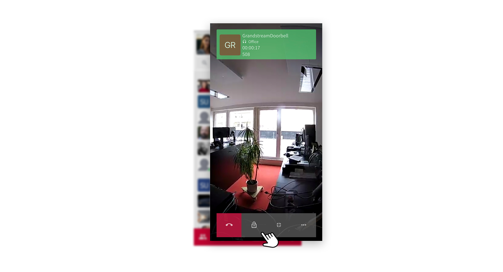


 


## Voraussetzungen

Um eine Türsprechstelle als interaktives Element in Ihrer Kontaktliste zu nutzen, müssen entsprechende Rollen definiert sein, welche Ihnen die Nutzung der Türsprechstelle erlauben. Sollten Sie Türsprechstelle nicht in Ihrer Kontakliste finden, sprechen Sie Ihren Systemadministrator oder IT-Betreuer darauf an. 

## Türsprechstelle nutzen

In Ihrer Kontaktliste finden Sie die Türsprechstelle.

 

1. Klicken Sie in der Kontaktliste auf das Türsprechstellenelement, gelangen Sie zur Übersicht der Türsprechanlage und können dort weitere Infos einsehen.

 

2. **Durchwahl** - Die Türsprechstelle besitzt eine eigene interne Durchwahl. Klingelt jemand an der Tür, baut die Sprechstelle einen Anruf über diese Durchwahl auf.

3. **Türöffnen erlaubt** - Hier ist definiert, ob es Ihnen erlaubt ist, die Tür zu öffnen. Sollte wie in obiger Abbildung, das Öffnen der Tür gesperrt sein, sprechen Sie mit Ihrem IT-Administrator.

 

**TIP:** Sie können die Türsprechstelle, wie jedes Element, in Ihrer Kontaktliste zu den **Favoriten** hinzufügen. Klicken sie dazu einfach auf das **Stern-Symbol** und die Sprechanlage reiht sich in Ihrer Favoritenliste ein.

## Es klingelt an der Tür

Betätigt jemand die Klingel an Ihrer Türsprechstelle, baut die Sprechanlage einen Anruf auf und ruft Sie an. Den Anruf erhalten Sie im **pascom Dekstop Client**, auf dem **Mobile Client** und auch auf einem **Hardware-Telefon**.

 

1. Sie sehen im Vorfeld bereits, über den Videostream, wer vor Ihrer Tür steht. Nehmen Sie nun das **Gespräch** über das **grüne Höhrersymbol** an. Sie sind nun mit dem Besucher über die Sprechanlage verbunden.

 

3. Um dem Besucher die Tür zu öffnen, klicken Sie auf das **Türöffner-Symbol**. 

4. Um das Gespräch zu beenden, legen Sie einfach über das **rote Höhrersymbol** auf.

## Nützliche Hinweise

1. Warum habe ich kein Video wenn es an der Tür klingelt?
 
Die **Türsprechstelle** und der pascom Client benötigen eine direkte Verbindung zueinander. Weitere **technische Informationen** finden Sie [hier]().

 