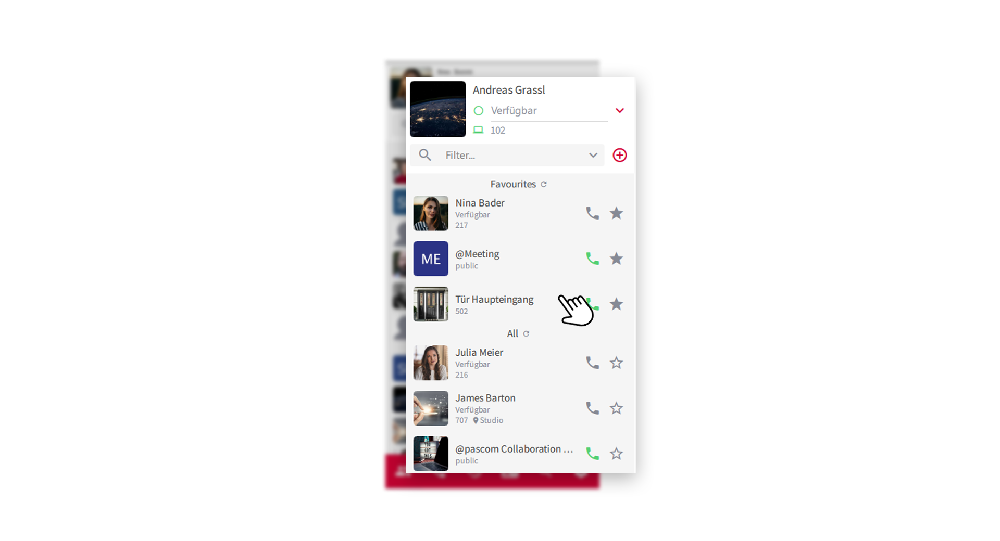
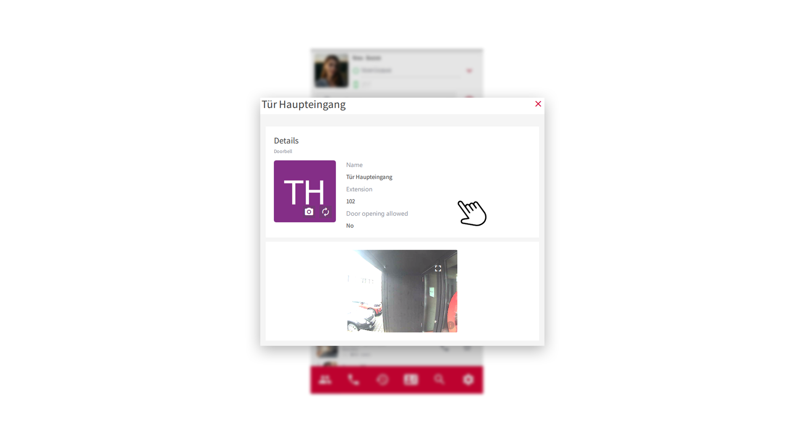
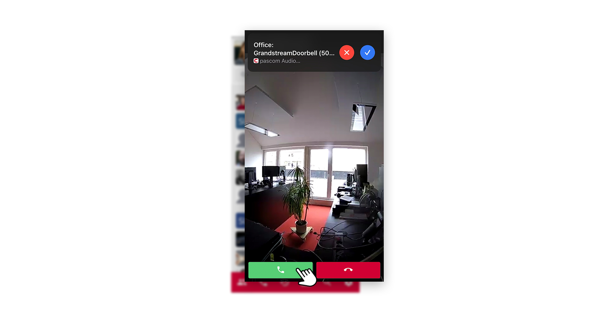
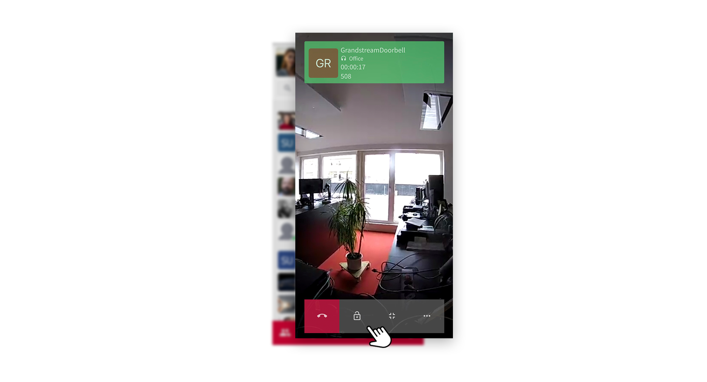


 


## Requirements

In order to use a door bell as an interactive element in your contact list, corresponding roles must be defined that allow you to use the door intercom. If you do not find the door bell in your contact list, contact your system administrator or IT manager. 

## How to use the Door Bell

In your contact list you will find the door bell.

 

1. If you click on the door bell element in the contact list, you will be taken to the overview of the door intercom system, where you can view further information.

 

2. **Extension** - The door bell has its own internal extension number. If someone rings the doorbell, the intercom establishes a call via this extension number.

3. **Door opening allowed** - Here it is defined whether you are allowed to open the door. If, as in the figure above, opening the door is blocked, talk to your IT administrator.

 

**TIP:** You can add the door bell, like any element, to the **Favorites** in your contact list. Simply click on the **star symbol** and the door bell will be added to your list of favorites.

## Someone rings the door bell

If someone presses the bell at your door intercom, the intercom sets up a call and calls you. You receive the call in the **pascom Dekstop Client**, on the **Mobile Client** and also on a **hardware phone**.

 

1. You can already see in advance, via the video stream, who is standing in front of your door. Now accept the **call** via the **green receiver icon**. You are now connected to the visitor via the intercom.

 

3. To open the door for the visitor, click the **door opener icon**. 

4. To end the call, simply hang up via the **red receiver icon**.

## Useful Informations

1. Why don't I have a video when the door bell rings?
 
The **door bell** and the pascom client require a direct connection to each other. Further **technical information** can be found [here]().

 