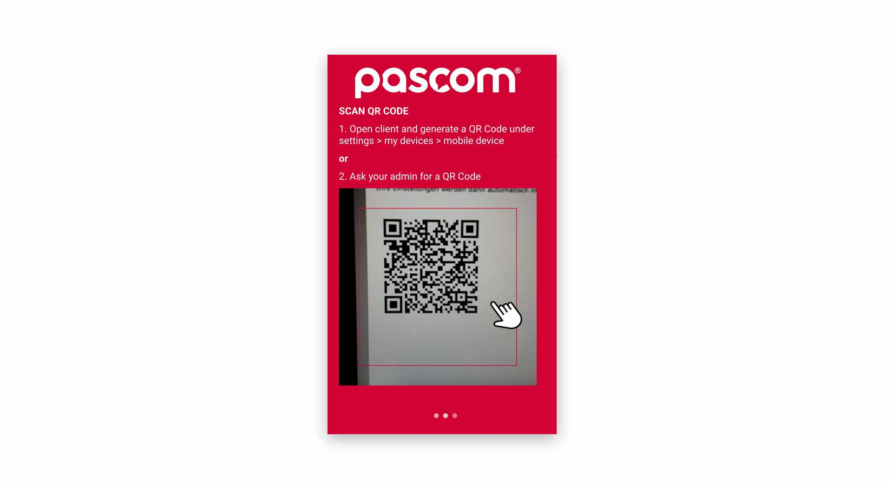

 


## Übersicht

Um sich am pascom Mobile Client anmelden zu können ist zuvor einmalig der Pairing-Vorgang notwendig. Einfacher ausgedrückt, die pascom Mobile App muss sich mit dem Desktop Client koppeln. Dies kann vom Systemadministrator durchgeführt werden oder, mit den notwendigen Berechtigungen, auch von Ihnen selbst.

## Der Pairing Vorgang

Starten Sie den pascom Desktop Client und gehen Sie in die **Client-Einstellungen**

1. Öffnen Sie die **Client-Einstellungen** über das pascom Menü.

 

2. Klicken Sie im **Einstellungs-Menü** auf **Meine Geräte**

 

3. Klicken Sie im nächsten Schritt auf **"Pair"** und Sie gelangen zu einem Fenster mit einer Passwortabfrage.

 

4. Geben Sie Ihr **Anmelde-Passwort** des pascom Desktop Client ein und klicken Sie auf **weiter**.

 

5. Laden Sie sich die **pascom Mobile APP** für Ihr Smartphone herunter und installieren die Anwendung. 

## Pairing Vorgang am Smartphone fortsetzen

Da Sie nun die notwendigen Einstellungen am **pascom Desktop Client** vorgenommen haben, kann es mit der Kopplung am **Mobile Client** weitergehen.

1. Öffnen Sie die **pascom Mobile App** auf Ihrem Smartphone.

 

2. Klicken Sie auf **Start** um mit der **Kopplung** zu beginnen.

 

3. Scannen Sie nun den **OR-Code** von Ihrem Desktop Client ab und Sie gelangen bei erfolgreicher **Pairung** zum nächsten Schritt.

 

4. Geben Sie Ihre **Mobilfunknummer** ein, welche zu Ihrer genutzten SIM-Karte passt. Keine Sorge, Sie werden niemals mit Ihrer **privaten** Handynummer über den pascom Mobile Client telefonieren. Klicken Sie abschließend auf **Weiter**.

{}
Ihre **private** Mobilfunknummer wird benötigt, um den **GSM-Fallback** zu verwenden. Haben Sie keine aktive WLAN-Verbindung, baut der pascom Mobile Client eine Verbindung über das Handynetz auf. 
{}

5. **Ihr pascom Mobile Client ist nun erfolgreich gepairt**.

Sobald der pascom Mobile Client angemeldet wurde, kann dieser unabhängig vom pascom Desktop Client genutzt werden.

 

