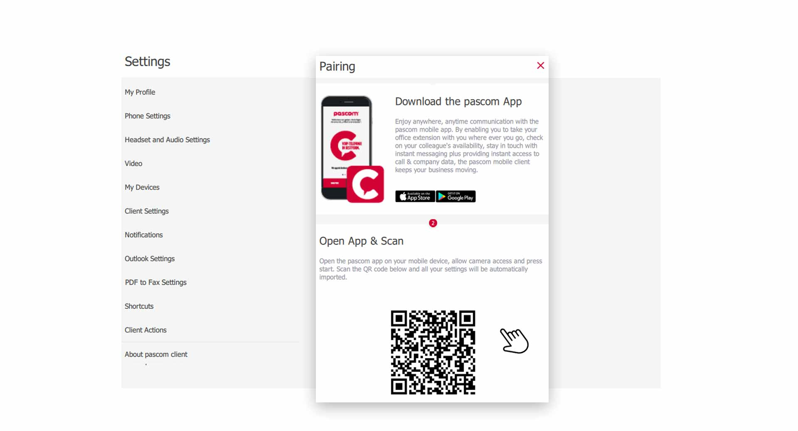

 


## Overview

In order to log on to the pascom Mobile Client, the pairing process must first be carried out once. Simply, the pascom Mobile App must couple with the Desktop Client. This can be done by the system administrator or, with the necessary permissions, by yourself.

## The Pairing Process

Start the pascom Desktop Client and go to the **Client Settings**

1. Open the **Client Settings** via the pascom menu.

 

2. Click on **My devices** in the **Settings menu**.

 

3. In the next step click on **"Pair "** and a window with a password request will appear.

 

4. Enter your **login password** of the pascom Desktop Client and click on **next**.

 

5. Download the **pascom Mobile APP** for your smartphone and install the application. 

## Continue pairing process on the Smartphone

Now that you have made the necessary settings on the **pascom Desktop Client**, you can continue with the pairing on the **Mobile Client**.

1. Open the **pascom Mobile App** on your smartphone.

 

2. Click **Start** to begin the **pairing**

 

3. Now scan the **OR code** from your desktop client and if **pairing** is successful you will proceed to the next step.

 

4. Enter your **mobile phone number** which matches the SIM card you are using. Don't worry, you will never make calls with your **private** cell phone number via the pascom Mobile Client. Finally, click on **Next**.

{}
Your **private** mobile phone number is required to use the **GSM fallback**. If you do not have an active WLAN connection, the pascom Mobile Client establishes a connection via the cell phone network. 
{}

5. **Your pascom Mobile Client is now successfully paired**.

Once the pascom Mobile Client has been registered, it can be used independently of the pascom Desktop Client.

 

