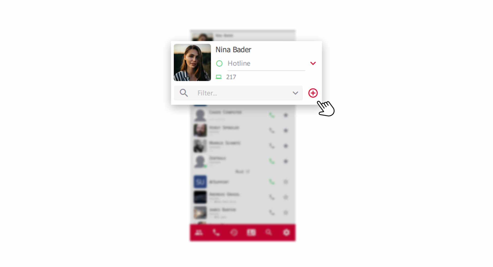
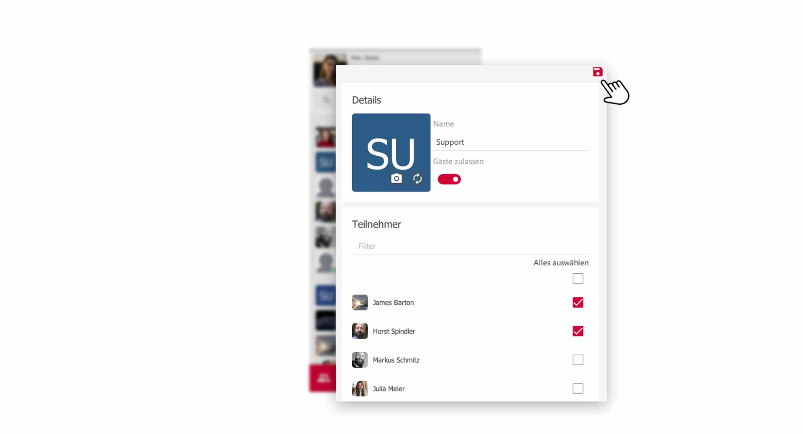
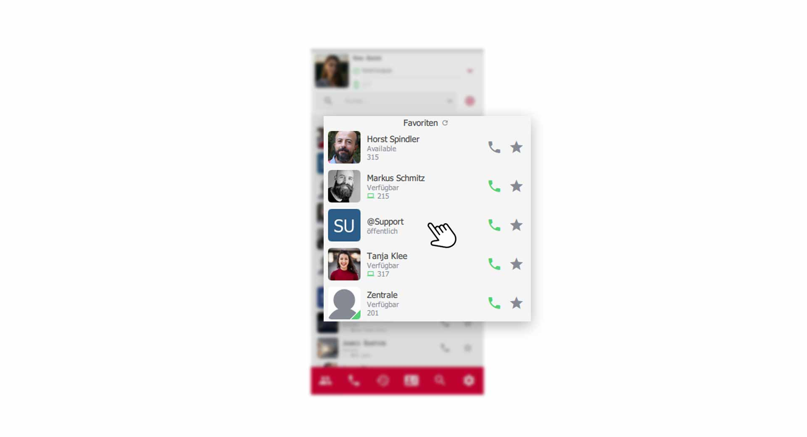
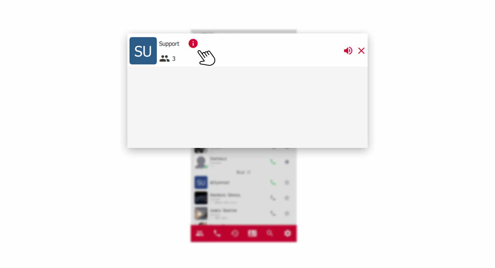
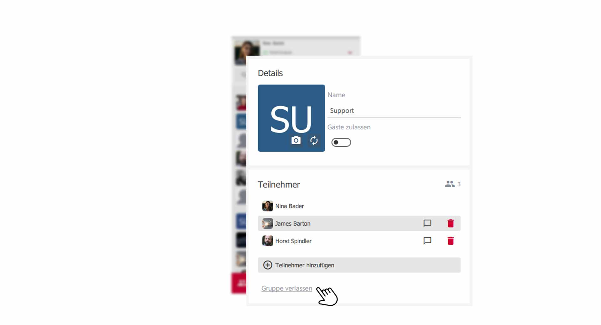
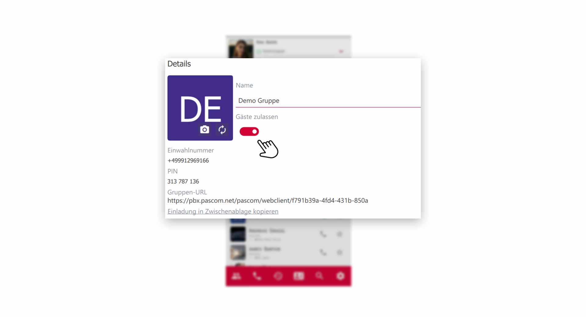

 


## Was sind pascom Gruppen?

Stellen Sie sich pascom Gruppen wie dynamische Konferenzräume vor, die eine Menge zusätzlicher Funktionen mitbringen. pascom Gruppen lassen sich als Chat-Räume nutzen, aber auch zu Audio- und Video Konferenzräumen upgraden.
Legen Sie sich z.B. eine **"Support-Gruppe"** für alle Support-Mitarbeiter an, in der Sie im Gruppenchat informationen austauschen und Audio- und Video-Besprechungen abhalten.

Mit der Gruppen-Funktion erstellen Sie permanente Gruppen für:

1. Gruppen-Chat
2. Audio-Konferenzen
3. Video-Konferenzen
4. Online-Meetings mit Screensharing

### Eine pascom Gruppe erstellen

{}
Das Anlegen neuer pascom Gruppen ist nicht restriktiert und kann von jedem Benutzer vorgenommen werden.
{}

Erstellen Sie eine neue Gruppe über das **+-Symbol** in Ihrem Profil.

 

Geben Sie im Einstellungsfenster der Gruppe eine **Bezeichnung** ein z.B. "Support" oder "Flurfunk". Anschließend fügen Sie die **Teilnehmer** hinzu, welche Mitglied dieser Gruppe sein sollen.

 

Abschließend klicken Sie zum **Speichern** der Gruppe auf das **rote Diskettensymbol**. Ihre neue Gruppe erscheint nun in der Kontaktliste.

 

{}
In Ihrer Kontaktliste erscheinen nur Gruppen, in denen Sie selbst Teilnehmer/Mitglied sind. Sollten Sie eine Gruppe nicht finden, lassen Sie sich von anderen Teilnehmern dieser Gruppe einfach mit aufnehmen. 
{}

## pascom Gruppe verwalten

Befinden Sie sich im Fenster einer pascom Gruppe, haben sie in der oberen Menüleiste einige Funktionen zu Auswahl. Zusätzlich wird Ihnen angezeigt, wieviele **Teilnehmer** die Gruppe hat.

 

### Gruppe stumm schalten

1. Klicken Sie dazu in der oberen Menüleiste auf das **Lautsprecher-Symbol**. Nun bekommen Sie keine Benachrichtung mehr bei neuen Ereignissen in der Gruppe.

### Gruppe schließen

2. Um eine Gruppe zu schließen, klicken Sie in der oberen Menüleiste auf das **rote X-Symbol**. Keine Sorge, Sie können jederzeit die Gruppe wieder, aus der Kontaktliste heraus, öffnen.

### Gruppe editieren und Teilnehmer verwalten

3. Um Änderungen an einer Gruppe vorzunehmen, klicken Sie in der oberen Menüleiste auf das **rote Info-Symbol**, und Sie gelangen zu den Gruppen-Einstellungen.

### Bezeichnung der Gruppe ändern

4. Sind Sie nicht zufrieden mit dem Namen einer Gruppe, können Sie die **bisherige Bezeichnung** einfach überschreiben. z.B.**Support** ändern in **Vertrieb**.

### Teilnehmer hinzufügen oder entfernen

5. Soll Ihre Gruppe neue Mitglieder aufnehmen, so klicken Sie auf den Menüpunkt **Teilnehmer hinzufügen** und wählen aus einer Liste neue Teilnehmer aus. 

6. Zum entfernen von Teilnehmern aus der Gruppe, klicken Sie auf das **rote Mülleimer-Symbol**.

### Gruppe selbst verlassen

7. Möchten Sie selbst die Mitgliedschaft in einer Gruppe beenden, klicken Sie ganz unten in den **Gruppen-Einstellungen** auf **Gruppe verlassen**.

## pascom Gruppe öffentlich machen

Externe Teilnehmer können ebenfalls in Ihre pascom Gruppen eingeladen werden. Mit einem Klick auf **Gäste zulassen** aktivieren Sie den **Gastmodus** und erhalten Einwahldaten für Ihre Gruppe.

*So lässt sich eine Chat-Gruppe zu einem virtuellem Audio- /Video-Konferenzraum für externe Teilnehmer upgraden*

|Felder|Beschreibung|
|---|---|
|Einwahlnummer|Teilnehmer können über den WebClient an der Konferenz per Telefon teilnehmen, indem die Einwahlnummer gewählt wird.|
|PIN|Für die Konferenzteilnahme über die Einwahlnummer wird die PIN benötigt.|
|URL|Link zur Gruppe im Web Client.|
|In Zwischenablage kopieren| Alle Details übersichtlich in die Zwischenablage kopieren. Teilen Sie so, alle wichtigen Daten mit externen Teilnehmern.|

## pascom Gruppe löschen

Löschen Sie eine pascom Gruppe, indem Sie **alle Teilnehmer** aus einer Gruppe entfernen und zuletzt selbst die **Gruppe verlassen**. Damit verschwindet die Gruppe aus dem System.

 

