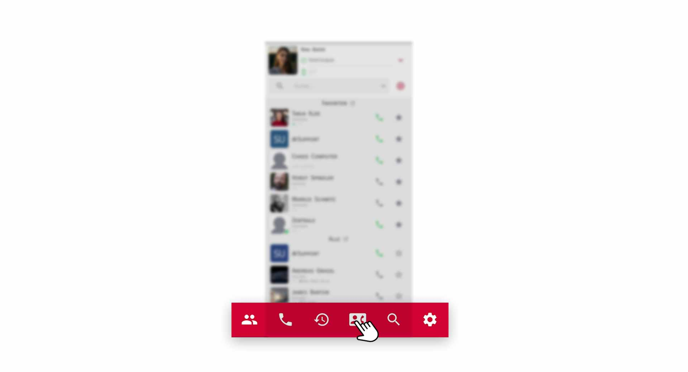
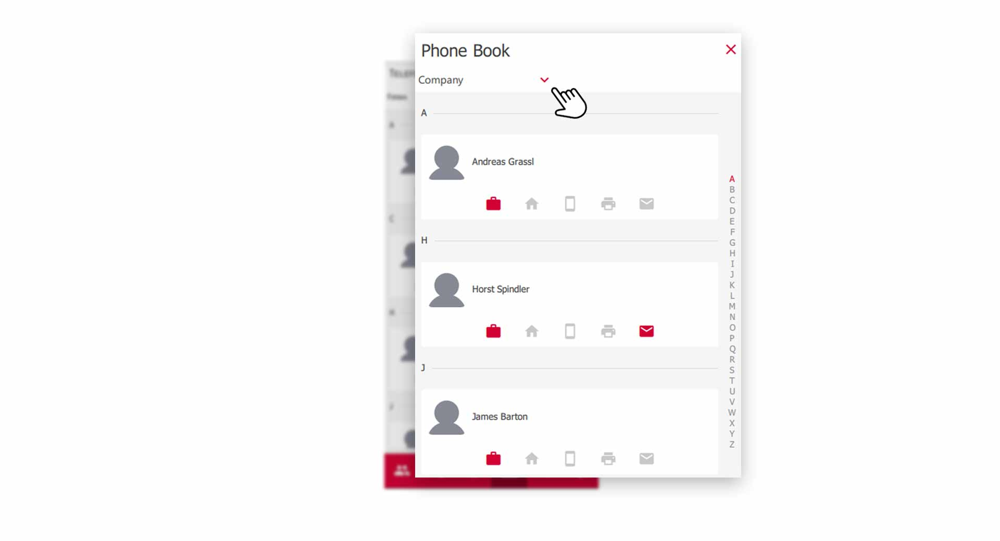
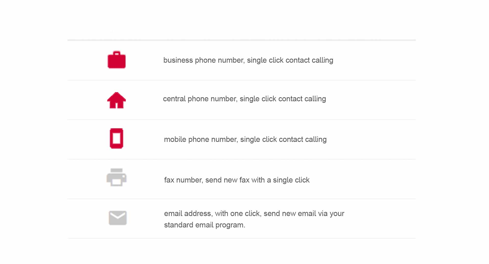
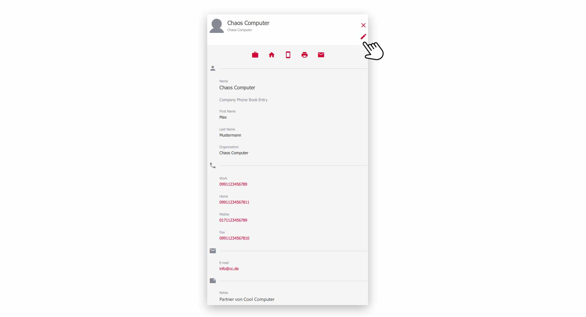
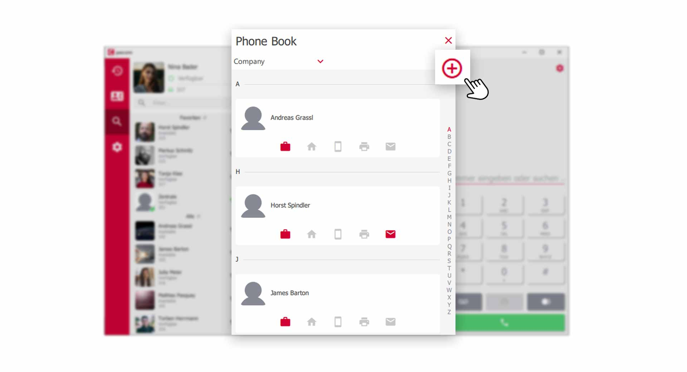
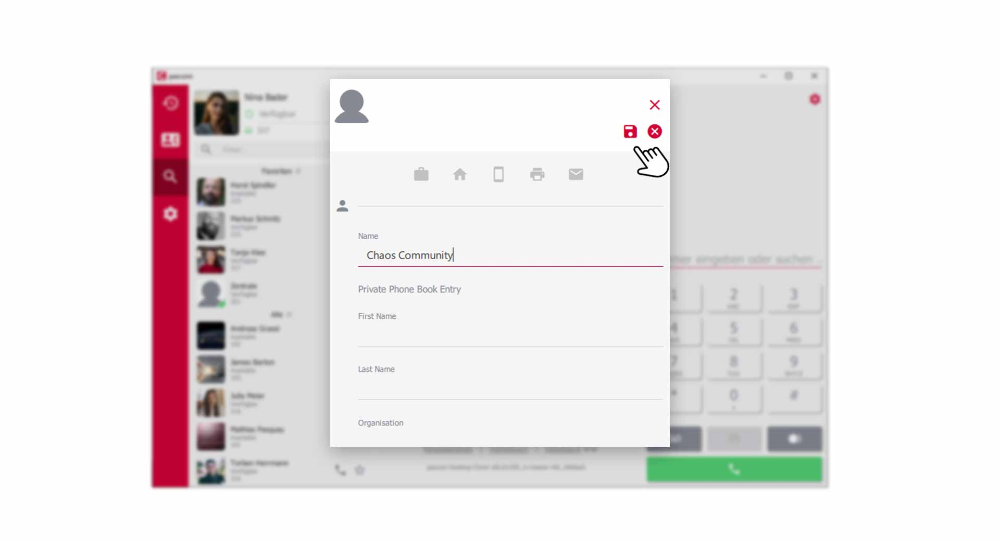
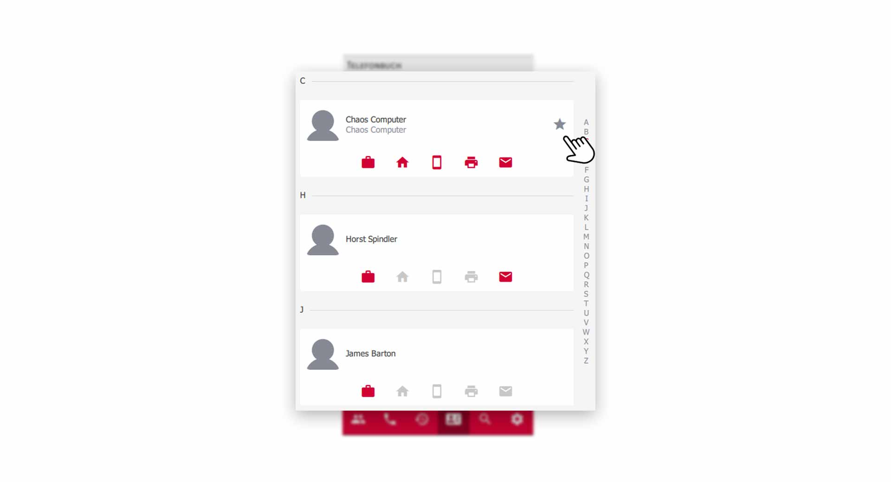
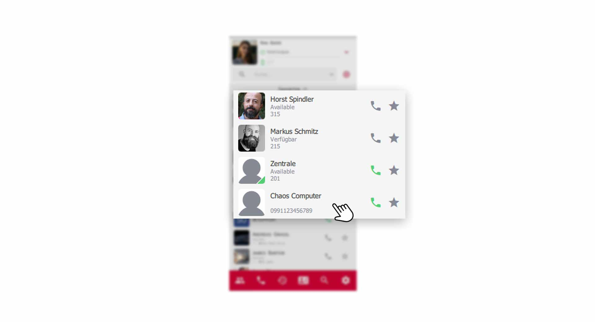
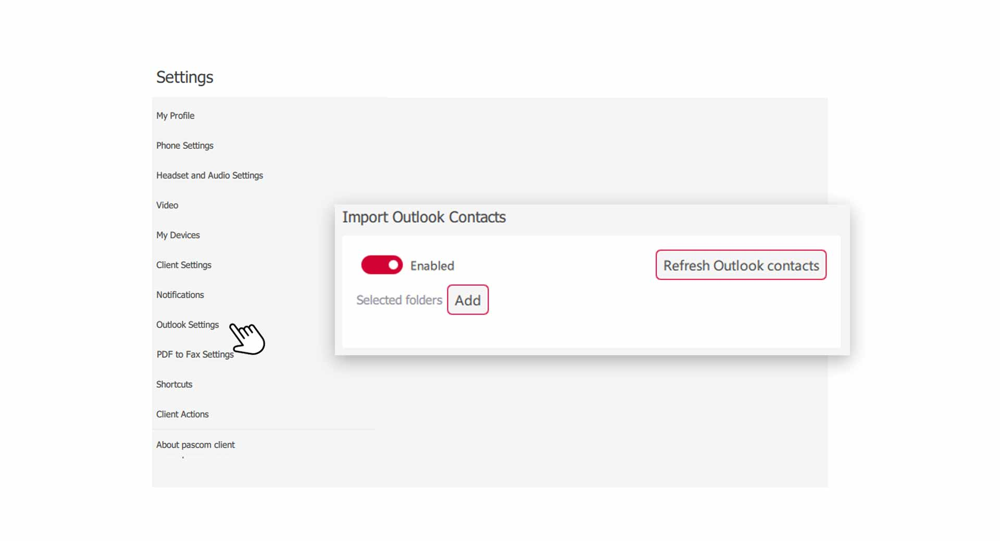


 


## Trainings Video

 

## Overview

The pascom phone book is designed to contain a company-wide global phone book and a private phone book for each individual user. This prevents users from storing their private data in the company phone book. System administrators and phone book administrators take care of global phone book entries and you can manage your own records. 

1. *When an incoming call is received, the system first searches for a matching contact in your private phone book. If the system does not find it, it will search the global company phone book for a matching entry. So you can overwrite company entries with your private data and only you can see this data.* 

## Open the Phonebook

Click on the **Phone Book** icon in the menu bar to open up the telephone book.

*Open Phonebook via the pascom Menue*
 

## Overview of the private and global Phonebook

Using the menu item in the upper left corner of the phone book, you can switch between your **private** and **global** phone book with one click. 

*Overview of the Phonebook*
 

All contacts are clearly displayed in a kind of **business card**. From here you have immediate access to important contact types, which we will explain briefly below. 

*Symbols of the Phonebook explained*
 

As you can see in the above graphic, there are **colored** and **greyed** symbols that indicate whether the corresponding contact type contains data or not. 

## Details of an Phonebook entry

Each contact in the phone book contains additional information. Click on a **phonebook entry** and you will get to the **detail view**. 

*Details of an Phonebook entry*
 

The **detail view** of a phone book entry gives you more information. 

If you have the role of **Phone book administrator** or if you are in a telephone book entry of your private telephone book, you can edit the telephone book entry on the top right of the **Edit icon**. 

## Create new phone book entry

{}
To create new phone book entries in the global company phone book, you must have the role **Phone book administrator** or be **system administrator**.
{}

To create new phone book entries, click on the **red plus symbol** in the phone book.

*Add a new Phonebook entry*
 

Fill in the predefined fields with your contact data and click on the **floppydisk symbol** to save the phone entry. 

*Create and save a new phonebook entry*
 

## Add phone book entries to contact list

If you want to place contacts from your phonebook directly in your **contact list**, you must mark the corresponding **phonebook entry** as **favorite**.

*Mark phonebook entry as favorit

Then the **Phonebook entry** appears in the section of your **Favorites** in the contact list.

*Add phone book entry as favorite in the contact list*

## Outlook Kontakte importieren (ab v.2013)

Findet der pascom Desktop Client auf dem PC ein unterstütztes Telefonbuch von Outlook können die Einträge automatisch als **privates Telefonbuch** dem Client hinzugefügt werden.

1. Open the **Client-Settings** via the pascom Menü

 

2. Click on **Outlook Settings** in the **Settings menu**

 

3. **Activate** the connector and the pascom client will automatically attempt to connect to your **Outlook**.

### Set Outlook PST folder manually

The Outlook PST file contains all Outlook data. Among others also your contacts.

1. Click the **Add**-Button at **Selected folders** and select the directory where the Outlook PST file is located.

### Update Outlook contacts

The pascom client automatically updates your Outlook contacts every time you start the program. If newly created contact data does not yet appear in the pascom phone book, click on **Update Outlook Contacts** in the settings menu.  

 
