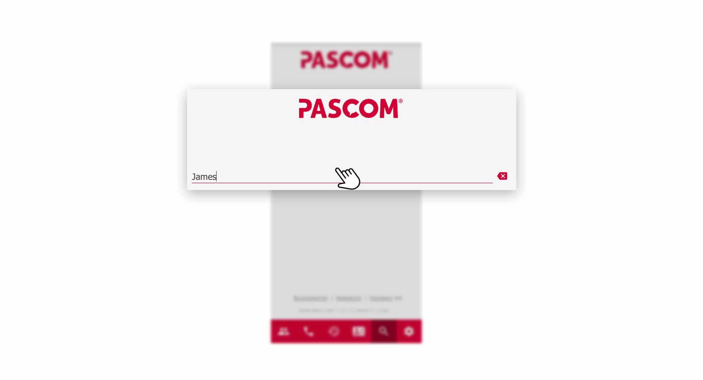
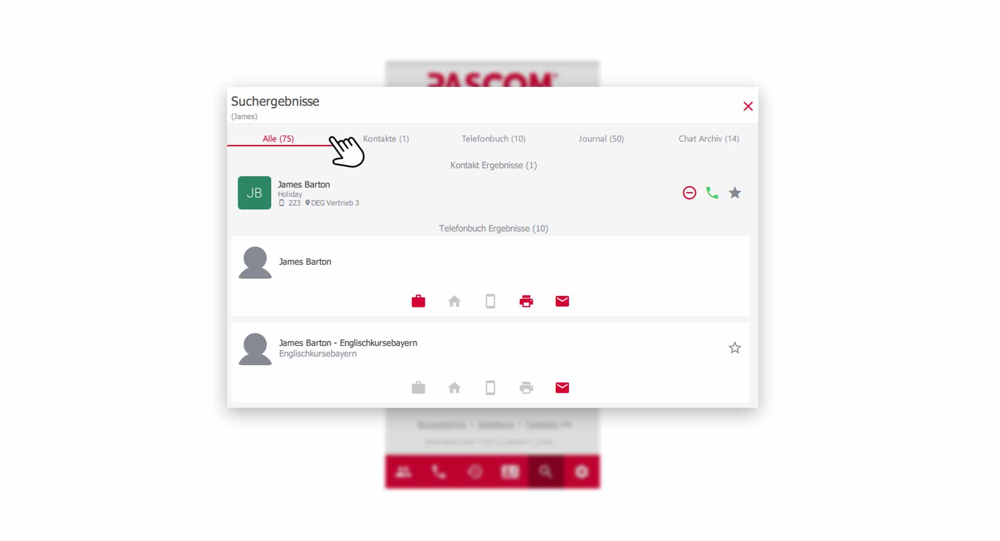
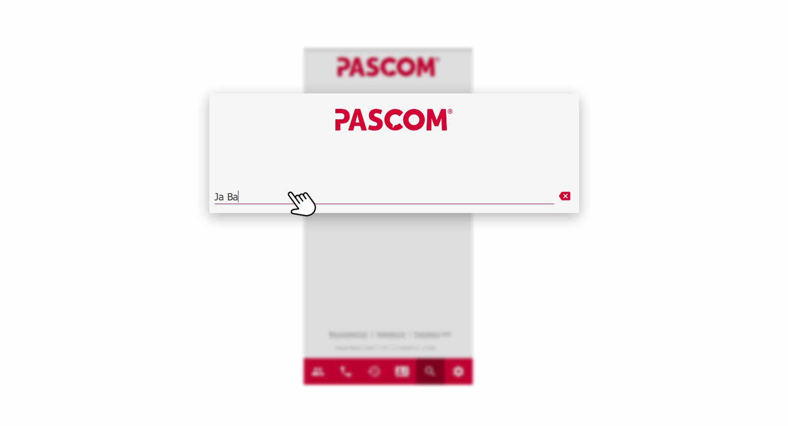
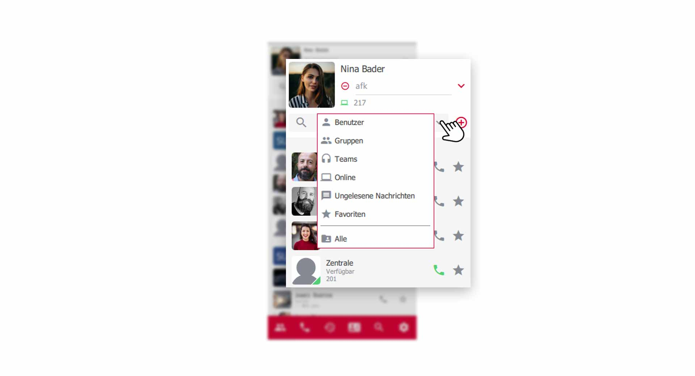
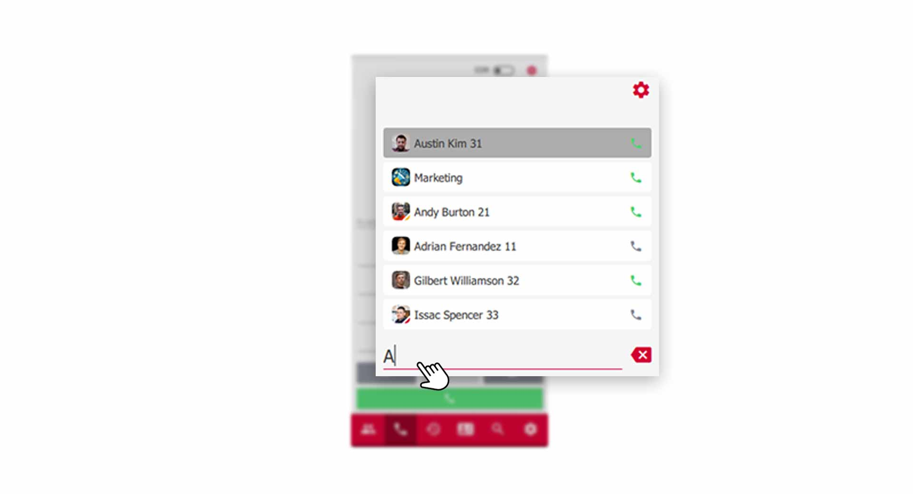
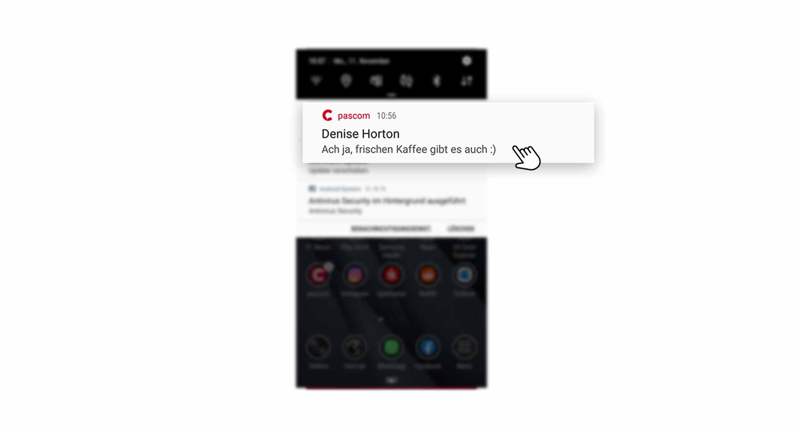
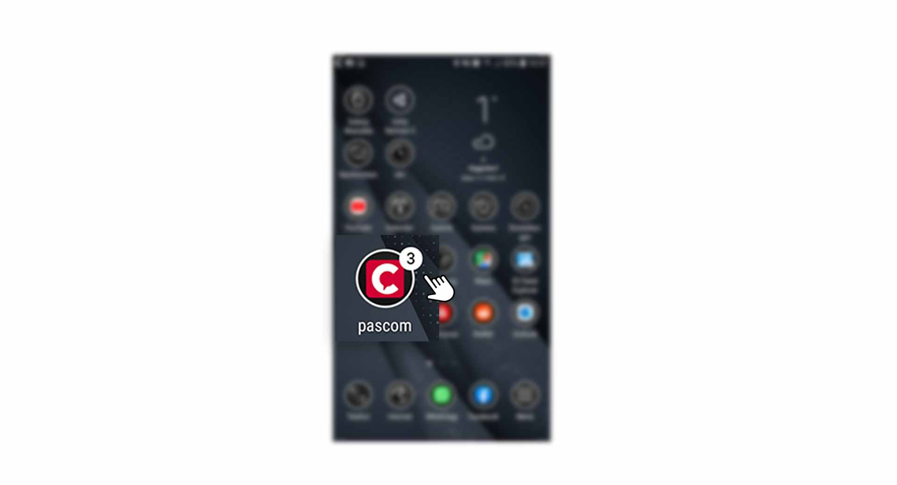

 


## Die Suchfuntkion nutzen

Um effizienter im pascom Client zu navigieren, ist die Suchfunktion ein sehr gutes Werkzeug. Die Suchefunktion finden Sie über die Menüleiste mit Klick auf das **Lupen-Symbol**.

*Sucheingabe*
 

### Die Suchergebnisse

Die Ergebnisse Ihrer Suche sind in Register unterteilt. Im Register **"Alle"** sehen Sie alle Ergebnisse aus den *Kontakten, Telefonbucheinträgen, Chats und dem Journal*. Filtern Sie ganz einfach mit Klick auf die Register, Ihre gewünschten Suchergebnisse.

*Suchergebnisse*
 

### Intelligente Suche

Die intelligente Suche liefert Ihnen Ergebnisse, auch wenn Sie nur ein paar Buchstaben Ihres Kontakts kennen. Dies erlaubt es z.B. nur die Anfangsbuchstaben des Vor- und Nachnamen einzugeben.

*Intelligente Sucheingabe*
 

## Smart-Filter der Kontaktliste

Der Smart-Filter ist ein nützliches Werkzeug, um schnell seine Kontaktliste nach vordefinierten Kategorien zu filter. Lassen Sie sich mit einem Klick anzeigen welche Kollegen gerade Online sind oder filtern Sie nur noch ungelesenen Nachrichten.

Die Anwendung ist simpel, klicken Sie neben der Filter-Suchleiste auf das **Dropdown-Symbol** und wählen Sie die gewünschte Kategorie aus.

*Smart-Filter nutzen in der Kontaktliste*
 

## Die Suche im Wählfeld

Die Suche im Wählfeld ist eine tolle Erleichterung im Arbeitsalltag. Tippen Sie im **Wählfeld** einfach einen **Namen**, **Durchwahl** oder **Rufnummer** ein und der pascom Client sucht Ihnen entsprechende Ergebnisse direkt im Wählfeld. Dies ist besonders hilfreich, wenn Sie einen aktiven Anruf verbinden möchten und gerade die Telefonnummer nicht zur Hand haben. 

*Suchen im Wählfeld*
 

## Benachrichtigungen

Benachrichtigungen erhalten Sie in Form von **Push Notifications** und eine zusätzliche **Signalisierung** am pascom **App-Icon**

 

1. Mit Klick auf die **Push-Notification** öffnet sich der pascom Mobile Client.

 

Das pascom App Logo auf dem Home-Bildschirm zeigt zusätzlich an, wieviele Nachrichten Sie erhalten haben. 

 

 

