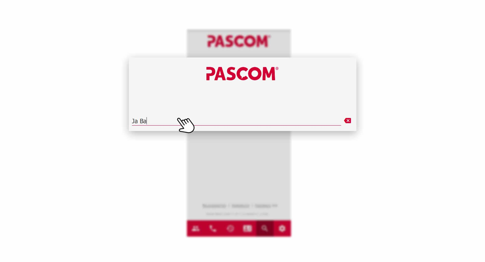
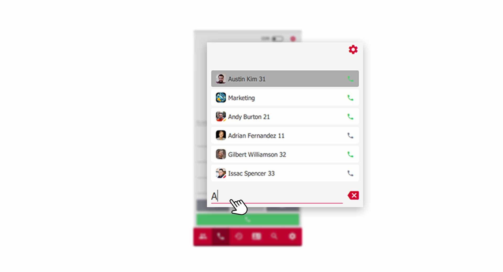

 


## How to use the Search function

The search function is a very good tool for navigating more efficiently in the pascom client. The search function can be found via the menu bar by clicking on the **magnifying glass symbol**.

*The Search input field*
 

### The Search results

The results of your search are divided into registers. The tab **"All"** shows all results from the *contacts, phonebook entries, chats and the journal*. Simply click on the tabs to filter your desired search results.

*Search results*
 

### Intelligent Search

The intelligent search delivers results even if you only know a few letters of your contact. For example, this allows you to enter only the first letters of the first and last name.

*Intelligent seach input*
 

## Smart-Filter of the Contact List

The Smart Filter is a useful tool to quickly filter your contact list according to predefined categories. With one click you can see which colleagues are currently online or filter only unread messages.

The use is simple, click on the **drop-down icon** next to the filter search bar and select the desired category.

*Use the smart filter in your contact list*
 

## The search in the dialpad

The search in the dialpad is a great relief in everyday work. Simply enter a **name**, **phone number** or **internal extension** in the **dialpad** and the pascom client will search for the corresponding results directly in the dial field. This is especially helpful if you want to transfer an active call and do not have the phone number at hand. 

*search in the dialpad*
 

## Notifications

You receive notifications in the form of **Push Notifications** and an additional **signaling** on the pascom **App icon**.

 

1. Click on the **Push Notification** to open the pascom Mobile Client.

 

The pascom app logo on the home screen also shows how many messages you have received. 

 

 