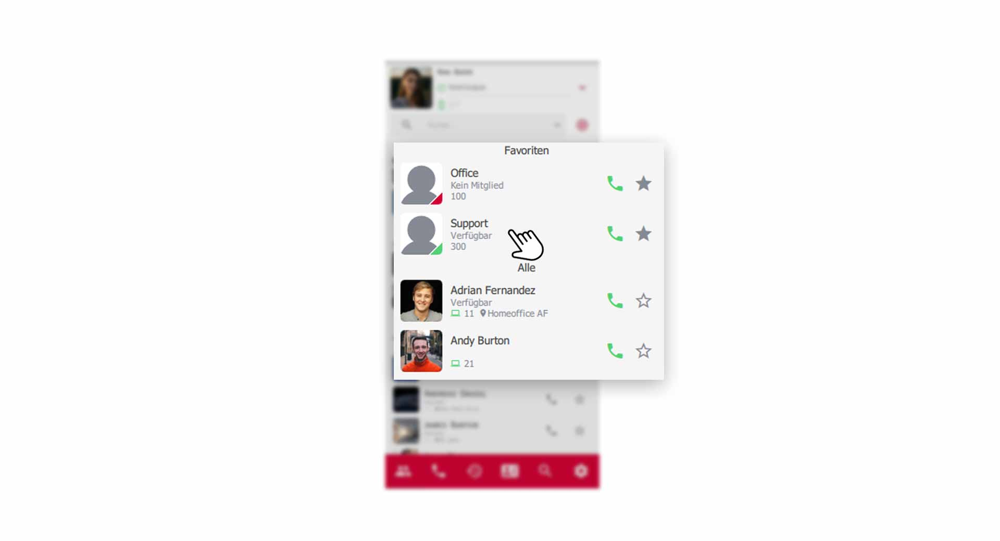
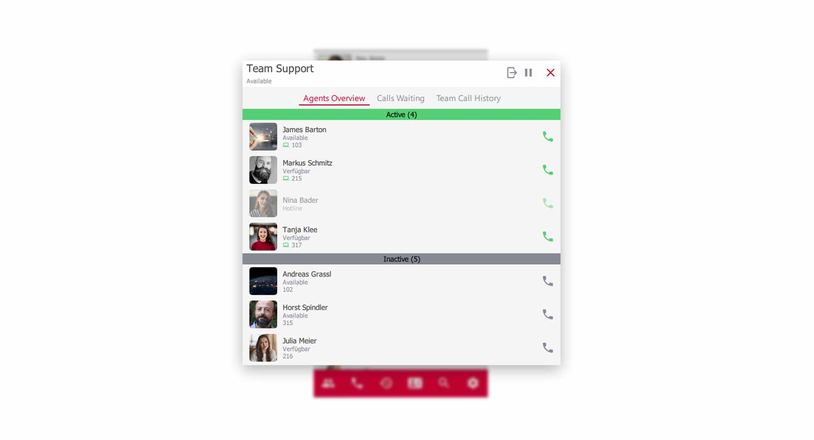
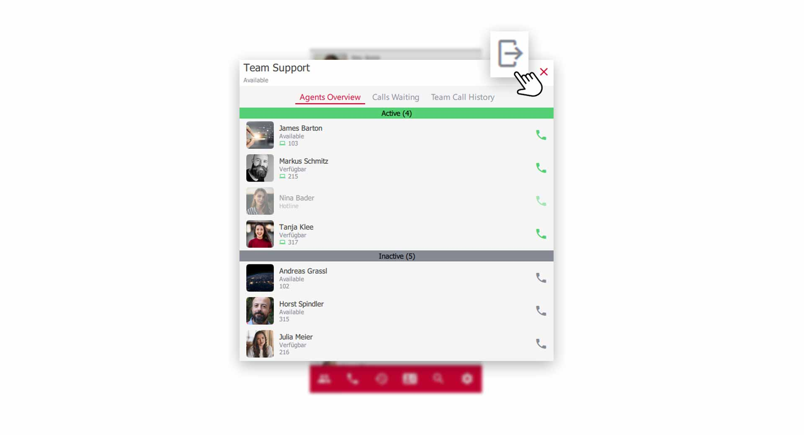
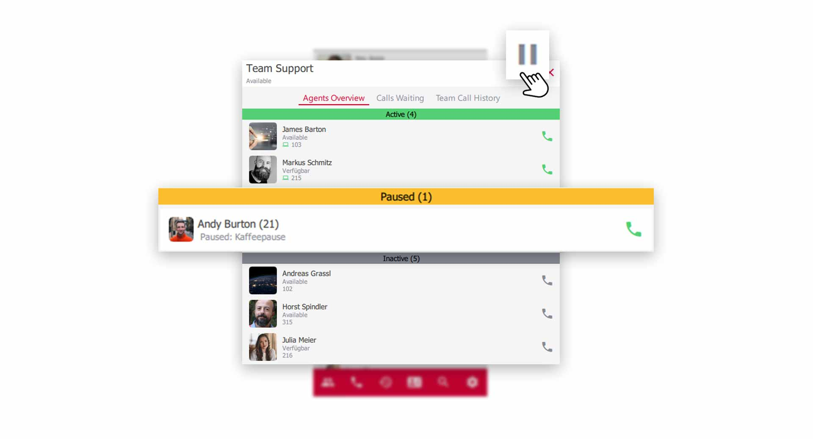
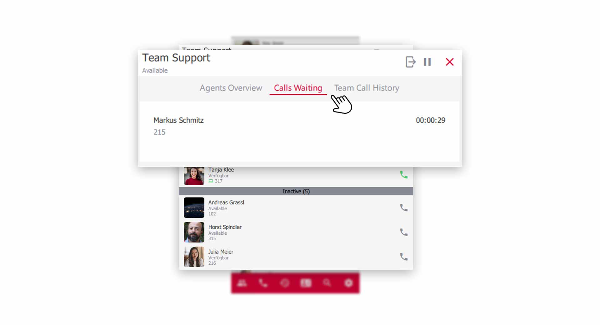

 


## Overview

pascom teams are basically queues. A place where your customers stay until a user/agent answers the call. If you are a member of a team e.g. **Sales**, you will receive calls from the queue in addition to your personal calls. 

## Open a pascom team

In your **contact list** you will find the **team** of which you are a member, and you can open the queue with a **click** on the team. e.g. **Team Support**

*Open a pascom team via the contactlist*
 

{}
The **Team-Office** you see in the contact list has a red signal and at the same time shows you that you are **no member** of this queue and therefore cannot view any data. 
{}

## Overview of a pascom Team

In the queue overview you will find your colleagues as well as tabs and menu items with additional functions.

*Overview of the pascom team*
 

1. In the **active green area** you will find colleagues who are actively logged on to the queue and receive calls. In addition, you can see the current **call status** by means of the **handset icon**.

2. In the **deactivated grey area** you will find colleagues who have logged out of the queue and do not receive calls. In addition, you can see the current **call status** by means of the **hearing icon**.

## Log in to the team

Users in teams, can be **flexible** or **fixed** members of a queue. If your system administrator has set you up as a **flexible member**, you can log on and off the queue and thus switch from the **active** to the **disabled** area.

1. Use the **Login- / Logout-** button to log in and out of the team.

*Log in and log out as a flexible member of the team*

## Pause work in a team

On the pascom telephone system, **pause reasons** can be defined that you can use to temporarily not receive calls from the queue. e.g. **coffee break** or **postprocessing** etc. 

1. Click on the **Pause button** and select a **Pause reason**.

*Take a short break from working in a team*

## Waiting callers

Click on the **Tabs** on the **Callers waiting** item and you will get an overview of callers waiting in the queue. 
You will see the phone number, the name (if there is a phone book entry) and the waiting time.

*Show waiting callers in the queue*

## The Team-Journal

The functions of the Team Journal are explained in the following [Tutorial](Link to Team Journal).

 