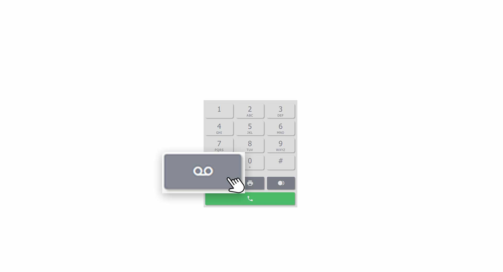
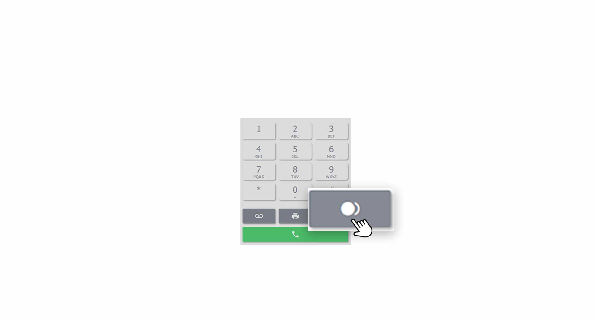
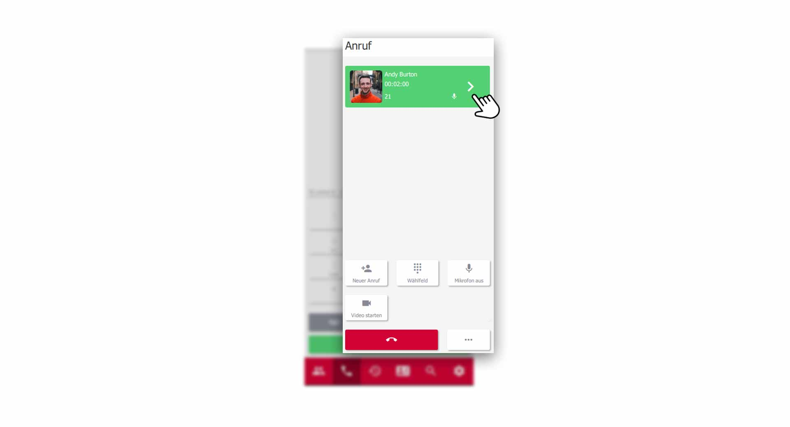
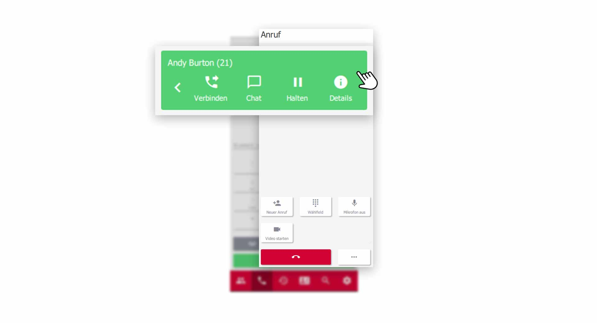
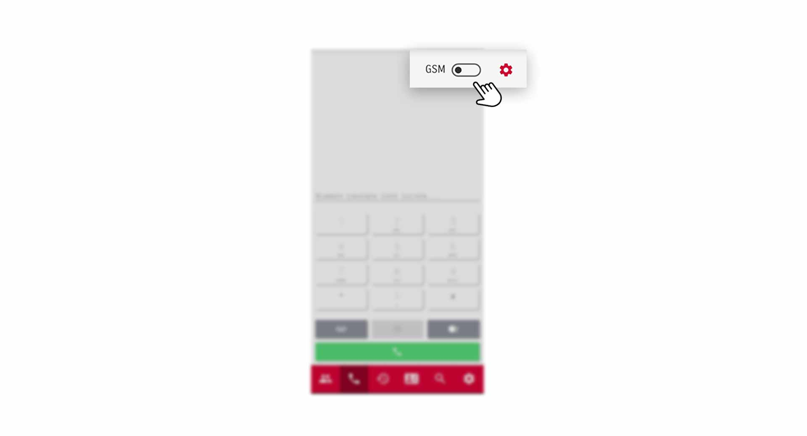

 


## Gespräch starten

Im pascom Mobile Client gibt es mehrere Wege, einen neuen Anruf zu starten. Geben Sie eine Telefonnummer im **Wählfeld** ein oder klicken Sie auf einen **grünen Hörer** in der Kontaktliste. Zusätzlich können Anrufe aus dem **Telefonbuch** und dem **Anrufjournal** heraus, gestartet werden. 

*Neuen Anruf starten*
 

### Der pascom Telefonbereich erklärt

Der Telefonbereich bietet einige Funktionen die wir Ihnen nachfolgend erklären.

**Wählfeld**

Geben Sie im Wählfeld direkt die Rufnummer ein, die Sie anrufen möchten. Machen Sie sich keine Sorgen über die Syntax der Telefonnummer. Der pascom Client kümmert sich darum. Zum starten des Anrufs drücken Sie auf den **grünen Telefonhörer-Button**. Sie können im Wählfeld auch direkt nach **Personen** suchen. Weitere informationen finden Sie [hier](link zu Suche)

 

**Voicemailbox**

Zu Ihrem Anrufbeantworter / Voicemailbox gelangen Sie mit einem Klick auf den **Voicemail - Button**. Eine Anleitung zu den Funktionen der Voicemailbox finden Sie [hier](Link zu Voicemail).

 

**Wahlwiederholung**

Mit der **Wahlwiederholung** rufen Sie den zuletzt gewählten Kontakt / Telefonnummer erneut an. 

 

## Eingehender Anruf

Werden Sie angerufen, erscheint im Telefonfeld das eingehende Anrufelement. Sie haben nun die Möglichkeit den Anruf **anzunehmen** oder **abzulehnen**. Zusätzlich können Sie den Anruf aber auch gleich zu einem Kollegen weiter **verbinden**.

*Eingehender Anruf im pascom Client*
 

## Aktives Gespräch

Während einem aktiven Gespräch bietet der Telefonbereich des pascom Client eine Menge Funktionen. Hier kommen **interaktive Anrufelemente** zum Einsatz, welche eine intuitive und einfach Interaktion mit den Gesprächsteilnehmern ermöglicht. 

### Interaktive Anrufelemente erklärt

Jeder Gesprächsteilnehmer wird im Telefonbereich des Pascom Client als **interaktives Anrufelement** dargestellt. So behalten Sie stehts die volle Kontrolle über das aktuelle Telefonat.

*Gesprächsteilnehmer als interaktives Anrufelement*
 

Mit einem Klick auf den **weissen Pfeil** gelangen Sie zu weiteren Optionen für dieses Anrufelement.

*Erweiterte Funktionen des Anrufelements*
 

Sie haben die Möglichkeit den aktuellen Anrufer weiter zu **Verbinden**, den **Chat-Bereich** zu öffnen, den Anruf zu **Halten** oder sich weitere **Details** aus dem Telefonbuch anzeigen zu lassen. 

### Erweiterte Telefonfunktionen im aktiven Gespräch

Auch der Telefonbereich/ Wählbereich ändert sich während einem aktiven Gespräch und ermöglicht weitere Funktionen.

Hier können Sie nun einen **neuen Anruf** starten, **DTMF Töne** senden, das **Mikrofon stumm** schalten, sowie **Video- und Screensharing** nutzen oder den Anruf über den **roten Höhrer** auflegen.

## Anruf halten

Einen aktiven Gesprächsteilnehmer auf **"Halten"** setzen hat mehrere Vorteile. Anders als beim Stummschalten Ihres Mikrofons, hört der Gesprächsteilnehmer eine Wartemusik und weiss daher das Sie gerade z.B. Rücksprache halten. Zusätzlich können Sie während Ihr Gesprächspartner wartet, andere Kontakte anrufen. 

Klicken Sie zum **"Halten"** des Gesprächspartners im **Anrufelement"** auf den **Pause- / Haltenknopf**. Der Anrufteilnehmer wird dann ausgegraut. 

*Anruf Halten*
 

Sie können den wartenden Gesprächsteilnehmer wieder zurückholen, indem Sie erneut auf den **Pauseknopf** klicken.

## Ihre Voicemailbox

Mit einem Klick auf den **Voicemail-Button** rufen Sie Ihre Voicemailbox an, sofern Ihr Systemadministrator Ihnen eine eigene Voicemailbox eingerichtet hat. Sie können Ihre **Mailbox** auch über einen [Funktionscode](Link zu Funktionscodes) erreichen. 

1. Abrufen Ihrer Nachrichten bzw. das Tätigen von Einstellungen erfolgt über ein **Sprachmenü** in Ihrer **Mailbox**.

## GSM Fallback aktivieren

Es kommt vor, dass dort wo Sie sich gerade befinden, keine stabile WLAN Verbindung besteht. Der pascom Mobile Client erkennt die automatisch und
wechselt in den GSM Modus um die Verbindung über Ihr Handynetz aufzubauen. 

Sie können den GSM Modus auch manuell aktivieren.

1. Klicken Sie dazu rechts oben im **Telefonie-Bereich** auf den **GSM-Schalter**.

 
