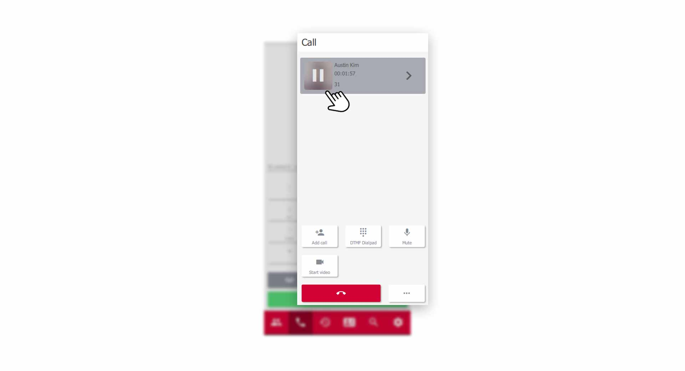

 


## Start a Call

There are several ways to start a new call in the pascom Mobile client. Enter a phone number in the **dialpad** or click on a **green handset** in the contact list. Additionally, calls can be started from the **phone book** and the **call journal**. 

*Start a new Call*
 

### The pascom Phone Area explained

The Phone area or Phone field offers some functions which are explained below.

**Dialpad**

Enter the phone number you want to call directly in the dialing field. Do not worry about the syntax of the phone number. The pascom client takes care of it. To start the call, press the **green handset button**. You can also search directly for **persons** in the dialing field. You can find more information [here]()

 

**Voicemailbox**

You can reach your answering machine / voice mailbox by clicking on the **Voicemail - Button**. You can find instructions on the functions of the voicemail box [here](link to voicemail).

 

**Redial**

Use **Redial** to call the last contact / phone number dialed, again. 

 

## Incomming Call

If you are called, the incoming call element appears in the phone field. A pop-up notification of the incoming call also appears. You now have the option to **accept** or **reject** the call. You can also directly **transfer** the call to a colleague.

*Incomming Call within the pascom Client*
 

## Active Call

During an active call, the telephone area of the pascom client offers a lot of functions. Here, **interactive call elements** are used, which allows intuitive and easy interactions with the participants. 

### Interactive Call Elemtents explained

Each participant is displayed in the telephone area of the Pascom client as **interactive call element**. This way you always have full control over the current call.

*Participant as interactive Call Element*
 

Click on the **white arrow** to access further options for this call element.

*Extended Options of the Call Element*
 

You have the option to forward the current caller via **transfer**, open the **Chat area**, put the call on **Hold** or display further **details** from the phone book. 

### Extended telephone functions during active calls

The phone field/area also changes during an active call and enables further functions.

Here you can now start a **new call**, send **DTMF tones**, mute the **microphone**, and use **video and screen sharing** or hang up the call via the **red handset button**.

## Hold a Call

Putting an active Call on **"Hold "** has several advantages. Differently than with the muting of your microphone, the conversation partner hears music on hold and knows therefore that you e.g. hold consultation. In addition, you can call other contacts while the other party is on hold. 

To **"hold"** a call, click on the **pause/hold button** in the **call element"**. The caller is then grayed out.

*Hold a Call*
 

You can retrieve the waiting caller by clicking the **pause button** again.

## Your Voicemail Box

Click the **Voicemail button** to call your voicemail box, provided your system administrator has configured your own voicemail box. You can also reach your **mailbox** via a [Function code](link to function codes). 

1. retrieve your messages or make settings via a **voice menu** in your **mailbox**.

## Enable GSM fallback

It can happen that where you are, there is no stable WLAN connection. The pascom Mobile Client automatically detects the
switches to GSM mode to establish the connection via your mobile network. 

You can also activate the GSM mode manually.

1. Click on the **GSM button** in the top right-hand corner of the **Telephony area**.

 