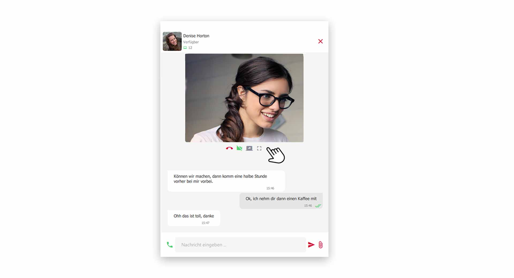

 


## Video-Telefonie mit Ihren Kollegen

Egal ob im Home-Office oder bei virtuellen Besprechungen, das visuelle Element der Video-Telefonie fördert eine bessere Zusammenarbeit. 

### Video-Telefonie starten

Rufen Sie wie gewohnt Ihren Kollegen an. Während dem **aktiven Gespräch** haben Sie nun im **Wählfeld** die Option, mit einem Klick, die **Video-Funktion** einzuschalten.

*Video-Telefonie mit Kollegen starten*
 

Das Video-Telefonat mit Ihrem Kollegen startet standartmäßig im Vollbildmodus.

*Aktives Video-Telefonat im Vollbildmodus*
 

## Video-Optionen

Während einem aktiven Video-Telefonat stehen Ihnen viele Optionen und Funktionen zur Verfügung.

*Optionen während eines Video-Telefonat*
 

### Chatten

Sie können während dem Video-Telefonat ganz normal die Chat-Konversation mit Ihrem Kollegen nutzen. Klicken Sie dazu auf der linken Seite auf das **Chat-Symbol**.

### Video-Bild Ein- /Ausschalten

Klicken Sie zum Ein- /Ausschalten des Video-Bild auf den **Kamera-Button** im **Video-Menü**.

### Mikrofon Ein- /Ausschalten

Klicken Sie zum Ein- /Ausschalten Ihres Mikrofons auf den **Mikrofon-Button** im **Video-Menü**.

### Video-Vollbildmodus beenden

Um den Vollbildmodus des Video-Telefonat zu beenden, klicken Sie im **Video-Menü** auf den **Vollbildmodus-Button**. Das Video-Bild wird dann in die Gruppe im pascom Client integriert.

*Aktives Video-Telefonat minimiert im pascom Client*
 

### Video-Telefonat beenden

Zum Beenden des Video-Anrufs legen Sie das Gespräch über den **roten Höhrer-Button** auf.

 

