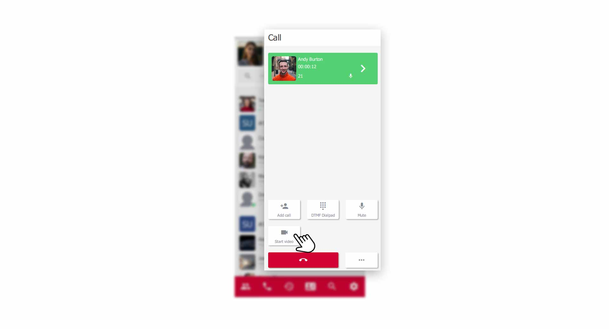
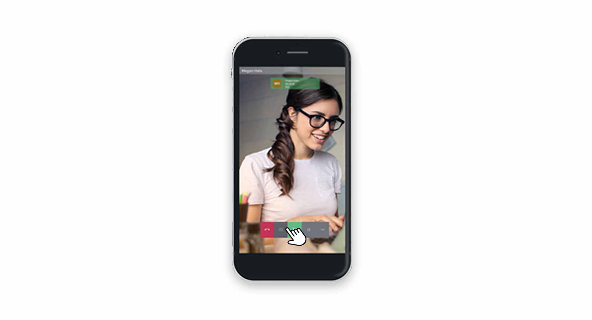
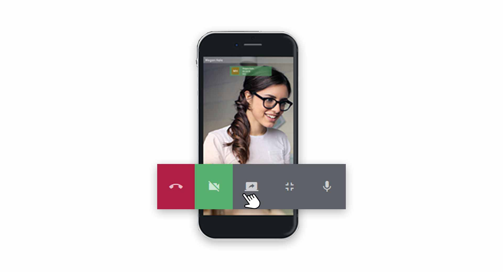
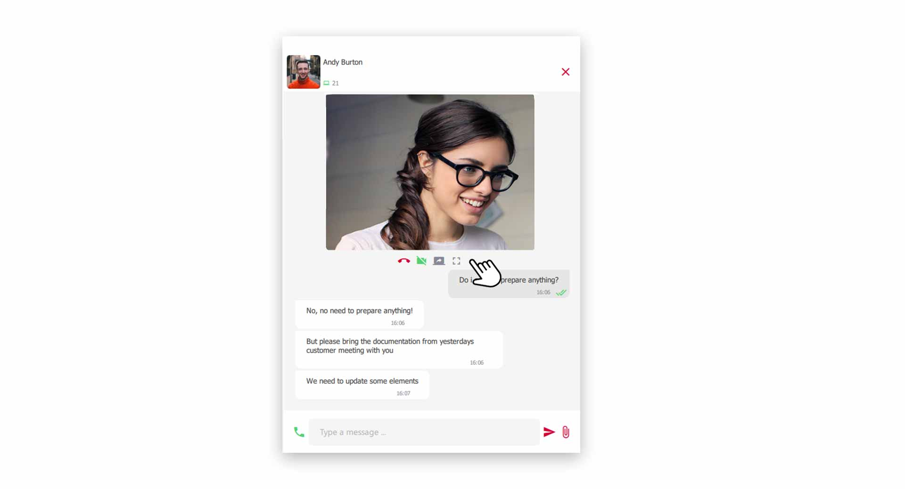



## Video telephony with your colleagues

Whether in the home office or in virtual meetings, the visual element of a video Call promotes better collaboration. 

### Start a Video Call

Call your colleague as usual. During the **active call** you now have the option to activate the **video function** in the **dialing field** with one click.

*Start video Call with colleagues*
 

By default, the video call with your colleague starts in full screen mode.

*Active Video Call in Fullscreen Mode*
 

## Video-Options

During an active video call, many options and functions are available to you.

*Options during a Video Call*
 

### Chat

You can use the chat conversation with your colleague during the video call as normal. To do so, click on the **Chat icon** on the left side.

### Switch Video on/off

To switch the video picture on/off, click the **Camera button** in the **Video menu**.

### Switch Microphone on/off 

Click on the **Microphone button** in the **Video menu** to switch your microphone on/off.

### Exit Video Fullscreen Mode

To exit the full screen mode of the video call, click the **Full Screen Mode button** in the **Video menu**. The video image is then integrated into the group in the pascom client.

*Active Video Call minimized in the pascom client*
 

### End a Video Call

To end the video call, hang up the call using the **red handset button**.

 
