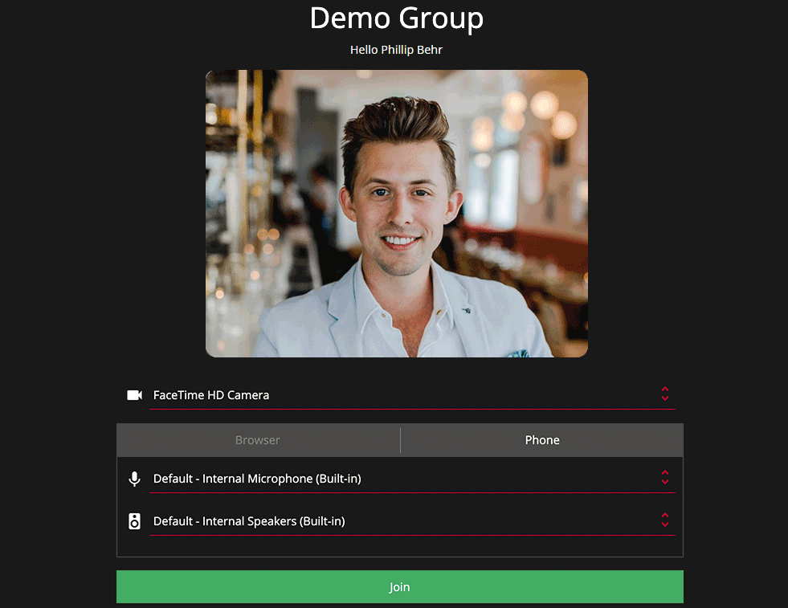






{}
The pascom Web Client does not replace the pascom desktop or mobile client, but enables communication with external participants in web conferences via the web browser.
{}

## pascom Training Video

 

## Supported Browsers

The pascom Web Client can be used in your favourite web browser. Currently, popular browsers such as Chrome, Firefox, Safari and Microsoft Edge are supported.


## Participate in Conferences

pascom groups are a powerful conference tool which cn be used to enable both classic audio conferences and modern video conferences via the web browser.

### Join a Classic Audio Conference

{}
To use this option, the public group must be configured with an **external group number**!
{}

As an external participant in an audio conference, you will usually receive dial-in data consisting of a phone number and PIN.

```
Dial in Number: +499912969166
PIN: 313 787 136

```
As soon as you have dialed in via the dial-in number and entered the PIN, the pascom phone system will direct you to the corresponding conference. To end the audio conference, simply hang up.

### Participate in a Web Conference

As an external participant in a web conference, you will usually receive an invitation that can look like similar to below.

```
Group: "Demo Group"
Webclient URL: https://pascom.net/pascom/webclient/f791b39a-4fd4-431b-850a
Dial in Number: +499912969166
PIN: 313 787 136

```
Enter the URL into to your browser and navigate to the pascom web client's web conference start page.


Enter a name with which you want to join the web conference. This name will also be visible to all other participants. 

### The Web Client Options



**Select Camera**  

Your browser will automatically search for and find installed webcams which can be used when participating in a video web conference. It is of course also possible to disable the video function via the **drop down menu** and selecting **no camera**. 

**Browser Audio**  

Select and configure your audio preferences for both your microphone and speaker. Your browser will automatically try to detect installed devices such as integrated audio components, headsets and headphones. Simply select your preferred audio device from the **drop down list**.

**Phone Audio**  

To join a conference using dial-in phone audio you will need to select the **phone tab** within your the webclient log in browser window. You will need the conference **dial-in number** and **PIN** in order to call in and use your phone audio.

### The Waiting Area

If a participant joins a web meeting before a moderator has started the conference, the waiting area will always appear. This is also the case if a moderator chooses to pause a conference.


External participants will hear the music on hold set in the pascom phone system for the duration the wait before the conference starts / resumes. The **leaver (exit door) symbol** takes you back to the Web Client options.

### The Web Client Interface

As soon as the web conference starts, all external participants will move to the web client interface, where as a participant several conferencing and collaboration tools will be available to you.


**Increase / Reduce Video Size**  

By clicking on a participants video, it is possible to maximise the size of their video as the main point of focus. To decrease the video size, simply click it again. This function is especially helpful for maximising screen sharing video streams for maximum detail.

**Chat Area**  

On the left of the screen, you will see the chat menu icon which you can click to show or hide the instant messaging section. Within the chat area, each conference participant can chat with each other.

**Participant List**  

On the right of the screen, you will find the the participant menu icon which you can click to which you can show or hide the conference participant list.

**Toolbar**  

In the bottom section of the screen, you will find the conference toolbar in which it is possible to mute / unmute your **microphone**, turn your **video** on or off, switch to **fullscreen mode** and leave the conference.

### Leaving the Web Conference

If you leave the web conference using the **Leave (exit door) symbol**, you will return to the client options. From here, you can re-enter the web conference again or close the browser window.


