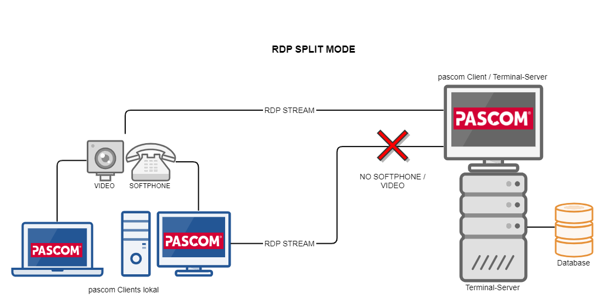


 


### Modify Your Firewall

Many companies do not have any **Internet access restrictions** and can therefore **immediately** start using the [pascom desktop UCC client}(https://www.pascom.net/en/business-phone-system/unified-communications/ "pascom Desktop Mobile Unified Communications") without needing to make any alterations to their Firewall.

However, should you choose to, you can specify which internet services your company network is permitted to access by opening the following ports and allowing the pascom desktop client access in order to ensure that your pascom phone system operates optimally:

[Configure Firewall / Port Overview]()

## Windows Installation

{}
System requirements: **Windows 7, 8.1 or 10 (32 and 64bit)** including the most up-to-date patch levels. 
{}

The Windows installation process does not require any admin privileges and be performed directly in the home-directory of the currently logged in user:

 * Download the [Windows Desktop Client](https://my.pascom.net/update/client/stable/windows "pascom Windows Desktop UC Client")
 * Run the **pascom-client-setup.exe**
 * Follow the install guide

### Windows QoS Settings (Optional)

In order to achieve the maximum voice quality, the pascom client marks all voice data accordingly with QoS flags.

With the exception of Windows, this happens automatically on all other platforms.

The following group policies "**Policy-based QoS**" are required under Windows to mark the packages accordingly.

The group policies are created under the following path:

```bash
Local Computer Policy > Computer Configuration 
> Windows Settings > Policy-based QoS
```

|                           | Policy 1          | Policy 2          | Policy 3          |
| ------------------------- | ----------------- | ----------------- | ----------------- |
| *Policy Name*             | pascomSIP         | pascomRTP         | pascomXMPP        |
| *Application Name*        | pascom Client.exe | pascom Client.exe | pascom Client.exe |
| *Protocoll*               | TCP and UDP       | UDP               | TCP               |
| *Source Port*             | \*                | \*                | \*                |
| *Destination Port*        | 5060:5062         | 30000:35000       | 5222              |
| *Source-IP*               | \*                | \*                | \*                |
| *Destination-IP*          | \*                | \*                | \*                |
| *DSCP Value*              | 24                | 46                | 24                |
| *Throttle Rate*           | -1                | -1                | -1                |


## Terminalserver Installation

{}
System requirements: **Windows Server 2008 R2 64bit** or higher
{}

{}
 When using this installation method, the automatic pascom desktop client updates will be deactivated, even without setting the noUpdate command line option. You will need to download and deploy the newer clients versions manually.
{}

(Optional) On the Microsoft Terminal Server it is possible to install the pascom desktop client directly in the programmes directory instead of the corresponding user's home directory. 

The disadvantage of this type of installation is that you will need to manually perform all pascom desktop client updates, as the updates require admin rights. The advantage of terminal server installations is that you can save upto ca. 100MB storage space per user. 

* Download the [Windows Desktop Client](https://my.pascom.net/update/client/stable/windows )
* Open the command prompt as an Administrator
* Start the setup and specify the install directory

Example

```
pascomClient-setup.exe /D=C:\Program Files (x86)\pascom Client
```

### Use RDP mode on Terminal Server



Using the command line parameter **- -rdp** or by setting the environment variable **PC_RDP to 1** it is now possible to disable softphone and video support for the client on the Terminal Server. This allows the client on the Terminal Server to use the softphone of another client instance for telephony.

This allows e.g. to start one client instance within an RDP session and another one on the host computer. The instance running within the RDP session has the --rdp flag set, the outer one does not. Thus, a headset connected to the PC can be used for telephony.

#### What does this do?

- Better audio quality, as the audio does not have to be transferred to the RDP session
- Headset control (e.g. Accept via button on headset) works as a result.
- Integrations in software running on a terminal server (e.g. Outlook, Datev) still works.
- Less CPU load on terminal servers, since audio and video are encoded and decoded via the client on the respective terminal device.
- Call control is fully possible via each of the clients.  

The feature works across platforms (Windows, macOS, Linux) and is not limited to RDP sessions.


### Mac OS

{}
System requirements: **macOS High Sierra 10.13** or higher
{}

* Download [macOS Desktop Client](https://my.pascom.net/update/client/stable/macos)
* Run the **pascom Client.dmg** file
* Drag the pascom icon (red) on to the Applications folder
* As soon as the copy process has been completed, you will be able to start the client

## Linux Installation

{}
System requirements **Ubuntu 18.04 LTS** or higher. Other Linux distributions may work, but are however neither tested nor officially supported by pascom. 
{}

* Download the [Linux Desktop Client](https://my.pascom.net/update/client/stable/linux) 
* Unzip **pascom_Client.tar.bz2** in the home directoy
* Create Ubuntu Application Icon with **create-starter.sh**
* Start the client via the Application Icon

Example

```bash
tar jxvf ./Downloads/pascom_Client-7.17.10.R.tar.bz2
./pascom_Client/create-starter.sh 
```

## Windows Installer Command Line Parameters

|Parameter|Explanations|
|---------|---------|
|S|Enables an installation in to run in the background, without displaying any dialog windows.|
|D=PATH| Enables the defining of the installation folder, i.e path. This parameter must always be the last parameter in the command line and only supports absolute file paths|


## Desktop Client Environment Variables and Command Line Options

The pascom Desktop Client supports a range of command line options and reacts to a nummber of environment variables on all operating systems. 

Using the `--help` parameter for more information on which options and envirnoment variables are supported by your version of the pascom desktop client. 

Example

```text
pascom Client 7.18.00.D3667_267a0cd
Environment variables without corresponding commandline parameter:
- PC_SCALE_FACTOR=<value>: Set this environment variable to override automatic DPI Scaling value. Useful if you have a Setup with multiple Monitors and non-integer scaling factors. Value is a real, e. g. 1, 0.75, 1.5, and applies as second factor to the Scaling Value QT Calculated. Example: Your screen is at 150% scaling, QT would calculate a factor of 2. So VALUE needs to be 0.75 to get to the correct real scaling of 1.5

- PC_SCENE_GRAPH_BACKEND=<value>: Set this environment variable to switch the backend used for rendering the ui. Useful if the default backend produces graphic errors on your setup. Do not set or leave empty to use automatic (Software on Windows, OpenGL on other platforms). Possible Values are: software, d3d12, openvg, opengl

- PC_QSG_RENDER_LOOP=<VALUE>: Change the used opengl render loop by setting `QSG_RENDER_LOOP` internally. Defaults to 'basic' if not set. Possible Values are: basic, windows, threaded


Options:
  --userDir <userDir>      Set user directory. Via Environment: Set PC_USERDIR
                           to desired value
  -h, --help               Displays this help.
  --exec                   Execute a command instead of starting a client
                           instance. Example: --exec dial,*104 (Calls your own
                           Voicemailbox)
  --debug                  Show debug window. Via Environment: Set
                           PC_DEBUG_WINDOW to any value.
  --noUpdate               Disable automatic update. Via Environment: Set
                           PC_NO_UPDATE to any value.
  --forceTouchMode         Show UI like touchscreen is enabled
  --disableHeadsetSupport  Set to true to disable automatic headset detection
                           and controls. Via Environment: Set
                           PC_HEADSET_SUPPORT_DISABLED to any value.
  --logSennheiserMessages  Log all communication from and to Sennheiser
                           HeadSetupApplication. Via Environment: Set
                           PC_LOG_SENNHEISER_MESSAGES to any value.
  --logXmppMessages        Log complete Xmpp Messages. Via Environment: Set
                           PC_LOG_XMPP_MESSAGES to any value.
  --logSipMessages         Log complete Sip Messages. Via Environment: Set
                           PC_LOG_SIP_MESSAGES to any value.
  --loglevel <loglevel>    Set Logging verbosity. values from 0-5. Via
                           Environment: Set PC_LOG_LEVEL to desired value.
  --minimized              Do not open the main window on startup. Via
                           Environment: Set PC_MINIMIZED to any value
  --user <user>            Override login username. Via Environment: Set
                           PC_USER to desired value.
  --password <password>    Override login password. Insecure, please use
                           PC_PASS environment variable instead
  --server <server>        Override login server. Via Environment: Set
                           PC_SERVER to desired value.
  --rdp                    Use RDP Mode. Via Environment: Set
                           PC_RDP to 1.
```
