



<!-- FIXME - bilder nur mit hellem theme! -->

<!--FIXME
- Amtsholung
- Hinweis auf unterstützte Headsets
- VErbinden -> Bilder mit einheitlichen Nummern
-->

## What's New in pascom19 | Training Video
 


## Login

Damit ein angelegter [Benutzer]() den pascom Client verwenden und sich anmelden kann benötigt er seinen Benutzernamen und das hinterlegte Benutzerkennwort.

{}
Verwenden Sie eine selbstgehostete "on Premise" Telefonanlage mit nur einer Instanz, ist die Angabe des Instanznamen nicht erforderlich.
{}

|Eingabefeld|Beschreibung|
|---|---|
|Benutzername|Benutzername@Instanzname|
|Passwort|Benutzerkennwort|
|Server|Domain oder IP des Serverhosts|
|Anmeldedaten speichern?|Setzen Sie hier einen Haken, wenn sich der Client beim Starten automatisch mit den angegebenen Zugangsdaten anmelden soll.|

## Übersicht

Der Client besteht aus drei grundsätzlichen Bereichen:

+ Der Bereich links beinhaltet das eigene Profil mit Kontaktliste und Umschaltleiste,
+ der Bereich rechts bietet die Telefonie-Funktion
+ und der mittlere Content-Bereich ist flexibel. Sie können über die rote Umschaltleiste Konversationen, Journal oder das Telefonbuch anzeigen lassen.

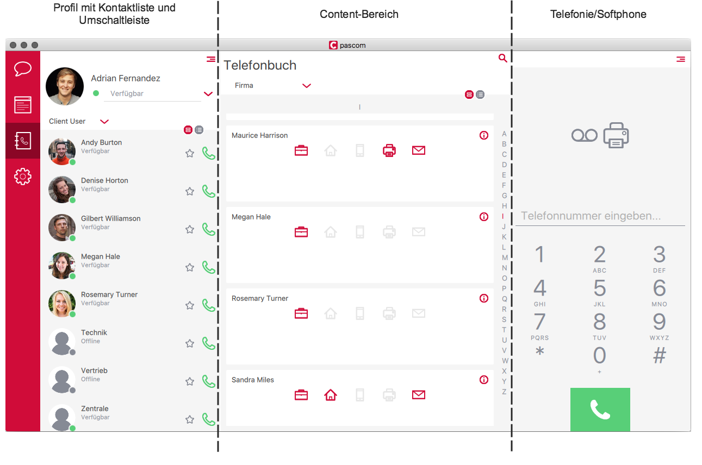

Die verschiedenen Ansicht-Möglichkeiten des Clients:

+ **Expanded Mode**: Alle drei Bereiche sind sichtbar, der mittlere Bereich kann über die Umschaltleiste ausgewählt werden.
+ **Normal Mode**: Es sind der Profil- und Kontakte-Bereich sichtbar, zusätzlich kann über die Umschaltleiste zwischen *Konversationen*, *Telefonie-Funktion*, *Journal* oder *Telefonbuch* gewählt werden.
+ **Mini Mode**: Es ist nur ein Bereich sichtbar, und die Umschaltleiste ist nun unten zu finden. Über diese kann zwischen den Bereichen gewechselt werden.

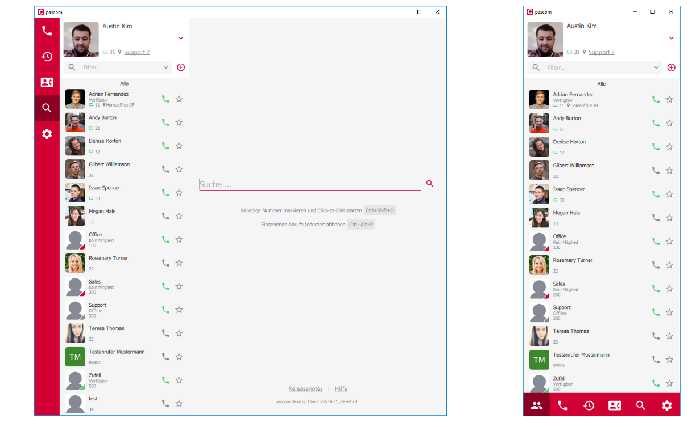

Zwischen den verschiedenen Ansichten können Sie wechseln, indem Sie die Größe des Clients ändern oder indem Sie [Tastenkürzel]() verwenden.

## Profil und Kontaktliste

Funktionen in der Kontaktliste:

|Funktion|Beschreibung|
|---|---|
|Verfügbarkeits-Status|Es stehen zur Auswahl: - *grün* > Verfügbar - *gelb* > Bin gleich zurück - *rot* > Bitte nicht stören (Diese Einstellung hat keine DND-Funktionalität.) Die Status-Texte können Sie nach Bedarf ändern.|
|Neue Gruppe erstellen|Über das "+ Symbol" können Sie eine neue permanente Gruppe erstellen.|
|Filter für Kontaktliste|Über die Filter/Suche finden Sie schnell, anhand Ihrer Eingaben, die gewünschten Kontakte in Ihrer Kontaktliste.|
|Kontakte|Hier erhalten Sie Informationen über Ihre [Kontakte]().|
|Hörer-Symbol|Mit einem Klick auf den Hörer rufen Sie den Kontakt an.|
|Favoriten makieren|Mit dem "Sternchen-Symbol" makieren Sie ganz einfach Ihre favorisierten Kontakte. Diese werden dann oben in der Kontaktliste angepinnt.|
|Teams|Hier sehen Sie die [Teams]() in denen Sie ein festes oder flexibles Mitglied sind. Der Status *Verfügbar* oder *Offline* bezieht sich in diesem Fall darauf, ob Sie eingebucht sind oder nicht.|

## Kontakte

Jeder Kontakt in Ihrer Kontaktliste besitzt diverse Status, welche anhand der folgenden Darstellung erkennbar sind.

## Teams

## Integriertes Softphone

Über die Einstellungen können Sie auch das pascom Softphone auswählen. Voraussetzung ist, dass Ihr Administrator Ihnen bereits ein integriertes Softphone zugewiesen hat.

Um das Softphone verwenden zu können, müssen Sie die passenden Softphone-Einstellungen vornehmen (Mikrofon und Lautsprecher auswählen). Auch wenn Ihr Client das Headset bereits erkannt hat, müssen Sie es explizit auswählen. Sollte das gewünschte Headset nicht automatisch in den Einstellungen erscheinen, müssen Sie ggf. die Audio-Einstellungen Ihrer Rechners prüfen.

## Arbeitsplatz auswählen

Sie haben die Möglichkeit, mit der Arbeitsplatz Funktion, vorkonfigurierte Setups zu benutzen z.B. Homeoffice PC mit Hardwaretelefon. Sofern Ihnen durch einen Administrator die Rechte, für das An- und Abmelden an solch einem Arbeitsplatz, gegeben wurde, können Sie ganz einfach dieses Setup für Ihren Benutzer übernehmen.

Sie wählen einen der Ihnen zugewiesenen Arbeitsplätze aus und können von nun an das vorkonfigurierte Telefonsetup verwenden. Diese Einstellung finden Sie auch nochmals in den Follow Me Settings der Client Einstellungen.

## Telefonieren

Bevor Sie das erste Mal telefonieren, prüfen Sie bitte die Telefon-Einstellungen. Wichtig dabei ist, dass Sie, falls Ihnen mehrere Telefone zugewiesen sind, das richtige auswählen.

### Gespräch starten

Der Client bietet mehrere Möglichkeiten ein Gespräch zu starten:

* Geben Sie im [Wählfeld]() eine Nummer ein.
* Rufen Sie einen Kollegen an, indem Sie auf das grüne Hörer-Symbol in der [Kontaktliste]() klicken.
* Klicken Sie das Hörer-Symbol im [Journal-Eintrag]() an.
* Wählen Sie eine Nummer im [Telefonbuch]().

### Aktives Gespräch

### Eingehender Anruf

### Verbinden

#### Blind Transfer (Verbinden ohne Rücksprache)

Während eines Gesprächs können Sie einen Gesprächspartner ohne Rücksprache weiter verbinden.  Klicken Sie auf 'Verbinden' und wählen Sie die neue Zielrufnummer.

Möchten Sie den Anrufer an einen Kollegen verbinden, rechts-klicken Sie auf dessen Namen oder Profilbild in der Kontaktiliste und wählen Sie *Transfer*.

#### Attended Transfer (Verbinden mit Rücksprache)

Das Verbinden mit Rücksprache erfolgt in zwei Schritten:

1. Einen weiteren *Anruf hinzufügen*, um Rücksprache zu halten.
2. Den ersten Anrufer mit dem hinzugefügten Anrufer *verbinden*.

Es ist nicht notwendig den ersten Anruf extra zu halten. Dieser wird automatisch gehalten, wenn, wie in Schritt 1 beschrieben, der neue Anruf gestartet wird. Anschließend wird im Schritt 2 der Anrufer verbunden.

### Dreierkonferenz

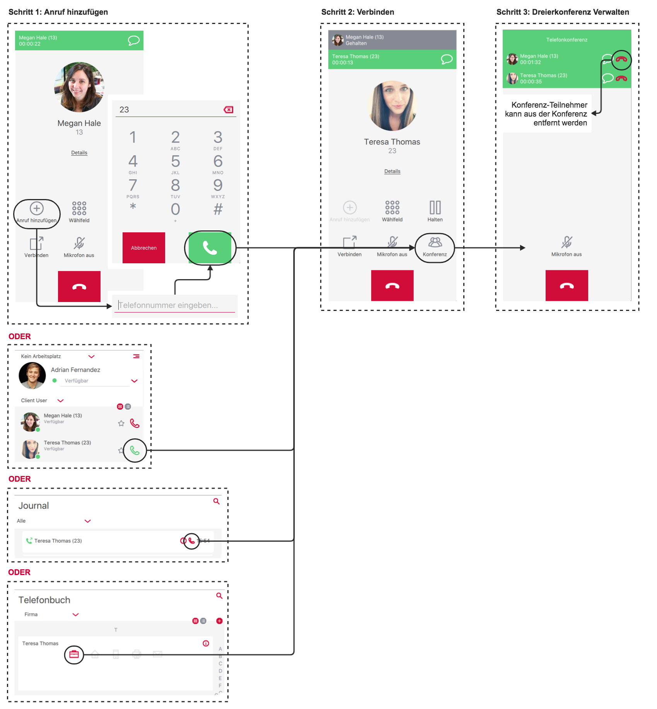

Die Dreierkonferenz wird ähnlich wie [Attended Transfer]() in zwei Schritten eingeleitet. Im ersten Schritt wird, wie bereits bekannt, der Anruf hinzugefügt.

Im Schritt 2 werden beide aktiven Anrufe mit dem Klicke auf *Konferenz* zu einer Dreierkonferenz zusammengeschalten. Im Schritt 3 können Sie, als Initiator der Dreierkonferenz, einen Teilnehmer aus der Konferenz entfernen.

### DTMF-Töne senden

DTMF-Töne werden verwendet um z. B. in einem Konferenzraum eine PIN zur Authentifizierung einzugeben, wenn Sie in einer Hotline durch die Eingabe von 1, 2 oder 3 an den/die gewünschten Gesprächspartner gelangen möchten oder mit einem Nummerncode eine Tür öffnen müssen.

Um mit dem pascom Client unter Verwendung des pascom Softphones DTMF-Töne zu versenden klicken Sie während des laufenden Gesprächs auf das *Wählfeld*.

## Suche und Smart Filter

### Suche

Der Client bietet über das Lupen-Symbol eine sehr umfangreiche Suche. Geben Sie einen Suchbegriff ein, werden Telefonbücher, Journal-Einträge, Kontakte und das Chat-Archiv durchsucht. Der Suchbegriff kann dabei aus mehreren Begriffen und sogar aus mehreren Wortteilen bestehen.

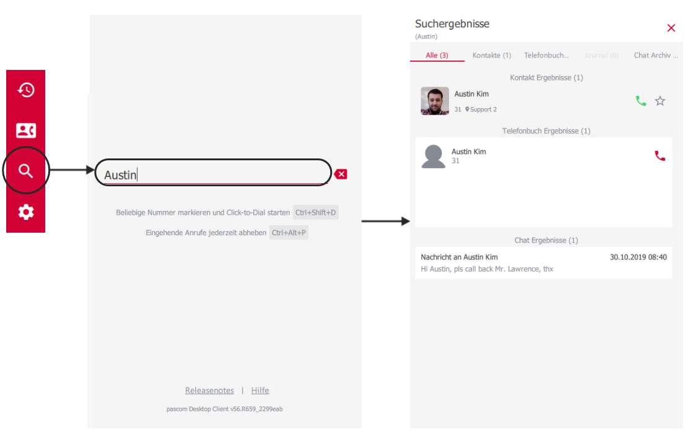

*Beispiel*: Sie suchen nach dem  Kontakt *"Max-Andreas Mustermann"* reicht der Suchbegriff *"And Muster"*.  

Die Suchfunktion kann auch im Wählfeld genutzt werden, um schnell Kontakte z.B. für Konferenzen oder Transfers zu finden.

### Smart Filter

Smart-Filter sind ein tolles Werkzeug um seine Kontaktliste schnell nach bestimmten Attributen oder Status zu filtern z.B wer ist gerade Online oder zeige nur meine Favoriten.

## Benachrichtigungen

Benachrichtigungen sind Popups, die erscheinen, sobald eine Aktion stattfindet. Sie geben Informationen über die Art der Aktion, des Anrufers bzw. Konversations-Kontakt und bietet die Möglichkeit über das Popup gleich zu reagieren.

|Benachrichtigung|Beschreibung|
|---|---|
||Benachrichtigung über einen aktuell ausgehen Anruf mit der Möglichkeit den Anruf zu beenden mit Click auf den roten Hörer.|
||Benachrichtigung über einen aktuell eingehen Anruf mit der Möglichkeit den Anruf anzunehmen mit Click auf den grünen Hörer.|
|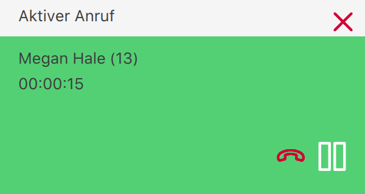|Benachrichtigung über einen aktive Anruf mit der Möglichkeit den Anruf... ...zu halten mit Click auf das Pause-Symbol. ...zu beenden mit Click auf den roten Hörer.|
||Benachrichtigung über einen verpassten Anruf mit der Möglichkeit zurück zu rufen mit Click auf den grünen Hörer.|
|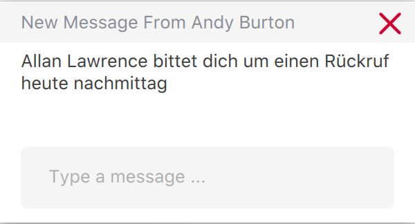|Benachrichtigung über eine neue Chat-Nachricht mit der Möglichkeit zurück zu schreiben.|

Über Einstellungen können Sie Ihre Benachrichtigungen anpassen:

## Gruppen

Mit der Gruppen-Funktion erstellen Sie permanente Gruppen welche eine menge Funktionen bieten.

1. Gruppen-Chat
2. Audio-Konferenz
3. Video-Konferenz
4. Online-Meetings mit Screensharing

### Gruppe erstellen

Klicken Sie in der Kontaktliste auf das "+ - Symbol" um eine neue Gruppe zu erstellen. Sie können so viele Gruppen anlegen, wie Sie möchten. Im nächsten Schritt vergeben Sie einen Gruppennamen, Gruppenbild und fügen die gewünschten Teilnehmer hinzu. Abschließend speichern Sie die Gruppe mit dem "Disketten-Symbol". Die neue Gruppe erscheint nun in Ihrer Kontaktliste.

### Gruppe verwalten

Um eine Gruppe zu verwalten, klicken Sie in der Kontaktliste auf die entsprechende Gruppe. Im Contentbereich erscheint im oberen Abschnitt ein kleines Infosymbol. Hier nehmen Sie Änderungen an der Gruppe vor. Wünschen Sie keine Benachrichtigungen mehr, können Sie die Gruppe über das Lautsprechersymbol stummschalten.

## Chat

Es gibt 2 Möglichkeiten eine Chat Konversation mit einem Kontakt zu starten. Mit einem direkten Klick auf den Kontakt in der Kontaktliste oder während einem Gespräch in den Anrufoptionen.

### Gruppenchat

Für einen Gruppenchat wird eine Gruppe benötigt. Haben Sie noch keine Gruppe angelegt, erstellen Sie sich zunächst eine neue [Gruppe]().

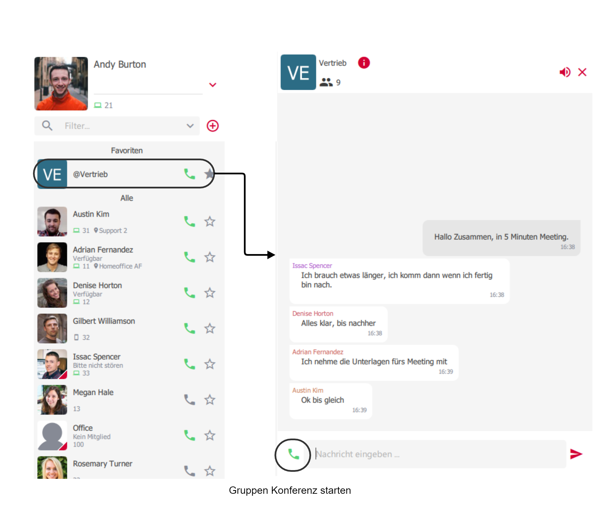

Klicken Sie in der Kontaktliste auf die gewünschte Gruppe. Im Contentbereich erscheint nun die Konversation der jeweiligen Gruppe. Sie können von dort aus auch eine Gruppen-Konferenz starten. Zum Verlassen des Chats, klicken Sie einfach auf das X Symbol in der oberen rechten Ecke.

### Chatbenachrichtigungen

Ist der Konversations-Bereich nicht im Fokus, und Sie erhalten eine neue Nachricht, so erscheint in der Kontaktliste am Profilbild und am jeweiligen Kontakt eine Hinweismeldung. Am Profilbild erkennen Sie immer die gesamten, noch nicht gelesenen, Nachrichten. Kontakte mit neuen Nachrichten, rutschen in der Kontaktliste automatisch nach oben, sofern die Sortierung so eingestellt wurde.

 Sollte Ihre Sortierung nicht so eingestellt sein, dass die letzten Änderungen automatisch oben in der Kontaktliste erscheinen, können Sie mit einem Klick auf die Nummer, der noch nicht gelesenen Nachrichten an Ihrem Profilbild, klicken. Mit Hilfe der Smart Filter werden dann nur die Kontakte angezeigt, die neue Nachrichten enthalten. 

## Dateien versenden

Der Client bietet Ihnen die Möglichkeit mit Ihren Kollegen Dateien auszutauschen. Dafür gibt es drei Möglichkeiten.

1. Klicken Sie bei einer bereits bestehenden Konversation mit dem Kollegen auf das Büroklammern-Symbol. Anschließend können Sie auf Ihrem Rechner die gewünschte Datei auswählen und somit verschicken:

2. Sie können bei einer bereits bestehenden Konversation mit dem Kollegen auch die Datei einfach auf das Konversations-Feld ziehen. Beim Loslassen der Datei wird diese versendet:

3. Falls Sie keine bestehende Konversation offen haben, können Sie die Datei auch in der Kontaktliste auf das Profil-Feld des Kollegen ziehen. Beim Loslassen der Datei wird diese versendet:

## Gruppen Konferenz

Oft kommt es vor, dass Sie sich schnell mit Kontakten abstimmen müssen. Um nicht jedes Mal einen Konferenzraum zu belegen, gibt es die Gruppen Konferenzen.
Für eine Gruppen Konferenz wird eine Gruppe benötigt. Haben Sie noch keine Gruppe angelegt, erstellen Sie sich zunächst eine neue [Gruppe]().

### Gruppen Konferenz starten/beitreten

Um eine Gruppen Konferenz zu starten oder beizutreten, rufen Sie die entsprechende Gruppe an. Das System wird Ihnen wie in einem Konferenzraum alle nötigen Infos zur Konferenz mitteilen. 

Sind bereits Kollegen in einer Gruppen Konferenz, erkennen Sie dies daran, dass die Gruppe nun grün hervorgehoben ist. Beitreten können Sie ganz einfach, indem Sie die Gruppe anrufen. 

### Aktive Gruppen Konferenz

Während der Gruppen Konferenz stehen Ihnen eine Reihe von Funktionen zur Verfügung.

1. Gruppen Chat
2. Auf Video-Session umstellen
3. Screensharing starten

Verlassen können Sie die Gruppen Konferenz über den roten Hörer.

## Video und Screensharing

### Video-Telefonie

Während eines Telefonats, können Sie ganz einfach auf Video-Telefonie umschalten, sofern eine entsprechende Webcam vorhanden ist. Ob Ihre Webcam richtig funktioniert, sehen Sie in den Client Einstellungen.

Die Video-Telefonie startet standartmäßig im Vollbildmodus.

Das Chat-Symbol öffnet die aktuelle Chatkonversation des Kontakts oder der Gruppe. Das Video-Menü bietet folgende Optionen:

|Option|Beschreibung|
|---|---|
|Auflegen|Beendet das komplette Telefonat.|
|Video an/aus|startet/beendet das Video Telefonat und kehrt zum normal Audio Telefonat zurück.|
|Screensharing an/aus|startet/beendet das Screensharing.|
|Fullscreen aus|Minimiert den Fullscreen und integriert Video/Screensharing in den Contentbereich des Client.|
|Weiere Optionen (3 Punkte)|Erweitert das Menü.|
|DTMF Dialpad|Blendet das Wählfeld ein.|
|Stummschalten aus/ein|Schaltet das Mikrofon aus/ein.|
|Kamera wechseln|Wechselt die Kamera Font/Back - nur am Mobiltelefon.|

Wenn Sie den Vollbildmodus verlassen, wird das aktive Video/Screensharing Telefonat minimiert und in den Client integriert. Von dort aus haben Sie wieder Zugriff auf die gewohnten Funktionen. Natürlich können Sie auch wieder mit den Buttons unter dem Videofenster zurück in den Vollbildmodus wechseln.

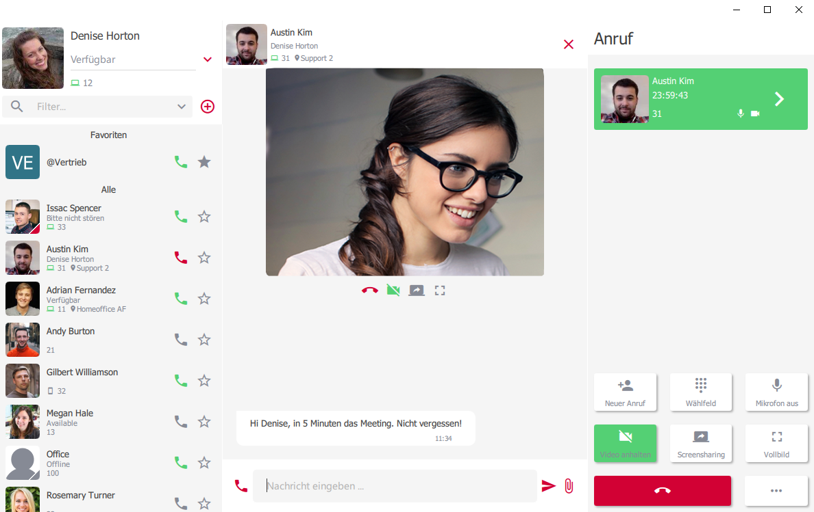

### Screensharing

Während dem Telefonat können Sie mit einem Klick auf den Screensharing-Button Ihren Bildschirminhalt mit dem Gesprächspartner teilen.

Die Screensharing-Session startet standartmäßig im Vollbildmodus. Ihnen stehen die selben [Optionen]() wie bei der Video Telefonie zur Verfügung.

### Video-Telefonie und Screensharing gleichzeitig

Sie können während einem [Video-Telefonat]() gleichzeitig Ihren Bildschirminhalt mit Ihrem Gesprächspartner teilen. Dazu klicken Sie im Menü einfach auf Screensharing starten. 

Der Video-Bereich wird minimiert und macht Platz für den Bildschirminhalt des Gesprächspartners. Auch hier stehen Ihnen wieder alle gewohnten [Optionen]() zur Verfügung.

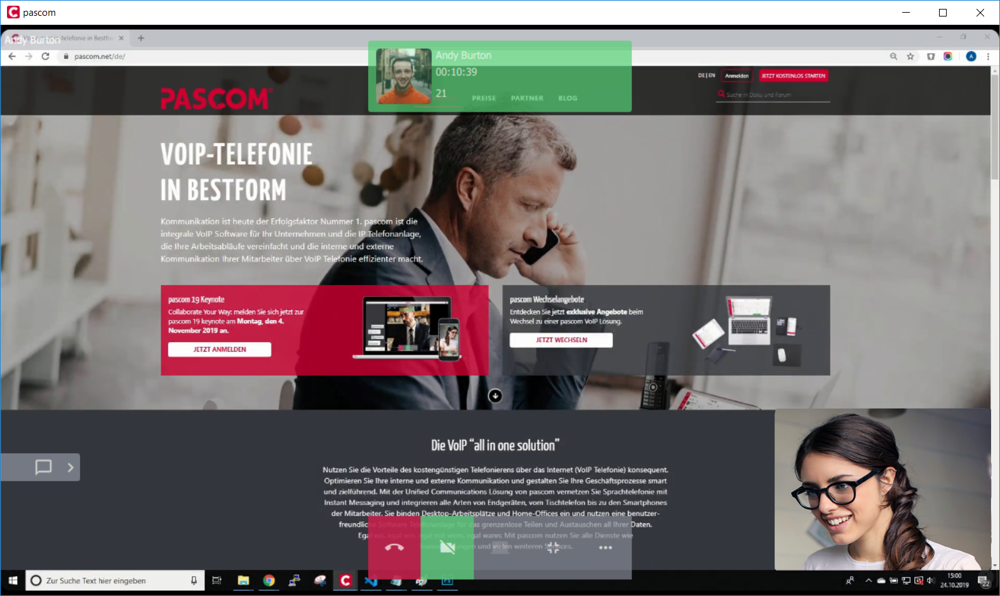

## Gruppen Audio/Video Konferenz mit Screensharing

Als Basis für folgende Funktionen wird eine Gruppe benötigt. Haben Sie noch keine Gruppe, erstellen Sie sich zunächst eine neue [Gruppe]().  

Starten Sie nun eine neue [Gruppen Konferenz]() oder treten Sie einer existierenden Gruppen Konferenz bei. Nun können Sie die [Video]()- und [Screensharing]() Funktion mit mehreren Konferenzteilnehmern nutzen.

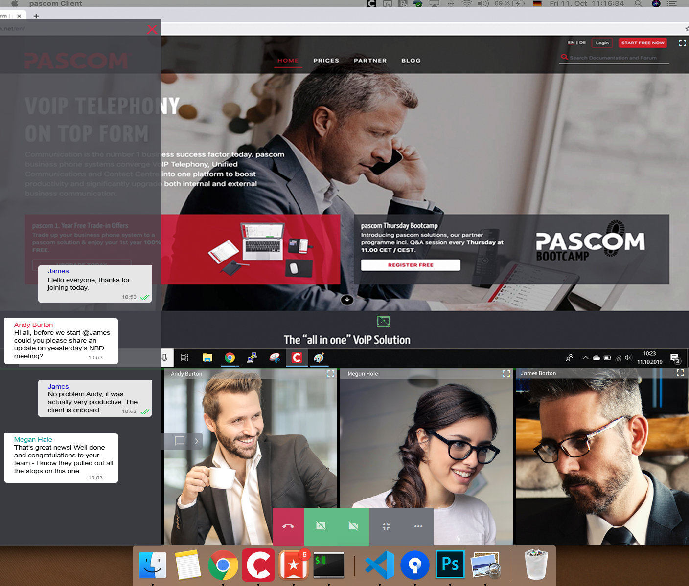

## Journal

Das Journal gibt eine Übersicht über alle getätigten Anrufe.

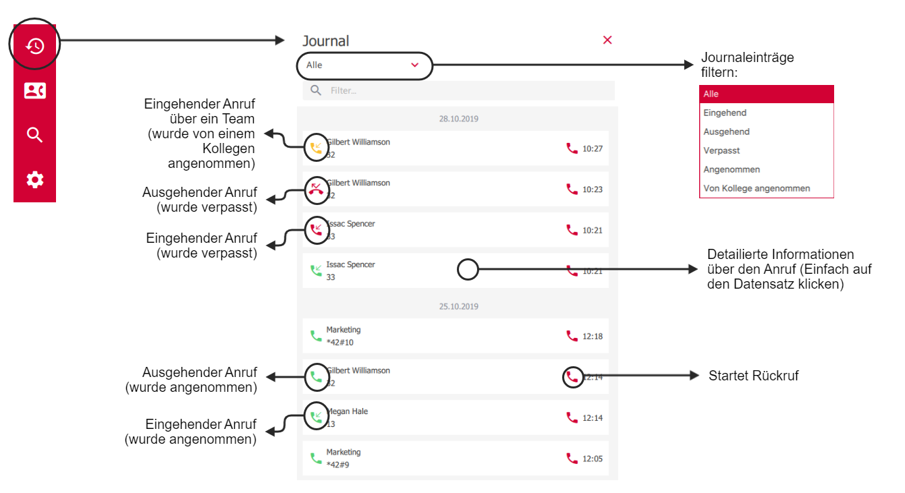

Im Journal haben Sie die Möglichkeit mit einem Rechtsklick auf den Eintrag

* Details eines Anrufers zu kopieren (Anrufzeit, Art des Anrufs, Name des Anrufers, falls vorhanden, und Telefonnummer),
* nur die Rufnummer zur weiteren Bearbeitung zu kopieren
* oder die Rufnummer für einen Rückruf in das Wahlfeld zu übertragen.

## Telefonbuch

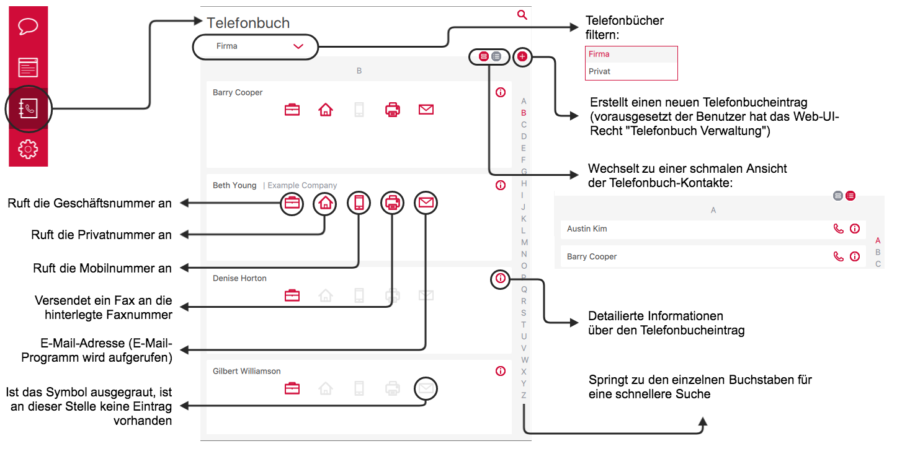

Der Client bietet neben dem Firmen-Telefonbuch auch ein eigenes (privates) welches Sie selber anlegen und pflegen können. Legen Sie einen Eintrag in Ihrem privaten Telefonbuch, wird dessen Name bei einem eingehendenen Anruf nur in Ihrem Client angezeigt.  

Möchten Sie externe Kontakte aus Ihrem Telefonbuch in die Kontaktliste mit aufnehmen, so können Sie im Telefonbuch den entsprechenden Kontakt als Favorit markieren.

## Fax

### Faxen über den Telefoniebereich

### Faxen über den Telefonbuch-Eintrag

Falls die Faxnummer bereits bekannt und im Telefonbuch hinterlegt ist, kann das Fax auch mit einem Klick auf das Fax-Symbol im Telefonbuch versendet werden:

### Faxen über einen überwachten Ordner (PDF to Fax)

Über die Client-Einstellungen >  können Sie auf Ihrem Rechner einen Ordner definieren. Dieser Ordner wird vom Client überwacht. Sobald eine PDF-Datei in diesem Ordner  gespeichert, kopiert oder gedruckt wird, öffnet der pascom Client den Fax-Dialog um diese Datei zu versenden.

### Automatisches Faxen über einen überwachten Ordner

Fax-Steuerfelder werden als normaler Text in das zu sendende Dokument eingefügt, anschließend verarbeitet der Fax-Server diese Anweisungen.

#### Vorbereitung

Damit die Steuerfelder aus dem PDF-Dokument erkannt werden können, wird das [Ghostskript](https://www.ghostscript.com/) auf Ihrem Rechner benötigt.
Ist das Ghostskript installiert muss der Pfad der Ghostskript-Datei *gs* über die Client-Einstellungen >  ausgewählt werden.

#### Automatisches Senden

Fügen Sie die Steuerfelder in das zu sendende Dokument ein.

Bitte beachten Sie, dass diese Steuerfelder vom Empfänger auch gelesen werden können. Ggf. können Sie mit bestimmten Schreibprogrammen "unsichtbar" gemacht werden (z. B. weiße Schrift auf weißem Hintergrund).

|Verfügbare Steuerfelder||
|---|---|
|@@+FAX:+49991123456789@@|Das Fax muss mindestens dieses Steuerzeichen mit der Zielnummer enthalten.|
|@@+TAG:Bestellung XYZ@@|Optional kann der Fax-Job mit einem Betreff versehen werden.|
|@@+NOTIFY:mustermann@musterfirma.de@@|Optional kann festgelegt werden, wer über den Status des Fax-Jobs informiert werden soll.|

Wie bereits im vorherigen Punkt beschrieben, können Sie über die Client-Einstellungen >  auf Ihrem Rechner einen Ordner definieren, der vom Client überwacht wird. Sobald eine PDF-Datei in diesem Ordner  gespeichert, kopiert oder gedruckt wird, werden die Steuerfelder ausgewertet und die Datei als Fax versendet.

## Voicemailbox abrufen

Mit dem Klick auf das Voicemail-Box-Symbol können Sie Ihre Voicemail-Box direkt anrufen. Weitere Optionen erfolgen über die Ansagen der Voicemail-Box.

## Tastenkürzel

Bei der Installation des Clients sind die Tastenkürzel bereits vordefiniert. Diese können Sie aber nach Ihren Wünschen belegen.

{}
Tastenkürzel sind nur im Desktop Client unter Windows und macOS verfügbar.
{}

Im folgenden werden die globalen Tastenkürzel näher erklärt:

|Tastenkürzel|Beschreibung|
|---|---|
|Intelligentes Abheben|Sie können einen ankommenden Anruf unter Verwendung des Tastenkürzels annehmen, auch wenn der Client nicht im Fokus ist.|
|Click-to-Dial|Diese Funktion ermöglicht es mit einem Tastenkürzel aus dem Browser oder einem Dokument heraus eine Nummer zu wählen.|
|Fenster umschalten|Diese Funktion ermöglicht es mit einem Tastenkürzel den Client in den Vordergrund zu holen oder zu minimieren.|

## Client-Einstellungen

### Profil Einstellungen

|Einstellung|Beschreibung|
|---|---|
|Avatar|Ändern Sie Ihr Profilbild. Lassen Sie sich ein Profilbild generieren oder laden Sie sich ein Profilbild vom Computer hoch.|
|Kontaktliste|Sortieren Sie Ihre Kontaktliste nach Ihren Anwendungsvorlieben.|
|Listenstil|Es stehen 2 Kontaktlistenstile zur Verfügung. "Listenansicht" für eine schmale Kontaktliste und "Details" für eine detailiertere Ansicht.|
|Automatische Abwesenheit|Ist Ihr Computer nicht gespehrt und Ihre Maus bewegt sich für XXX Sekunden nicht, wechselt Ihr Status auf gelb "Bin gleich zurück"|
|Journal / Systemanrufe ausblenden|Blendet Systemanrufe wie Voicemail etc. aus dem Journal aus.|
|Passwort ändern|Passwort neu vergeben - funktioniert nur, wenn das Passwort nicht von extern kommt (z.B. Active Directory)|

### Audio und Headset Einstellungen

Einstellungen für Headsets unterstützter Hersteller Sennheiser, Jabra und Plantronics. Diese sollten auf "Auto" stehen, um eine schnelle Hardware Erkennung angeschlossener Geräte zu gewährleisten. Stellen Sie das Mikrofon, Lautsprecher und den Klingelton der angeschlossenen Headsets ein.

### Meine Geräte

In den Follow Me Einstellungen bestimmen Sie selbst, sofern es durch den Administrator freigeschalten wurde, welche Ihrer Endgeräte wann klingeln soll. Zusätzlich können Sie vordefinierte Arbeitsplätze auswählen, an denen Sie sich anmelden können.

1. Bestimmen Sie Ihr Endgerät das für ausgehende Telefonate verwendet werden soll.
2. Legen Sie fest, welches Ihrer Endgeräte wann klingeln soll. 
3. Pairen/unpairen Sie Ihr Mobilgerät. 

### Client Einstellungen

Hier legen Sie die Basiseinstellungen des Client fest.

1. Ändern Sie die Sprache
2. Wählen Sie zwischen 2 Farbmodi, hell und dunkel.
3. Bestimmen Sie einen Download Ordner in dem die Dateien von Übertragungen gespeichert werden. 

## Aktionen

In den Aktionen können Sie Anrufdaten an Drittanwendungen weitergeben. Hier haben Sie die Möglichkeit Daten an eine URL, oder an eine installierte Anwendung weiter zu geben. 

Die Anwendungsfälle sind hier vielfälltig. Sie können die Variablen ${name}, ${number}, ${MDC_LABEL-X} oder ${MDC_SKILL-X} (Labels) als Parameter verwenden.

|Einstellung|Beschreibung|
|---|---|
|URL|Geben Sie hier die URL ein, gefolgt von den gewünschten Parametern.|
|URL automatisch öffnen|URL automatisch bei eingehendem Anruf öffnen.|
|Anwendung|Wählen Sie hier die installierte Anwendung auf Ihrem Computer aus.|
|Parameter|Hinterlegen Sie hier die Parameter, die an die Anwendung übergeben werden soll.|
|Anwendung automatisch öffnen|Anwendung wird automatisch gestartet bei eingehendem Anruf.|

## Client-Feedback an pascom melden

Sollten Sie Probleme mit dem Client haben, können Sie über die Einstellungen die Client-Log-Datei sichten.
Falls Sie das Problem melden möchten, senden Sie bitte die *Support-Info*-Zip-Datei mit.

