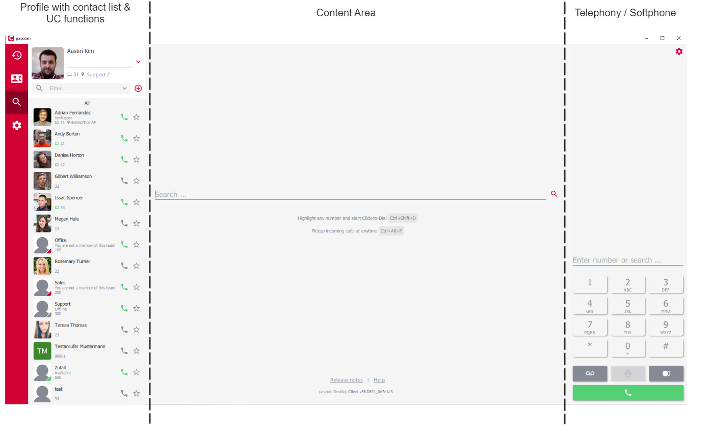
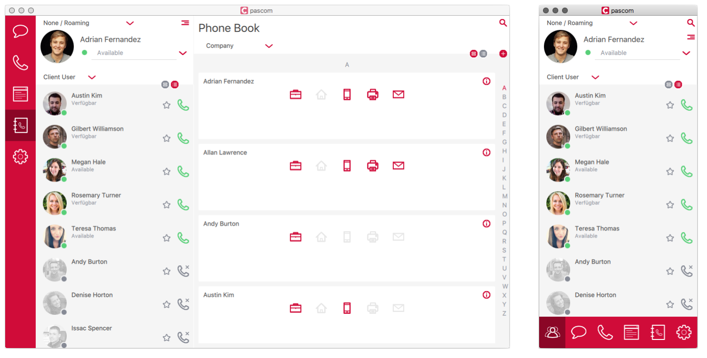
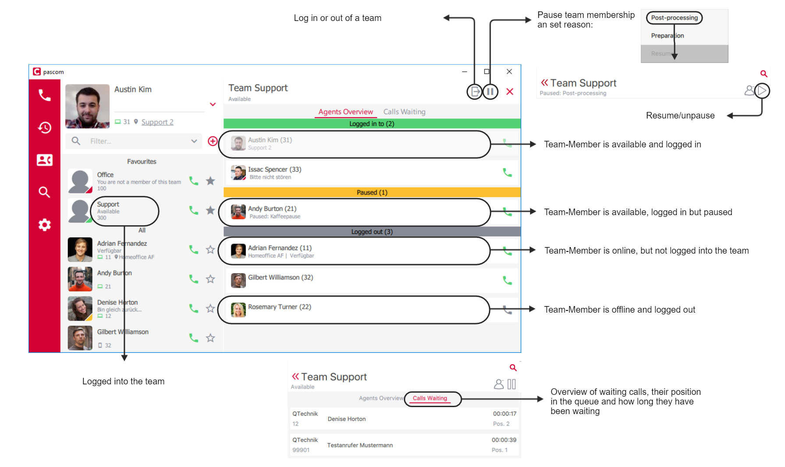
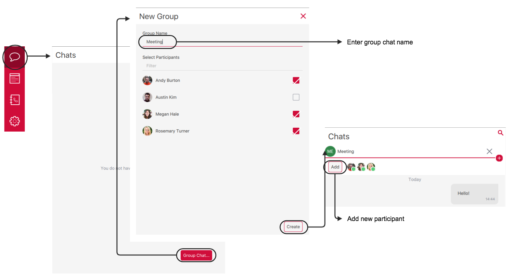
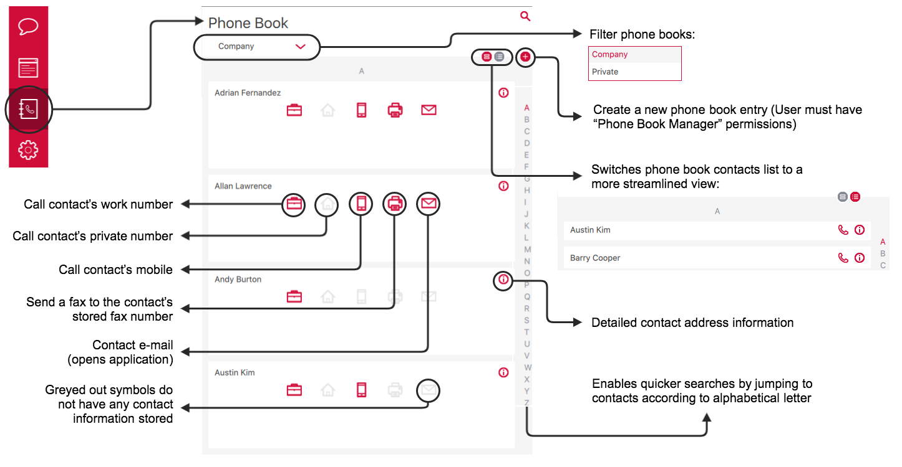


 


<!-- FIXME - bilder nur mit hellem theme! -->

<!--FIXME
- Amtsholung
- Hinweis auf unterstützte Headsets
- VErbinden -> Bilder mit einheitlichen Nummern
-->

## Overview

The Desktop client consists of three main components:

+ On the left hand side of the client, you will find your profile section, UC functions selector and contact list.
+ The right hand side is dedicated to telephony functions
+ The middle section is a flexible content area that changes depending on which UC tool is currently selected, i.e. Instant Messaging (Chat), Call History or Phone Books.

The desktop client also offers differing view modes:

+ **Expanded Mode**: Displays all three components, of which the middle section can be selected using the UC tool toggle list.
+ **Normal Mode**: The user profile and contacts are visible as well as it being possible to switch between the *Chats, Telephony, Call History,* and *Phone Book* tools.
+ **Mini Mode**: Only a single area is visible and the UC tool selector menu is now found under the content area. Using the selector tool, it is possible to navigate through all UC tools, changing the visible content area as you go.

In order to simplify switching the various views, it is possible to toggle the sizes using a [shortcut key]() if you choose to.

## Profile and Contacts List

|Function|Description|
|---|---|
|Profile and contact list settings|Configure further settings (s. below) and log out of the client.|
|Presence Status|It is possible to update your presence status with the following options: - *Green* > Available - *Yellow* > Away - *Red* > Do Not Disturb / Busy (This option doesn't deliver DND functionality.) Status texts can be personalized according to requirements - simply select the correct presence and then click on the status text and replace it.|
|Contact list view switch|With this switch, it is possible to toggle the contact list view between *wide* and *narrow*.|
|Contact list filter|Filter contacts to display only certain contacts. Per default, two filters are available as standard - *Favorites* and *Teams*. Favorites can be add by clicking on the star symbol next to a contact's handset icon. Additional filters can be defined by the system administrator via Roles.|
|Contacts |[Contact Information]() list displaying contact presence, extension and contact information.|
|Teams | Under [Teams]() you will see all the teams of which you are either a permanent or dynamic member. The *Available* or *Offline* status signify whether you are currently logged into a team or not.|

### Profile and Contact List Settings

|Setting|Description|
|---|---|
|Profile|Under the profile settings menu, you can add / customize your profile picture. Click on the *Select....* button to upload an image from your computer. Alternatively, it is possible to *Generate* an image.|
|Contact list|Configure how your contacts are displayed within the contact list.|
|Auto Away| Enable the Auto Away function and configure an inactive time period after which your status should be changed to *Away* as well as setting a customized **away message**.|
|Change Password|Should your user authentication occur via the pascom PBX, then the *Change Password* button will be visible enabling users to update their password without requiring the system admin.|

Gain an instant overview of your internal contacts, whether they are available or not as well as whether their phone is currently available to call - helping you decide how best to contact them.

## Contacts

## Teams

The teams function can be used to gain an overview of what's happening in the teams of which you are a member of. The teams tool also enables you to dynamically log in / out of a team (if your are a dynamic member) as well as being able to pause / resume your team membership plus seeing the status of other team members / queue agents and seeing any calls currently waiting in the queue.

## Integrated Softphone

If your user has been assigned a pascom softphone by your System Admin, then you can select your pascom softphone via the telephony settings menu.

In order to use the softphone, you will need to configure the following softphone settings; Microphone, Speaker (Audio output) and Ringing speaker. Even if your desktop client has automatically detected your headset, you will need to select it from the drop down list. Should your headset not automatically appear in the list, then please check your computers audio

## Making Calls
  
Before you starting phoning, please check your telephone settings. Particularly if you have multiple telephone assigned to your user account, it is essential to ensure that the correct device is selected.

### Start a Call

The desktop app offers numerous options for starting a call:

* Enter the number via the [Dialpad](),
* Call a colleague by clicking on the phone icon within the [Contact List](),
* Clicking on the phone icon in the [Call History]() or
* Selecting a number from the [Phone Book]().

### Active Call

### Inbound Calls

### Transfer

#### Blind Transfer (Unattended Transfer)

A blind or unattended transfer is a transfer of a call from one party to another without talking to the new contact during the transfer. A blind transfer can be performed at anytime during a call by clicking on the 'Transfer' icon and dialing the new destination number (number to which the call should be transferred).

If you wish to transfer the call to an internal colleague, simply right click on the desired colleague's name / profile picture in the contact list and select *Transfer* from the menu.

#### Attended Transfer

To transfer a call having spoken to the party to whom the call should be transferred, please follow these steps:

1. Click *Add Participant*, to talk to the new party and
2. now *Transfer* the caller with the newly added participant.

It is not necessary to place the caller on hold, as this is automatically done when the call to the new participant in step 1 is started either via the *Add Participant* button, the contact list, the phone book or via the call history logs. After completing step 2, the caller will be connected to the new party.

### 3-Way-Conferencing

A 3-way-conference is started in a similar fashon to an [Attended Transfer](/clients/client-user-guide/#attended-transfer) via a 2 step process.

1. Click the *Add Participant* button and call the required party.
2. To start a 3-way-conference simply click on the *Conference* button.

During a 3-way-conference call it is possible for the initiator to remove a party from the conference directly from the active calls list in the telephony section of the desktop app.

### Sending DTMF Tones

DTMF tones are used to enter information via the dialpad such as PIN authentication for conference rooms or when selecting the required choice in an options menu (press 1 for..., 2 for ..., 3 for ... etc) or even having to enter a number code to open an intercom door for example.

For the pascom Client to send DTMF tones, the pascom softphone is required and the DTMF tones can be sent during a call via the *Dialpad*.

## Search

The pascom desktop client includes an extensive search tool which can be accessed via the magnifying glass icon. When searching, the search tool will search all connected phone books, the call history and the chat archive. The search term can consist of multiple terms / words.

*Example*: when searching for the contact *"Max-Andreas Mustermann"* the search term *"And Muster"* is sufficient.

{}
The magnifying glass icon is visible within the content area no matter the client view (size).
{}

## Notifications

As soon as an event (call, message etc) occurs a popup notification will appear. These popup notifications provide additional information to the type of event i.e. caller name or chat contact name. The popups also allow users to react to the event without needing to refer to the desktop client.

|Notification|Description|
|---|---|
||Popup indicating an active outbound call with the ability to end the call by clicking on the red phone icon.|
||Popup notification indicating an active inbound call with the ability to:   * Pick up via the green phone icon   * Hang up via the red phone symbol.|
||Popup indicating an active call with the ability to: * hold the call via the pause symbol * to end the call by clicking on the red phone icon.|
||Popup notification indicating an active held call with the ability to: * resume via the play symbol * end via the red phone icon.|
||Popup notification indicating a missed call with the ability call back via the green phone icon.|
||BPopup notification indicating a new chat message with the ability to respond direct from the popup.|

Via the settings menu, you can modify your notification settings:

## Chat

Click on the Chat symbol (speech bubble) found in the red UC function toolbar on the left hand side (or bottom) of the desktop client in order to open the chat tools.

### Single User Chat

To start a single user chat, simply click on the desired contact in the contact list which will then open the chat tools in the content area of the client.

If you have numerous open chats, these will be listed alongside each other.

### Group Chat

If there are no active chat tabs open, click on the chat symbol in the toolbar and you will have the option of starting a group chat via the Group Chat button at the bottom right of the content area. When starting a group chat, you will be able to modify the group name to reflect the purpose of the chat or who organized the chat as well as selecting which contacts should join the chat via the Select Participants tool. Within the participants list, only online contacts will be displayed. It is possible to add more participants after the chat has been setup via the red / white plus + symbol. Newly added contacts will receive messages from the point that they entered the group chat and not before.

### Chat Notifications

Should the chat tool is not selected as the active UC tool, then when you receive a new chat message, a green notification will be displayed next to the chat symbol (speech bubble) in the red UC toolbar.

## File Transfers

The desktop client allows you to share files with your colleagues which can done via either one of the following three methods:

1. In an ongoing, active chat simply click on the paper clip symbol (bottom right of the chat area). This will allow you to select a file from your computer which can then be sent:

2. In an active chat with a colleague, you can add the file to be transferred by drag and drop. Upon dropping the file will be sent:

3. Should you not have an active chat open, it is possible to send a file to a colleague by dragging the file to the desired contact's profile listing in the contact list. Drop the file on the contact and the file will be sent:

## Call History

The Call History provides an overview of all your calls.

By using the right click function, it is possible to use do the following when clicking on a call in the log:

* Copy all details pertaining to a caller (Time, type of call, caller name (if available), and their phone number),
* Copy only the phone number to store or edit elsewhere,
* Send the number to the dialpad

## Telephone Book

The client provides access to the company phone book as well as your private phone book which you can manage yourself. Add a contact to the private phone book and this display name will displayed by incoming calls but only in your desktop client.

## Fax

If a fax number is already stored in the phone book, it is possible to send a fax by clicking on the fax symbol in the phone book:

## Call Voicemail

By clicking on the Voicemail box symbol, it is possible to call your voicemail box directly. Additional options can be configured by following the prompts in the voicemail system itself.

## Shortcut Keys

When installing the client, the shortcut keys are predefined. However, if needed the shortcut keys can be freely customised according to your preference.

### Global Shortcut Keys:

|Shortcut Key|Description|
|---|---|
|Smart On / Off Hooking |Enables incoming call pickup via shortcut key, even when the client is not the active window.|
|Click-to-Dial|Enables dialing a number direct from a browser or document by highlight and pressing the shortcut keys.|

## Client Settings

|Settings|Description|
|---|---|
|Language|Current languages available include: English, German, French, Dutch, Serbian and Bavarian.|
|Colour Scheme|Available in a two colour schemes: light and dark.|
|Download Folder|Per default, your downloads folder will be used, however it is possible to customize according to your requirements.|

## pascom Client Feedback  

Should you discover an issue / problem with your client, you can view detailed info via the Open Client Logs button in the Settings menu. Should you wish to report a bug, please send the  *Support-Info* ZIP file to us.

