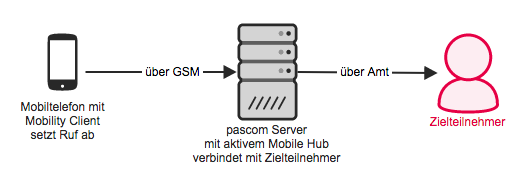


 


## GSM Fallback

Der pascom Mobile Client verbindet sich per VoIP mit dem pascom Server um Gespräche durchzuführen. Dazu benötigen Sie eine aktive Datenverbindung auf Ihrem Mobiltelefon. Sollte die Datenbindung deaktiviert oder unzuverlässig sein hat der pascom Mobile Client die Möglichkeit auf GSM (Normales Mobilgespräch) auszuweichen.

Dazu baut der pascom Mobile Client zuerst ein Gespräch zum pascom Server auf. Der pascom Server verbindet den Teilnehmer dann mit dem gewählten Ziel. So wird Ihre Büro- und nicht Ihre Mobilfunknummer übermittelt. Auch eingehende Gespräche werden im Fehlerfall direkt der GSM an den pascom Mobile Client weiter geleitet.

## Konfiguration

### Mobile Hub für Mobility Client einrichten

Um den Mobile Hub zu konfigurieren wählen Sie `Appliance` > `Dienste` > und den Tab `Mobile Hub`.

Tragen Sie hier die **Externe Nummer** ein, unter welcher der Mobile Hub erreichbar ist. Wählen Sie eine Nummer aus Ihrem Rufnummernblock die noch frei ist. Wenn ein Anruf über den Mobile Hub getätigt wird, ruft das Mobiltelefon diese Nummer an. Geben Sie diese Nummer zwingend im *internationalen Format* an damit der Mobile Hub auch im Ausland erreichbar ist.

### GSM Fallback Aktivieren

Sie können den GSM Fallback pro Mobiltelefon aktivieren indem Sie die Mobiltelefonnummer beim Pairen des pascom Mobile Clients oder direkt beim Mobilgerät in der Geräteliste angeben. Details entnehmen Sie bitte der [Mobile Client Installation](). 

Der Endanwender ist auch in der Lage die Nutzung des GSM Fallbacks pro ausgehendem Anruf durch den [GSM-Schalter]() zu erzwingen.