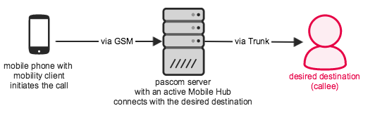


 


## GSM Fallback

For Telephony purposes, the pascom Mobile Client connects with the pascom Server via VoIP. For this to work, an active data connection is required on your mobile phone. Should the data connection be deactivated or unstable, the pascom mobile client has the built-in option of switching to GSM.

To do this, the pascom mobile client first establishes a connection with the pascom server. The pascom server then connects the participant with the intended destination. This process ensures that your office number and not your mobile number will be transmitted and displayed to the recipient. Inbound calls will also be routed via GSM in the case of a direct IP connection not being available. 

### Setting up the Mobile Hub for the Mobility Client

To configure the pascom Mobile Hub, select **Appliance > Services > Mobile Hub**. The following settings are required:

Under **External Number** enter the number under which the mobile hub is available. Select a number from your number block that is still available. When an outbound call is routed via the mobile hub, this is the number that will be called by the mobile phone. As such it is essential to add the number in the *international dialing format* ensuring that the mobile hub is also available from abroad.

### Activate the GSM Fallback 

It is possible to activate the GSM fallback function per mobile device by entering your mobile phone number when pairing the pascom mobile App or directly in the mobile device's entry in the device list. Futher details can be found in our <!--FixMe--> Mobile Client Installation <!--()-->. 

The end user also has the ability to manually use the GSM fallback for outbound calls by using the [GSM switch]().