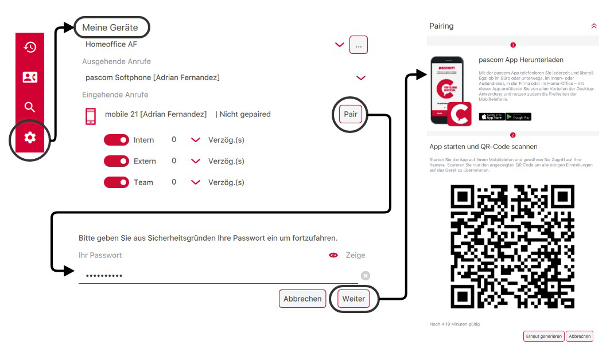
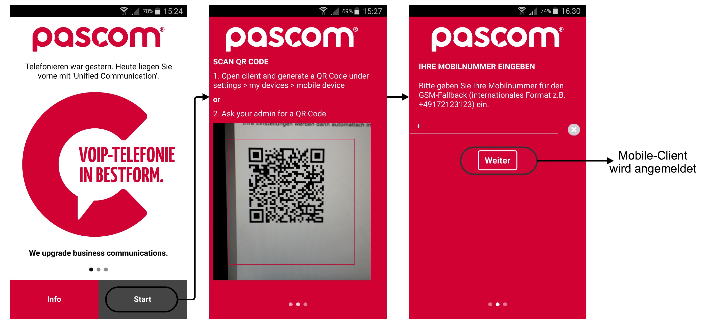
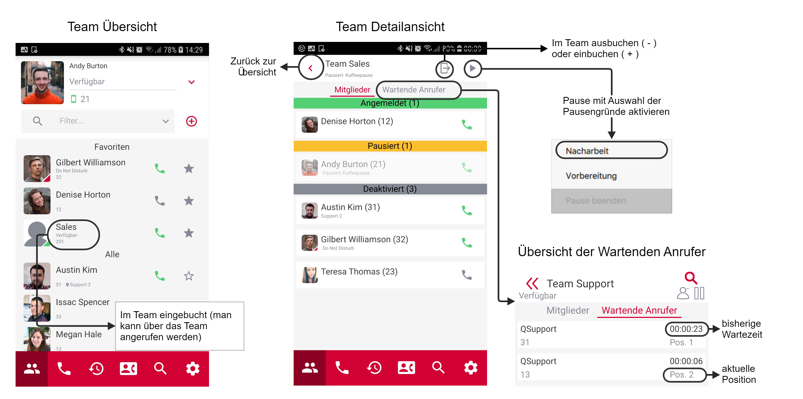
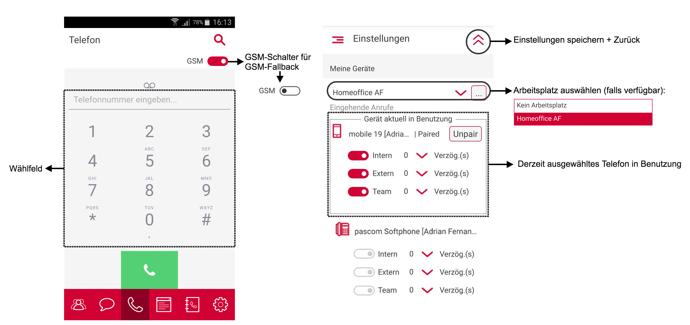
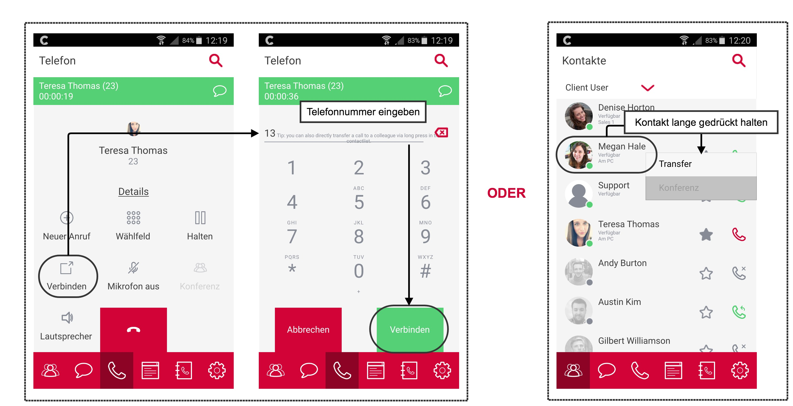
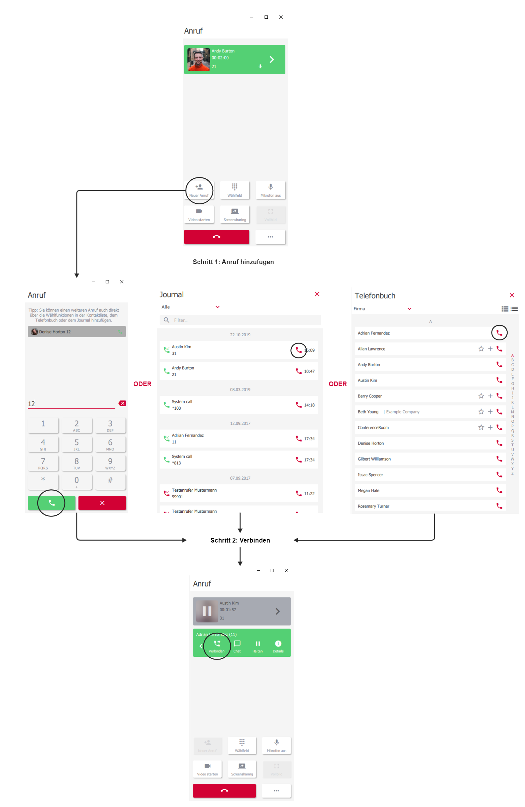
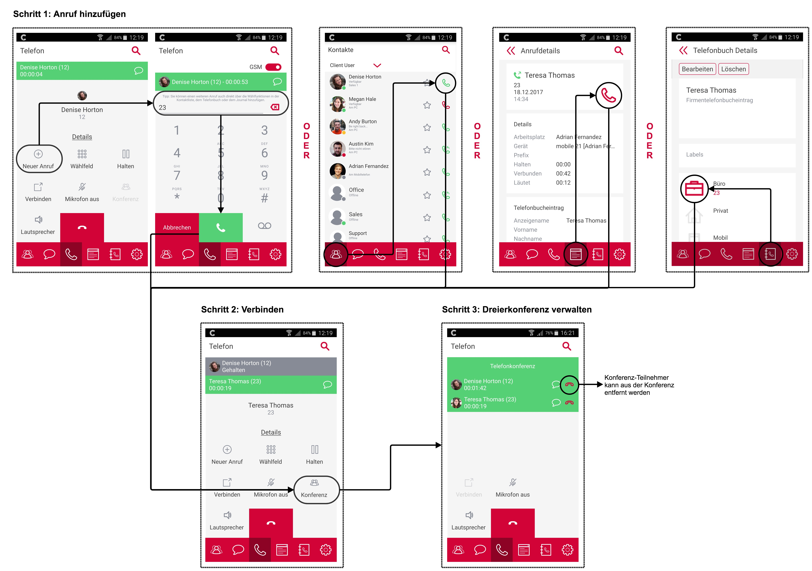


 


<!--- Bilder nur mit hellem Theme! --->

## Benutzer anmelden

{}
Um sich am pascom Mobile Client anmelden zu können ist zuvor einmalig der Pairing-Vorgang notwendig.
Dieser kann vom [Administrator]() durchgeführt werden oder, mit den notwendigen Berechtigungen, auch vom Endandwender selbst.
{}

### Pairing-Vorgang

* Starten Sie den [pascom Desktop Client]() und wählen Sie unter  >  bei Ihrem zugeordneten Mobiltelefon die Schaltfläche **Pair** um den Pairing-Vorgang anzustoßen.

* Geben Sie Ihr Benutzerpasswort für den pascom Desktop Client ein und klicken Sie auf **Weiter**. Jetzt werden Ihnen weitere Anweisungen und ein QR-Code angezeigt. Jeder QR-Code ist 5 Minuten gültig und erneuert sich nach Ablauf der Zeit automatisch oder kann mit einem Klick auf **Erneut generieren** manuell neu generiert werden.

{}
Folgende Anweisungen werden Ihnen direkt im pascom Desktop Client angezeigt.
{}

3. Laden Sie sich den pascom Mobile Client aus dem [AppStore](https://www.pascom.net/appstore) für iOS-Geräte bzw. [PlayStore](https://www.pascom.net/playstore) für Android-Geräte auf Ihr Mobiltelefon herunter.

4. Sobald die Installation abgeschlossen ist starten Sie den pascom Mobile Client auf Ihrem Mobiltelefon und klicken Sie auf **Start**.

5. Scannen Sie nun mit Ihrem Mobiltelefon den QR-Code, der Ihnen im pascom Desktop Client angezeigt wird.

6. Geben Sie im nächsten Schritt Ihre Mobilrufnummer im internationalen Rufnummernformat ein, oder lassen Sie das Feld leer, wenn Sie die Telefonie über GSM nicht nutzen möchten, und klicken Sie auf **Weiter**.

7. Nach Abschluss des Pairing-Vorgangs werden Sie automatisch am pascom Mobile Client angemeldet.

{}
Sobald der pascom Mobile Client angemeldet wurde, kann dieser unabhängig vom [pascom Desktop Client]() genutzt werden. Ein Simultanbetrieb ist **NICHT** notwendig.
{}

## Übersicht

Der pascom Mobile Client besteht grundsätzlich aus 6 Bereichen:

+ Die [**Kontaktliste**]() enthält alle Kontakte, Favoriten und Teams
+ Im [**Chat**]()-Bereich findet man alle Einzel- und Gruppenchats
+ Im [**Telefonie**]()-Bereich können Gespräche und Dreierkonferenzen geführt werden. Auch die eigene Voicemailbox ist hier zu finden
+ Im [**Journal**]() ist eine Übersicht aller getätigten Anrufe zu finden
+ Das [**Telefonbuch**]() enthält die Einträge aus dem privaten und Firmen-Telefonbuch
+ Alle **Einstellungen** zum Benutzerprofil, pascom Mobile Client und den eigenen Geräten befinden sich hier

## Kontaktliste

### Kontakte

Funktionen in der Kontaktliste:

|Funktion|Beschreibung|
|---|---|
|Filter für Kontaktliste|Hier können Sie über Filter nur bestimme Kontakte anzeigen lassen. Drei Filter sind standardmäßig schon vorhanden, *Client-User*, *Favoriten* und *Team*. Die Favoriten können Sie selber definieren, mit einem Klick auf das Sternchen neben dem Hörer-Symbol. Weitere Filter werden von Ihrem Administrator über Rollen festgelegt.|
|Client-User|Hier erhalten Sie Informationen über Ihre [Kontakte]().|
|Favoriten|Hier finden Sie Ihre favorisierten Kontakte, die sowohl Benutzer als auch Telefonbuch-Kontakte sein können.|
|Teams|Hier sehen Sie die [Teams]() in denen Sie festes oder flexibles Mitglied sind. Der Status *Verfügbar* oder *Offline* bezieht sich in diesem Fall darauf, ob Sie eingebucht sind oder nicht.|
|Suche|Hier können Sie Ihre Kontaktliste durchsuchen.|

### Teams

Funktionen in der Teamübersicht:

|Funktion|Beschreibung|
|---|---|
|Mitglieder|Hier werden Ihnen alle angemeldeten (**grün**), pausierten (**gelb**) und inaktiven Mitgleider (**grau**) des ausgewählten Teams angezeigt.|
|Im Team ein-/ausbuchen oder pausieren|Sie können sich hier über die entsprechenden Schaltflachen im Team einbuchen (+), ausbuchen (-), pausieren (II) oder die Pause beenden|
|Wartende Anrufer|Hier werden Ihnen alle Anrufer, die derzeit in der Warteschlange des ausgewählten Teams warten angezeigt.|

## Chat

Klicken Sie auf das Chat-Symbol (Sprechblase) in roten Umschaltfläche um in den Konversations-Bereich zu gelangen. Dort werden alle aktiven Einzel- und Gruppenchats in einer Listenansicht dargestellt.

### Einzelchat

 Starten Sie einen Einzelchat, indem Sie in der Kontaktliste auf den gewünschten Chat-Partner klicken.

### Gruppenchat

Starten Sie einen Gruppenchat, indem Sie im Konversations-Bereich auf *Gruppenchat...* klicken. Anschließend können Sie ein Thema festlegen und die Teilnehmer der Konversation auswählen. In der Auswahl-Liste stehen nur Online-Kontakte zur Verfügung. Fügen Sie nachträglich neue Kontakte zu Ihrer Gruppen-Konversation hinzu erhalten diese nur die neuen Nachrichten, ab dem Zeitpunkt zu dem Sie hinzugefügt wurden.

### Chatbenachrichtigungen

Auch wenn der pascom Mobile Client nur im Hintergrund auf Ihrem Mobiltelefon läuft und gerade nicht aktiv verwendet wird, erhalten Sie eine Benachrichtigung über neue Chatnachrichten als Statusmeldung.
Ist der Konversations-Bereich nicht im Fokus, und Sie erhalten eine neue Nachricht so erscheint die Benachrichtigung in der roten Umschaltleiste neben dem Sprechblasen-Symbol.

<!--- TODO: Noch nicht in der App umgesetzt
### Dateien versenden
--->

## Telefonieren

Bevor Sie ein Telefonat starten können Sie über einen Schalter auswählen, ob Sie via GSM telefonieren möchten oder nicht. Sofern Sie beim Pairing des Mobiltelefons die Rufnummer Ihres Mobiltelefons angegeben haben, ist bei ausgeschaltetem GSM-Schalter ein Fallback auf GSM möglich. Der Fallback tritt in Kraft wenn die Internet-Verbindung instabil ist (z. B. beim Wechsel zwischen verschiedenen mobilen Netzen).

### Gespräch starten

Der pascom Mobile Client bietet mehrere Möglichkeiten ein Gespräch zu starten:

+ Geben Sie im [Wählfeld]() eine Nummer ein,
+ rufen Sie einen Kollegen an, in dem Sie auf das grüne Hörer-Symbol in der [Kontaktliste]() klicken,
+ klicken Sie auf das Hörer-Symbol im [Journal-Eintrag]() oder
+ wählen Sie eine Nummer im [Telefonbuch]().

### Aktives Gespräch

### Eingehender Anruf

### Verbinden

#### Blind Transfer (Verbinden ohne Rücksprache)

Während eines Gesprächs können Sie einen Gesprächspartner ohne Rücksprache weiter verbinden.
Klicken Sie auf *Verbinden* und wählen Sie die neue Zielrufnummer.

Möchten Sie den Anrufer an einen Kollegen verbinden, wechseln Sie während dem Telefonat über die rote Umschaltfläche zu Ihrer Kontaktliste und klicken Sie lange auf dessen Namen oder Profilbild, bis sich weitere Optionen öffnen und wählen Sie *Transfer*.

#### Attended Transfer (Verbinden mit Rücksprache)

Das Verbinden mit Rücksprache erfolgt in zwei Schritten:

1. Einen weiteren *Anruf hinzufügen*, um Rücksprache zu halten und
2. den ersten Anrufer mit dem hinzugefügten Anrufer *verbinden*.

Es ist nicht notwendig den ersten Anruf extra zu halten. Dieser wird automatisch gehalten, wenn, wie in Schritt 1 beschrieben, der neue Anruf gestartet wird. Anschließend wird im Schritt 2 der Anrufer verbunden.

### Dreierkonferenz

Die Dreierkonferenz wird ähnlich wie [Attended Transfer]()  in zwei Schritten eingeleitet.

1. Zuerst wird, wie bereits bekannt, der Anruf hinzugefügt.
2. Dann werden beide aktiven Anrufe mit dem Klick auf *Konferenz* zu einer Dreierkonferenz zusammengeschalten
3. Außerdem können Sie, als Initiator der Dreierkonferenz, einen Teilnehmer aus der Konferenz entfernen.

### DTMF-Töne senden

DTMF-Töne werden verwendet um z. B. in einem Konferenzraum eine PIN zur Authentifizierung einzugeben, wenn Sie in einer Hotline durch die Eingabe von 1,2 oder 3 an den/die gewünschten Gesprächspartner gelangen möchten oder mit einem Nummerncode eine Tür öffnen müssen.

Um mit dem pascom Mobile Client DMTF-Töne zu versenden klicken Sie während des laufenden Gesprächs auf das *Wählfeld*.

### Benachrichtigungen

Auch wenn der pascom Mobile Client nur im Hintergrund auf Ihrem Mobiltelefon läuft oder Sie den Telefonie-Bereich nicht im Fokus haben, wird Ihnen der aktive Anruf als Statusmeldung auf Ihrem Mobiltelefon angezeigt, über die Sie jederzeit zum aktiven Gespräch im Telefonie-Bereich des pascom Mobile Client wechseln können.

### Voicemailbox abrufen

Mit dem Klick auf das Voicemailbox-Symbol können Sie Ihre Voicemailbox direkt anrufen. Weitere Optionen erfolgen über die Ansagen der Voicemailbox.

## Journal

Das Journal gibt eine Übersicht über alle getätigten Anrufe.

Klicken Sie auf einen Journal-Eintrag um detaillierte Informationen zu diesem Anruf anzeigen zu lassen. Hier haben Sie auch die Möglichkeit einen Rückruf anzustoßen.
Im Journal haben Sie außerdem die Möglichkeit durch gedrückt halten des Eintrags Details des Anrufers zu kopieren (Name des Anrufers, falls vorhanden und die Telefonnummer).

## Telefonbuch

Der pascom Mobile Client bietet neben dem Firmen-Telefonbuch auch ein eigenes (privates) welches Sie selber anlegen und pflegen können. Legen Sie einen Eintrag in Ihrem privaten Telefonbuch an, wird dessen Name bei einem eingehenden Anruf nur in Ihrem Mobile und Desktop Client angezeigt.

<!---
## Mobile-Client Einstellungen

### Profileinstellungen

### Telefoneinstellungen

### Meine Geräte

### Sonstige Einstellungen --->
