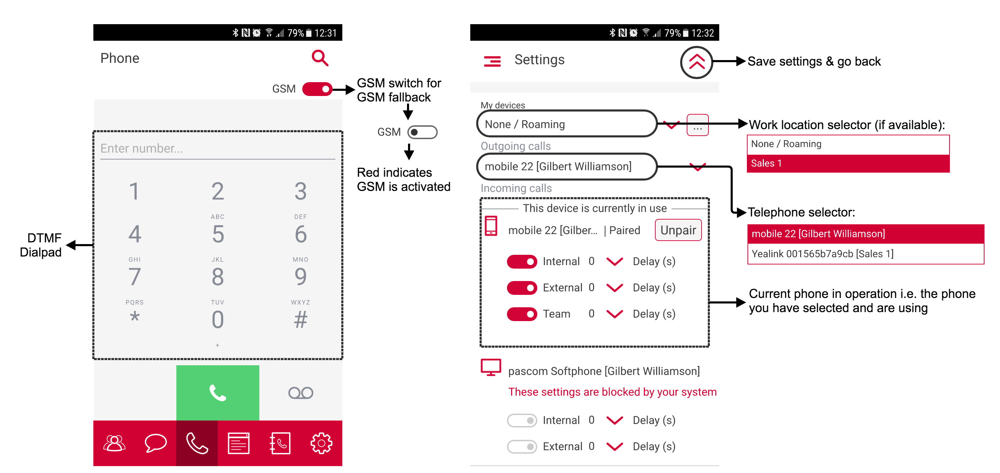
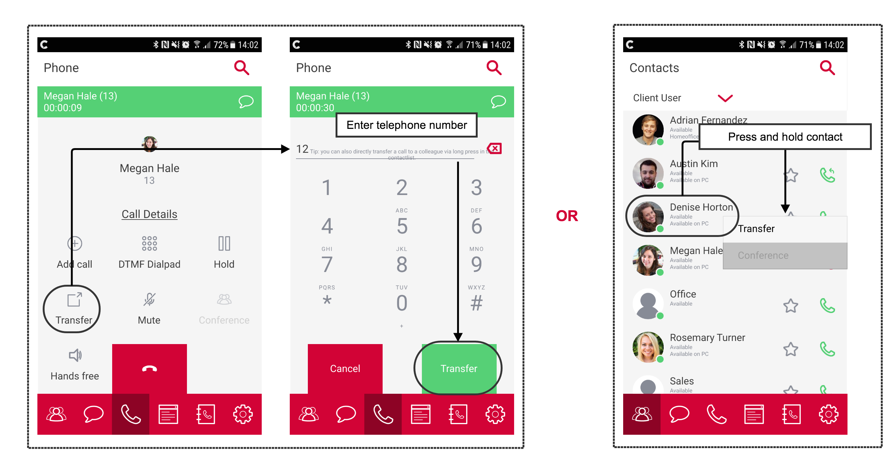
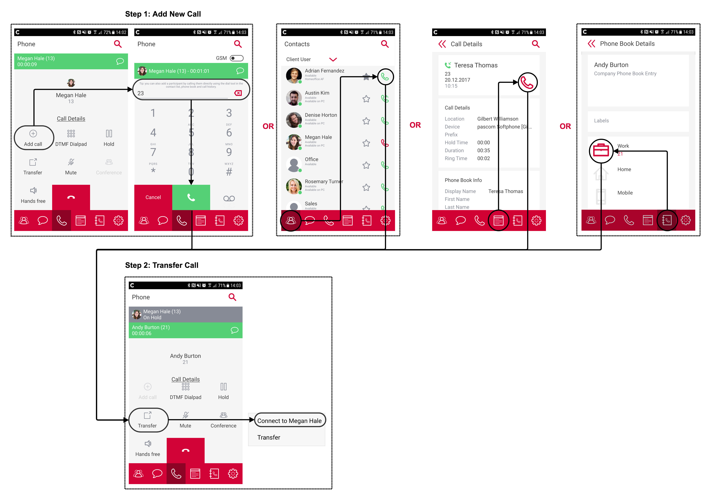


 


<!--- Bilder nur mit hellem Theme! --->

# User Login

{}
Before logging in to the pascom mobile VoIP client for the first time, the mobile app pairing process needs to completed.
This can be done either by your [System Administrator]() or by the end user, providing they have the required pascom phone system permissions.
{}

### Pairing Process

1. Open the [pascom Desktop Client]() and go to the `Settings` > `My Devices` section. Next to your assigned mobile telephone, click on the **Pair** button in order start the pairing process.
                                                                            
2. You will now need to enter your pascom desktop client password and click **Next**. Further instructions and a QR code will now be displayed. The QR code is valid for 5 minutes and will automatically regenerate after the time period has expired. Alternatively, this can be done by hand via the **Regenerate** button.

{}
The following instructions will be displayed within the pascom desktop client.
{}

3. Download & install the pascom mobile app for Android ([PlayStore](https://play.google.com/store/apps/details?id=net.pascom.client.android)) or iOS ([AppStore](https://itunes.apple.com/us/app/pascom-client/id1253954942?mt=8)) on to your smartphone or tablet.

4. As soon as the install has finished successfully, open the pascom mobile app and click on **Start**.

5. Using your smartphone / tablet, scan the QR-Code as shown in the pascom desktop client.

6. In the next step, enter your mobile phone number using the international format, or leave this field empty. By not providing a phone number, you will not be able to use the GSM function of the mobile app. Once entered correctly, click **Next** and the automatic pairing process will start.

7. Once the pairing process has finished, you will be automatically logged into the pascom mobile app.

{}
As soon as the pascom mobile app has been setup and logged into, it can now be used independantly of the [pascom Desktop Client](). A simultaneous, parallel operation is **NOT** required.
{}

## Overview

The pascom mobile app consists of 6 menu options / features:

+ The **contact list** displaying all your contacts, favourites and teams.
+ The **chat** option enables you find all your chats & group chats
+ The **telephony** tool enables phone calls, transfers & 3-way-conferencing as well as accessing your voicemail box.
+ The **call history** provides an overview of all your calls on your office extension across all your devices.
+ The **phone book** contains all you company & private phone book contacts
+ The **settings** menu option allows you to update your user profile, configure pascom mobile client settings as well as assigned device follow me settings.

## Contact List

### Contacts

#### Contact list functions:

|Function|Description|
|---|---|
|Contact list filter|Can be used to display only specific contacts. Per default, three filters are available, *Client-User*, *Favourites* and *Team*. Favorites can be user defined by clicking on the star next to the receiver symbol. Further filters can be defined by your phone system admin using Roles.|
|Client-User|Displays information regarding your internal [contacts]().|
|Favorites|Filters and display only those contacts added to your favorites.|
|Teams|Lists the [Teams]() within which you are either a permanent or flexible member. The *Available* or *Offline* status here refers to wether you are currently logged into the team nore not.|
|Search|Search tool to search through a.o. your contact list. |

### Teams

#### Teams overview functions:

|Function|Description|
|---|---|
|Agents Overview|Displays all logged in (**green**), paused (**yellow**) and inactive team members (**gray**).|
|Calls Waiting|Displays all the calls currently waiting in the selected team's call queue.|
|Log in / out|If you are a dynamic team member you can use the person symbol to log in (+) or out (-).|
|Pause / Resume|Use the pause symbol to pause your selected team membership (you will not receive any team calls) and set a preconfigured reason for the pause. To rejoin the team simply click the play button.|

## Chat / Instant Messaging

Click on the speech bubble chat symbol found in the red menu ribbon to open to the chat section. This will display all your active chats and group chats in list form.

### Chat (Single User)

To start a chat conversation, within the contact list simply click on the desired participant.
 
### Group Chats (Multi-User)

To start a group chat, go to the chat tool as described above and click on the *Group Chat...* button. Enter a group name (i.e. short description of topic to be discussed) and the add participants either by using the filter tool or the list below. It is only possible to add online contacts to a group chat (offline contacts are not displayed). Should you add a participant later after the group chat has started, they will only receive messages from the moment they were added and not before.

### Chat Notifications

Chat notifications are delivered even if the pascom mobile client app is running the background and is not currently active on your mobile device. Notifications are delivered as status updates just as you would expect on your smart device. Should the chat tool not be the currently selected active section of the client, the new chat(s) notification will by symbolized by the green counter next to the speech bubble icon in the red menu ribbon.

<!--- TODO: Noch nicht in der App umgesetzt
### Dateien versenden
--->

## Telephony

To make a call, click on the phone receiver icon in the red menu ribbon. Before starting a call, it is possible to choose whether the call should be completed via GSM or not (via VoIP). To choose simply select your preference via the GSM switch (top left). As long as you entered your mobile phone number during the [device pairing process](), a GSM fallback is possible even when the GSM switch deactivated is. The GSM fallback comes into affect when your internet connection is unstable or too weak (e.g. when switching between different mobile networks or lower mobile data coverage areas).

### Start a Call

There are numerous options for starting a call using the pascom mobile client:

+ Enter the desired number via the the [dial pad](),
+ Call a colleague by pressing the green receiver symbol within the [contact list](),
+ Via a [call history]() entry using the receiver symbol,
+ Dialing a number from the [phone book]().

### Active Call

### Incoming Call

### Transfer

#### Blind / Unattended Transfer

A blind / unattended transfer is a call transfer that is performed without speaking to the intended contact where the call should be transferred to. Blind transfers can be done at anytime during a call. Simply click on *Transfer* and dial target number.

Should you wish to transfer the call to a colleague, simply select your contact list (red menu ribbon) and press and hold the desired colleagues listing / profile picture until the dropdown options list appears. From the list, select the *Transfer* option.

#### Attended Transfer

Attended transfers are similar to blind / unattended transfers with the exception that the intended recipient is consulted before the transfer is conducted.
An attended transfer is completed using a 2 step process:

1. In the call screen, select the *Add Call* option in order to speak with the transfer target recipient.
2. Then connect the caller with the target by pressing *Transfer*.

It is not necessary to place the original call on hold as this will be done automatically once the call as described in step 1 starts. By completing step 2, the call will be transferred and will disconnect on your participation in the call.

### 3-Way-Conference

Starting a 3-way-conference is similar to performing an [Attended Transfer]() and is done using the following 2 step process:

1. Firstly, as described above, press the *Add Call* button.
2. Start the conference by pressing the *Conference* button which will join the active calls into a 3-way-conference.

Lastly, as the conference initiator it is possible to remove a participant from the conference by pressing the red hang up receiver icon next to the participant in the active call list in the top of the call screen.

### Sending DTMF Tones

DTMF tones are used for example when entering a conference room PIN, selecting from an options menu when calling a hotline / business with multiple departments (i.e. "press 1 for..., 2 for..., 3 for ....") or entering a number code in open a door.

In order to use DTMF tones once a call with the pascom mobile client has been started, simply press the *dialpad* icon found within the active call screen.

### Notifications
<!--Screen Shot-->

Even if the pascom mobile client is running in the background on your mobile device or the telephony tool is currently not in focus, active calls will be display as a status update via which you can switch to the active call window (telephony section) within the pascom mobile client at any time.

### Call Voicemail Box

By pressing the voicemail box symbol, you can call your voicemail box directly play back messages from within the mobile client. By following the voicemail box prompts, further additional options are also available to you.

## Call History

The call history section provides an overview of all your completed calls, populated from across all your phone system devices.

Press on a call history entry in order to view more detailed information relating to the call. Within this screen it is also possible to start a call back by pressing the phone receiver icon.

By pressing and holding on an entry within the call history, it is possible to copy the call details including caller name (if present) and the telephone number.

## Telephone Book

The pascom mobile client provides access to both the company phone book as well as your private phone book (managed by you). Should you add a contact to your private phone book, the contact name etc will appear for inbound calls only in your mobile and desktop client Der pascom Mobile Client.

<!---
## Mobile-Client Einstellungen

### Profileinstellungen

### Telefoneinstellungen

### Meine Geräte

### Sonstige Einstellungen --->
