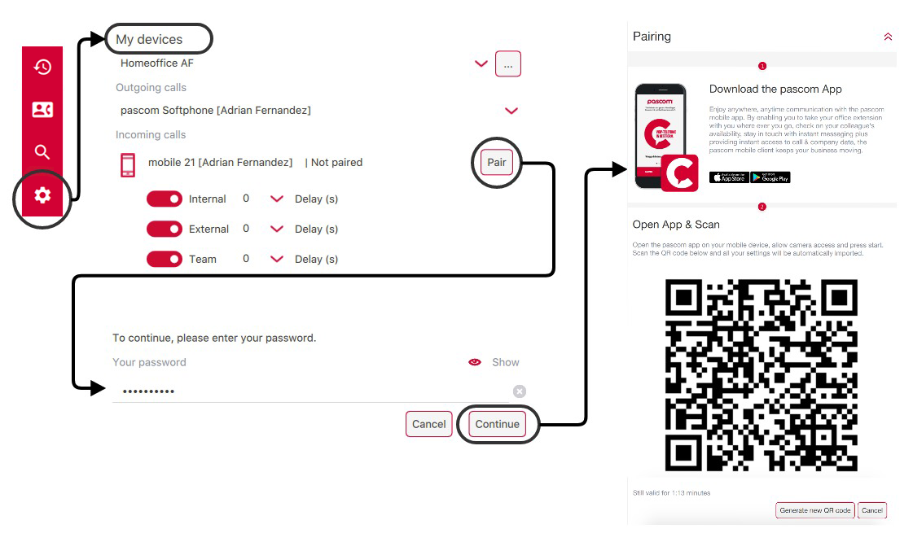
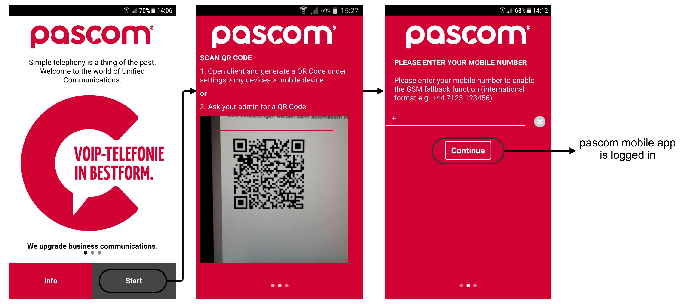
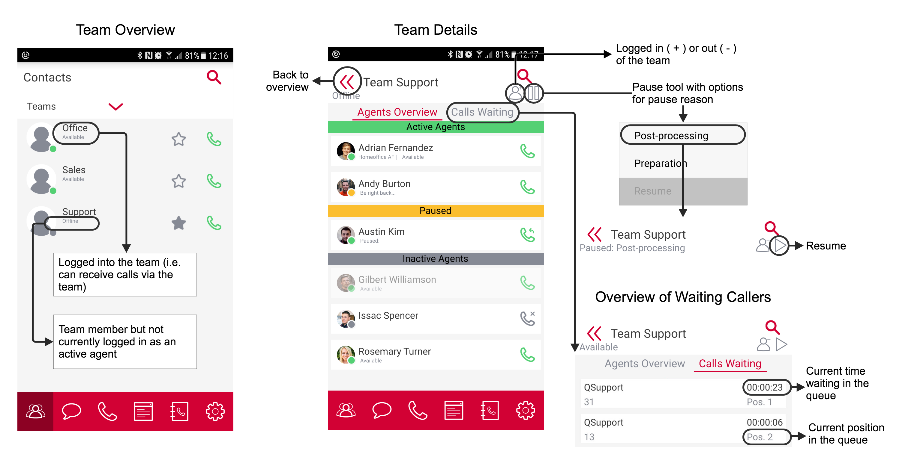
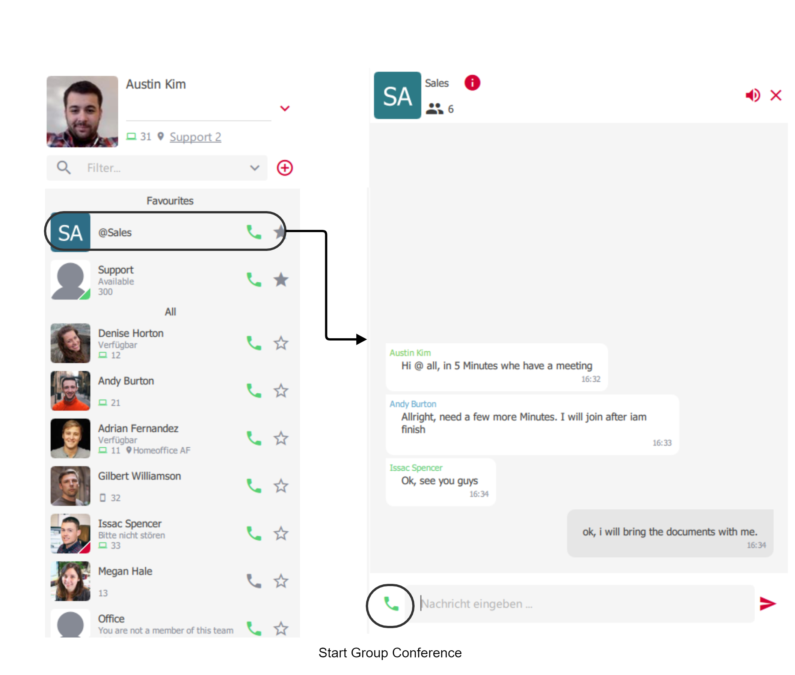
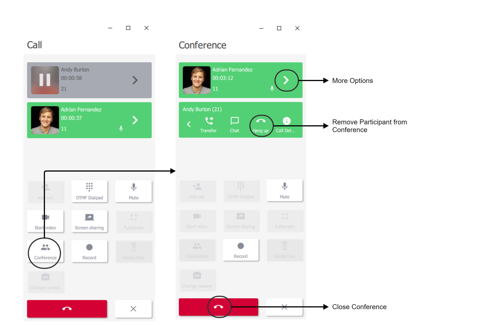
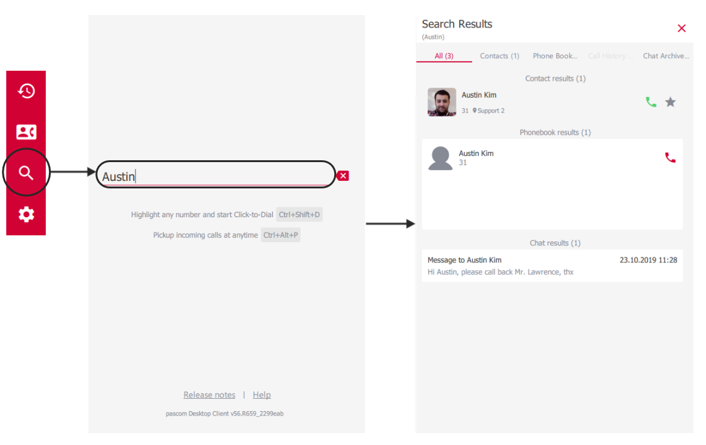
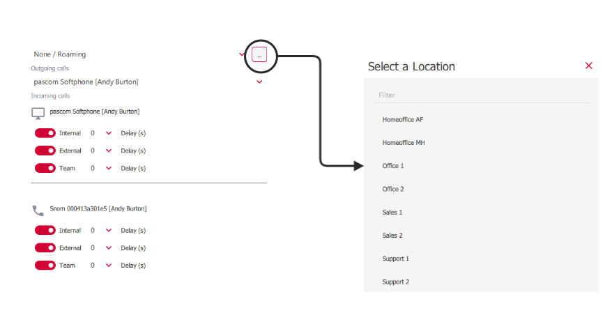


 


<!--- Bilder nur mit hellem Theme! --->

# User Login

{}
Before logging in to the pascom mobile VoIP client for the first time, the mobile app pairing process needs to completed.
This can be done either by your [System Administrator]() or by the end user, providing they have the required pascom phone system permissions.
{}

### Pairing Process

1. Open the [pascom Desktop Client]() and go to the `Settings` > `My Devices` section. Next to your assigned mobile telephone, click on the **Pair** button in order start the pairing process.
                                                                            
2. You will now need to enter your pascom desktop client password and click **Next**. Further instructions and a QR code will now be displayed. The QR code is valid for 5 minutes and will automatically regenerate after the time period has expired. Alternatively, this can be done by hand via the **Regenerate** button.

{}
The following instructions will be displayed within the pascom desktop client.
{}

3. Download & install the pascom mobile app for Android ([PlayStore](https://play.google.com/store/apps/details?id=net.pascom.client.android)) or iOS ([AppStore](https://itunes.apple.com/us/app/pascom-client/id1253954942?mt=8)) on to your smartphone or tablet.

4. As soon as the install has finished successfully, open the pascom mobile app and click on **Start**.

5. Using your smartphone / tablet, scan the QR-Code as shown in the pascom desktop client.

6. In the next step, enter your mobile phone number using the international format, or leave this field empty. By not providing a phone number, you will not be able to use the GSM function of the mobile app. Once entered correctly, click **Next** and the automatic pairing process will start.

7. Once the pairing process has finished, you will be automatically logged into the pascom mobile app.

{}
As soon as the pascom mobile app has been setup and logged into, it can now be used independantly of the [pascom Desktop Client](). A simultaneous, parallel operation is **NOT** required.
{}

## Overview

The pascom mobile app consists of 6 menu options / features:

+ The [**contact-list**]() displaying all your contacts, favourites and teams.
+ The [**telephony**]() tool enables phone calls, transfers & conferencing as well as accessing your voicemail box.
+ The [**call-history**]() provides an overview of all your calls on your office extension across all your devices.
+ The [**phonebook**]() contains all you company & private phone book contacts.
+ In the [**search**]() you can quickly find seach results for all possible areas
+ The **settings** menu option allows you to update your user profile, configure pascom mobile client settings as well as assigned device follow me settings.

## Profile and Contacts List

|Function|Description|
|---|---|
|Presence Status|It is possible to update your presence status with the following options: - *Green* > Available - *Yellow* > Away - *Red* > Do Not Disturb / Busy (This option doesn't deliver DND functionality.)  Status texts can be customised according to requirements - simply select the correct presence and then click on the status text and replace it.|
|Create new group|With the "+ symbol" you can create a new permanent team messaging / chat group.|
|Contact list filter|Filter contacts to display only certain contacts. Per default, two filters are available as standard - *Favourites* and *Teams*. Favourites can be added by clicking on the star symbol next to a contact's handset icon. Additional filters can be defined by the system administrator using [Roles]().|
|Contacts |[Contact list]() displaying contact presence, extension and contact information.|
|Phone Symbol |Click on the phone symbol to call the contact.|
|Favourite Symbol|Simply mark your favourite contacts with the "star" symbol. These are then pinned at the top of the contact list.|
|Teams | Under [Teams]() you will see all the teams of which you are either a permanent or dynamic member. The *Available* or *Offline* status signify whether you are currently logged into a team or not.|

## Contacts

Each contact in your contact list has various statuses, which can be seen in the following illustration.

### Teams

#### Teams overview functions:

|Function|Description|
|---|---|
|Agents Overview|Displays all logged in (**green**), paused (**yellow**) and inactive team members (**gray**).|
|Calls Waiting|Displays all the calls currently waiting in the selected team's call queue.|
|Log in / out|If you are a dynamic team member you can use the person symbol to log in (+) or out (-).|
|Pause / Resume|Use the pause symbol to pause your selected team membership (you will not receive any team calls) and set a preconfigured reason for the pause. To rejoin the team simply click the play button.|

## Groups

With the group function, it is possible to create permanent groups which deliver a number of additional functions.

1. Always - on Team Messaging / Group Chat
2. Audio Conference rooms
3. Video Conferencing

### Create Groups

In the contact list, click on the "+ symbol" to create a new group. You can create as many groups as you need. Next, enter an appropriate group name (i.e. sales or marketing), upload a group profile image and add the desired participants. Finally, save the group by clicking the "Floppy Disk" save symbol. The new group will now appear in your contact list. 

### Manage Groups

To manage a group, select and click on the required group within your contact list. To make changes to the group, click on the information symbol next to the group name and icon at the top of the content section. It is also possible to mute notifications for this particular group via the speaker icon (top right of the content section). 

## Chat

There are 2 ways to start a chat conversation: by clicking on the desired person within the contacts list OR during a call and selecting the chat option from within the in-call menu.

### Team Messaging / Group Chat

In order to use the team messaging / group chat tools, a group is required. If you have not yet created a group, first create a new [Group]().

Click on the desired group in the contact list. Within the contect section of the client, all chat messages from the selected group will appear. To close the chat, simply click the "X" symbol in the upper right hand corner of the chat window. 

### Chat Notifications

Should the chat window not currently be active and you receive a new message, a green notifier will appear in the contact list next to the respective group / contact AND within your profile picture. The notifier within your profile picture represents all unread messages from all contacts / groups. Contacts with new messages will automatically move up to the top of the contact list, if you have set the list sorting to "recent".

If your order is not set to automatically show the most recent activity at the top of the contact list, you can click on the number of unread messages within your profile picture. The smart filters will then only show the contacts that contain new unread messages.

In addition, you receive a pushup notification for incoming messages.

Also the pascom symbol on the start page shows you the number of unread messages.

<!--- TODO: Noch nicht in der App umgesetzt
### Dateien versenden
--->

## Telephony

### Start a Call

The desktop app offers numerous options for starting a call:

* Enter the number via the [Dialpad]().
* Call a colleague by clicking on the phone icon within the [Contact List]().
* Click on the phone icon in the [Call History]().
* Select a number from the [Phone Book]().

### Active Call

### Inbound Calls

### Transfer

#### Blind Transfer (Unattended Transfer)

A blind or unattended transfer is a transfer of a call from one party to another without talking to the new contact during the transfer. A blind transfer can be performed at anytime during a call by clicking on the 'Transfer' icon and dialing the new destination number (number to which the call should be transferred).

If you wish to transfer the call to an internal colleague, simply right click on the desired colleague's name / profile picture in the contact list and select *Transfer* from the menu.

#### Attended Transfer

An attended transfer is a call transfer that involves speaking to the intended recipient before completing the transfer. To perform an attended transfer, please follow these steps:

1. Click *Add Participant*, to talk to the new party.
2. Now *Transfer* the caller with the newly added participant.

It is not necessary to place the caller on hold, as this is automatically done when the call to the new participant in step 1 is started either via the *Add Participant* button, the contact list, the phone book or via the call history logs. After completing step 2, the caller will be connected to the new party.

### 3-Way-Conferencing

A 3-way-conference is started in a similar fashion to an [Attended Transfer](/clients/client-user-guide/#attended-transfer) via a 2 step process.

1. Click the *Add Participant* button and call the required party.
2. To start a 3-way-conference simply click on the *Conference* button.

During a 3-way-conference call it is possible for the initiator to remove a party from the conference directly from the active calls list in the telephony section of the desktop app.

### Sending DTMF Tones

DTMF tones are used to enter information via the dialpad such as PIN authentication for conference rooms or when selecting the required choice in an IVR options menu (press 1 for..., 2 for ..., 3 for ... etc) or even having to enter a number code to open an intercom door for example.

For the pascom Client to send DTMF tones, the pascom softphone is required and the DTMF tones can be sent during a call via the *Dialpad*.

## Search and Smart Filter

### Search

The pascom desktop client includes an extensive search tool which can be accessed via the search / magnifying glass icon. When searching, the search tool will search your internal contacts, all connected phone books, your call history and chat archive. The search term can consist of multiple terms / words.

*Example*: when searching for the contact *"Max-Andreas Mustermann"* the search term *"And Muster"* is sufficient.  

The search function can also be used in the dialpad to quickly find contacts for conferences or transfers.

### Smart Filter

Smart-Filters are a great tool to quickly filter your contact list for specific attributes or status, for example, who is currently online or just showing my favorites.

### Notifications
<!--Screen Shot-->

Even if the pascom mobile client is running in the background on your mobile device or the telephony tool is currently not in focus, active calls will be display as a status update via which you can switch to the active call window (telephony section) within the pascom mobile client at any time.

### Call Voicemail Box

By pressing the voicemail box symbol, you can call your voicemail box directly play back messages from within the mobile client. By following the voicemail box prompts, further additional options are also available to you.

## Call History

The call history section provides an overview of all your completed calls, populated from across all your phone system devices.

Press on a call history entry in order to view more detailed information relating to the call. Within this screen it is also possible to start a call back by pressing the phone receiver icon.

By pressing and holding on an entry within the call history, it is possible to copy the call details including caller name (if present) and the telephone number.

## Telephone Book

The pascom mobile client provides access to both the company phone book as well as your private phone book (managed by you). Should you add a contact to your private phone book, the contact name etc will appear for inbound calls only in your mobile and desktop client Der pascom Mobile Client.

## Client Settings

### Profile Settings

|Setting|Description|
|---|---|
|Avatar|The avatar can only be changed via the desktop client.|
|Contact List|Sort your contact list according to your application preferences.|
|List Style|There are 2 contact list styles available. "List view" for a narrow contact list and "Details" for a more detailed view.|
|Journal / Hide System Calls|Hides system calls like voicemail etc. from the journal.|

### My Devices / Follow Me Settings

In the Follow Me Settings you decide yourself, providet that it has been activated by the administrator, which of your devices should ring. In addition, you can select predefined workstations to which you can login.

1. Determine your device that will be used for outgoing calls.
2. Determine which of your devices should ring when. 
3. Pair / unpair your mobile device. 

