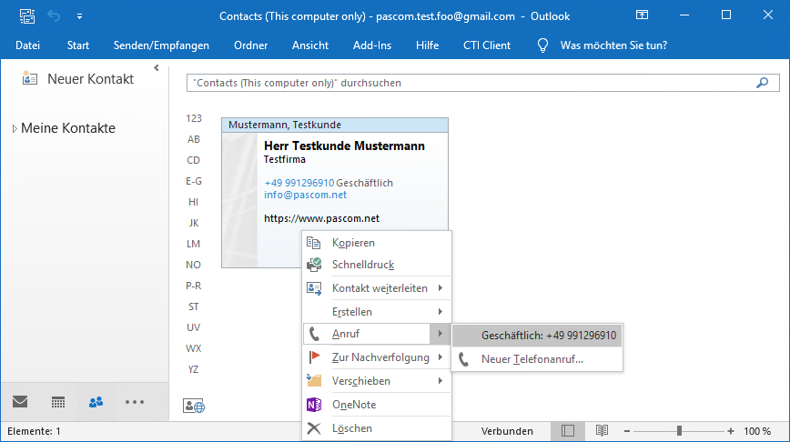


 


## Konzept

Die TAPI meldet sich am Server mit den selben Benutzerdaten wie der pascom Client an und ist daher nicht direkt mit einem Telefon sondern dem Benutzer verknüpft.

Sendet die TAPI ein Wahlbefehl an die pascom sucht diese automatisch das aktuelle Telefon des Benutzers und nutzt es für den Anruf. Wechselt der Benutzer den Arbeitsplatz oder das Telefon muss die TAPI nicht umkonfiguriert werden.

Die pascom TAPI funktioniert unabhängig vom pascom Desktop Client.

## Unterstützte TAPI-Funktionen

Die TAPI Schnittstelle spezifiziert eine Vielzahl an anrufbezogenen Funktionen, von denen der pascom TAPI-Treiber die folgenden unterstützt:

|Funktion| Kommentar|
|---|---|
|**Signalisierung von eingehenden Anrufen**|Signalisierung von Rufnummern, Rufrichtung, weiteren Details.|
|**Pickup**|Pickup auf eine bestimmte Durchwahl durchführen.|
|**Halten**|Halten eines aktiven Anrufs.|
|**Fortsetzen**|Fortsetzen eines gehaltenen Anrufs.|
|**Auflegen**|Anruf beenden.|
|**Anrufen**|Anruf an eine Rufunummer initiieren|.
|**Anruf annehmen**|Einen eingehenden Anruf automatisch am Telefon abheben.|

## Amtskennziffer bei der TAPI konfigurieren

Bei der Konfiguration bzw. der ersten Verwendung der TAPI-Schnittstelle werden Sie nach den zu verwendenden Wähleinstellungen gefragt. Allerdings erfolgt die Rufnummernbehandlung (Setzen einer 0 für ausgehende Gespräche, Internationale Formattierung, ...) ausschließlich im pascom Server, so dass die in Windows hinterlegten Einstellungen ignoriert werden.

Die Ortskennzahl ist ein Pflichtfeld. Geben Sie hier bitte Ihre Ortskennzahl (Vorwahl) ohne führende Null ein. Alle anderen Felder sollten nicht gefüllt sein. Erreichbar ist dieser Dialog unter  >  >  > .

## TAPI Client Installation

{}
Systemvoraussetzung **Windows 7 (32 und 64bit)** oder höher und **Windows Server 2008 R2 (32 und 64bit)** oder höher. Jeweils das neueste Patchlevel. 
{}

{}
Bitte stellen Sie sicher, dass keine Anwendung läuft, die die TAPI-Schnittstelle verwendet.    
Bitte stellen Sie sicher, dass der Telefoniedienst beendet ist. (Dieser ist aufgelistet unter Systemsteuerung > Verwaltung > Dienste)     
Sie können eine Debug- anstatt der Produktiv-Version installieren, indem Sie das Setup einfach nochmals ausführen. Das selbe ist auch bei einem Wechsel von produktiv auf debug möglich.
{}

### TAPI Software herunterladen

Den aktuellen pascom TAPI Client finden Sie im [Downloadbereich](https://www.pascom.net/de/downloads/#clients) der pascom Homepage.

### Installation auf einer Windows Arbeitsstation

{}
Das Setup benötigt Administrationsrechte auf der jeweiligen Arbeitsstation. Es wird automatisch nach einem entsprechenden Login gefragt.
{}

Starten Sie das Setup indem Sie die zuvor heruntergeladene Datei ausführen.
Akzeptieren Sie die Allgemeinen Geschäftsbedingungen (AGB), anschließend werden alle Komponente installiert

Nach erfolgreicher Installation müssen Sie die Verbindung der TAPI zu pascom konfigurieren:

Die TAPI meldet sich am Server mit den selben Benutzerdaten wie der pascom Client an.

|Variable|Bedeutung|
|---|---|
|Username|Benutzername@Instanzname|
|Password|Passwort des Benutzers|
|pascom Server|IP Adresse oder Hostname des pascom Servers|

Bestätigen Sie den Erfolg der Installation mit einem Klick auf **Finish**.

### Installation auf einem Terminal Server

#### Konfiguration der pascom

Wenn Sie die TAPI auf einem Termial-Server oder einem Rechner der von mehreren Personen genutzt wird installieren, müssen Sie den Benutzer, den Sie mit der TAPI verbinden die **Rolle xmpp.supervisor** zuweisen. Dies bedeutet das vom Terminal Server nur eine einzige XMPP-Verbindung aufgebaut wird, über die die gesamte Kommunikation abgewickelt wird.

#### Installation

{}
Das Setup benötigt Administrationsrechte auf dem jeweiligen Server. Ab Windows Server 2008 wird automatisch nach einem entsprechenden Login gefragt, bei Windows Server 2003 müssen Sie sich ggf. vorher unter einer geeigneten Kennung anmelden.
{}
Starten Sie das Setup indem Sie die zuvor heruntergeladene Datei ausführen. Akzeptieren Sie die Allgemeinen Geschäftsbedingungen (AGB), anschließend werden alle Komponente in das System installiert.

Nach erfolgreicher Installation müssen Sie die Verbindung der TAPI zu pascom konfigurieren:

Die TAPI meldet sich am Server mit den selben Benutzerdaten wie der pascom Client an.

|Variable|Bedeutung|
|---|---|
|Username|Benutzername@Instanzname|
|Password|Passwort des Benutzers|
|pascom Server|IP Adresse oder Hostname des pascom Servers|

Es erscheint ein weiterer Dialog, in dem Sie die Benutzer auswählen können, die später in TAPI Applikationen (z. B. MS Outlook) zur Verfügung stehen sollen. Es werden hier alle in der pascom vorhandenen Benutzer angezeigt. Um einen Benutzer auszuwählen, kann man diese doppelklicken oder die Buttons in der Mitte verwenden:

Bestätigen Sie den Erfolg der Installation mit einem Klick auf **Finish**.

{}
Wenn zu einem späteren Zeitpunkt weitere Benutzer das Recht erhalten oder entzogen bekommen sollen, kann dieser Dialog via  >  >  und Doppelklick auf "pascom TAPI Service Provider" erneut aufgerufen werden. Hierzu muss sich der Supervisor-Benutzer erneut anmelden.
{}

### Nutzungsbeispiel mit Microsoft Outlook

Starten Sie Outlook und suchen Sie den gewünschten Kontakt. 

{}
Um die Anruffunktion nutzen zu können, wählen Sie in der Kontaktanzeige in Outlook die Ansicht: Visitenkarte, Karte, Telefon oder Liste aus. In der "Person"-Ansicht wird die pascom-Telefonie nicht unterstützt.
{}

Mit der rechten Maustaste rufen Sie das Kontextmenü und die zu wählende Rufnummer auf:

Nun erscheint das Anruffenster. Bestätigen Sie per **Anruf beginnen** die Nummer:

 Nun sollte Ihr Telefon den Anruf durchführen.
{}
 Auf Terminal-Server-Installationen muss jeder Benutzer seine "eigene" Leitung in der TAPI-Software (z. B. Outlook) auswählen, bevor er Anrufe mit seinem Telefon durchführen kann.
{}

 Mit einem Klick auf **Wähloptionen** können Sie die zu verwendende Leitung auswählen:

 

### Unbeaufsichtigte (Silent) Installation

Es ist auch möglich, die TAPI ohne eine GUI-Interaktion zu installieren. Hierzu muss das Installationsprogramm mit den folgenden Optionen aufgerufen werden:

    pc-tapi-setup-3.
    R42_4b8de95.exe /S /options=benutzername@instanz:passwort:server.domain.tld

    Beispiel:
    pc-tapi-setup-3.R42_4b8de95.exe /S /options=mmustermann@pascom:12345678:pascom.cloud

Wenn dem TAPI-Benutzer die **Rolle xmpp.supervisor** hat, werden automatisch alle verfügbaren Benutzer selektiert und stehen dann in TAPI-Applikationen zur Verfügung.

## TAPI Debugging
Wenn Sie ein Problem bei der Verwendung des TAPI-Treibers feststellen, können Sie mithilfe dieser Anleitung einen TRACE erstellen, der durch pascom analysiert werden kann um Ihr jeweiliges Problem zu lösen.

### Vorbereitung
Um den Debug-Output der TAPI aufzuzeichnen benötigen Sie das Tool DebugView von Microsoft/Sysinternals, das Sie von hier herunterladen können: https://technet.microsoft.com/en-us/library/bb896647.aspx
Zusätzlich ist es oft auch eine gute Idee, parallel den Anrufablauf mittels des Tools "Tapi Master Line Watcher" aufzuzeichnen. Dieses Tool ist hier verfügbar: http://www.tapimaster.eu/de/leitungsbeobachter.htm

{}
Achtung: Sollte sich beim Einsatz des Line Watchers das Verhalten der Programme ändern, dann führen Sie das Debugging bitte **ohne** den Line Watcher durch.
{}

### pascom TAPI Treiber in der Debug-Version installieren

Um Debug-Output aufzeichnen zu können, müssen Sie die Debug-Version des pascom TAPI Treibers installiert haben. Ob die Produktiv oder Debug-Version installiert ist, können Sie am einfachsten mithilfe des Konfigurationsdialoges prüfen.

1. Navigieren Sie zu Systemsteuerung > Telefon und Modem
2. Navigieren Sie zum Tab "Erweitert"

3. Wählen Sie den Eintrag "pascom TAPI Service Provider"

4. Klicken Sie auf Konfigurieren
5. Wenn im folgenden Dialog der Text "WARNING: DEBUG VERSION INSTALLED" erscheint, ist die Debug-Version installiert.

Sollten Sie sich nicht sicher sein, beenden Sie bitte alle Programme und führen das Setup erneut aus. Bitte beachten Sie dabei die Installationshinweise. Während der Installation selektieren Sie bitte "Debug" und bestätigen mit weiter.

Sollte die Produktiv-Version bereits installiert sein wird diese nun durch die Debug-Version ersetzt.

### Debugging durchführen

Nun sind alle notwendigen Komponenten heruntergeladen & Installiert.
Nun müssen Sie die entsprechenden Tools starten und Konfigurieren

**DebugView öffnen**

1. Starten Sie DebugView.exe bitte mit Administrator-Privilegien indem Sie rechts auf die Datei klicken und "Als Administrator ausführen" auswählen

2. Im Menüpunkt "Capture" haken Sie die Option "Capture Global Win32" an. Sollten Sie das Programm nicht als Administrator gestartet haben, erhalten Sie nun eine Fehlermeldung

**Line Watcher öffnen**

1. Starten Sie das Programm. Es sind keine besonderen Berechtigungen erforderlich
2. Im DropDown auf dem ersten Tab wählen sie bitte die TAPI-Leitung des
3. Benutzers der die Probleme verursacht
Setzen Sie einen Haken bei der Option "More Information"

Starten Sie als nächstes bitte Ihre TAPI-Software führen die Schritte aus, die zu dem Problem führen. Im Fenster von DebugView sollten Sie dabei eine große Menge Ausgaben sehen. Sobald Sie einen Anruf starten bzw. einen eingehenden Anruf bekommen, sollte auch eine Ausgabe im Line Watcher erscheinen.

Sobald Sie ihren Testablauf abgeschlossen haben, speichern Sie in beiden Anwendungen (DebugView und LineWatcher) die entstandenen Traces bitte ab.

**Trace im DebugView abspeichern**

1. Klicken Sie auf File > Save as
2. Geben Sie der Datei einen aussagekräftigen Namen

**Trace im LineWatcher abspeichern**

1. Klicken Sie auf den Button "Save Message Flow"
2. Geben Sie der Datei einen Aussagekräftigen Namen

Diese beiden Dateien können Sie nun zur Analyse an pascom senden.
