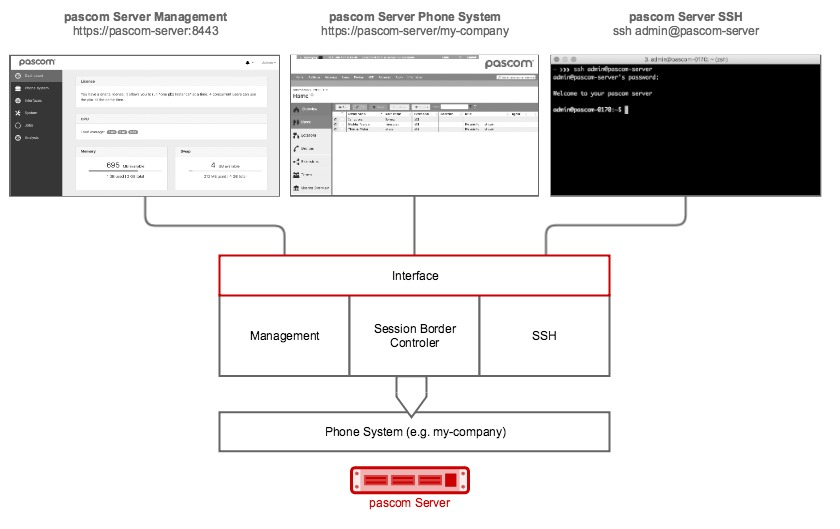


 

 
## Systemaufbau



### Interface

Das Interface ist die Netzwerk-Schnittstelle des pascom Servers. Befinden sich am Server mehrere physikalische oder virtuelle Ethernet-Schnittstellen werden die Interfaces analog dazu erstellt.

### Management

Das pascom Server Management liegt direkt via **Port 8443** am Interface an. Haben Sie mehrere Interfaces können Sie sich aussuchen an welchem das Management verfügbar sein soll. Die Aufgaben des Management umfassen:

* Verwaltung der Interfaces
* Anlegen der Telefonanlage
* Update des Gesamtsystem 
* Backup/Restore Operationen
* Überwachung und Anlayse des Gesamtsystems

### Session Border Controller

Zugriffe auf die Telefonanlage können ausschließlich via Session Border Controller erfolgen. Dieser sichert das System ab und lässt in der Standard-Konfiguration ausschließlich verschlüsselte Verbindugen zu. Über den Session Border Controller stehen folgende Dienste der Telefonanlage am Interface zur Verfügung:

#### Aktiviert (Standard)
| Port | Beschreibung |
| ---- | ------------ |
| TCP **443** | Webinterface der Telefonanlage |
| TCP **636** | LDAPS für Telefonbuchzugriffe via LDAP |
| UDP **3478** | Zugriff für Video-Funktionalität |
| TCP **5061** | SIP-TLS - sichere SIP-Kommunikation |
| TCP **5222** | pascom Desktop- und Mobile-Client-Zugriffe |
| TCP **8884**  | Provisionierung von IP-Hardware-Telefonen |
| UDP **30000 - 35000** | SRTP - verschlüsselte Sprachdaten |

#### Deaktiviert (Standard)
| Port | Beschreibung |
| ---- | ------------ |
| TCP **5060** | SIP - SIP-Kommunikation |
| TCP **8885**  | VPN Tunnel direkt zur Telefonanlage |

### SSH

Direkt am Interface steht via **Port 22** der SSH-Server zur Verfügung. Dort können Sie sich, wie an den Webinterfaces, per admin anmelden um das System zu verwalten. Zugriffe per SSH empfehlen sich nur für Anwender mit Linux-Erfahrung. 

### Phone System

Ist die eigentliche Telefonanlage. Auf diese kann, aus Sicherheitsgründen, ausschließlich per Session Border Controller zugegriffen werden. Es ist auch möglich mehrere Telefonanlagen auf einem pascom Sever gleichzeitig zu betreiben. Dies ist jedoch unseren Cloud Service Provider Partnern vorbehalten.

Um nicht immer über das Management auf die Weboberfläche der Telefonanlage zugreifen zu müssen steht diese auch direkt, durch angabe des Telefonanlgen-Namens, zur Verfügung:

```
https://pascom-server/my-company
```

