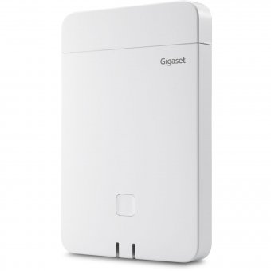





## Unterstützte Geräte

**[Liste der unterstützten Endgeräte, hier klicken!]()**

## Übersicht

Die DECT Basis lässt sich sowohl einzeln als auch als Multizellenkonfiguration betreiben. Sie ist ideal für Unternehmen geeignet, die eine Funkabdeckung über mehrere Etagen oder in großen Bürogebäuden benötigen.

## Neue DECT Basisstation hinzufügen

{}
{}

Bevor Sie das Gigaset DECT System in der pascom Telefonanlage provisionieren, müssen Sie die DECT Sender vorbereiten. 
Der erste Sender der auch zur Provisionierung der Daten von Ihrer pascom Telefonanlage verwendet wird muss vor der ersten Einrichtung in die Geräterolle **"Integrator/DECT-Manager"** versetzt werden. **Folgen Sie hierzu bitte der beiliegenden Anleitung bzw. der Anleitung die von Gigaset bereitgestellt wird.**
Weitere Sender fügen Sie wie von Gigaset empfohlen als Basisstation (Standardgeräterolle im Auslieferungszustand) hinzu.



Integrieren Sie das DECT-System in Ihr Netzwerk. 



Die MAC-Adresse steht auf der Basisstation oder einem beigelegten Merkzettel.



Loggen Sie sich in Ihrer Telefonanlage ein und fügen unter  >  ein
neues Gerät vom Typ **DECT-gateway: Gigaset** hinzu.

Tragen Sie im Feld **Mac-Adresse** die zuvor ermittelte MAC-Adresse des DECT Systems ein.



Nach dem Speichern von Änderungen erscheint in der Job-Box (oben) ein
entsprechender Eintrag die Telefonie anzuwenden. Starten Sie den Job durch
einen Klick auf den .



Haken Sie das DECT-System in der Gateway-Liste an und wählen  > . Kopieren Sie die
**URL** in die Zwischenablage.



Auf der Web-UI des DECT System tragen Sie die eben kopierte Provisionierung-URL ein.

Abschließend führen Sie einen Reebot des DECT-System aus, damit die Provisionierungsdaten aktualisiert werden.

{}

### Handsets anlegen und zuweisen

Wählen Sie unter  >  >  den Eintrag *Via Gigaset DECT Gateway: handset* aus. Folgende Einstellungen müssen Sie vornehmen:

|Einstellung|Beschreibung|
|---|---|
|Angeschlossen an|Wählen Sie hier den DECT-Sender, bzw. bei Mulizellenbetrieb das DECT-System.|
|IPEI Nummer|Geben Sie hier die IPEI-Nummer des Handsets ein.|
|SIP Optionen|Optional können Sie hier asterisk-spezifische Sip-Optionen eintragen.|
|Zuweisung|In diesem Reiter können Sie einen Benutzer zuweisen.|
