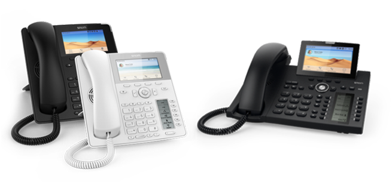


 


## Compatability

With [our VoIP Software] (https://www.pascom.net/en/mobydick-voip/ "pascom VoIP phone systems") it is possible to centrally and automatically configure Snom IP Telephones including the Snom 3xx, 7xx, D3xx and D7xx series of phones.

|Provisioning|Firmware Management|Desktop Client CTI Control|pascom Menu|
|---|---|---|---|
|yes|yes|yes|yes|

**Provisioning**: The IP phone is manageable via the PBX web UI. 
**Firmware Management**: Firmware can be managed and updated via the PBX web UI. 
**Desktop Client CTI Control**: The desktop UC client can remotely control the phone, i.e. to start calls. 
**pascom Menu**: A phone touch key will be assigned to access the pascom Menu.

## Snom Provisioning

The process of configuring or registering an VoIP phone with an IP PBX such as pascom's is know as `Provisioning`. For this purpose, pascom phone systems include a Default Configuration (`Devices > Basic Configuration`). For most deployment scenarios, these standard settings provide an ideal configuration. However, in some cases, the settings may need to be modified.

## (Optional) Mass Deployments

For pascom on-premise phone system installations, it is possible to perform fully automated mass Endpoint deployments by using the pascom DHCP server:

* See mass deployments Masseninbetriebnahme

## Device Onboarding 
{}
The telephone requires a DHCP server in order to receive an IP Address.
{}

{}
Should the telephone not be factory new, ensure you perform a **factory reset**. In order to do this on the phone, power up the phone and then press`**##` holding the final `#` until after the phone has restarted and a menu has appeared. Select option `1` for factory settings. 
{}

### Connect the Phone

Connect the phone to your network. Snom IP phones come with a built in switch, allowing you to connect the phone directly via the Ethernet port labelled as **NET**. Should you not have a **PoE** option available, connect the phone to a power supply.

The Snom IP phone will now boot and acquires an IP address which is displayed on the screen during the boot process. Please take a note of this address.

After booting, the phone will stop at the country selection screen.

### Determine the MAC Address

MAC addresses can be found on the rear underside of the telephone.

Alternatively, using your browser, surf to the previously noted telephone's IP address.

Under `System Information > MAC-Address` please take a note of the phone's IP address.

### Add Phones / Endpoints

Log into your pascom phone system and under `Devices > Device list` and press `Add` and select the option **IP Telephone: Manufacturer Snom**.

Under the corresponding field, enter the **Mac-Address** that you have just found and noted. 

### Apply Jobs

After saving your phone setup configurations, a corresponding prompt to apply telephony configs will appear in the job box (top of the screen). Simply start the job by clicking on the `green tick`.

### Finding the Provisioning URL

Select the desired telephone from the device list and under `Action` select the option `Provisioning URL`. Copy the **URL** to your clipboard.

### Enter the Provisioning URL on the Telephone

Go back to the telephone Web UI and under `Advanced Settings > Update > Setting URL` paste the copied Provisioning URL.

Click on `Apply` and finally `Reboot`.

### Assigning Users

As soon as the IP phone has appeared in the Device List, it can be edited via the `Edit` button. Under the `Assign` tab, the phone can be assigned to a [user (or location)]().

After saving and once again apply the telephony configuration, the telephone will restart.

### Function Testing

The simplest method of testing whether a device has been successfully deployed is to call ones Voicemail box via **\*100**. On successfully provisioned phones, you should now hear your Voicemail box prompts.

### pascom Menu Key

After the provisioning process, the **Menu** button on Snom phones is no longer assigned to the Telephone Menu, but rather to a telephone specific pascom Menu making the following pascom phone system functions available:

|Function|Description|
|---|---|
|Telephone Book|Opens up the central PBX phonebook.|
|Journal|Displays answered, dialed and missed calls|
|Call Forwarding|Sets a call forwarding, activates / updates a previously configured call forwarding or deactivates an active call forwarding.|
|Voicemail Box|Voicemail box menu for activating/deactivating your mail box, plus message play backs|
|Login|Enables a user to log into the location where the phone is (Hotdesking / roaming users).|
|Logout [*username*]|Logs out the current user from this location.|
|Teams (Queues)<!--FIXME-->|Is used for agent management within a queue (login, logout, pause..) according the configuration of the queue.|

Should the Snom IP telephone not have a menu key (i.e. Snom 300, 710 or D715), then the second function key will be assigned with the pascom menu function.

{}
Only set Call Forwardings via the pascom menu as they can then be managed by the PBX and reflected within the desktop UC client etc.
{}

{}
 Using the DND key (*do not disturb*) directly on your Snom phone, ensures that the assigned user extension cannot be reached on the phone. The DND notice will appear only on the telephone itself and will have no impact on other endpoints or the Desktop UC client (softphone).
{}

### Accessing the Snom Telephone Web UI

In order to access your telephone's web UI, you will need to know the phone's IP address. The following outlines the different methods of discovering the phone IP Address:

#### Finding the IP-Address on the Telephone

Press the **?** (i.e. the **help**) in order to call up the phone IP address.

#### Finding the IP-Address via the Web UI Device List

Log into the PBX Web UI and select the `Devices` > `Device list`, which provides you an overview of all available devices. To the left of each entry is an *Info* symbol which when clicked will open an overview of the provisioned telephone including the IP address.

#### Admin Rights

In order to access certain menu options with the Snom Telephone web UI, you will require admin rights. To do this simply go the **Advanced** menu point and now enter the Admin Password.

### Function Keys

In the menu of the left, click on the `Function Keys` option.

#### User / Extension Monitoring with BLF Keys

Using the function keys, it is possible to monitor other extensions (i.e. users). The BLF keys (Busy Lamp Field) can be used to provide status information relating to the monitored extension. In this scenario, monitoring means watching the extension to see if the user is currently on the phone, being called or to answer calls intended for this extension (call pickup).

|Context|Type|Number|Short Text|
|---|---|---|---|
|Select Account / Identity|**Extension**|The extension to be monitored (e.g. 123) in the following format <sip:123@192.168.100.1>|Should the telephone have a second display for paperless keys, then the keys labels can be entered here.|

Alongside user extensions, it is also possible to configure keys as login / out codes for queues or to configure them as an extension switch.
<!--FIXME Links zu dw-schalter, warteschlangen  -->

#### Additional Useful Function Keys
     
|Function Key|Description|
|---|---|
|**Speed Dial**| Can be assigned with a telephone number.|
|**DTMF**|Can be assigned with DTMF characters.|

### Default Configuration

As previously stated, Snom IP phones are provisioned using the default configurations which can be found under `Devices`> `Basic Configurations`.

{}
When modifying the default configuration settings, ensure you make a duplicate copy of the original using the `Duplicate`tool.
{}

In addition, you can set an already edited default configurations as the `standard settings`. Doing so ensures that all newly added IP telephones will automatically be provisioned with these default configurations.

#### Assigning a Default Configuration

A default configuration can be assigned using multiple methods:

+ Via `Devices`> `Basic Configurations` > Choose your Basic configuration set and press `Edit` Under the `Devices` tab, it is possible to add multiple IP telephones.
+ Via `Devices`> `Device list` > Select and edit the IP Telephone and under the tab `Basic Data` choose the correct **Basic configuration** option.

#### Automatic BLF Key Configuration via Basic Configurations

Under the `Configuration` tab, it is possible to modify the existing basic configuration. Under the **Keys** section you will find the already pre-configured function keys which provide a useful guideline to work with.

Navigate to the Snom Telephone web UI and under *Function Keys* configure the **P1** button as an example. As type, select **Extension**, and as number **123** and **ExampleUser** as the short text. Once done, apply the settings.

Next, click on the *Settings* menu option. Should this option not be visible, you will require [admin rights](). 
Search for *fkey0* and *fkey_label0*. Next copy and paste the search result lines into the phone system web UI:

    {{!-- keys --}}
    fkey0: dest <sip:123@192.168.100.1>
    fkey_label0: Switchboard

Via the menu tab `devices`, assign these default configurations to the telephones which should have this BLF configuration. Save and apply your changes and once the phones have restarted, the changes will have taken affect.

### Firmware Updates

From mobydick version 7.14 onwards, IP endpoint firmware will no longer be included as standard. Should a firmware version (other than the version pre-installed on the phone) be required, this must be externally sourced and per hand uploaded to the phone system firmware management tool.

#### Upload New Firmware

The desired firmware can be uploaded via the the `Devices`> `Device firmware`:

|Settings|Description|
|---|---|
|Firmware Files|Upload the firmware files here. Firmware can be found here: [Snom Support Wiki](http://wiki.snom.com/Category:Firmware).|
|Model|Snom Telephone model name|
|Version|Firmware Version|
|Comments|Optional field for notes|

#### Firmware Roll Outs

Firmware updates can be rolled out via the `Devices` > `Device list` menu. Simply select the desired Snom Endpoints from the list via the check boxes and click `Actions` > `Roll out firmware`. This will open an overview of all selected devices to which the new firmware version should be rolled out to. Click `Firmware Update` to roll out the desired firmware version.

#### Recommended Firmware

As there are numerous Firmware versions available for the varying IP endpoint models, it is unfortunately not possible to test them all. Therefore, it is possible that some firmware versions may not support all phone system functions. If in doubt, please refer to below list of already tested firmware versions:

|Model|Firmware|
|---|---|
|Snom 300|8.7.3.25.5|
|Snom 320|8.7.3.25.5|
|Snom 360|8.7.3.25.5|
|Snom 370|8.7.3.25.5|
|Snom 710|8.7.3.25.5|
|Snom 715|8.7.8.8.2|
|Snom 720|8.7.3.25.5|
|Snom 760|8.7.3.25.5|
|Snom D345|8.9.3.40|
|Snom D715|8.9.3.60|
