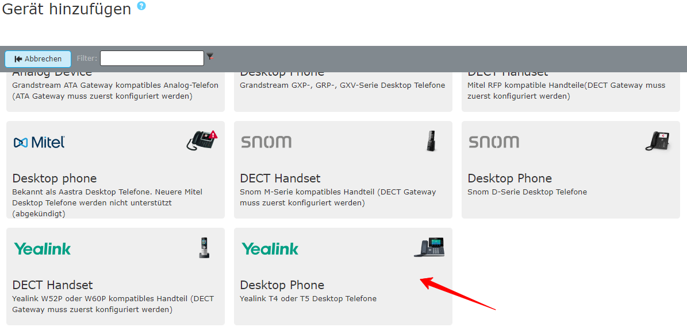





## Unterstützte Geräte

**[Liste der unterstützten Endgeräte, hier klicken!]()**

## Provisionierung

{}
Für lokale Installationen des pascom Servers ist es möglich Endgeräte per DHCP-Server massenweise und vollautomatisch in Betrieb zu nehmen.
Details können Sie dem Howto [Telefon-Provisionierung via DHCP]() entnehmen.
{}

pascom ist in der Lage IP-Telefone des Herstellers Yealink automatisch und zentral zu konfigurieren. Diesen Vorgang nennt man Provisionierung. Dazu stellt pascom eine Basis-Konfiguration ( > ) zur Verfügung. Diese ist ausreichend vorparametriert und muss nur in manchen Fällen angepasst werden.

## Neues Telefon einrichten

{}

{}

Die Cloud Provisionierung ermöglicht Ihnen eine Einrichtung der Telefone ohne diese manuell zu konfigurieren. Die Provisionierung erfolgt über die Provisionierungs-Server der jeweiligen Hersteller. Dies geschieht alles vollautomatisch.



Die MAC-Adresse steht auf der Rückseite des Telefon.

Alternativ befindet sich die MAC-Adresse oft auf der Produktverpackung.



Loggen Sie sich in Ihrer pascom Telefonanlage ein und fügen unter  >  ein
neues Gerät vom Typ **IP-Telefon: Hersteller Yealink** hinzu.

Wählen Sie einen **Anzeigenamen** für das Telefon z.B Fr. Müller - Zentrale.

Tragen Sie im Feld **Mac-Adresse** die zuvor ermittelte MAC-Adresse des Telefones ein.

Geben Sie den **HTTP-Benutzer** und das **HTTP-Passwort** des Telefons an. Die Daten erhalten Sie aus dem jeweiligen Herstellerhandbuch.



Als nächstes können Sie dem IP-Telefon einen Benutzer oder Arbeitsplatz zuweisen. Im Tab  kann dem Telefon ein [Benutzer (oder Arbeitsplatz)]() zugewiesen werden.

Klicken Sie abschließend auf 



Nach dem Speichern von Änderungen erscheint in der Job-Box (oben) ein
entsprechender Eintrag die Telefonie anzuwenden. Starten Sie den Job durch
einen Klick auf den . Das Telefon wird nun komplett eingerichtet.



Stecken Sie das IP-Telefon an das Netzwerk. Das Telefon enthält einen eingebauten Switch, benutzen Sie den Ethernet-Port mit der Bezeichnung **NET**. Falls Sie kein **PoE** (Power over Ethernet) verwenden, stecken Sie das Telefon an den Netzstrom.

**Ist das Telefon bereits in Ihrem Netzwerk eingebunden?**  
1. Starten Sie das Telefon neu.

{}
Handelt es sich nicht um ein fabrikneues Telefon setzen Sie es in jedem
Fall auf **Werkseinstellungen**zurück. Um dies am Telefon zu tun, schalten Sie das Telefon ein und drücken Sie dann {} und halten Sie die Taste gedrückt, bis **Factory Reset** auf dem Display erscheint. Bestätigen Sie durch Drücken der {. 
{}

Sobald das Telefon erfolgreich für Ihren Benutzer registriert wurde, testen Sie die Telefonie



Am einfachsten kann man die erfolgreiche Inbetriebnahme testen, indem man mit **\*100** die eigene Voicemailbox anruft. Daraufhin sollte die Ansage Ihrer Voicemailbox zu hören sein.

{}

{}

**DHCP Provisioning funktioniert nur ONSITE**  

{}
Für lokale Installationen des pascom Servers ist es möglich Endgeräte per DHCP-Server massenweise und vollautomatisch in Betrieb zu nehmen.
{}



Bereiten Sie einen DHCP-Server wie unter [Telefon-Provisionierung via DHCP]() beschreiben vor.



{}
Handelt es sich nicht um ein fabrikneues Telefon setzen Sie es in jedem
Fall auf **Werkseinstellungen**zurück. Um dies am Telefon zu tun, schalten Sie das Telefon ein und drücken Sie dann {} und halten Sie die Taste gedrückt, bis **Factory Reset** auf dem Display erscheint. Bestätigen Sie durch Drücken der {. 
{}

Stecken Sie das IP-Telefon an das Netzwerk. Das Telefon enthält einen eingebauten Switch, benutzen Sie den Ethernet-Port mit der Bezeichnung **NET**. Falls Sie kein **PoE** (Power over Ethernet) verwenden, stecken Sie das Telefon an den Netzstrom.

Das Gerät wird **automatisch** vom pascom Server konfiguriert und **erscheint** daraufhin in der List  > . 



Als nächstes können Sie dem IP-Telefon einen Benutzer oder Arbeitsplatz zuweisen. Klicken Sie hierzu auf . Im Tab  kann dem Telefon ein [Benutzer (oder Arbeitsplatz)]() zugewiesen werden.



Nach dem Speichern von Änderungen erscheint in der Job-Box (oben) ein
entsprechender Eintrag die Telefonie anzuwenden. Starten Sie den Job durch
einen Klick auf den . Das Telefon startet neu. 
Nach dem Neustart steht der Name des Benutzers oder der zugewiesene Arbeitsplatz im Telefondisplay.



Am einfachsten kann man die erfolgreiche Inbetriebnahme testen, indem man mit **\*100** die eigene Voicemailbox anruft. Daraufhin sollte die Ansage Ihrer Voicemailbox zu hören sein.

{}
{}

## pascom Menütaste

Nach der Provisionierung ist auf der zweiten Funktionstaste am Display das pascom Menü zu finden. Hier sind pascom Funktionen hinterlegt:

|Funktion|Beschreibung|
|---|---|
|Telefonbuch|Ruft das pascom Telefonbuch auf.|
|Journal|Zeigt verpasste, angenommene und gewählte Anrufe an|
|Rufumleitung|Setzt eine Rufumleitung, aktiviert/ändert eine schon gesetzte Rufumleitung oder deaktiviert eine aktive Rufumleitung.|
|Voicmailbox|Voicemailbox-Menü zum Einschalten/Ausschalten und Abhören der eigenen Voicemailbox|
|Anmelden|Hier kann ein Benutzer sich an dem Arbeitsplatz anmelden.|
|Abmelden [*benutzername*]|Der bereits angemeldete Benutzer kann sich an dem Arbeitsplatz abmelden.|
|Warteschlangen|Dient zur Verwaltung der Warteschlangen (anmelden, abmelden, pausieren...), je nach Konfiguration der Warteschlangen.|

{}
Setzen Sie Rufumleitungen nur über das pascom Menü, da diese Rufumleitungen über die pascom verwaltet werden können.
{}

{}
Die Verwendung der DND-Taste (*do not disturb*) oder Ruhe-Taste am Yealink hat zur Folge, dass die Durchwahl am Telefon nicht erreichbar ist. Der DND-Hinweis erscheint nur am Telefon und hat für die pascom (z. B. Desktop Client) keine weitere Bedeutung.
{}

## Auf die Yealink-Weboberfläche zugreifen

Um auf die Weboberfläche Ihres IP-Telefons zu gelangen benötigen Sie die IP-Adresse. Im Folgenden sind Möglichkeiten beschrieben, um diese in Erfahrung zu bringen:

### IP-Adresse am Telefon anzeigen

Drücken Sie die **OK**-Taste auf Ihrem Yealink IP-Telefon. Nun können Sie die IPv4-Adresse des Telefons ablesen.

### IP-Adresse über die Geräteliste ermitteln

Loggen Sie sich in das Web-UI der pascom ein. Klicken Sie auf  > . Nun sehen Sie eine Übersicht über alle verfügbaren Geräte. Links von jedem Eintrag finden Sie ein *Info*-Symbol. Klicken Sie es an, erhalten Sie eine Übersicht über das provisionierte Telefon, unter anderem auch die IP-Adresse.

### Funktionstasten

Die Funktionstasten rechts und links vom Display sind dreifach belegbar. Ist die erste Seite vollständig belegt, wird die letzte Taste am Display zum "umblättern" verwendet.

### Andere Benutzer (Nebenstellen) überwachen

Zur Überwachung anderer Benutzer oder Nebenstellen können Funktionstasten eingerichtet werden. Dazu eignen sich BLF-Tasten (Besetztlampenfeld oder Busy Lamp Field). Diese geben Informationen über den Status der überwachten Durchwahl. Überwachen bedeutet in diesem Fall zu sehen ob ein Benutzer telefoniert, angerufen wird und ggf. sein Gespräch heranzuholen (Pickup).

Tasten können auf verschiedenen Wegen konfiguriert werden.

### Tasten belegen direkt am Telefon

Drücken Sie auf Ihrem Telefon ca. 5 Sekunden lang auf die Taste die Sie belegen möchten. Nun können Sie Ihre Taste (z. B. BLF-Taste) belegen.

|Einstellungen|Belegung|
|---|---|
|Typ|BLF|
|Konto ID|Leitung 1|
|Kontoname|Geben Sie hier eine Bezeichnung für die Taste an.|
|Wert|Die zu überwachende Durchwahl, z. B. 123 für die Durchwahl 123|

Drücken Sie zum Bestätigen auf *Speichern*.

### Tasten belegen über das Web-UI

Im Tab  können die verschiedenen Tasten, z. B. BLF-Tasten am Telefon belegt werden:

|Typ|Wert|Name|Konto|
|---|---|---|---|
|BLF|Die zu überwachende Durchwahl, z. B. 123 für die Durchwahl 123|Geben Sie hier eine Bezeichnung für die Taste an.|Leitung 1|

Neben Benutzer-Durchwahlen können auch Einbuchcodes für Warteschlangen oder Durchwahlschalter konfiguriert werden.

### Weitere nützliche Funktionstasten

|Funktionstaste|Beschreibung|
|---|---|
|**Speed Dial**|Hier kann eine Telefonnummer hinterlegt werden.|
|**DTMF**|Hier können DTMF-Zeichen hinterlegt werden.| -->

## Basis-Konfiguration

Wie bereits erwähnt, werden Yealink IP-Telefone  mit Hilfe der Basis-Konfiguration provisioniert. Die Basis-Konfiguration ist unter  >  zu finden.

{}
Bevor Sie die Basis-Konfiguration ändern, müssen Sie diese .
{}

Ebenfalls können Sie eine schon bearbeitete Basis-Konfiguration als . Somit erhalten neu angelegte IP-Telefone automatisch die angepasste Basis-Konfiguration.

### Zuweisung einer Basis-Konfiguration

Eine Basis-Konfiguration kann auf mehreren Wegen zugewiesen werden:

+ Über  >  > Basis-Konfiguration auswählen und Bearbeiten, im Tab  können gleich mehrere IP-Telefone hinzugefügt werden.
+ Über  >  > IP-Telefon auswählen und Bearbeiten im Tab .

### BLF-Tasten konfigurieren über die Basis-Konfiguration

Im Tab  können Sie die vorhandene Basis-Konfiguration anpassen. Im Bereich **keys** finden Sie bereits vorkonfigurierte Funktionstasten, an denen Sie sich orientieren können.

BLF-Tasten lassen sich wie folgt einrichten:

    {{!-- keys --}}
    linekey.3.type = 16
    linekey.3.value = 123
    linekey.3.label = Max
    linekey.3.line = 1

Die belegte Taste (in diesem Fall Linekey 3) besteht aus drei Parametern:

+ *type*: der Typ der Taste, 16 steht für BLF,
+ *value*: der Wert, das ist hier die Nebenstelle,
+ *label*: das Label, das ist die Bezeichnung, die am Display angezeigt wird.
+ *line*: das Konto des Benutzers, der am Telefon angemeldet ist und die Konfiguration ausführt. *(Muss immer 1 sein)*

Weisen Sie diese Basis-Konfiguration über den Tab  den IP-Telefonen zu, die diese Taste auch in der Weise belegt haben sollen und speichern Sie. Nach dem Neustart der IP-Telefone werden die Änderungen auf diesen übernommen.

## Firmwareupdate

Ab der mobydick Version 7.14 wird die Firmware für IP-Endgeräte nicht mehr mitgeliefert. Sollte eine andere als auf dem IP-Endgerät installierte Firmware benötigt werden, muss diese selber heruntergeladen und in die pascom Firmware-Verwaltung hochgeladen werden.

### Firmware hinzufügen

Die gewünschte Firmware kann hinzugefügt werden unter  > :

|Einstellung|Beschreibung|
|---|---|
|Firmware-Datei|Laden Sie hier die Firware hoch. Diese finden Sie auf der [Download-Seite von Yealink](http://support.yealink.com/documentFront/forwardToDocumentFrontDisplayPage).|
|Model|Modellbezeichnung des Yealink-Telefons|
|Version|Firmware-Version|
|Dokumentation|Optionales Feld für Notizen|

### Firmware ausrollen

Die Firmware kann über  >  aktualisiert werden. Wählen Sie die Zielgeräte in der Geräteliste mit Häkchen aus und klicken Sie auf  > . Nun erhalten Sie eine Übersicht der gewählen Geräte, in der Sie die Zielfirmware auswählen können. Anschließend klicken Sie auf  um die gewählte Firmware auszurollen.

