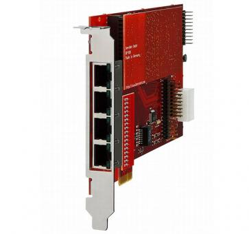





## Übersicht

beroNet Karten werden in die pascom Appliance eingebaut und erhalten beim Hochfahren der pascom automatisch eine IP-Adresse aus dem Zero-Config-Netzwerk **169.254.0.0/16**. An die vorderen Anschlüsse der Karte werden dann z. B. das öffentliche Telefonnetz oder analoge Endgeräte angeschlossen. beroNet Karten können modular ausgestattet werden. Je nach Modulen sind die Ports an der Vorderseite analog oder ISDN.

### (Optional) Direkte Amt-Anbindung von Endgeräten
{}
Diese Funktion ist nur in Kombination mit einem ISDN-Amt, dass sich auf derselben Karte befindet, sinnvoll.
{}

Möchten Sie Ihre beroNet Karte dazu verenden ISDN- oder Analog-Endgeräte in Kombination mit einem ISDN-Amt auf derselben Karte zu betreiben haben Sie die Möglichkeit das Endgerät direkt mit dem Amt zu verbinden ohne dass die Anrufe über die gesamte Strecke bis zur Telefonanlage geführt werden.

Anrufe werden nicht in SIP gewandelt und über die pascom geschickt sondern direkt auf der beroNet geroutet. Kommt beispielsweise ein eingehender Anruf für das Faxgerät herein, wird dieser direkt von der beroNet mit dem Faxgerät verbunden.

Der Vorteil dieser Methode ist, dass Verbindungen die nicht in SIP gewandelt werden. Für **Faxanwendungen** erzielt man dadurch wesentlich bessere Ergebnisse. Ein weiterer Anwendungsfall ist die Übertragung von **ISDN Daten**.  

Nachteil ist, dass die pascom von diesen Anrufen nichts "mitbekommt". Dadurch kann pascom nicht in den Anruffluss eingreifen. Z. B. den Anruf nach einem Timeout an ein anderes Ziel leiten, Geschäftszeiten prüfen, usw.. Außerdem muss sich das ISDN Amt und die betroffene Nebenstelle auf derselben beroNet Hardware befinden.

Ob ein Endgerät direkt an ein Amt oder über die Telefonanlage geführt werden soll können Sie beim Anlegen des ISDN- oder Analog-Endgerätes festlegen.

## Konfiguration

### Karte vorbereiten

Als Vorbereitung müssen beroNet Karten mit den passenden Modulen bestückt werden. Haben Sie Ihre Hardware bei pascom bestellt sind diese Module bereits installiert. Detail hierzu wie z. B. Portbelegung, usw. entnehmen Sie bitte direkt der [beroNet Dokumentation] (https://beronet.atlassian.net/wiki/spaces/PUB/pages/51085410/Gateways+and+Cards "Zur beroNet Dokumentation").

Bauen Sie die Karte nun (soweit nicht vorinstalliert) in die pascom Appliance ein.

### Zugriff auf die beroNet Karte

Nach dem Systemstart finden Sie erkannte beroNet Karten im pascom Management unter **System** > **System** > **Berofix Karte**. Durch klicken auf den Link können Sie auf die Weboberfläche der Karte zugreifen z. B. um ein Firmware Update durchzuführen (Standardbenutzer **admin**, Kennwort **admin**).

### Firmware Update (optional)

{}
pascom Server ab Version 18 benötigt mindestens die **beroNet Firmware 16** oder höher!
{}

Loggen Sie sich auf der Weboberfläche des beroNet Karte ein (Standardbenutzer: admin Passwort: admin) und stellen Sie zunächst unter **Management** > **Info** sicher, dass Sie appfs **16 oder neuer** verwenden. Falls nicht updaten Sie die Karte jetzt:

* Download der [Firmware 16.X](https://beronet.atlassian.net/wiki/spaces/PUB/pages/61210659/Tools+and+Downloads) (Abschnitt: beroNet OS)
* Setzen Sie die beroNet unter **Management** > **Firmwareupdate** in den Updatemodus
* Laden Sie die Firmware 16.X nach dem Reboot hoch und starten Sie das Update

### Anlegen der beroNet Karte

Loggen Sie sich nun auf der Weboberfläche der Telefonanlage ein und klicken Sie unter **Gateways** > **Gatewayliste** auf **Hinzufügen** und wählen **beroNet** aus. beroNet Karten werden automatisch erkannt. Wählen Sie die Karte unter **Gateways** aus und klicken auf **weiter**.

Zur Kontrolle wird Ihnen nun die aktuelle Modulbelegung und MAC-Adresse der Karte angezeigt. Schließen Sie den Vorgang durch **Speichern** ab.

### ISDN Amtsleitungen anlegen
In vielen Fällen wird beroNet Hardware dazu verwendet ISDN Amtsleitungen daran anzuschließen. Selektieren Sie hierzu die entsprechende Karte aus der Liste, wählen Sie **Bearbeiten** und schalten Sie dann auf den Tab **Belegung** um.

Unter **Hinzufügen** können Sie entweder **BRI** oder **PRI-Amtsleitungen** konfigurieren.

Klicken Sie im entsprechenden Datensatz doppelt auf das Feld **Bezeichnung**. Dadurch öffnet sich ein Detailfenster. Hier können Sie anhaken welcher **Port** der Karte zu diesem Amt gehört. Auch Mehrfachauswahlen sind möglich da es bei z. B. Anlagenanschlüssen sein kann, dass mehrere NTs zu einem Amtsanschluss zusammengefasst werden.

Unter **Modus** und **Technologie** stellen Sie die Anschlussart ein. Bei einem Anlagenanschluss ist das z. B. **TE** und **PTP**.

In diesem Schritt konfigurieren Sie lediglich den Anschluss auf der beroNet Hardware. Nun müssen Sie unter **Gateway** > **Ämter** ein entsprechendes Amt anlegen. Nutzen Sie hierzu die **Amtsvorlage** **beroNet Gateway**.

### ISDN oder Analoge Nebenstellen anlegen

Selektieren Sie die entsprechende Karte aus der Liste, wählen Sie **Bearbeiten** und schalten Sie dann auf den Tab **Belegung** um.

Unter **Hinzufügen** haben Sie folgende Auswahl:

|Typ|Beschreibung|Anwendungsfall|
|---|---|---|
|Analoges Endgerät direkt|Analoges Endgerät welches direkt auf der beroNet Hardware geroutet wird|Faxgerät, Türöffner, Feuermeldeanlage|
|Analoges Endgerät via SIP|Analoges Endgerät welches über die pascom geroutet wird|Telefon|
|ISDN Telefon direkt|ISDN Telefon welches direkt auf der beroNet Hardware geroutet wird |Notruftelefon|
|ISDN Fax direkt|ISDN Fax welches direkt auf der beroNet Hardware geroutet wird |Faxserver (z. B. Tobit Faxware)|
|ISDN Datenleitung direkt|ISDN Datenleitung welches direkt auf der beroNet Hardware geroutet wird|Onlinebanking, ISDN Maschinensteuerung, Alarmanlage|
|ISDN Telefon via SIP|ISDN Telefon welches über die pascom geroutet wird|Telefon|

In diesem Schritt konfigurieren Sie lediglich den Anschluss auf der beroNet Karte. Legen Sie nun unter **Endgeräte** > **Geräteliste** ein Gerät vom Typ **Via beroNet Gateway**, analog dem zuvor gewählten Typ, an.