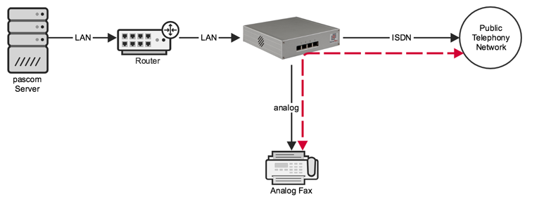





## Overview

beroNet Cards can be mounted in the pascom SMB appliance and during the boot process are automatically assigned an IP address from the Zero-Config-Network **169.254.0.0/16**. On the front ports of the cards, connection options such as the Public Telephony Network or analog Endpoints are then connected. beroNet Cards can be modular mounted. Depending on the module, the front ports are then either intended for either Analog or ISDN connections.

### Direct Trunk Connection of Endpoints (Optional)

{}  
This function only makes sense in combination with an ISDN trunk located on the same PCIe Card.
{}

If you wish to use your beroNet card to operate ISDN or Analog endpoints in combination with an ISDN trunk on the same card, then use the option to directly connect the endpoints directly to the trunk without needing to route calls over the complete path to the phone system. 

Calls will not be converted to SIP and sent over the phone system server, but rather they are routed directly over the beroNet device. If, for example, there is an inbound call for the fax device, the beroNet device will directly connect it to the fax device.

The **advantage** of this approach is that connections are not converted to SIP, which gives superior results when **fax applications** are used. Direct connections can also be used if **ISDN data** must be transmitted.

The **disadvantage** here is that the PBX will not be made aware of these calls. Therefore, the server is not able to manage the call flow, e.g. forward the call to another device after a timeout, check for business hours, etc. In addition to that, the ISDN trunk and the extension must be connected to the same beroNet hardware.

Whether an endpoint should be routed directly on a trunk or via the pascom phone system can be configured when adding the ISDN or Analog endpoint. 

## Configuration

## Card Preparation

The first step of preparation is to mount suitable modules on the beroNet Gateway. If you ordered your hardware via pascom, the modules will already be pre-installed. For further details such as port assignment etc, please refer to the [beroNet Documentation](https://beronet.atlassian.net/wiki/spaces/PUB/pages/51085410/Gateways+and+Cards "beroNet Documentation").

Mount the cards now (assuming they were not pre-installed) into your pascom SMB appliance now. 

### Accessing the beroNet Cards

After the system startup it will now be possible to view all detected cards within the pascom Management UI under , listed under **berofix cards** in the **System** section. By clicking on the link, you can access beroNet card web UI for example to perform a Firmware update (Default User **admin**, Password **admin**).

### Firmware Update (optional)

{}
pascom phone system server's from version 18 onwards required a minimum of the **beroNet Firmware 16** or higher.
{}

Log into the beroNet card web UI (per default User: admin, password: admin) and under **Management** > **Info** that you use appfs **16 or newer**. If not, update the box now:

* Download the [Firmware 16.X](https://beronet.atlassian.net/wiki/spaces/PUB/pages/61210659/Tools+and+Downloads) (Section: beroNet OS)
* Under the beroNet **Management** > **Firmware update** select the update mode. 
* Upload the firmware 16.X after the reboot and start the update

### Adding beroNet Cards

Log into the pascom phone system web UI and navigate to the menu  >  >  and select . beroNet cards will then be automatically detected. Select your card from the **Gateways** dropdown list and click .

For control purposes, the card's actual module assignment and MAC Address will be displayed. The process can be closed by pressing .

### Add ISDN Trunk Lines

A common use case for beroNet hardware is to connect ISDN trunks to it. To do so, select the gateway you want to use from the list, click the  button and then switch to the **Allocation** tab.

Under  you can configure either **BRI** or **PRI Trunk Lines**.

Double-clicking on the record  field will open a more detailed view in which you select which **Ports** are allocated to the trunk. It is possible to select multiple options here as a BRI that is configured to use the PP protocol allows for several NTs to be aggregated so they form a single trunk.

Under  and  to configure the interface type. For BRI connections in PP mode, the interface should be set to **TE** and **PTP**.

You have now configured the interface of the beroNet hardware. For complete functionality, you should now continue with the appropriate Trunks and Call Rules configuration under  >  > . To help you, use the **Trunk Template** **beroNet Gateway**. 

### Add ISDN or Analog Terminals

Select the desired Gateway from the list and press  and switch to the **Allocation** tab.

The **Add** dropdown includes the following options:

|Type            |Description   |Uses |
|---------------|---------------|---------------|
|Analogue terminal directly | Analogue terminal device being routed directly on beroNet hardware| Fax, door control, fire alarm system|
|Analogue terminal via SIP| Analogue terminal device being routed on the PBX| Telephones|
|ISDN telephone directly| ISDN telephone being routed directly on beroNet hardware| Emergency phone|
|ISDN fax directly| ISDN fax being routed directly on beroNet hardware| Fax server (e.g. Tobit Faxware)|
|ISDN data directly| ISDN data transmission line being routed directly on beroNet hardware| Online banking, ISDN machine control, Security alarm|
|ISDN telephone via SIP| ISDN telephone being routed on the PBX| Telephones|

You have now configured the connection of the beroNet hardware. For complete functionality, you should now continue with Endpoint deployment under  >  >  and select the appropriate endpoint type listed under  from the list.