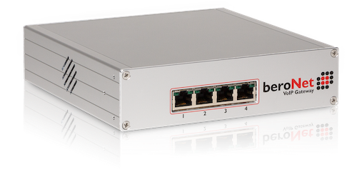
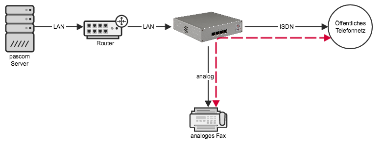





## Übersicht

Das beroNet VoIP Gateway wird an das LAN angeschlossen und erhält eine IP-Adresse. An die vorderen Anschlüsse des Gateways werden dann z. B. das öffentliche Telefonnetz oder analoge Endgeräte angeschlossen. beroNet Gateways können modular ausgestattet werden. Je nach Modulen sind die Ports an der Vorderseite analog oder ISDN. Durch die Anbindung per LAN eigenen sich beroNet Gateways ideal für Umgebungen in denen pascom in einer virtuellen Maschine oder der Cloud betrieben wird.

### (Optional) Direkte Amt-Anbindung von Endgeräten

{}
Diese Funktion ist nur in Kombination mit einem ISDN-Amt, dass sich auf demselben Gateway befindet, sinnvoll.
{}

Möchten Sie Ihr beroNet Gateway dazu verenden ISDN- oder Analog-Endgeräte in Kombination mit einem ISDN-Amt auf derselben Box zu betreiben haben Sie die Möglichkeit das Endgerät direkt mit dem Amt zu verbinden ohne dass die Anrufe über die gesamte Strecke bis zur Telefonanlage geführt werden.

Anrufe werden nicht in SIP gewandelt und über die pascom geschickt sondern direkt auf der beroNet geroutet. Kommt beispielsweise ein eingehender Anruf für das Faxgerät herein, wird dieser direkt von der beroNet mit dem Faxgerät verbunden.

Der Vorteil dieser Methode ist, dass Verbindungen die nicht in SIP gewandelt werden. Für **Faxanwendungen** erzielt man dadurch wesentlich bessere Ergebnisse. Ein weiterer Anwendungsfall ist die Übertragung von **ISDN Daten**.  

Nachteil ist, dass die pascom von diesen Anrufen nichts "mitbekommt". Dadurch kann pascom nicht in den Anruffluss eingreifen. Z. B. den Anruf nach einem Timeout an ein anderes Ziel leiten, Geschäftszeiten prüfen, usw.. Außerdem muss sich das ISDN Amt und die betroffene Nebenstelle auf derselben beroNet Hardware befinden.

Ob ein Endgerät direkt an ein Amt oder über die Telefonanlage geführt werden soll können Sie beim Anlegen des ISDN- oder Analog-Endgerätes festlegen.

## Konfiguration

### Gateway vorbereiten

Als Vorbereitung müssen beroNet Gateways mit den passenden Modulen bestückt werden. Haben Sie Ihre Hardware bei pascom bestellt, sind diese Module bereits installiert. Detail hierzu wie z. B. Portbelegung, usw. entnehmen Sie bitte direkt der [beroNet Dokumentation] (https://beronet.atlassian.net/wiki/spaces/PUB/pages/51085410/Gateways+and+Cards "Zur beroNet Dokumentation").

Verbinden Sie das Gateway mit dem LAN, schließen Sie dann das Netzteil an und warten Sie ab bis das Gateway vollständig gestartet ist (LEDs an den durch Module belegten ISDN- und Analoganschlüssen leuchten oder blinken - kann mehrere Minuten dauern).

Das Gateway zieht sich automatisch eine **IP-Adresse per DHCP**. Falls Sie in Ihrem LAN keinen DHCP betrieben, setzt das Gateway automatisch die Standard-IP-Adresse **10.0.0.2**.

### Gateway im Netzwerk auffinden (optional)

Sollten Sie die IP-Adresse des Gateways nicht kennen können Sie das Gateway mit dem beroNet Tool **bfdetect** im Netzwerk auffinden lassen und ggf. auch die IP-Adresse ändern. **bfdetect** funktioniert nur, wenn sich der PC auf dem das Tools ausgeführt wird und das beroNet Gateway im selben Netzwerk-Segment befinden.

* [BFDetect Tool for Windows (x86)](bfdetect_win_x86.zip)
* [BFDetect Tool for Windows (x64)](bfdetect_win_x64.zip)
* [BFDetect Tool for Linux](bfdetect_src.tar.gz)

### Firmware Update (optional)

{}
pascom Server ab Version 18 benötigt mindestens die **beroNet Firmware 16** oder höher!
{}

Loggen Sie sich auf der Weboberfläche des beroNet Gateways ein (Standard Benutzer: admin Passwort: admin) und stellen Sie zunächst unter  >  sicher, dass Sie appfs **16 oder neuer** verwenden. Falls nicht updaten Sie die Box jetzt:

* Download der [Firmware 16.X](https://beronet.atlassian.net/wiki/spaces/PUB/pages/61210659/Tools+and+Downloads) (Abschnitt: beroNet OS)
* Setzen Sie die beroNet unter  >  in den Updatemodus
* Laden Sie die Firmware 16.X nach dem Reboot hoch und starten Sie das Update

### Anlegen des beroNet Gateways

Loggen Sie sich nun auf der Weboberfläche der pascom Instanz ein und klicken Sie unter  >  auf . 

{}
Hat Ihre OnSite Telefonanlage eine integrierte beronet PCIe Karte klicken Sie auf  um den Suchlauf zu starten. 
{}

Geben Sie in der Maske die gesteckten Module des Beronet-Gateways an, die MAC-Adresse, IP-Adresse, sowie die Zugangsdaten zu Ihrem Gateway an.

Klicken Sie auf  und wenden Sie die Jobs in der Jobbox an.

### Provisionierungs URL kopieren

Markieren Sie das Gateway in der Gatewayliste, klicken Sie auf  >  und kopieren die URL in die Zwischenablage.

Loggen Sie sich auf der Weboberfläche der beroNet Box ein und stellen Sie zunächst unter  sicher, dass Sie  gewählt haben.

Tragen Sie nun unter  >  folgende Werte ein:

|Feld|Wert|
|---|---|
|Manual Config| aktivieren|
|Provisioning on Boot:|**always**|
|Provisioning-URL|Die zuvor kopierte Provisioning-URL|
|Polling Interval (min.)|Leer lassen|

Speichern Sie die Änderung. Die beroNet Box startet neu. 

{}
Da die Cloud Telefonanlage keinen direkten Zugriff auf die beronet Box hat, wird beim Bearbeiten der Einstellungen in pascom die Meldung "Die Hardwaredetails des Gateways konnten nicht abgerufen werden" angezeigt. In diesem Fall muss nach Änderungen an den Einstellungen die beronet Box neu gestartet werden.
{}

### ISDN Amtsleitungen anlegen

In vielen Fällen wird beroNet Hardware dazu verwendet ISDN-Amtsleitungen daran anzuschließen. Selektieren Sie hierzu das entsprechende Gateway aus der Liste aus, wählen Sie  und schalten Sie dann auf den Tab  um.

Unter  können Sie entweder **BRI-** oder **PRI-Amtsleitungen** konfigurieren.

Klicken Sie im entsprechenden Datensatz doppelt auf das Feld **Bezeichnung**. Dadurch öffnet sich ein Detailfenster. Hier können Sie dann anhaken, welcher **Port** zu diesem Amt gehört. Auch Mehrfachauswahlen sind möglich, da es bei z. B. Anlagenanschlüssen sein kann, dass mehrere NTs zu einem Amtsanschluss zusammengefasst werden.

Unter **Modus** und **Technologie** stellen Sie die Anschlussart ein. Bei einem Anlagenanschluss ist das z. B. **TE** und **PTP**.

In diesem Schritt konfigurieren Sie lediglich den Anschluss auf der beroNet Hardware. Nun müssen Sie unter  >  ein entsprechendes Amt anlegen. Nutzen Sie hierzu die Amtsvorlage: **beroNet Gateway**.

### ISDN oder Analoge Nebenstellen anlegen

Selektieren Sie das entsprechende Gateway aus der Liste, wählen Sie  und schalten Sie dann auf den Tab  um.

Unter  haben Sie folgende Auswahl:

|Typ|Beschreibung|Anwendungsfall|
|---|---|---|
|Analoges Endgerät direkt|Analoges Endgerät welches direkt auf der beroNet Hardware geroutet wird|Faxgerät, Türöffner, Feuermeldeanlage|
|Analoges Endgerät via SIP|Analoges Endgerät welches über die pascom geroutet wird|Telefon|
|ISDN Telefon direkt|ISDN Telefon welches direkt auf der beroNet Hardware geroutet wird |Notruftelefon|
|ISDN Fax direkt|ISDN Fax welches direkt auf der beroNet Hardware geroutet wird |Faxserver (z. B. Tobit Faxware)|
|ISDN Datenleitung direkt|ISDN Datenleitung welches direkt auf der beroNet Hardware geroutet wird|Onlinebanking, ISDN Maschinensteuerung, Alarmanlage|
|ISDN Telefon via SIP|ISDN Telefon welches über die pascom geroutet wird|Telefon|

In diesem Schritt konfigurieren Sie lediglich den Anschluss auf der beroNet Hardware. Legen Sie nun unter  >  ein Gerät vom Typ **Via beroNet Gateway**, analog dem gewählten Typ, an.
