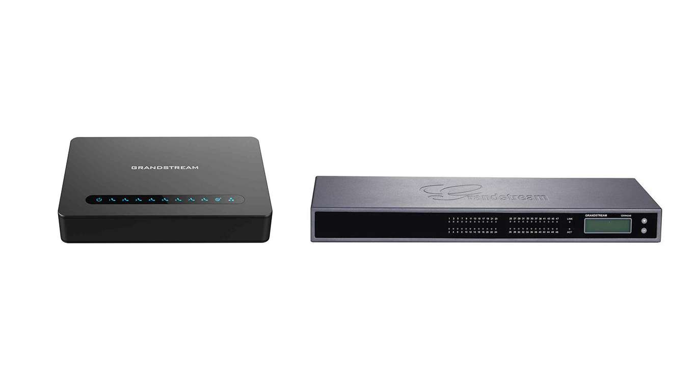





## Compatibility

|Model|Ports|
|---|---|
|HT701|1|
|HT802|2|
|HT812|12|
|HT814|14|
|HT818|18|
|GXW4216|16|
|GXW4224|24|
|GXW4232|32|
|GXW4248|48|

## Provisioning

|Provisioning|Firmware Management|
|---|---|
|Yes|No|

**Provisioning**: The gateway / adapter will be managed via the pascom phone system. 
**Firmware Management**: Device firmware can not be actualized / updated via the pascom phone system. 

## Configuration
{}

{}

**Pairing via URL works in the CLOUD + ONSITE**  



{}
If it is not a brand-new gateway, set it in every
Fall back to **factory settings**. To do this at the gateway, switch to the admin interface of the gateway via your browser and perform a **Reset** there. For further information, please refer to the manufacturer's manual. 
{}

Connect the gateway to the network. 



The MAC address is located on the back of the gateway.

Alternatively, surf to the gateway's admin web interface with your browser or use the user manual.



Log in to your PBX and under  > 
add a new device of type **ATA Gateway: Grandstream**.

Select the **model** you have connected.

In the **Mac Address** field, enter the previously determined MAC address of the gateway.

Enter an individual description.

Finally, click on **Next and Create Gateway**.



After saving changes, the job box (above) shows a
corresponding entry to use telephony settings. Start the job by
a click on the .



Check the Gateway in the Gateway List and choose  > . Copy the **URL** to the clipboard.



Go to the admin UI of the gateway and store the copied provisioning URL.

Save the changes and restart the gateway for provisioning. Alternatively, you can restart the gateway
also manually remove the power briefly.



Choose under  >  >  > the entry **Via Grandstream Gateway: Analog Device via SIP**.
In the tab  select the port on the Gateway to which the device should be connected. Then assign the device to a user via the  tab.



The easiest way to test the successful Setup is to call your own voice mailbox with **\*100**. You should then hear the announcement of your voicemail box.

{}

{}

**DHCP Provisioning only works ONSITE**  

{}
For local installations of the pascom server it is possible to commission gateways fully automatically via DHCP server.
{}



Prepare a DHCP server as described in [Phone Provisioning via DHCP]().



{}
If it is not a brand-new gateway, set it in every
Fall back to **factory settings**. To do this at the gateway, switch to the admin interface of the gateway via your browser and perform a **Reset** there. For further information, please refer to the manufacturer's manual. 
{}

Connect the gateway to the network.

The device is **automatically** configured by the pascom server and **appears** in the list  > . 



Choose under  >  >  > the entry **Via Grandstream Gateway: Analog Device via SIP**.
In the tab  select the port on the Gateway to which the device should be connected. Then assign the device to a user via the  tab.



After saving changes, the job box (above) shows a
corresponding entry to use telephony settings. Start the job by
a click on the .



The easiest way to test the successful Setup is to call your own voice mailbox with **\*100**. You should then hear the announcement of your voicemail box.

{}
{}

{}
Problems with provisioning? Occasionally, 3CX's built-in auto-provisioning feature may block a setup on the pascom.
{}

### Deactivate 3CX Auto Provisioning.

If the setup of the gateway on the pascom does not work, the auto-provisioning of 3CX may be activated. This can be disabled via the admin web interface of the gateway.

