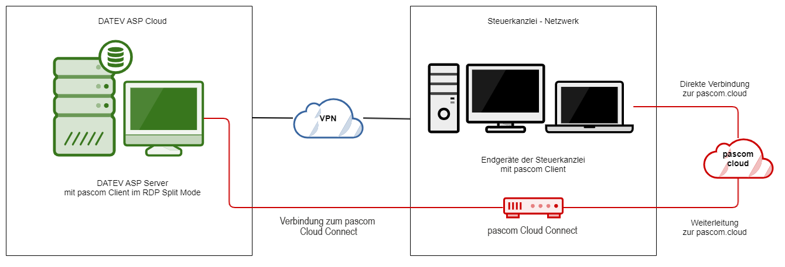
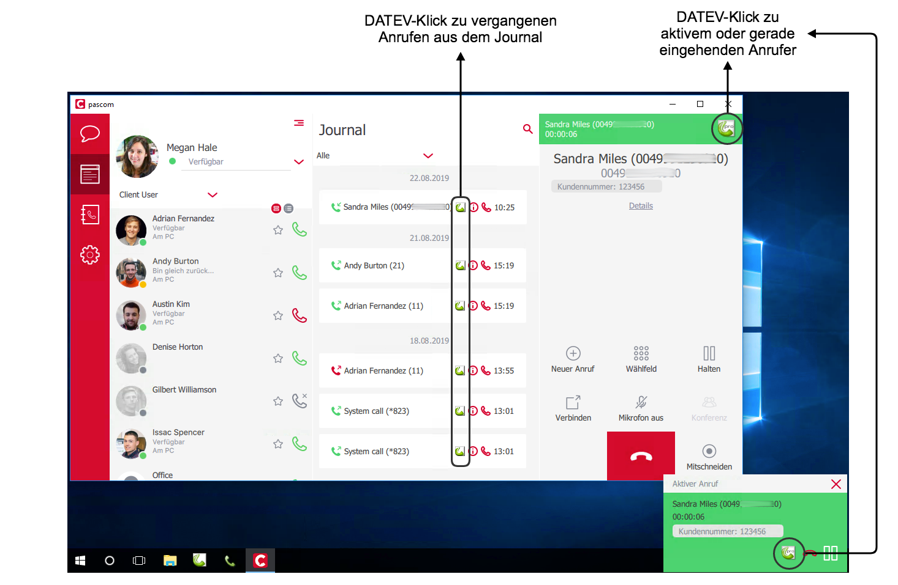
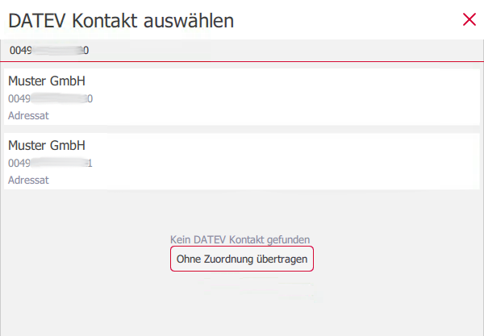
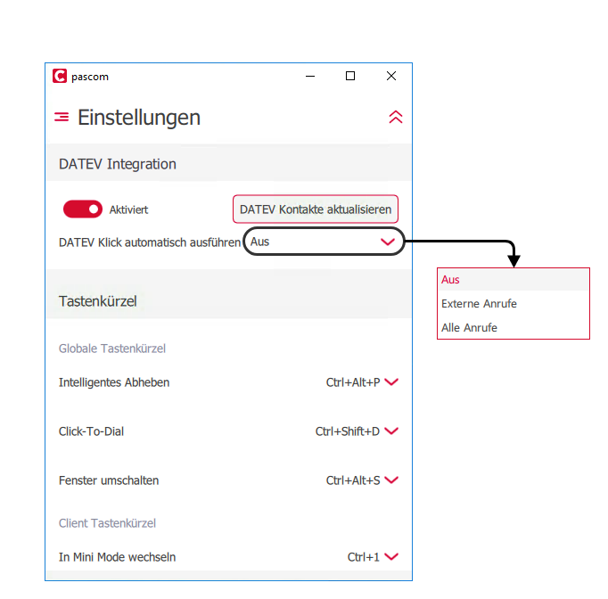





## Konzept

Die DATEV-Schnittstelle ermöglicht es bei einem eingehenden Anruf die Anrufdaten in Ihre *DATEV Arbeitsplatz pro*-Software zu übertragen. Ebenso können Sie aus dem DATEV-Telefonbuch Gespräche starten. Voraussetzung ist die Verwendung von *DATEV Arbeitsplatz pro* mit dem *Telefoniemodul*.

## pascom Cloud mit DATEV ASP Cloud verwenden

Datev bietet ihre Produkte auch als Datev ASP in der Cloud an. Dies bedeutet, dass Datev einen Server in ihrem Rechenzentrum bereit stellt, auf dem sich Kunden (Steuerberater, Rechtsanwalt usw) via Remotedesktop verbinden können. Von dieser Remotesitzung aus, kann nur über Proxy (port 80 und 443) ins Internet kommuniziert werden. Das Netz der Kanzlei ist jedoch mit VPN an die Datev ASP angebunden und hat keinerlei Einschränkungen der Ports. Bei diesem Szenario, kann man sich über die Remotesitung zwar ins Kanzleinetz aber nicht zur pascom.cloud verbinden.

Abhilfe schafft die pascom DATEV ASP Appliance, welche als Gateway in der Kanzlei, die Daten an die pascom.cloud weiterleitet.

### Wie funktioniert das?

{}
Weitere Informationen zu der pascom DATEV ASP Appliance für Ihr Unternehmen erhalten Sie von unserem Vertrieb.
{}

## Konfiguration

Zur Vorbereitung muss zunächst ein *Generisches Label* angelegt werden. Klicken Sie hierfür auf  >  > . Wählen Sie  und tragen Sie als *Label Name* **DATEV** ein. *Im Client anzeigen* sollten Sie auf *NEIN* setzen.

Anschließend ist die DATEV-Schnittstelle automatisch aktiv sobald Sie neben *DATEV Arbeitsplatz pro* mit Telefoniemodul den [pascom Client]() installieren.

Sollte das Label nicht angelegt sein, erscheint beim Übertragen der Anrufdaten in Datev während einem aktiven Anruf mit dem pascom Client folgende Meldung:

## Bedienung

### Eingehender Anruf

Bei einem eingehenden Anruf werden die DATEV-Stammdaten abgefragt und Treffer in der Anruf-Notification angezeigt.

Schon während des Läutens ist es möglich über den DATEV-Klick die Telefonie-Daten in die Telefonliste Ihres *DATEV Arbeitsplatz pro* zu übertragen.

Nach einem Anruf können die Daten über den DATEV-Klick aus dem Journal übertragen werden.

Sollten zu einer Telefonnummer keine oder mehrere Einträge in den DATEV-Stammdaten zu finden sein, erscheint eine Liste mit den möglichen Treffern und Sie können den richtigen Kontakt für die Datenübertragung auswählen, oder die Anrufdaten ohne Zuordnung übertragen.

### Ausgehender Anruf

Wird im Client-Telefonbuch nach einem Kontakt gesucht, wird immer auch das DATEV-Telefonbuch durchsucht.
Außerdem kann auch direkt aus der Kontaktliste des *DATEV Arbeitsplatz pro* heraus ein Kontakt angerufen werden.

Wird eine Nummer über den pascom Client oder einem Hardware-Telefon gewählt, erscheint in der Gesprächs-Benachrichtigung der DATEV-Klick. Über den Klick können die Gesprächs-Daten an die DATEV-Software übertragen werden. 
Sobald ein Gespräch beendet wurde, können die Daten ebenfalls über den DATEV-Klick direkt aus dem Client-Journal heraus übertragen werden.

## DATEV-Einstellungen im pascom Client

Im pascom Client können unter  >  Einstellungen vorgenommen werden:

|Einstellungen|Beschreibung|
|---|---|
|DATEV Integration|Kann mit dem Schalter aktiviert oder deaktiviert werden. |
|DATEV Kontakte aktualisieren|Stößt die Synchronisation mit dem DATEV Telefonbuch an und aktualisiert diese mit dem pascom Client ab. *Im Default findet der Kontakt-Import alle 2 Stunden statt.*|
|DATEV Klick automatisch ausführen|Hier können Sie einstellen, ob die Datenweitergabe an DATEV manuell via DATEV-Klick ausgeführt werden (*Aus*), nur Externe Anrufe automatisch an DATEV übertragen werden (*Externe Anrufe*) oder Alle Anrufe automatisch an DATEV übertragen werden (*Alle*). |
