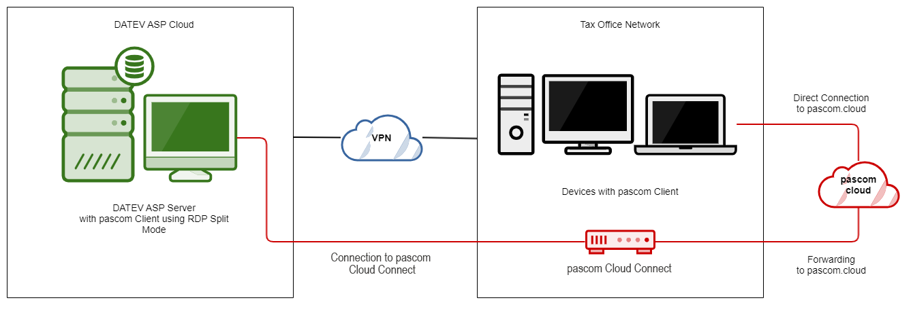
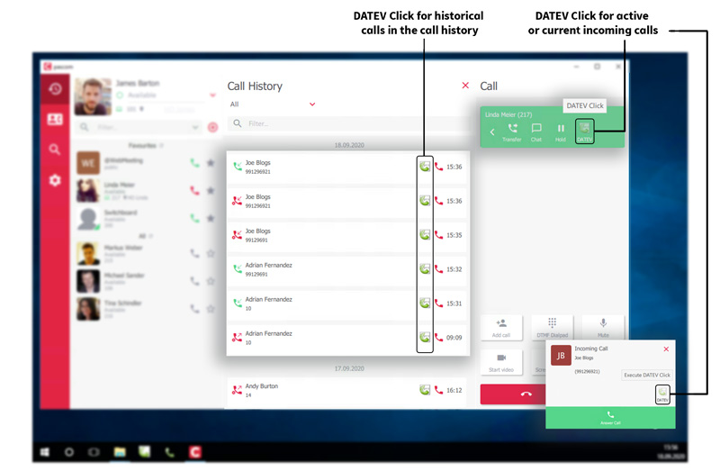
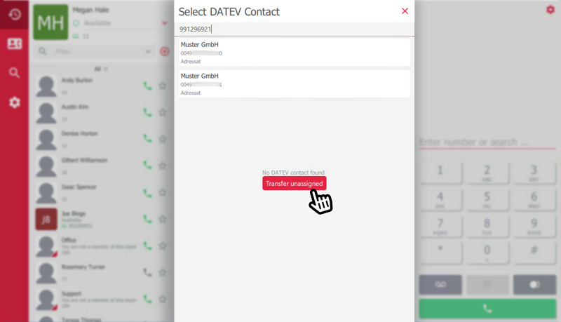
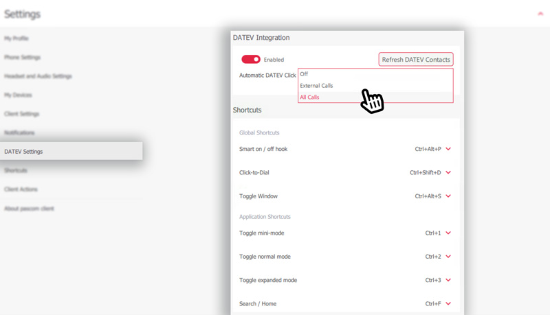





## Concept

The DATEV interface enables you to transfer incoming call data into your *DATEV Arbeitsplatz pro* software. What's more, the interface also allows DATEV users to start calls directly from the DATEV telephone book providing they are using the *DATEV Arbeitsplatz pro (DATEV Workstation Pro)* with the *Telefonie Basis (Telephony module)*. 

## Use pascom Cloud with DATEV Cloud (DATEVasp und PARTNERasp)

Datev also offers its products as Software as a Service (SaaS). This means that Datev provides a server in its data center where customers (tax advisor, lawyer, etc.) can connect via remote desktop. From this remote session, communication to the Internet is only possible via proxy (port 80 and 443). However, the law firm's network is connected to Datev ASP via VPN and has no port restrictions. In this scenario, you can connect to the office network via the remote session, but not to pascom.cloud.

The pascom cloud connect provides a remedy by acting as a gateway in the law firm and forwarding the data to the pascom.cloud.

### How does this work?

{}
For more information about the pascom DATEV ASP Appliance for your company, please contact our sales team.
{}

## Configuration

In preparation, a *Generic Label* must be added. To do this, click  >  >  within the pascom phone system admin UI. Select the option  and enter the *Label Name* **DATEV**. *Display in client* should be set to *NO*.

The DATEV interface is automatically active so long as you have installed the [pascom Client]() alongside the *DATEV Arbeitsplatz pro* with telephony module.

Should the label no be set, the following message will appear in the client when transferring the active call data to DATEV:

## User Guide

### Incoming Calls

By incoming calls, the DATEV master data will be called up and the results display in the call notification.

Even during the ringing stage of the call, it is possible to transfer the telephony data to the *DATEV Arbeitsplatz pro* telephony list using the DATEV click function.

After the call, you can use the DATEV click to transfer the data directly from the call history in the pascom client.

Should a telephone number have multiple entries within the DATEV master data, then the possible matches will appear in a list and you can choose the right contact. If a number cannot be found within the DATEV data, then it is possible to transfer the call data without assigning the number to a contact. 

### Outgoing Calls

When searching for a contact within the client phone book, the DATEV telephone book will also always be searched. Moreover, it is also possible to call contacts directly from the *DATEV Arbeitsplatz pro* contact list using click-to-dial.

If a number is dialed using the pascom client softphone or a hardware telephone, the DATEV click icon will appear in the call notification. By clicking the icon, the call data can then be transferred to the DATEV software. As mentioned above, as soon as a call has ended, the data can also be pushed to DATEV using the DATEV click icon in the client call history.

## pascom Client DATEV Settings

The DATEV settings can be found within the pascom Client under  >  :

|Setting|Description|
|---|---|
|DATEV Integration|Switch to activate or deactivate the integration. |
|Refresh DATEV Contacts|Starts the synchronisation with the DATEV telephone book and updates them in the pascom client. *Per default the contact import runs every 2 hours.*|
|Automatic DATEV Click |Allows you configure whether the DATEV data transfer should be start manually via DATEV click (*Off*) or automatically for *External Calls* only or *All* calls. |
