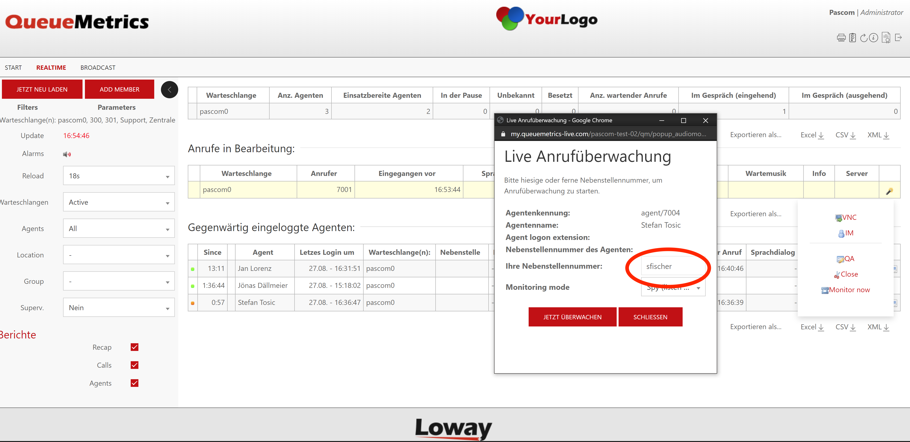





## Overview

QueueMetrics is a [Call and Contact Center Software](https://www.pascom.net/en/business-phone-system/call-contact-center// "pascom Contact Center Solutions") Queues and Agents reporting tool. 

## Configuration

### QueueMetrics Interface

QueueMetrics is a Loway product. The QueueMetrics interface transfers data between the pascom server and QueueMetrics via Uniloader. The Uniloader is also capable of receiving HTTPs commands from QueueMetrics and passing these on to the Asterisk AMI. 

Since the AMI is integrated directly into the pascom platform, no additional installation is required on the pascom server.

### QueueMetrics Configuration

#### Add API User in QueueMetrics

Log in to the QueueMetrics web UI and select the menu option  >  > .

Add the API User with the following values:

|Parameter|Description|
|---------|---------|
|Login|User login name. We recommend "pascom"|
|Password|Password for user authentication|
|Confirm Password|Reenter the user password|
|Class|From the dropdown menu, select the class "WQLOADER" |
|User keys| Click the Hat icon and select "User's roles" > "User may launch ROBOT transactions." and "Misc API access" > "The user can upload logs over HTTP". In the text field, "ROBOTS" will be automatically entered.|

Save the user via .

### pascom Configuration

#### Connect the QueueMetrics Database

Log into the pascom web UI and select the menu point  > :

|Parameter|Description|
|---------|---------|
|QueueMetrics enabled| By selecting Yes, pascom will start the service which continually saves queue data to the QueueMetrics database|
|QueueMetrics URL|The URL of the QueueMetrics server|
|API User|The API user on the QueueMetrics Server (Login-Name)|
|API Password|The API users password|

Save the configuration and apply all generator jobs.

#### Configure the Asterisk Manager Interface

In order to communicate with the phone system Server, you will need to allow QueueMetrics access via the Asterisk Manager Interface (AMI).

**Find the AMI Access Credentials**       
The AMI access credentials can be found in the pascom web UI under  >  > 

**Setup AMI Access in QueueMetrics**      
Now enter the access credentials within the QueueMetrics web UI under  >  and activate the phone system's access:


    ...
    callfile.dir=tcp:USERNAME:PASSWORD@127.0.0.1
    ...

    ...
    default.webloaderpbx=true
    ...


Replace the USERNAME and PASSWORD with the AMI credentials from the pascom Web UI. The IP Address 127.0.0.1 does not need to be updated as the QueueMetrics Uniloader is located on the pascom phone system host.


{}
The Call Monitor function (listening to live calls) from QueueMetrics is not currently possible with pascom 18. 
{}

### Set up Queuemetrics Live Call Monitoring

Enter the following parameters in the Queuemetrics web interface under > :

```
callfile.monitoring.enabled=true
callfile.monitoring.channel=Local/10@queuemetrics
callfile.monitoring.extension=11
callfile.monitoring.context=queuemetrics
```

In Quemetrics itself you then have to enter the **username** and _not_ the extension number under "Your extension":




## Check the Connection (On-premise)

### pascom to QueueMetrics Data Loading Checks

In order to see whether the transfer of data from pascom to the QueueMetrics database is functioning, access your instance via SSH and you can use the following command to check the connection:

    journalctl -fu uniloader.service


As the answer, you will receive the status of the connection:


    root@pascom:/# journalctl -fu uniloader.service            
    -- Logs begin at Tue 2019-02-12 01:01:32 CET. --
    Feb 15 14:46:33 pascom uniloader[12323]: 2019/02/15 14:46:33 Uniloader 0.4.1 (84-20170920.1110) is alive - GR: 19 - Mem: Alloc 3372k (Free 11992503k) Sys 9094k
    Feb 15 14:51:33 pascom uniloader[12323]: 2019/02/15 14:51:33 Uniloader 0.4.1 (84-20170920.1110) is alive - GR: 17 - Mem: Alloc 1941k (Free 11999561k) Sys 9094k
    Feb 15 14:56:33 pascom uniloader[12323]: 2019/02/15 14:56:33 Uniloader 0.4.1 (84-20170920.1110) is alive - GR: 19 - Mem: Alloc 3103k (Free 12004255k) Sys 9094k

