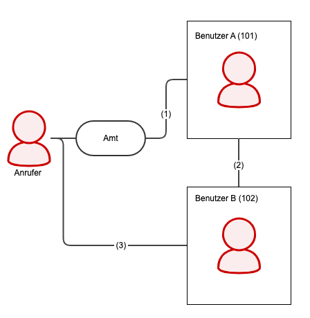
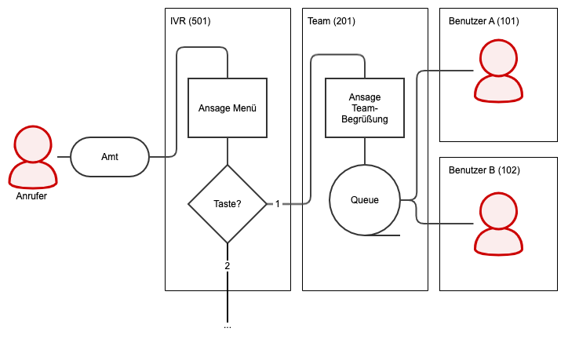





## Übersicht

{}
Sie können nur Datenbankabfragen anpassen. Die Datenquellen für **Live-Dashboard** werden von pascom **statisch** generiert 
{}

Mit pascom Analytics können Sie nicht nur eigene Dashboard mit vorhanden Graphen erstellen sondern auch die darunterliegenden Datenquellen 
frei anpassen. 

**Voraussetzung** dafür ist, dass Sie mit den **Grundlagen von pascom Analytics** sowie **SQL** vertraut sind.

## Einstieg

Die einfachste Möglichkeit die verwendeten SQL Abfragen zu verstehen ist vorhandene Grafen zu editieren. Kopieren Sie hierzu zunächst ein vorhandenes Dashboard (Siehe [Neues Dashboard erstellen]()). Danach können Sie Graphen und Tabellen editieren und und das SQl anpassen.

Klicken Sie auf den einem beliebigen Graphen oder Tablle auf :


Nun können Sie das SQL anpassen und testen:


Weitere Informationen, insbesondere zu Variablen, finden Sie im Editor unter .

Die verwendete Datenbank ist PostgreSQL. Informationen zu PostgreSQL in Zusammenhang mit Grafana (von pascom verwendete Analytics Tool) finden Sie hier [Using PostgreSQL in Grafana](https://grafana.com/docs/grafana/latest/features/datasources/postgres/).

## SQL Funktionen

pascom stellt SQL Funktionen zur Abfrage von Daten bereit. Diese können, ähnlich wie Tabellen, in SQL Abfragen genutzt werden.

### filter_calls()

Diese Funktion gibt **alle abgeschlossenen** Anrufe zurück. Anrufe die im Moment der Abfrage noch aktiv sind (live) werden nicht
berücksichtigt.

#### Parameter

```sql
filter_calls( 
    from_timestamp, 
    to_timestamp,
    call_type, 
    filter_user, 
    filter_label, 
    filter_from_name, 
    filter_from_number,
    filter_to_name,
    filter_to_number
)
```

| Parameter          | Beschreibung                      |
| ------------------ | --------------------------------- |
| from_timestamp     | Anrufe seit diesem Zeitpunkt. Üblicherweise Dasboard-Variable ***$__timeFrom()*** für selektierten Zeitraum. |
| to_timestamp       | Anrufe bis zu diesem Zeitpunkt. Üblicherweise Dashboard-Variable ***$__timeTo()*** für selektierten Zeitraum. |
| call_type          | Mögliche Werte: ***all*** = alle Anrufe, ***inbound*** = Nur eingehende Anrufe, ***outbound*** = Nur ausgehende Anrufe, ***internal*** = Nur interne Anrufe |
| filter_user        | Filter nach Benutzername (nicht Anzeigename). ***\****  = Alle Benutzer. Mehrere Benutzer per Kommagetrennter Liste möglich z.B. 'user1, user2'.  |
| filter_label       | Filter nach Labelname. ***\****  = Alle Label. Mehrere Label per Kommagetrennter Liste möglich z.B. 'label1, label2'. |
| filter_from_name   | Filter nach Anrufer Namen. Anzeigenamen des Anrufers, z.B. aus Telefonbuch falls vorhanden. Lassen Sie den Parameter ***leer*** um keinen Filter anzuwenden. |
| filter_from_number | Filter nach Anrufer Nummer. Lassen Sie den Parameter ***leer*** um keinen Filter anzuwenden. |
| filter_to_name     | Filter nach Angerufenem Namen. Anzeigenamen des Angerufenen, z.B. aus Telefonbuch falls vorhanden. Lassen Sie den Parameter ***leer*** um keinen Filter anzuwenden. |
| filter_to_number   | Filter nach Angerufenem Nummer. Lassen Sie den Parameter ***leer*** um keinen Filter anzuwenden. |

#### Rückgabewerte

| Rückgabewert       | Beschreibung                      |
| ------------------ | --------------------------------- |
| record_timestamp   | Zeitpunkt zu dem dieser Anruf gestartet wurde |
| record_id          | ID dieses Datensatzes |
| from_internal      | Anrufer interner?: ***t*** = ja, ***f*** = nein |
| from_number        | Anrufer Nummer |
| from_name          | Anrufer Anzeigename, z.B. aus Telefonbuch falls vorhanden |
| to_internal        | Angerufener intern?: ***t*** = ja, ***f*** = nein |
| to_number          | Angerufener Nummer |
| to_name            | Angerufener Anzeigenamen, z.B. aus Telefonbuch falls vorhanden |
| status             | Mögliche Werte: ***hangup*** = Anruf wurde normal aufgelegt, ***transfer*** = Anruf wurde verbunden, ***noanswer*** = Anruf wurde nicht beantwortet |
| direction          | Mögliche Werte: ***inbound*** = Eingehender Anruf, ***outbound*** = Ausgehende Anruf, ***internal*** = Interner Anruf |
| total_duration     | Gesamtdauer des Anrufes. Der Anruf startet sobald der Benutzer oder das Team gerufen wird. IVR, Anrufverteiler, etc. werden nicht mitgezählt. |
| ringing_duration   | Dauer bis der Anruf durch einen Benutzer beantwortet |
| talking_duration   | Dauer des Gespräches inklusive ***hold_duration*** |
| hold_duration      | Dauer die der Anruf gehalten wurde |
| data               |  |
| record_chain       | Jeder Anruf ist mit mehreren Einzelaktionen über die ***record_chain*** verknüpft. Die Einzelaktionen stehen in der Tabelle ***mdphonecallrecord***, die Chain in der Spalte ***phonecallrecord_chain*** |


### filter_queue_calls()

Diese Funktion gibt alle **abgeschlossenen**, **eingehenden** Anrufe zurück die über ein **Team** gelaufen sind. Anrufe die im Moment der Abfrage noch aktiv sind (live) werden nicht
berücksichtigt.

#### Parameter

```sql
filter_queue_calls( 
    from_timestamp, 
    to_timestamp, 
    filter_team,
    filter_user,  
    filter_from_name, 
    filter_from_number,
    filter_label
)
```

| Parameter          | Beschreibung                      |
| ------------------ | --------------------------------- |
| from_timestamp     | Anrufe seit diesem Zeitpunkt (Timestamp ohne Zeitzone). Üblicherweise Dasboard-Variable ***$__timeFrom()*** für selektierten Zeitraum. |
| to_timestamp       | Anrufe bis zu diesem Zeitpunkt (Timestamp ohne Zeitzone). Üblicherweise Dashboard-Variable ***$__timeTo()*** für selektierten Zeitraum. |
| filter_team        | Filter nach Teamname. ***\****  = Alle Teams. Mehrere Teams per Kommagetrennter Liste möglich z.B. 'team1, team2'.  |
| filter_user        | Filter nach Benutzername (nicht Anzeigename). ***\****  = Alle Benutzer. Mehrere Benutzer per Kommagetrennter Liste möglich z.B. 'user1, user2'. |
| filter_from_name   | Filter nach Anrufer Namen. Anzeigenamen des Anrufers, z.B. aus Telefonbuch falls vorhanden. Lassen Sie den Parameter ***leer*** um keinen Filter anzuwenden. |
| filter_from_number | Filter nach Anrufer Nummer. Lassen Sie den Parameter ***leer*** um keinen Filter anzuwenden. |
| filter_label       | Filter nach Labelname. ***\****  = Alle Label. Mehrere Label per Kommagetrennter Liste möglich z.B. 'labe1, label2'. |

#### Rückgabewerte

| Rückgabewert       | Beschreibung                      |
| ------------------ | --------------------------------- |
| id                 | ID dieses Datensatzes |
| chain              | Jeder Anruf ist mit mehreren Einzelaktionen über die ***record_chain*** verknüpft. Die Einzelaktionen stehen in der Tabelle ***mdphonecallrecord***, die Chain in der Spalte ***phonecallrecord_chain*** |
| from_internal      | Anrufer interner?: ***t*** = ja, ***f*** = nein |
| from_number        | Anrufer Nummer |
| from_name          | Anrufer Anzeigename, z.B. aus Telefonbuch falls vorhanden |
| total_duration     | Gesamtdauer des Anrufes. Der Anruf startet sobald das Team gerufen wird. IVR, Anrufverteiler, etc. werden nicht mitgezählt. |
| talking_duration   | Dauer des Gespräches inklusive ***hold_duration*** |
| moh_duration       | Dauer in der Musik On Hold gespielt wurde. 
| hold_duration      | Dauer die der Anruf gehalten wurde exclusive ***moh_duration***|
| status             | Möglich Werte: ***hangup*** = Anruf wurde normal aufgelegt, ***transfer*** = Anruf wurde verbunden, ***noanswer*** = Anruf wurde nicht beantwortet |
| queue_timestamp    | Zeitpunkt zu dem dieser Anruf gestartet wurde |
| queue_name         | Name des Teams |
| data               |
| agent_record_id    | ID des Teammitgliedes der den Anruf beantwortet oder transferiert hat. Alle agent_* Felder sind nur gefüllt wenn der Anruf beantwortet oder transferiert wurde. |
| agent_chain        | Gleicher Wert wie ***chain***. |
| agent_timestamp    | Zeitpunkt wenn das Teammitglied gerufen wird |
| agent_name         | Benutzername (nicht Anzeigename) des Teammitgliedes |
| agent_number       | Interne Durchwahl des Teammitgliedes |
| agent_ringing      | Rufdauer des Teammitgliedes |


## SQL Tabellen

### mdphonecallrecord

In **mdphonecallrecord** wird jeder einzelne Schritt, den ein Anruf durch die Telefonanlage nimmt, gespeichert. Ein Anruf erzeugt also viele Einträge
in der mdphonecallrecord. Die einzelnen Einträge werden via Feld **phonecallrecord_chain** zu einem Anruf verkettet.

Nutzen Sie bitte vorwiegend die von pascom angebotenen SQL Funktionen und greifen nur für etwaige Details auf diese Tabelle zu.

#### Beispiel Verbinden mit Rücksprache



In der **mdphonecallrecord** entsteht für jeden einzelnen Schritt ein Eintrag.

Als Schritt verstehen wir jedes Objekt in pascom, dass über eine Durchwahl erreichbar ist.

In unserem Beispiel ist der Anruffluss wie folgt:

- Anrufer ruft Benutzer A direkt an (101)
- Benutzer A legt Benutzer A auf "hold" und ruft Benutzer B an (102)
- Benutzer A verbindet Anrufer mit Benutzer B (102)

Der Beispiel-Anruffluss erzeugt demnach frei Einträge in der Datenbank (Nur auszugsweise):

| Feldname (phonecallrecord_) | Schritt 1           | Schritt 2           | Schritt 3           |
| --------------------------- | ------------------- | ------------------- | ------------------- |
| id                          | 1                   | 2                   | 3                   |
| timestamp                   | 2020-04-03 12:47:32 | 2020-04-03 12:47:56 | 2020-04-03 12:48:13 |
| srcnumber                   | 004989123123        | 101                 | 004989123123        |
| dstname                     | Benutzer A          | Benutzer B          | Benutzer B          |
| dstnumber                   | 101                 | 102                 | 102                 |
| parentid                    |                     | 1                   | 2                   |
| chain                       | 158589 9721877_10   | 158589 9721877_10   | 158589 9721877_10   |
| result                      | transfer            | transfer            | hangup              |
| resultdetails               | dst                 | src                 |                     |
| via                         |                     |                     | transfer            |
| viadetails                  |                     |                     |                     |
| duration                    | 41                  | 16                  | 18                  |
| connected                   | 29                  | 12                  | 18                  |
| holdduration                | 16                  | 0                   | 0                   |

An den Daten lässt sich folgendes ablesen:

- Der Anrufer hat 13 Sekunden mit Benutzer A gesprochen (connected - holdduration)
- Benutzer A hat 12 Sekunden mit Benutzer B gesprochen und dann den Anrufer an Benutzer B transferiert
- Benutzer A hat Benutzer B 4 Sekunden lang (duration - connected) gerufen bevor dieser abgehoben hat


#### Beispiel Anruf über IVR und Team



In der **mdphonecallrecord** entsteht für jeden einzelnen Schritt ein Eintrag.

Als Schritt verstehen wir jedes Objekt in pascom, dass über eine Durchwahl erreichbar ist.

In unserem Beispiel ist der Anruffluss wie folgt:

 - Anrufer wird in IVR Menü nach dem Team gefragt und entscheidet sich für 1 (501)
 - Das Team begrüßt den Anrufer durch eine Ansage und ruft die Mitglieder parallel (201)
 - Benutzer A wird gerufen und beantwortet den Anruf nicht (101)
 - Benutzer B wird gerufen und beantwortet den Anruf (102)

Der Beispiel-Anruffluss erzeugt demnach vier Einträge in der Datenbank (Nur auszugsweise):

| Feldname (phonecallrecord_) | Schritt 1           | Schritt 2           | Schritt 3           | Schritt 4           |
| --------------------------- | ------------------- | ------------------- | ------------------- | ------------------- |
| id                          | 1                   | 2                   | 3                   | 4                   |
| timestamp                   | 2020-04-03 09:42:13 | 2020-04-03 09:42:17 | 2020-04-03 09:42:19 | 2020-04-03 09:42:19 |
| srcnumber                   | 004989123123        | 004989123123        | 004989123123        | 004989123123        |
| dstname                     | IVR                 | Team                | Benutzer A          | Benutzer B          |
| dstnumber                   | 501                 | 201                 | 101                 | 102                 |
| parentid                    |                     | 1                   | 1                   | 1                   |
| chain                       | 158589 9721877_10   | 158589 9721877_10   | 158589 9721877_10   | 158589 9721877_10   |
| result                      | transfer            | hangup              | noanswer            | hangup              |
| resultdetails               | dst                 | caller              | elsewhere           | caller              |
| via                         |                     | queue               | queue               | queue               |
| viadetails                  |                     | caller              | agent               | agent               |
| duration                    | 4                   | 33                  | 10                  | 30                  |
| connected                   | 0                   | 20                  | 0                   | 20                  |
| holdduration                | 0                   | 6                   | 0                   | 6                   |

An den Daten lässt sich folgendes ablesen:

- Schritt 2 bis 4 laufen parallel. Dies ist durch die selbe **parentid** erkennbar.
- Das Team (Schritt 2) läuft so lange bis der Anruf durch einen Benutzer abgearbeitet wurde.
- Die Gesamtdauer des Anrufes ist daher die Dauer von Schritt 1 und Schritt 2 also 37 Sekunden. 
- Benutzer A und Benutzer B wurden parallel gerufen (Siehe **timestamp**).
- Bei Benutzer A hat der Anruf 10 Sekunden lange geläutet, wurde aber nicht beantwortet (duration - connected = 10).
- Benutzer B hate den Anruf nach 10 Sekunden beantwortet (duration - connected = 10) und 20 Sekunden gesprochen.
- Benutzer B hat den Anrufer 6 Sekunden lang auf "Hold" gelegt.


#### Feldbescheibung mdphonecallrecord

| Feldname                            | Beschreibung |
| ----------------------------------- | ------------ |
| phonecallrecord_id                  | ID dieses Schritt |
| phonecallrecord_timestamp           | Zeitpunkt zu dem dieser Schritt begonnen wurde |
| phonecallrecord_parentid            | ID des vorangegangenen Schrittes |
| phonecallrecord_chain               | Über diese ID werden die Schritte zu einem Anruf verkettet |
| phonecallrecord_result              | Ergebnis dieses Schrittes. Mögliche Rückgabewerte siehe Tabelle ***phonecallrecord_result***. |
| phonecallrecord_resultdetails       | Ergebnisdetails dieses Schrittes. Mögliche Rückgabewerte siehe Tabelle ***phonecallrecord_resultdetails***. |
| phonecallrecord_via                 | Über welchen vorangegangenen Schritt wurde dieser Schritt ausgelöst. Mögliche Rückgabewerte siehe Tabelle ***phonecallrecord_via***. |
| phonecallrecord_viadetails          | Details zum vorangegangenen Schritt. Mögliche Rückgabewerte siehe Tabelle ***phonecallrecord_viadetails***. |
| phonecallrecord_recordid            | ID des Mitschnitts, falls vorhanden |
| phonecallrecord_duration            | Gesamtdauer dieses Schrittes |
| phonecallrecord_connected           | Dauer des Gespräches in diesem Schritt. (Ansagen und Wartemusik zählen nicht als Gespräch) |
| phonecallrecord_srcinternal         | Anrufer interner?: ***t*** = ja, ***f*** = nein | |
| phonecallrecord_srcuserid           | Anrufer Benutzer-ID. Nur bei internen Teilnehmern |
| phonecallrecord_srcusername         | Anrufer Benutzername. Nur bei internen Teilnehmern |
| phonecallrecord_srcname             | Anrufer Anzeigename, z.B. aus Telefonbuch falls vorhanden |
| phonecallrecord_srcdeviceid         | Anrufer Endgerät-ID. Nur bei internen Teilnehmern |
| phonecallrecord_srcdevicename       | Anrufer Endgerät-Name. Nur bei internen Teilnehmern |
| phonecallrecord_srclocationid       | Anrufer Arbeitsplatz-ID. Nur bei internen Teilnehmern |
| phonecallrecord_srclocationname     | Anrufer Arbeitsplatz-Name. Nur bei internen Teilnehmern |
| phonecallrecord_srcprefix           | Anrufer Prefix. Nur bei eingehnden Anrufern. Präfix des Amtes über die der Anruf gekommen ist |
| phonecallrecord_srcnumber           | Anrufer Telefonnummer |
| phonecallrecord_srcextension        | Anrufer Durchwahl |
| phonecallrecord_dstinternal         | Angerufener intern?: ***t*** = ja, ***f*** = nein | |
| phonecallrecord_dstuserid           | Angerufener Benutzer-ID. Nur bei internen Teilnehmern |
| phonecallrecord_dstusername         | Angerufener Benutzername. Nur bei internen Teilnehmern |
| phonecallrecord_dstname             | Angerufener Anzeigename, z.B. aus Telefonbuch falls vorhanden |
| phonecallrecord_dstdeviceid         | Angerufener Endgerät-ID. Nur bei internen Teilnehmern |
| phonecallrecord_dstdevicename       | Angerufener Endgerät-Name. Nur bei internen Teilnehmern |
| phonecallrecord_dstlocationid       | Angerufener Arbeitsplatz-ID. Nur bei internen Teilnehmern |
| phonecallrecord_dstlocationname     | Angerufener Arbeitsplatz-Name. Nur bei internen Teilnehmern  |
| phonecallrecord_dstprefix           | Angerufener Prefix. Nur bei ausgehenden Anrufern. Präfix des Amtes über die der Anruf gegangen ist |
| phonecallrecord_dstnumber           | Angerufener Telefonnummer |
| phonecallrecord_dstextension        | Angerufener Durchwahl. Nur bei internen Teilnehmern |
| phonecallrecord_srcphonebookentryid | Anrufer ID des Telefonbucheintrages, falls vorhanden |
| phonecallrecord_dstphonebookentryid | Angerufener ID des Telefonbucheintrages, falls vorhanden |
| phonecallrecord_data                | Labels, Voicemail, Queuedetails |
| phonecallrecord_holdcount           | Wie oft wurde der Anruf in diesem Schritt gehalten |
| phonecallrecord_holdduration        | Wie lange wurde der Anruf in diesem Schritt gehalten |
| phonecallrecord_phonecallid         | ID für internen gebrauch  |

##### phonecallrecord_result

| Rückgabewert | Beschreibung |
| ------------ | ------------ |
| noanswer     | In diesem Schritt nicht beantwortet |
| hangup       | In diesem Schritt behandelt |
| transfer     | Von diesem Schritt zum nächsten verbunden |


##### phonecallrecord_resultdetails

| Rückgabewert | Beschreibung |
| ------------ | ------------ |
| voicemail    | Schritt endete in Voicemailbox |
| src          | Anrufer hat weiter verbunden |
| dst          | Angerufener hat weiter verbunden |
| abandon      | Anrufer hat aufgelegt bevor der Angerufene geantwortet hat |
| elsewhere    | Anrufer wurde von einem anderen Teilnehmer angenommen (nicht in diesem Schritt) |
| timeout      | Timeout in diesem Schritt erreicht|
| picked       | Pickup (Heranholen) wurde ausgeführt |
| caller       | Anrufer hat die letzte Aktion ausgeführt |
| agent        | Angerufener hat die letzte Aktion ausgeführt |


##### phonecallrecord_via

| Rückgabewert | Beschreibung |
| ------------ | ------------ |
| noanswer     | Der Anruf wurde in diesem Schritt beendet, da er nicht beantwortet wurde |
| transfer     | Der Anruf wurde in diesem Schritt beendet, da er verbunden wurde |
| queue        | Der Anruf wurde in diesem Schritt beendet, da es ein Team-Anruf war |
| fax          | Der Anruf wurde in diesem Schritt beendet, da es ein Fax war |


##### phonecallrecord_viadetails

| Rückgabewert | Beschreibung |
| ------------ | ------------ |
| action       | Der Anruf wurde in diesem Schritt beendet, da er durch eine Aktion verbunden wurde |
| src          | Der Anruf wurde in diesem Schritt beendet, da er durch den Anrufer verbunden wurde |
| dst          | Der Anruf wurde in diesem Schritt beendet, da er durch den Angerufenen verbunden wurde |
| caller       | Team-Anruf aus Sicht des Anrufers |
| agent        | Team-Anruf aus Sicht des Team-Mitgliedes  |
| picked       | Herangeholter Anruf |
