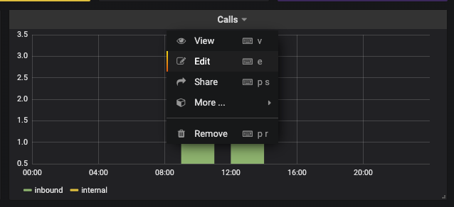
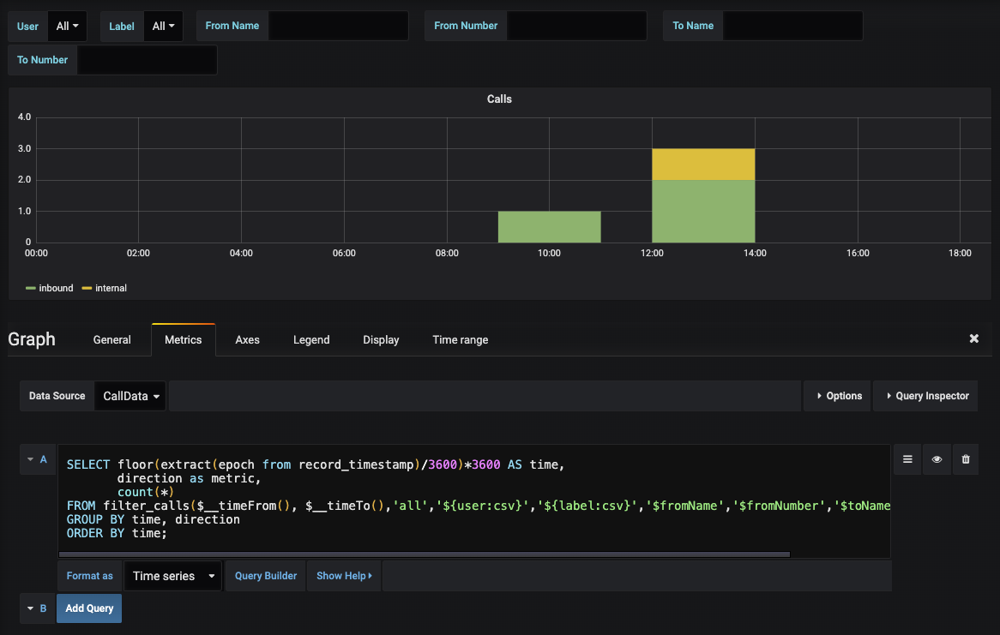
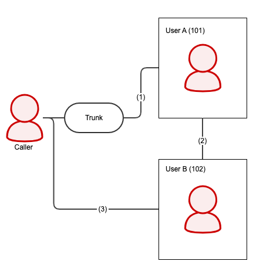
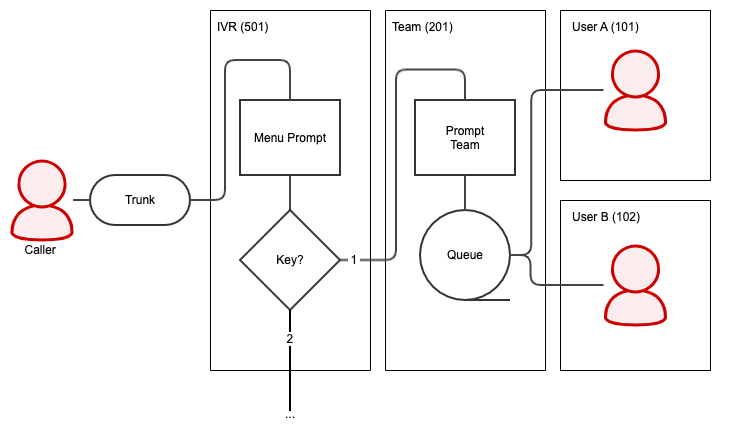





## Overview

{}
You can only customize database queries. The data sources for **Live Dashboards** are **statically** generated by pascom.
{}

With pascom Analytics you can create not only your own dashboard with existing graphs but also customize the underlying data sources.

The **requirement** for this is that you are familiar with the **basics of pascom Analytics** and **SQL**.

## Getting Started

The easiest way of understanding the SQL queries used is simply to edit existing graphs. First copy an existing dashboard (see [Create Edit Custom Dashboards]()). Then you can edit graphs and tables and adjust the SQl.

Click on any graph or tablet on :



Now you can adapt and test the SQL:



Further information, in particular on variables, can be found in the editor under .

The database used is PostgreSQL. Information about PostgreSQL in connection with Grafana (Analytics Tool used by pascom) can be found here [Using PostgreSQL in Grafana](https://grafana.com/docs/grafana/latest/features/datasources/postgres/ "Grafana documentation").

## SQL functions

pascom provides SQL functions for querying data. Similar to tables, these can be used in SQL queries.

### filter_calls ()

This function returns **all completed** calls. Active calls i.e. live calls that are ongoing at the time the query is made are not
included in the filter.

#### Parameters

```sql
filter_calls (
    from_timestamp,
    to_timestamp,
    call_type,
    filter_user,
    filter_label,
    filter_from_name,
    filter_from_number,
    filter_to_name,
    filter_to_number
)
```

| Parameters         | Description |
| ------------------ | --------------------------------- |
| from_timestamp     | Calls from this specific time. Usually the dasboard variable ***$__timeFrom()*** for the selected period. |
| to_timestamp       | Calls up to this point. Usually the dashboard variable ***$__timeTo()*** for the selected period. |
| call_type          | Possible values: ***all*** = all calls, ***inbound*** = only incoming calls, ***outbound*** = only outgoing calls, ***internal*** = only internal calls |
| filter_user        | Filter by username (not display name). ***\**** = All users. Multiple users per comma-separated list possible e.g. 'user1, user2'. |
| filter_label       | Filter by label name. ***\**** = All labels. Multiple labels per comma separated list possible e.g. 'label1, label2'. |
| filter_from_name   | Filter by caller name. Display name of the caller, e.g. from the phone book if available. Leave the parameter ***empty*** in order not to apply a filter. |
| filter_from_number | Filter by caller number. Leave the parameter ***empty*** in order not to apply a filter. |
| filter_to_name     | Filter by called name. Display name of the called party, e.g. from the phone book if available. Leave the parameter ***empty*** in order not to apply a filter. |
| filter_to_number   | Filter by called number. Leave the parameter ***empty*** in order not to apply a filter. |

#### Return Values

| Return Value       | Description |
| ------------------ | --------------------------------- |
| record_timestamp   | Time at which this call was started |
| record_id          | ID of this record |
| from_internal      | Internal caller?: ***t*** = yes, ***f*** = no |
| from_number        | Caller number |
| from_name          | Caller display name, e.g. from phone book if available |
| to_internal        | Internal call?: ***t*** = yes, ***f*** = no |
| to_number          | Called number |
| to_name            | Called display name, e.g. from phone book if available |
| status             | Possible values: ***hangup*** = call was hung up normally, ***transfer*** = call was transferred, ***noanswer*** = call was not answered |
| direction          | Possible values: ***inbound*** = incoming call, ***outbound*** = outgoing call, ***internal*** = internal call |
| total_duration     | Total duration of the call. The call starts as soon as the user or team is called. IVR, call router, etc. are not included in the call duration |
| ringing_duration   | Time taken for the call to be answered by a user |
| talking_duration   | Duration of the conversation including *** hold_duration *** |
| hold_duration      | Duration of the call on hold |
| data | |
| record_chain       | Each call is linked to several individual actions via the ***record_chain***. The individual actions are in the table ***mdphonecallrecord***, the chain in the column ***phonecallrecord_chain*** |

### filter_queue_calls ()

This function returns all **completed** **incoming** calls made to a **team**. Active calls that are still ongoing at the moment of the query (i.e.live) are not included.

#### Parameters

```sql
filter_queue_calls (
    from_timestamp,
    to_timestamp,
    filter_team,
    filter_user,
    filter_from_name,
    filter_from_number,
    filter_label
)
```

| Parameters         | Description |
| ------------------ | --------------------------------- |
| from_timestamp     | Calls since a specific time (timestamp without time zone). Usually the dasboard variable ***$__timeFrom()*** for the selected period. |
| to_timestamp       | Calls up to this point in time (timestamp without time zone). Usually the dashboard variable ***$__timeTo()*** for the selected period. |
| filter_team        | Filter by team name. ***\**** = All teams. Multiple teams per comma separated list possible e.g. 'team1, team2'. |
| filter_user        | Filter by username (not display name). ***\**** = All users. Multiple users per comma-separated list possible e.g. 'user1, user2'. |
| filter_from_name   | Filter by caller name. Display name of the caller, e.g. from the phone book if available. Leave the parameter ***empty*** in order not to apply a filter. |
| filter_from_number | Filter by caller number. Leave the parameter ***empty*** in order not to apply a filter. |
| filter_label       | Filter by label name. ***\**** = All labels. Multiple labels per comma separated list possible e.g. 'labe1, label2'. |

#### Return values

| Return value       | Description |
| ------------------ | --------------------------------- |
| id                 | ID of this record |
| chain              | Each call is linked to several individual actions via the ***record_chain***. The individual actions are described in the table ***mdphonecallrecord***, the chain in the column ***phonecallrecord_chain*** |
| from_internal      | Internal caller?: ***t*** = yes, ***f*** = no |
| from_number        | Caller number |
| from_name          | Caller display name, e.g. from phone book if available |
| total_duration     | Total duration of the call. The call starts as soon as the team is called. IVR, call router, etc. are not counted. |
| talking_duration   | Duration of the conversation including ***hold_duration*** |
| moh_duration       | Duration of music played on hold. |
| hold_duration      | Duration the call was held exclusive ***moh_duration*** |
| status             | Possible values: ***hangup*** = call was hung up normally, ***transfer*** = call was transferred, ***noanswer*** = call was not answered |
| queue_timestamp    | Time at which this call was started |
| queue_name         | Team Name |
| data               | |
| agent_record_id    | ID of the team member who answered or transferred the call. All ***agent_\**** fields are only filled if the call has been answered or transferred. |
| agent_chain        | Same value as *** chain ***. |
| agent_timestamp    | Time when the team member is called |
| agent_name         | Username (not display name) of the team member |
| agent_number       | Internal extension of the team member |
| agent_ringing      | Ringing duration of the team member |


## SQL tables

### mdphonecallrecord

In **mdphonecallrecord** every single step that a call takes through the pascom phone system is saved. A call therefore creates many entries
in the mdphonecallrecord. The individual entries are linked to a call via the **phonecallrecord_chain** field.

In the main, please only use the SQL functions offered by pascom and only access this table if needed for any details.

#### Example attended transfer



In the **mdphonecallrecord** an entry is created for each step.

As a step, we mean every object in pascom that can be reached via an extension.

In our example, the call flow is as follows:

- Caller calls user A directly (101)
- User A puts caller on hold and calls user B (102)
- User A connects caller to user B (102)

The sample call flow therefore creates three entries in the database (only excerpts):

| Field name (phonecallrecord_) | Step 1 | Step 2 | Step 3 |
| --------------------------- | ------------------- | ------------------- | ------------------- |
| id | 1 | 2 | 3 |
| timestamp | 2020-04-03 12:47:32 | 2020-04-03 12:47:56 | 2020-04-03 12:48:13 |
| srcnumber | 004989123123 | 101 | 004989123123 |
| dstname | User A | User B | User B |
| dstnumber | 101 | 102 | 102 |
| parentid | | 1 | 2 |
| chain | 158589 9721877_10 | 158589 9721877_10 | 158589 9721877_10 |
| result | transfer | transfer | hangup |
| result details | dst | src | |
| via | | | transfer |
| viadetails | | | |
| duration | 41 | 16 | 18 |
| connected | 29 | 12 | 18 |
| holdduration | 16 | 0 | 0 |

The following can be seen from the data:

- The caller spoke to user A for 13 seconds (connected - holdduration)
- User A spoke to user B for 12 seconds and then transferred the caller to user B.
- User A called user B for 4 seconds (duration - connected) before he answered

#### Example Call via a IVR / Team



In the **mdphonecallrecord** an entry is created for each step.

As a step, we mean every object in pascom that can be reached via an extension.

In our example, the call flow is as follows:

- Caller is prompted to select a team in IVR menu and chooses 1 (501)
- The team greets the caller with an announcement and calls the members in parallel (201)
- User A is called and does not answer the call (101)
- User B is called and answers the call (102)

The example call flow therefore creates four entries in the database (only excerpts):

| Field name (phonecallrecord_) | Step 1 | Step 2 | Step 3 | Step 4 |
| --------------------------- | ------------------- | ------------------- | ------------------- | ------------------- |
| id | 1 | 2 | 3 | 4 |
| timestamp | 2020-04-03 09:42:13 | 2020-04-03 09:42:17 | 2020-04-03 09:42:19 | 2020-04-03 09:42:19 |
| srcnumber | 004989123123 | 004989123123 | 004989123123 | 004989123123 |
| dstname | IVR | Team | User A | User B |
| dstnumber | 501 | 201 | 101 | 102 |
| parentid | | 1 | 1 | 1 |
| chain | 158589 9721877_10 | 158589 9721877_10 | 158589 9721877_10 | 158589 9721877_10 |
| result | transfer | hangup | noanswer | hangup |
| result details | dst | caller | elsewhere | caller |
| via | | queue | queue | queue |
| viadetails | | caller | agent | agent |
| duration | 4 | 33 | 10 | 30 |
| connected | 0 | 20 | 0 | 20 |
| holdduration | 0 | 6 | 0 | 6 |

The following can be seen from the data:

- Steps 2 to 4 run in parallel. This is recognizable by the same **parentid**.
- The team (step 2) runs until the call has been processed by a user.
- The total duration of the call is therefore the duration of step 1 and step 2, i.e. 37 seconds.
- User A and user B were called in parallel (see **timestamp**).
- For user A, the call rang for 10 seconds but was not answered (duration - connected = 10).
- User B answered the call after 10 seconds (duration - connected = 10) and spoke for 20 seconds.
- User B put the caller on hold for 6 seconds.

#### Field Description mdphonecallrecord

| Field name | Description |
| ----------------------------------- | ------------ |
| phonecallrecord_id | Id of this step |
| phonecallrecord_timestamp | When this step was started |
| phonecallrecord_parentid | ID of the previous step |
| phonecallrecord_chain | The steps in a call are linked using this ID |
| phonecallrecord_result | Result of this step. For possible return values, see table ***phonecallrecord_result***. |
| phonecallrecord_resultdetails | Result details of this step. Possible return values ​​see table ***phonecallrecord_resultdetails***. |
| phonecallrecord_via | Which previous step triggered this step? For possible return values, see table ***phonecallrecord_via***. |
| phonecallrecord_viadetails | Details on the previous step. Possible return values ​​see table ***phonecallrecord_viadetails***. |
| phonecallrecord_recordid | ID of the recording, if available |
| phonecallrecord_duration | Total duration of this step |
| phonecallrecord_connected | Duration of the conversation in this step. (Announcements and music on hold do not count as conversations) |
| phonecallrecord_srcinternal | Internal caller?: ***t*** = yes, ***f*** = no |
| phonecallrecord_srcuserid | Caller user ID. For internal participants only |
| phonecallrecord_srcusername | Caller username. For internal participants only |
| phonecallrecord_srcname | Caller display name, e.g. from phone book if available |
| phonecallrecord_srcdeviceid | Caller device ID. For internal participants only |
| phonecallrecord_srcdevicename | Caller device name. For internal participants only |
| phonecallrecord_srclocationid | Caller location ID. For internal participants only |
| phonecallrecord_srclocationname | Caller location name. For internal participants only |
| phonecallrecord_srcprefix | Caller prefix. Only for incoming callers. Prefix of the trunk through which the call came |
| phonecallrecord_srcnumber | Caller phone number |
| phonecallrecord_srcextension | Caller extension |
| phonecallrecord_dstinternal | Internal call?: ***t*** = yes, ***f*** = no |
| phonecallrecord_dstuserid | Called user ID. For internal participants only |
| phonecallrecord_dstusername | Called username. For internal participants only |
| phonecallrecord_dstname | Called display name, e.g. from phone book if available |
| phonecallrecord_dstdeviceid | Called device ID. For internal participants only
| phonecallrecord_dstdevicename | Called device name. For internal participants only
| phonecallrecord_dstlocationid | Called location ID. For internal participants only
| phonecallrecord_dstlocationname | Called location name. For internal participants only
| phonecallrecord_dstprefix | Called prefix. Only for outgoing calls. Prefix of the trunk through which the call was made |
| phonecallrecord_dstnumber | Called phone number |
| phonecallrecord_dstextension | Called extension. For internal participants only
| phonecallrecord_srcphonebookentryid | Caller ID of the phone book entry, if available |
| phonecallrecord_dstphonebookentryid | Called ID of the phone book entry, if available |
| phonecallrecord_data | Labels, voicemail, queue details |
| phonecallrecord_holdcount | How many times the call was on hold during this step |
| phonecallrecord_holdduration | How long was the call held during this step? |
| phonecallrecord_phonecallid | ID for internal use |

##### phonecallrecord_result

| Return Value | Description |
| ------------ | ------------ |
| noanswer | Not answered in this step |
| hangup | Handled in this step |
| transfer | Connected from this step to the next |


##### phonecallrecord_resultdetails

| Return Value | Description |
| ------------ | ------------ |
| voicemail | Step ended in voicemailbox |
| src | Caller performed the transfer |
| dst | Called party performed the transfer |
| abandon | Caller hung up before the called party answered |
| elsewhere | Another party answered the call (not in this step) |
| timeout | Timeout reached in this step |
| picked | Pickup has been made |
| caller | Caller took the last action |
| agent | The called party performed the last action |


##### phonecallrecord_via

| Return Value | Description |
| ------------ | ------------ |
| noanswer | Call was not answered in the previous step |
| transfer | Call was transferred in the previous step  |
| queue | The call is a team call |
| fax | The call is a fax |


##### phonecallrecord_viadetails

| Return Value | Description |
| ------------ | ------------ |
| action | Triggered via action from the previous step |
| src | Triggered via transfer of the caller from the previous step |
| dst | Triggered via transfer of the called party from the previous step |
| caller | Triggered by a Team call from the caller's point of view |
| agent | Triggered by a Team call from the team member's point of view |
| picked | Triggered by a pick up from the previous step |