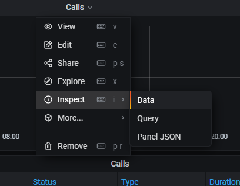





## Übersicht

Seit der pascom Version 18.05 steht mit Grafana ein umfangreiches Rufauswertungs-Tool zur Verfügung. Damit können der Live-Status von verfügbaren Agenten in Teams, aktive Anrufe, Rufstatistiken und Informationen über Anrufverläufe ausgelesen werden.

Die Rufstatistik ist in der pascom Weboberfläche unter  >  zu finden. 

{}
Das Rufauswertungs-Tool Grafana bietet keine Sprachauswahl-Möglichkeiten und kann daher nur English dargestellt werden.
{}

## Dashboards

Die Rufstatistik umfasst standardmäßig 3 Auswertungs-Ansichten oder Dashboards genannt.

+ [**Live**](#live): Im Live-Dashboard ist der aktuelle Status der Telefonanlage zu sehen: aktive Gespräche, Anrufer in den Warteschlagen, Teams und deren Agenten.
+ [**Overview**](#overview): Im Overview-Dashboard erhält man eine Übersicht über alle im ausgewählten Zeitraum geführten Gespräche, sowie eine ausführliche Rufauswertung.
+ [**Teams**](#teams): Im Teams-Dashboard findet man Auswertungen zu allen Warteschlangen/Teams, die durchschnittliche Wartezeit von Anrufern, sowie die durchschnittliche Gesprächsdauer bei eingehenden Anrufen.

### Live

Das Live-Dashboard aktualisiert sich automatisch und zeigt alle Gespräche auf der Telefonanlage an, unabhängig davon, ob diese derzeit aktiv geführt, gehalten, verbunden, oder in einer Warteschlange geparkt sind. Alle Warteschlangen/ Teams werden ebenfalls automatisch angezeigt und aktualisiert, falls weitere Teams auf der pascom Anlage angelegt werden oder Agenten der Teams bearbeitet werden.

**Echtzeit-Rufauswertung (oben)**       
Hier werden in Echtzeit alle Anrufe angezeigt, die derzeit über pascom geführt werden. Es werden ein- und ausgehende Anrufe, sowie interne Rufe angezeigt.

**Alle Teams/ Warteschlangen (darunter)**        
Unter der Echtzeit-Rufanzeige werden automatisch alle auf der pascom vorhandenen Teams/ Warteschlangen angezeigt.
Links sind jeweils alle Agenten des Teams mit Telefon-Status und Team-Status, sowie Pausengründen zu sehen.
Rechts werden alle wartenden Anrufer in der Warteschlange angezeigt. Die Hintergrund-Farbe der Anrufer gibt Auskunft über die Wartedauer des Anrufers:      
*grün*: Der Anrufer wartet < 10 Sekunden        
*gelb*: Der Anrufer wartet >= 10 Sekunden       
*rot*: Der Anrufer wartet seit >= 20 Sekunden

### Overview

Das Overview-Dashboard zeigt eine Übersicht aller geführten Gespräche, Statistiken über die Art der Gespräche, verwendeter Labels und eine ausführliche Rufauswertung.

**Anruf-Übersicht (Werte)**     
In der Anruf-Übersicht sind alle aktuellen Werte zum ausgewählten Zeitraum dargestellt.   

- *Calls total (grün)*: Gesamt-Anzahl aller Telefonate      
- *Calls duration (grün)*: Gesamt-Dauer aller Telefonate        
- *Inbound calls total (gelb)*: Gesamt-Anzahl aller eingegangenen Anrufe        
- *Inbound calls duration (gelb)*: Gesamt-Dauer aller eingegangenen Anrufe     
- *Outbound calls total (blau)*: Gesamt-Anzahl aller ausgegangenen Anrufe       
- *Outbound calls duration (blau)*: Gesamt-Dauer aller ausgegangenen Anrufe     
- *Internal calls total (violett)*: Gesamt-Anzahl aller internen Telefonate         
- *Internal calls duration (violett)*: Gesamt-Dauer aller internen Telefonate

**Anruf-Übersicht (Diagramme)**     
Das Torten-Diagramm links zeigt mit welchem Status alle Telefonate beendet wurden.     

- *hangup*: Anruf wurde aufgelegt       
- *transfer*: Anruf wurde weitergeleitet        
- *noanswer*: Anruf wurde nicht entgegen genommen

Das Säulen-Diagramm mittig zeigt an welche Art von Telefonaten zu welchem Zeitpunkt des ausgewählten Zeitraums geführt wurden.      

- *inbound*: Eingehende Anrufe      
- *outbound*: Ausgehende Anrufe     
- *internal*: Interne Telefonate

**Label-Übersicht**     
Das Torten-Diagramm rechts zeigt welche Labels im gewählten Zeitraum gesetzt wurden.

#### Auswertungs-Zeitraum setzen

Standardmäßig wird im Overview-Dashboard der aktuelle Tag "*Today*" ausgewertet.
Wenn Sie einen bestimmten Tag oder Zeitraum angezeigt bekommen möchten, klicken Sie im Aktionsmenü rechts oben auf das Uhr-Symbol um den gewünschten Zeitraum einzustellen.

#### Filter verwenden 

Wenn Sie die Auswertungen und Statistiken im Overview-Dashboard detaillierter anzeigen möchten, bieten sich hierfür diverse Filter an. 

|Filter|Beschreibung|Default|
|---|---|---|
|**User**|Hier können Sie die Anzeige auf einen oder mehrere bestimmte User einschränken.|All|
|**Label**|Hier können Sie die Anzeige auf ein oder mehrere Label einschränken.|All|
|**From Name**|Hier können Sie nach dem Namen des Anrufers filtern.|*-*|
|**From Number**|Hier können Sie nach der Rufnummer des Anrufers filtern.|*-*|
|**To Name**|Hier können Sie nach dem Namen des Anruf-Empfängers filtern.|*-*|
|**To Number**|Hier können Sie nach der Rufnummer des Anruf-Empfängers filtern.|*-*|

#### detaillierte Rufauswertung

Die detaillierte Rufauswertung (*Calls*) gibt eine ausführliche Übersicht auf alle geführten Gespräche im ausgewählten Zeitraum. 

|Wert|Beschreibung|
|---|---|
|**Time**|Zeitpunkt des Anrufs.|
|**From Number**|Rufnummer des Anrufers.|
|**From Name**|Name des Anrufers, sofern vorhanden (siehe Telefonbuch).|
|**To Number**|Rufnummer des Anruf-Empfängers.|
|**To Name**|Name des Anruf-Empfängers, sofern vorhanden (siehe Telefonbuch).|
|**Status**|Anruf-Status:  + hangup: Anruf wurde durch Auflegen beendet + transfer: Anruf wurde weitergeleitet + noanswer: Anruf wurde nicht entgegen genommen|
|**Type**|Art des Anrufs:  + internal: Interner Anruf + inbound: Eingehender Anruf + outbound: Ausgehender Anruf|
|**Duration**|Gesamte Dauer des Anrufs.|
|**Ringing time**|Dauer bis der Anruf entgegen genommen wurde.|
|**Talk time (incl. Hold)**|Gesprächsdauer des Anrufs (inklusive "Halten").|
|**Hold time**|Dauer, die der Anruf gehalten wurde.|
|**Chain**|Verlinkt zu einer Übersicht des genauen Anrufverlaufs, ähnlich der Anruf-Details im pascom Client.|

**Anruf-Details (*Chain*):**

|Wert|Beschreibung|
|---|---|
|**Id**|ID des Anruf-Vorgangs.|
|**Time**|Zeitpunkt des Anruf-Vorgangs.|
|**Parent**|ID des vorausgegangengen Anruf-Vorgangs.|
|**In Prefix**|Prefix-Ziffer, die bei eingehenden Telefonanrufen vorangestellt wurde.|
|**From Number**|Rufnummer des Anrufers.|
|**From Name**|Name des Anrufers, sofern vorhanden (siehe Telefonbuch).|
|**Out Prefix**|Prefix-Ziffer, die bei ausgehenden Telefonanrufen vorangestellt wurde.|
|**To Number**|Rufnummer des Anruf-Empfängers.|
|**To Name**|Name des Anruf-Empfängers, sofern vorhanden (siehe Telefonbuch).|
|**Duration**|Gesamte Dauer des Anruf-Vorgangs.|
|**Talk time (incl. Hold)**|Gesprächsdauer des Anruf-Vorgangs (inklusive "Halten").|
|**Hold time**|Dauer, die der Anruf-Vorgang gehalten wurde.|
|**Result**|Ergebnis des Anruf-Vorgangs:  + hangup: Gespräch wurde durch Auflegen beendet + transfer: Gespräch wurde weitergeleitet + noanswer: Gespräch wurde nicht entgegen genommen|
|**Result details**|Details zum Ergebnis:  + caller: Anrufer + elsewhere: andere Nebenstelle hat den Anruf übernommen + abandon: Gespräch wurde abgelehnt + dst: andere Nebenstelle wurde gewählt + voicemail: Anrufbeantworter wurde besprochen.|
|**Via**|Herkunft des Anruf-Vorgangs:  + queue: Team/ Warteschlange + transfer: Gespräch wurde weitergeleitet|
|**Via details**|Initiator des Anruf-Vorgangs:  + caller: Anrufer + agent: Team-Mitglied/ Agent + dst: andere Nebenstelle + action: Aktionsbedingung|
|**Recording**|Mitschnitt des Anruf-Vorgangs.|
|**Labels**|Gesetzte Label zum Anruf-Vorgang.|

### Teams

Das Team-Dashboard bietet eine Übersicht aller eingehenden Anrufe auf Warteschlangen/ Teams, Auswertungen zur durchschnittlichen Wartezeit und Gesprächsdauer, sowie eine Vielzahl an Filtermöglichkeiten zu bestimmten Warteschlangen und/oder Agenten.

{}
Im Team-Dashboard werden nur eingehende Anrufe dargestellt, da ein Team als ganzes keinen ausgehenden Anruf starten kann. Um ausgehende Anrufe einzelner Benutzer/ Agenten auszuwerten bitte das Overview-Dashboard verwenden.
{}

**Anruf-Auswertung**        
In der Anruf-Auswertung werden detaillierte Angaben zu allen eingegangenen Team-Anrufe im ausgewählten Zeitraum angezeigt.

- *Calls total*: Gesamt-Anzahl aller eingegangenen Team-Anrufe
- *Total duration*: Gesamte Wartezeit aller eingegangenen Team-Anrufe
- *Total Talking time*: Gesamte Gesprächsdauer aller eingegangenen Team-Anrufe
- *AHT (Average Handle time)*: Durchschnittliche Gesprächsdauer aller eingegangenen Team-Anrufe
- *ASA (Average Speed of Answer)*: Durchschnittliche Wartezeit aller eingegangenen Team-Anrufe

**Status-Übersicht**        
In der Status-Übersicht wird in Form eines Torten-Diagramms dargestellt, mit welchem Status alle eingegangenen Team-Anrufe beendet wurden.

- *noanswer*: Anruf wurde nicht entgegen genommen
- *transfer*: Anruf wurde weitergeleitet
- *hangup*: Anruf wurde aufgelegt

**Auswertung: angenommene Anrufe**      
In dieser Auswertung sehen Sie eine Liste aller Team-Agenten, die bisher Anrufe entgegen genommen haben mit der genauen Anzahl der entgegen genommenen Anrufe.

**Auswertung: gesamte Gesprächsdauer**      
In dieser Auswertung sehen Sie eine Liste aller Team-Agenten, die bisher Anrufe entgegen genommen ahben mit der gesamten Gesprächsdauer der entgegen genommenen Anrufe.

**verwendete Labels**       
In dieser Auswertung sehen Sie eine Liste aller Labels, die bei eingehenden Team-Anrufen gesetzt wurden, mit der genauen Anzahl, wie oft die Labels gesetzt wurden.

#### Auswertungs-Zeitraum setzen

Standardmäßig wird im Team-Dashboard der aktuelle Tag "*Today*" ausgewertet.
Wenn Sie einen bestimmten Tag oder Zeitraum angezeigt bekommen möchten, klicken Sie im Aktionsmenü rechts oben auf das Uhr-Symbol um den gewünschten Zeitraum einzustellen.

#### Filter verwenden 

Wenn Sie die Auswertungen und Statistiken im Team-Dashboard detaillierter anzeigen möchten, bieten sich hierfür diverse Filter an. 

|Filter|Beschreibung|Default|
|---|---|---|
|**Team**|Hier können Sie die Anzeige auf ein oder mehrere Teams/ Warteschlangen einschränken.|All|
|**User**|Hier können Sie die Anzeige auf einen oder mehrere bestimmte User/ Agenten einschränken.|All|
|**Label**|Hier können Sie die Anzeige auf ein oder mehrere Label einschränken.|All|
|**From Name**|Hier können Sie nach dem Namen des Anrufers filtern.|*-*|
|**From Number**|Hier können Sie nach der Rufnummer des Anrufers filtern.|*-*|

#### detaillierte Rufauswertung

Die detaillierte Rufauswertung (*Calls*) gibt eine ausführliche Übersicht auf alle eingegangenen Team-Anrufe im ausgewählten Zeitraum. 

|Wert|Beschreibung|
|---|---|
|**Time**|Zeitpunkt des Anrufs.|
|**From Number**|Rufnummer des Anrufers.|
|**From Name**|Name des Anrufers, sofern vorhanden (siehe Telefonbuch).|
|**Status**|Anruf-Status:  + hangup: Anruf wurde durch Auflegen beendet + transfer: Anruf wurde weitergeleitet + noanswer: Anruf wurde nicht entgegen genommen|
|**Queue**|Angerufene Warteschlange/ Team.| 
|**Agent**|Benutzer/ Agent, der den Anruf entgegen genommen hat.|
|**Duration**|Gesamte Dauer des Anrufs.|
|**Music on Hold**|Dauer bis der Anruf erfolgreich zum Team/ Warteschlange durchgestellt wurde.|
|**Agent Ringing time**|Dauer der Anrufsignalisierung (klingeln) beim Agenten.|
|**Talk time (incl. Hold)**|Gesprächsdauer des Anrufs (inklusive "Halten").|
|**Hold time**|Dauer, die der Anruf gehalten wurde.|
|**Chain**|Verlinkt zu einer Übersicht des genauen Anrufverlaufs, ähnlich der Anruf-Details im pascom Client.|

**Anruf-Details (*Chain*):**

|Wert|Beschreibung|
|---|---|
|**Id**|ID des Anruf-Vorgangs.|
|**Time**|Zeitpunkt des Anruf-Vorgangs.|
|**Parent**|ID des vorausgegangengen Anruf-Vorgangs.|
|**In Prefix**|Prefix-Ziffer, die bei eingehenden Telefonanrufen vorangestellt wurde.|
|**From Number**|Rufnummer des Anrufers.|
|**From Name**|Name des Anrufers, sofern vorhanden (siehe Telefonbuch).|
|**Out Prefix**|Prefix-Ziffer, die bei ausgehenden Telefonanrufen vorangestellt wurde.|
|**To Number**|Rufnummer des Anruf-Empfängers.|
|**To Name**|Name des Anruf-Empfängers, sofern vorhanden (siehe Telefonbuch).|
|**Duration**|Gesamte Dauer des Anruf-Vorgangs.|
|**Talk time (incl. Hold)**|Gesprächsdauer des Anruf-Vorgangs (inklusive "Halten").|
|**Hold time**|Dauer, die der Anruf-Vorgang gehalten wurde.|
|**Result**|Ergebnis des Anruf-Vorgangs:  + hangup: Gespräch wurde durch Auflegen beendet + transfer: Gespräch wurde weitergeleitet + noanswer: Gespräch wurde nicht entgegen genommen|
|**Result details**|Details zum Ergebnis:  + caller: Anrufer + elsewhere: andere Nebenstelle hat den Anruf entgegen genommen + abandon: Gespräch wurde abgelehnt/abgebrochen + dst: andere Nebenstelle wurde gewählt + voicemail: Anrufbeantworter wurde besprochen.|
|**Via**|Herkunft des Anruf-Vorgangs:  + queue: Team/ Warteschlange + transfer: Gespräch wurde weitergeleitet|
|**Via details**|Initiator des Anruf-Vorgangs:  + caller: Anrufer + agent: Team-Mitglied/ Agent + dst: andere Nebenstelle + action: Aktionsbedingung|
|**Recording**|Mitschnitt des Anruf-Vorgangs.|
|**Labels**|Gesetzte Label zum Anruf-Vorgang.|

## Weitere Funktionen

Das Rufauswertungs-Tool Grafana bietet noch viele weitere Einstellungs- und Auswertungsmöglichkeiten.

### Eigenes Dashboard erstellen/ bearbeiten

Im Rufauswertungs-Tool gibt es standardmäßig 3 Standard-Dashboards (Live, Overview, Team), die nicht verändert werden können. Es besteht jedoch die Möglichkeit einzelne Auswertungen/ Statistiken zu bearbeiten und in einem eigenen Dashboard abzuspeichern.

#### Neues Dashboard erstellen

**Neues Dashboard aus bestehendem Dashboard erstellen**

Wählen Sie ein beliebiges Dashboard aus, dass Sie gerne kopieren bzw. als Vorlage für Ihr neues Dashboard verwenden möchten. 

Klicken Sie im Aktionsmenü rechts oben auf das Einstellungsmenü um in das Konfigurationsmenü des Dashboards zu gelangen.
Passen Sie die Konfigurationen wie für Ihr neues Dashboard gewünscht an und klicken Sie links im Menü auf  um das neue Dashboard zu speichern.
Ihr neu erstelltes Dashboard öffnet sich automatisch und steht zukünftig zur Verfügung.

**Neues Dashboard aus Konfigurations-Code (*JSON*), URL oder ID erstellen**

Wenn Sie ein Dashboard oder eine Auswertung bearbeitet haben und einen [Konfigurations-Code (*JSON*)](#dashboards-und-auswertungen-exportieren), einen Link oder eine Dashboard-ID zur Hand haben, können Sie daraus ein bereits vollständig konfiguriertes Dashboard erstellen.

Klicken Sie in der linken Menüleiste auf das Plus-Symbol und wählen Sie  aus, um ein neues Dashboard anhand einer bestehenden Konfiguration zu erstellen.

+ Wenn Sie einen Link oder eine ID zur Hand haben fügen Sie diese im ersten Feld bei  ein.
oder:
+ Wenn Sie einen Konfigurations-Code (*JSON*) zur Hand haben fügen Sie diesen im zweiten Feld bei  ein. Alternativ können Sie den Konfigurations-Code auch als JSON-Datei über den Button  hochladen.

Jetzt ist es notwendig dem neuen Dashboard eine Bezeichnung zu geben, sodass das neue Dashboard eindeutig zugeordnet werden kann.

|Einstellung|Beschreibung|
|---|---|
|**Name**|Eindeutige Bezeichnung des neuen Dashboards.|
|**Folder**|Ablage-Ordner des Dashboards.|
|**Unique identifier (uid)**|Eindeutige ID des neuen Dashboards. *Default: auto-generated*|

Bestätigen Sie die Einstellungen mit einem Klick auf . Ihr neu erstelltes Dashboard öffnet sich automatisch und steht zukünftig zur Verfügung.

**Neues Dashboard mit neuen Auswertungen erstellen**

Klicken Sie in der linken Menüleiste auf das Plus-Symbol und wählen Sie  aus, um ein neues Dashboard zu erstellen.

Wählen Sie unter  die Diagramm-Form (*Panel*) aus, die Sie zu Ihrem neuen Dashboard hinzufügen möchten.

+ Graph
+ Singlestat
+ Table
+ Text
+ Heatmap
+ Alert List
+ Dashboard List
+ Row
+ Pie Chart
+ Plugin List

Welche Diagramm-Form (*Panel*) wofür geeignet ist und wie Sie diese korrekt einrichten finden Sie in der [Grafana-Dokumtentation](http://docs.grafana.org/features/panels).

Sobald Sie die gewünschten Auswertungen Ihrem neuen Dashboard hinzugefügt haben, können Sie die Änderungen mit einem Klick auf das Speichern-Symbol im Aktionsmenü rechts oben speichern. 

Jetzt ist es notwendig dem neuen Dashboard eine Bezeichnung zu geben, sodass das neue Dashboard eindeutig zugeordnet werden kann.

|Einstellung|Beschreibung|
|---|---|
|**Name**|Eindeutige Bezeichnung des neuen Dashboards.|
|**Folder**|Ablage-Ordner des Dashboards. |

Bestätigen Sie die Einstellungen mit einem Klick auf . Ihr neu erstelltes Dashboard öffnet sich automatisch und steht zukünftig zur Verfügung.

#### Dashboards bearbeiten

Sie können eigene Dashboards nach belieben bearbeiten, bestehende Auswertungen/ Statistiken hinzufügen, kopieren, bearbeiten und löschen.

Klicken Sie die Bezeichnung einer beliebigen Auswertung/ Statistik in einem bestehenden Dashboard an, um eine erweiterte Aktions-Auswahl zu erhalten. Wählen Sie die Aktion  aus.

Jetzt können Sie die Auswertung an Ihre Bedürfnisse anpassen: 

+ **Filter**: Filter bearbeiten (je nach zuvor gewähltem Standard-Dashboard)
+ **General**: Bezeichnung (*Titel*) und Beschreibung (*Description*) verändern 
+ **Metrics**: SQL-Abfrage direkt bearbeiten
+ **Options**: Darstellungs-Optionen bearbeiten (Farben (*Coloring*), Werte (*Value*), Beschriftung (*Gauge*), u. v. m.)
+ **Value Mappings**: Standard-Werte und Formatierung bearbeiten
+ **Time range**: Auswertungszeitraum bearbeiten

Sobald die Auswertung fertig angepasst wurde, können Sie die Änderungen mit einem Klick auf das Speichern-Symbol im Aktionsmenü rechts oben speichern.

Handelt es sich bei dem bestehenden Dashboard um ein Standard-Dashboard (Live, Overview oder Team), erhalten Sie an dieser Stelle eine Fehlermeldung, dass ein Standard-Dashboard nicht verändert werden darf und die Änderungen nicht gespeichert werden können:

        Cannot save provisioned dashboard.

Stattdessen können Sie den angezeigten Konfigurations-Code (*JSON*) des Dashboards mit einem Klick auf  in die Zwischenablage speichern und anschließend mit einem Klick auf  und  die Bearbeitungs-Maske verlassen.

### Dashboards und Auswertungen exportieren

Das Rufauswertung-Tool bietet Ihnen die Möglichkeit bestimmte Auswertungen oder sogar ganze Dashboards zu exportieren.

**Dashboard exportieren**

Wenn Sie ein gesamtes Dashboard als JSON exportieren möchten, wählen Sie zuerst das gewünschte Dashboard aus und klicken dann im Aktionsmenü rechts oben auf das Teilen-Symbol. 

Wechseln Sie zu dem Reiter  um einzustellen, wie dieses Dashboard exportiert werden soll.

|Einstellung|Beschreibung|
|---|---|
|**Export for sharing externally**|Setzen Sie hier einen Haken, wenn Sie dieses Dashboard unabhängig von Ihrer Telefonanlage verwenden können möchten.|

Klicken Sie auf  um das Dashboard als JSON-Datei zu exportieren.
Klicken Sie auf  um den JSON-Konfigurationscode anzeigen zu lassen.

**Auswertung exportieren**

Es ist möglich jede einzelne Statistik des Rufauswertungs-Tools via CSV zu exportieren. 

Klicken Sie dazu die Bezeichnung einer beliebigen Auswertung/ Statistik in einem bestehenden Dashboard an, um eine erweiterte Aktions-Auswahl zu erhalten. Fahren Sie mit der Maus über die Aktion  und wählen Sie  aus. 

Anschließend öffnet sich ein Detail-Fenster in dem Sie Einstellungen, wie Datumsformat und Darstellung der Auswertung zu dem CSV angeben können.

Mit einem Klick auf  wird die CSV-Datei generiert.

### Dashboards teilen

#### Dashboard via Link teilen

Wenn Sie eine Live-Auswertungen mit jemandem teilen möchten, können Sie hierfür einen Link zu Ihrem Dashboard erstellen um dieses zu teilen. 

Der Link-Empfänger benötigt jedoch ebenfalls einen Zugang zum Rufauswertungs-Tool, daher ist es sinnvoll hierfür einen eigenen Benutzer anzulegen (z.b. Gast).

Wählen Sie das Dashboard aus, das Sie teilen möchten und klicken Sie im Aktionsmenü rechts oben auf das Teilen-Symbol. 

Im Reiter "Link" wird automatisch ein lokaler Link generiert, mit dem Sie das aktuelle Dashboard teilen können.

#### Snapshots teilen

Wenn Sie eine aktuelle Auswertung mit jemanden ohne Administrationszugriff teilen möchten, können Sie hierfür einen Snapshot erstellen. 

{}
Der Snapshot stellt immer nur die Auswertung zum Zeitpunkt beim Erstellen des Snapshots dar und aktualisiert sich niemals automatisch mit aktuellen Daten. Mit einem Snapshot ist keine Live-Ansicht möglich.
{}

Wählen Sie das Dashboard aus, das Sie teilen möchten und klicken Sie im Aktionsmenü rechts oben auf das Teilen-Symbol. 

Wechseln Sie zu dem Reiter  um einzustellen, wie lange der Snapshot verfügbar sein soll.

|Einstellung|Beschreibung|
|---|---|
|**Snapshot name**|Bezeichnung des Snapshots|
|**Expire**|Dauer der Verfügbarkeit es Snapshots. *Default: Never*|
|**Timeout (seconds)**|Timeout in Sekunden, wie lange versucht wird die Daten auszulesen.|

Mit einem Klick auf  wird ein lokaler Link generiert, der mit  in die Zwischenablage kopiert und geteilt werden kann.

## Benutzer anlegen

Um aktuelle Dashboards und Statistiken sehen zu können, ist es notwendig Zugangsdaten zur Rufstatistik zu haben.
Sofern Sie jemandem Zugang zu einem oder mehreren Dashboards geben möchten, ohne Adminrechte einzuräumen können Sie hierfür einen neuen Benutzer anlegen.

Klicken Sie dazu links in der Menüleiste auf das Menü-Icon und wählen Sie  aus.

Hier können Sie mit einem Klick auf  einen Benutzer mit Zugriff auf das Rufauswertungs-Tool anlegen.

Sobald der Benutzer mit einem Klick auf  erfolgreich angelegt wurde, kann dieser sich mit Username oder Email und dem vergebenen Passwort am Rufauswertungs-Tool anmelden, unter:        
https:// link-zum-pascom-server/instanz-name/analysis/

*Beispiel Login-Link:*

        https://pascom.cloud/pascom/analysis/

### Benutzerrechte vergeben

Nachdem ein Benutzer erfolgreich angelegt wurde können Sie in der User-Liste erneut auf den Benutzer klicken um weitere Einstellungen (z. B. Benutzerrollen) vorzunehmen.

Standardmäßig ist jeder neue Benutzer ein "Viewer" und darf Dashboards nur betrachten und teilen, jedoch nicht verändern.

Um die Benutzerrolle zu verändern, wählen Sie am Ende des Reiters  unter  zu dem Punkt "Main Org.Current" im Dropdown die gewünschte Rolle aus:

+ **Viewer**: Diese Benutzer dürfen Dashboards nur betrachten, jedoch nicht verändern.
+ **Editor**: Diese Benutzer dürfen eigene Dashboards bearbeiten und verändern. Standard-Dashboards (Live, Overview, Teams) können generell nicht verändert werden.
+ **Admin**: Diese Benutzer sind Administratoren und dürfen Änderungen am System vornehmen und Dashboards neu erstellen und löschen.

## FAQ

**Was passiert wenn ein Benutzer oder eine Warteschlange/ Team auf der Telefonanlage gelöscht wird?**

Werden Benutzer oder Warteschlangen/ Teams gelöscht, oder Agenten aus bestehenden Warteschlangen entfernt, bleiben die Rohdaten für die Auswertung vorhanden. 

Das bedeutet:

+ In der Live-Anzeige werden nicht mehr vorhandene Benutzer und Warteschlangen/ Teams nicht mehr angezeigt.
+ Gelöschte Benutzer und Warteschlangen/ Teams, sowie entfernte Agenten stehen in den Filtern nicht mehr zur Auswahl (*können jedoch manuell eingetippt werden*).
+ Gelöschte Benutzer und Warteschlangen/ Teams bleiben in der Rufauswertung vorhanden, sofern Sie im angezeigten Zeitraum noch exitstiert haben.

**Wie zeige ich an einem PC/ TV immer die aktuellen Live-Daten an?**

Für die Anzeige von Dashboards auf einem PC oder TV empfehlen wir einen eigenen [Benutzer anzulegen](#benutzer-anlegen). 
Dieser Benutzer sollte lediglich "Viewer"-Rechte besitzen, sodass keine Änderungen vorgenommen werden können.

Loggen Sie sich mit dem neuen Benutzer auf dem PC oder TV ein und öffnen Sie das gewünschte Dashboard zur Ansicht.

**Wie lasse ich Dashboards wie in einer Slideshow automatisch wechseln?**

Möchten Sie nicht ein bestimmtes Dashboard anzeigen lassen, sondern alle Dashboards automatisch rotierend darstellen, müssen Sie hierfür eine "Playlist" erstellen um zu definieren, welche Dashboards angezeigt werden sollen.

Wählen Sie hierfür in der Menüleiste links, im Dashboard-Menü  aus und erstellen Sie mit einem Klick auf  eine neue Playlist.
Jetzt können Sie der Playlist einen Namen geben und das Intervall in sec (Sekunden) oder m (Minuten) definieren, wie schnell die Dashboards wechseln sollen.

Unter  können Sie mit einem Klick auf  zur Liste der Dashboards hinzufügen, die in der Slideshow angezeigt werden sollen.

Natürlich können Sie unter  mit den Pfeiltasten die Reihenfolge der Dashboards anpassen.

Sobald Sie mit der Konfiguration zufrieden sind, klicken Sie auf  um die Playlist zu speichern.

Zurück in der Playlist-Liste können Sie die mit einem Klick auf  die Dashboards als Slideshow im gewünschten Modus anzeigen lassen:

+ **In Normal mode**: Normale Ansicht der Dashboards inklusive Filterleiste
+ **In TV mode**: Dashboard-Inhalte werden nur mit Namen des Dashboards als Überschrift dargestellt
+ **In Kiosk mode**: Es werden nur die Dashboard-Inhalte dargestellt