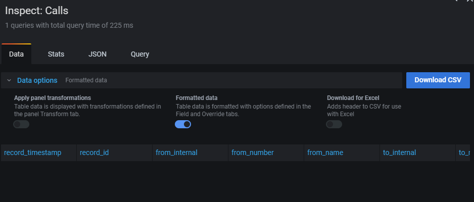





## Overview

From pascom phone system version 18.05 onwards, the integration of Grafana ensures that a comprehensive call analytics tool is now available. Through using this Analytics tool, it is possible to gain an instant live overview of the overall performance and status of your available agents, teams, active calls, call statistics plus information concerning call flows.

The call analytics tool can be found in the pascom web UI under  > . 

{}
The call analytics tool from Grafana offers does not offer any language selection options and is therefore only available in English.
{}

## Dashboards

Per default, the call analytics tool consist of 3 evaluation views (otherwise known as dashboards or wallboards).

+ [**Live**](#live): With the live dashboard, the current status of your phone system can be viewed: active calls, callers waiting in a queue, teams and associated agents.
+ [**Overview**](#overview): Using the Overview dashboard will provide you with an overview of all calls processed within a specified timeframe including a detailed evaluation.
+ [**Teams**](#teams): The Teams dashboard delivers an analysis of all Queues / Teams including the average caller wait times as well as average call duration of inbound calls.

### Live

The Live dashboard refreshes itself automatically and displays all phone system calls, regardless of whether these calls are currently active, on hold, connected or parked in a call queue. All queues / teams are also automatically displayed and updated, should further teams be added to the pascom phone system or the team agents be editied. 

**Real-time Analytics (above)**       
Real-time display of all calls, which are currently being handled on your pascom phone system. Both in- and outbound calls are displayed, plus all internal calls.

**All Teams/ Queues (below)**        
Under the real-time call display, all existing teams / queues from your pascom system will be automatically displayed.
On the left, all team agents plus their telephone and team status as well as pause reasons are displayed.
On the right, all calls to the team / queue are displayed. The background colour provides information according to the caller waiting time:    
*green*: caller wait time < 10 seconds          
*yellow*: caller wait time >= 10 seconds         
*red*: caller wait time seit >= 20 seconds  

### Overview

The Overview dashboard displays an overview of all ongoing calls, statistics regarding the type of call, attached labels plus a detailed call evaluation.

**Calls Overview (Values)**     
In the calls overview section, the call analytics from the selected time frame are displayed.   

- *Calls total (green)*: total number of all calls  
- *Calls duration (green)*: total duration of all calls  
- *Inbound calls total (yellow)*: total number of inbound calls  
- *Inbound calls duration (yellow)*: total duration of incoming calls  
- *Outbound calls total (blue)*: total number of outbound calls  
- *Outbound calls duration (blue)*: total duration of outbound calls  
- *Internal calls total (violet)*: total number of internal calls  
- *Internal calls duration (violet)*: total duration of internal calls  

**Calls Overview (Graphs)**     
The pie chart on the left displays the an overview of the call end status.     

- *hangup*: the call ended with a hangup  
- *transfer*: the call was forwarded  
- *noanswer*: the call was not answered  

The bar chart in the middle displays which type of calls were conducted at which time during the selected time frame. 

- *inbound*: Inbound calls  
- *outbound*: Outbound calls       
- *internal*: Internal calls  

**Labels Overview**     
The pie chart on the right displays a representation of which labels were set during the selected time period.

#### Analysis Time Frame 

Per default, the Overview dashboard the current day "*Today*" is analysed.
Should you wish to view a specific day or time frame, click on the clock symbol in the top right corner in order to enter the desired time frame.

#### Using Filters

Should you want to see a more detailed view of the analysis and statistics contained in the Overview dashboard, the following filters are available for this purposes. 

|Filter|Description|Default|
|---|---|---|
|**User**|Here it is possible to restrict the display to one or more specified users.|All|
|**Label**|Here it is possible to restrict the display to one or more labels.|All|
|**From Name**|Here it is possible to filter for caller names.|*-*|
|**From Number**|Here it is possible to filter for caller phone numbers.|*-*|
|**To Name**|Here it is possible to filter by call recipient / agent names.|*-*|
|**To Number**|Here it is possible to filter by the call recipient / agent phone numbers.|*-*|

#### In Depth Analysis

The detailed analysis (*Calls*) provides a comprehensive overview of all calls handled within a desired time frame. 

|Value|Description|
|---|---|
|**Time**|Time of call.|
|**From Number**|Caller phone number.|
|**From Name**|Caller name, as long as it is available (see phonebook).|
|**To Number**|Recipient phone number.|
|**To Name**|Recipient name, as long as it is available (see phonebook).|
|**Status**|Call status:  + hangup: call ended by hangup + transfer: call was forwarded + noanswer: call was not answered.|
|**Type**|Type of call:  + internal: internal call + inbound: incoming call + outbound: outgoing call|
|**Duration**|Total duration of the call.|
|**Ringing time**|Time taken to answer the call.|
|**Talk time (incl. Hold)**|Total talk time of the call (including "Hold").|
|**Hold time**|Total time, that the call was held.|
|**Chain**|Links to a more detailed overview of the call flow, similar to the call details available in the pascom client.|

**Call Details (*Chain*):**

|Value|Description|
|---|---|
|**Id**|ID the call process.|
|**Time**|Time of the call process.|
|**Parent**|ID of the parent call process.|
|**In Prefix**|Prefix code, which is attached to inbound calls.|
|**From Number**|Caller phone number.|
|**From Name**|Caller name, as long as it is available (see phonebook).|
|**Out Prefix**|Prefix code, which is attached to outbound calls.|
|**To Number**|Call recipient phone number.|
|**To Name**|Call recipient name, as long as it is available (see phonebook).|
|**Duration**|Total duration of the call process.|
|**Talk time (incl. Hold)**|Total talk time of call process (including "Hold".|
|**Hold time**|Total time that the call process was on hold.|
|**Result**|Result of the call process:  + hangup: call ended by hangup + transfer: call was forwarded + noanswer: call was not answered.|
|**Result details**|Details of the results:  + caller: caller + elsewhere: a different extension picked up / answered the call + abandon: Call was rejected / dropped + dst: another extension was dialled + voicemail: voicemail answering machine was called up.|
|**Via**|Origin of the call process:  + queue: Team/ Queue + transfer: call was forwarded|
|**Via details**|Initiator of the call process:  + caller: caller + agent: Team member / Agent + dst: another extension + action: action conditions|
|**Recording**|Recording of the call process.|
|**Labels**|Label(s) attached to the call process.|

### Teams

The Team dashboard provides an overview of all inbound calls to a team / queue, analysis of the average wait times and call duration as well as a number of filter options for specific queues and / or agents.

{}
Within the Team dashboard, only inbound calls are displayed as a team as a whole cannot start an outbound call. In order to analyse outbound calls of individual users / agents, please use the Overview dashboard.
{}

**Call Statistics / Analytics**        
The call analytics section provides a detailed information overview of all inbound team calls during the selected time frame.

- *Calls total*: total number of all inbound team calls  
- *Total duration*: total wait time of all inbound team calls 
- *Total Talking time*: total call duration of all inbound team calls 
- *AHT (Average Handle time)*: Average call duration of all inbound team calls 
- *ASA (Average Speed of Answer)*: Average waiting time of all inbound team calls 

**Status Overview**        
The overview of call statuses is displayed as a pie chart and shows how all inbound calls to the team during the time period ended.

- *noanswer*: call was not answered
- *transfer*: call was transferred / forwarded
- *hangup*: call ended with a hangup

**Analytics: Taken Calls**      
Displays a list of all team agents and then number of inbound calls they have answered during the selected time period.

**Analytics: Total Call Duration**      
This analysis displays a list of all team agents and their total talk time for the inbound calls they have answered. Agents who have not answered a call will not appear.

**Attached Labels**       
This analysis displays a list of all the labels attached to inbound team calls including a counter signifying the exact number of teams the label was attached.

#### Analysis Time Frame

Per default, the Team dashboard the current day "*Today*" is analysed.
Should you wish to view a specific day or time frame, click on the clock symbol in the top right corner in order to enter the desired time frame.

#### Using Filters

Should you want to see a more detailed view of the analysis and statistics contained in the Team dashboard, the following filters are available for this purposes. 

|Filter|Description|Default|
|---|---|---|
|**Team**|Here it is possible to restrict the display to one or more specified teams / queues.|All|
|**User**|Here it is possible to restrict the display to one or more specified users.|All|
|**Label**|Here it is possible to restrict the display to one or more labels.|All|
|**From Name**|Here it is possible to filter for caller names.|*-*|
|**From Number**|Here it is possible to filter for caller phone numbers.|*-*|

#### In Depth Analysis

The detailed analysis (*Calls*) provides a comprehensive overview of all inbound team calls within a desired time frame. 

|Value|Description|
|---|---|
|**Time**|Time of call.|
|**From Number**|Caller phone number.|
|**From Name**|Caller name, as long as it is available (see phonebook).|
|**Status**|Call status:  + hangup: call ended by hangup + transfer: call was forwarded + noanswer: call was not answered.|
|**Queue**|Called queue / team.| 
|**Agent**|User / Agent that answered the call.|
|**Duration**|Total duration of the call.|
|**Music on Hold**|The time before the call was successfully routed on to a team or queue.|
|**Agent Ringing Time**|The call signaling time length (ringing) on agent endpoints.|
|**Talk time (incl. Hold)**|Total talk time of the call (including "Hold").|
|**Hold time**|Total time, that the call was held.|
|**Chain**|Links to a more detailed overview of the call flow, similar to the call details available in the pascom client.|

**Call Details (*Chain*):**

|Value|Description|
|---|---|
|**Id**|ID the call process.|
|**Time**|Time of the call process.|
|**Parent**|ID of the parent call process.|
|**In Prefix**|Prefix code, which is attached to inbound calls.|
|**From Number**|Caller phone number.|
|**From Name**|Caller name, as long as it is available (see phonebook).|
|**Out Prefix**|Prefix code, which is attached to outbound calls.|
|**To Number**|Call recipient phone number.|
|**To Name**|Call recipient name, as long as it is available (see phonebook).|
|**Duration**|Total duration of the call process.|
|**Talk time (incl. Hold)**|Total talk time of call process (including "Hold".|
|**Hold time**|Total time that the call process was on hold.|
|**Result**|Result of the call process:  + hangup: call ended by hangup + transfer: call was forwarded + noanswer: call was not answered.|
|**Result details**|Details of the results:  + caller: caller + elsewhere: a different extension picked up / answered the call + abandon: Call was rejected / dropped + dst: another extension was dialled + voicemail: voicemail answering machine was called up.|
|**Via**|Origin of the call process:  + queue: Team/ Queue + transfer: call was forwarded|
|**Via details**|Initiator of the call process:  + caller: caller + agent: Team member / Agent + dst: another extension + action: action conditions|
|**Recording**|Recording of the call process.|
|**Labels**|Label(s) attached to the call process.|

## Further Functions

The Grafana call analytics tools offers a number of additional settings and analysis options.

### Create / Edit Custom Dashboards

The call analytics tool consists of 3 standard dashboards (Live, Overview, Team), which cannot be modified. However, it is possible to edit individual analyses / statistics and save them to a custom dashboard.

#### Create New Custom Dashboards

**Create a new dashboard from an existing dashboard** 

Select the dashboard that you would like to copy or use as a template for your new dashboard.

In the actions menu in the top right, click on the settings icon to go to the configurations setting of the dashboard. Modify the configuration settings according to the requirements of your new dashboard and click the  button on the left in order to save your new dashboard.

Your newly created dashboard will open automatically and is now available for future use.

**Create a new dashboard using the configurations code (*JSON*), URL or ID**

Once you have edited a dashboard or an analysis and have the configurations code (*JSON*), a link or the dashboard ID to hand, then you can immediately create a fully configured dashboard.

In the lefthand menu list, click the plus symbol and select  in order to create a new dashboard using an existing configuration.

+ If you have a link or ID, paste it into the first field .
or:
+ If you have a configurations code (*JSON*), paste the code into the second field . Alternatively, you can also upload the configurations code as a JSON file using the  button.

Now it is necessary to enter a name for the new dashboard, so that the new dashboard can be appropriately assigned.

|Setting|Description|
|---|---|
|**Name**|Appropriate dashboard name.|
|**Folder**|Dashboard storage folder.|
|**Unique identifier (uid)**|Appropriate ID for the new dashboard. *Default: auto-generated*|

Confirm the settings and click . Your newly created dashboard will open automatically and is now available.

**Create a New Dashboard With a New Analysis**

In the lefthand menu list, click the plus symbol and select  in order to create a new dashboard from scratch.

Under , select the diagram format (*Panel*) which you would like to add to your new dashboard.

+ Graph
+ Singlestat
+ Table
+ Text
+ Heatmap
+ Alert List
+ Dashboard List
+ Row
+ Pie Chart
+ Plugin List

Which diagram format (*Panel*) is most suitable and how to correctly configure them can be found in the [Grafana Documentation](http://docs.grafana.org/features/panels).

Once you have added the desired analyses to your new dashboard, click on the save symbol in the top right to save your setup. 

Now it is neccessary to enter a name for the new dashboard, so that the new dashboard can be appropriately assigned.
 
|Setting|Description|
|---|---|
|**Name**|Appropriate dashboard name.|
|**Folder**|Dashboard storage folder.|
 
Confirm the settings and click . Your newly created dashboard will open automatically and is now available.

#### Edit Custom Dashboards

It is possible to edit your custom dashboards to exactly match your requirements, add / remove / copy / edit existing analytics / analyse. 

Click on the title of any Analysis / Statistic in an existing dashboard in order to open the advanced action options. Select the action .

Now you can modify the analyses according to your requirements: 

+ **Filter**: Edit filters (according the previously selected standard dashboard)
+ **General**: Update name (*Title*) and description 
+ **Metrics**: Directly edit SQL queries
+ **Options**: Edit display options (Coloring, Value, Text (*Gauge*), and much more.)
+ **Value Mappings**: Edit standard values and formats
+ **Time range**: Edit time frames

As soon as you have finished with modifying the analytics settings, you can save your changes by clicking the save symbol in the top right corner.

If the dashboard you have edited is an existing standard dashboard (Live, Overview or Team), you will receive an error message as standard dashboards cannot be modified and therefore the changes could not be saved:

        Cannot save provisioned dashboard.

Instead, you can copy the displayed dashboard configurations code (*JSON*) by clicking  and finally click  and  in order to leave the editing screen.

#### Exporting Dashboards And Analyses

The call analytics tool provides the option of exporting certain analyses and even complete dashboards.

**Export Dashboard**

Should you wish to export a whole dashboard as JSON, first select the desired dashboard and then click the share symbol in the lefthand menu list. 

Switch to the  tab in order to set how the dashboard should be exported.

|Setting|Description|
|---|---|
|**Export for sharing externally**|Check this box should you want to be able to use this dashboard independantly of your pascom phone system.|

Click  in order to export the dashboard as a JSON file.
Click  in order to display the JSON configurations code.

**Exporting Analyses**

It is possible to export individual call analytics statistics as a CSV file. 

To do so, click on the title of any Analysis / Statistic in an existing dashboard in order to open the advanced action options. Klick on the  action and select the  option. 

Finally, a details window will open in which you can define the CSV settings.

Click  and the CSV file will be generated.

### Sharing Dashboards

#### Sharing Dashboards via a Link

If you want to share a live analysis with someone, you can do so by creating and sharing a link to your dashboard. 

The link recipient will however require pascom analytics access credentials, making it advisable to add a new user (e.g. Guest). 

Simply select the dashboard you wish to share and from the actions menu click the share symbol in the top right.  

Within the "Link" tab, a local link will be automatically generated with which you can share the selected dashboard.

#### Sharing Snapshots

If you want to share a current analysis with someone without admin access, then you can create a snapshot. 

{}
The snapshot displays only the analysis data to the point of the snapshot and will not automatically update itself, meaning with a snapshot a live viewing is not possible.
{}

Select the dashboard that you wish to share and click the share symbol in the top right. 

Go to the  tab to configure how long the snapshot should be available for.

|Setting|Description|
|---|---|
|**Snapshot name**|enter a snapshot name|
|**Expire**|How long the snapshot should be available for. *Default: Never*|
|**Timeout (seconds)**|Timeout length in seconds for data reading attempts.|

Click  to generate a local link which can be copied using  and then shared.

## Add Users

In order to view the pascom analytics dashboards and statistics, you will need access to the pascom analytics tools.

As soon as you wish to provide someone with access to one or more dashboards without granting them admin rights, you can create a new user.  

Click on the left-hand menu on the settings icon and select the  option.

By clicking , you can add a new user with access to the pascom analytics tools.

As soon as the user has been successfully added by clicking the , they can login into the pascom analytics tool using their Username or e-mail address and entered password unter: 
        
https:// link-to-pascom-server/instance-name/analysis/

*Example Login Link:*

        https://pascom.cloud/pascom/analysis/

### Assign User Rights

Having successfully added a new user, it can now once again select the user from the list in order to configure additional user settings e.g. to assign user roles. 

Per default, each user is setup with "Viewer" rights and can view and share dashboards but not edit them.

In order to change a user's roles, scroll down under the  tab to the  settings and by the point "Main Org.Current" select the desired role from the dropdown menu:

+ **Viewer**: These users can view dashboards but not alter / edit them.
+ **Editor**: These users can edit and modify customer dashboards. Default dashboards (Live, Overview, Teams) cannot be altered as standard.
+ **Admin**: These users are administrators and are permitted to make changes to the system, add and remove dashboards.

## FAQ

**What happens if a user or queue / team is deleted from the phone system?**

Should a user or queue / team be deleted or agents are removed from an existing queue, the raw data will remain intact for analysis. 

That means: 

+ In the live view the no longer available users / queues / teams will no longer be displayed.
+ Deleted users / queues / teams and removed agents are no longer listed in fitlers (*can however be manually typed in*).
+ Deleted users / queues / teams remain in the existing analysis as long as they existed in the specified time frame.

**How Do I display the Real-Time Live Data on a PC / TV?**

In order to display a dashboard on a PC or TV in the form of a Contact Centre Wallboard for example, we recommend [adding a user](#add-users) for this purpose. 
This use should only be assigned "Viewer" rights in order to ensure that no alterations can be undertaken.

As this user, log into the PC or TV and open the desired Dashboard which should be displayed as a Wallboard.

**How Can I Automatically Switch Between Dashboards i.e. Slideshow?**

Should you wish to display more than one specific dashboard in the form of a slideshow that automatically loops between the dashboards, then you will need to create a "Playlist" in order to define which Dashboards should be displayed.

From the left-hand menu, select click the dashboards icon and select the  option and then click  to create a new playlist.
Now enter a name for the playlist and define the interval between dashboard changes in sec (seconds) or m (minutes) to set how often the viewed dashboard should switch.

Under  you will find a list of available dashboards. Select the dashboards which should be added to the slideshow via  button.

Once added to the slideshow, the dashboard names will appear under the  list. Using the arrow keys, it is possible to modify the display order of the dashboards.

When you are happy with your setup, click  in order to save your playlist.

Back in the Playlist overview menue, you can start the slideshow by selecting the desired mode from the  dropdowndie Dashboards als Slideshow im gewünschten Modus anzeigen lassen:

+ **In Normal mode**: Normal view of the dashboard including filter ribbon
+ **In TV mode**: Dashboard content is displayed with only the name of the dashboard as a title
+ **In Kiosk mode**: Only the dashboard content will be displayed