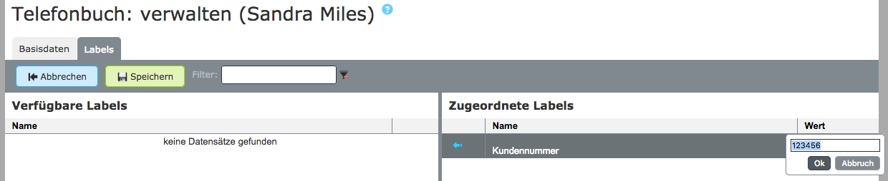
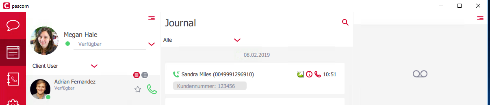

## Training Video

 

## Konzept

Auf pascom gibt es ein globales Telefonbuch, das jedem Benutzer zur Verfügung gestellt wird.
Dieses Telefonbuch wird im pascom Client und auch auf den unterstützten Telefonen angezeigt.

### Privates Telefonbuch (Desktop Client + Telefone)

Das globale Telefonbuch entspricht einem Firmentelefonbuch, auf das jeder Benutzer der pascom Telefonanlage Zugriff hat.
Auf das private Telefonbuch hat nur der Benutzer selbst Zugriff, sodass die Telefonbucheinträge aus dem privaten Telefonbuch nur im Client des jeweiligen Benutzers aufgelöst werden.

{}
Lediglich in der allgemeinen Rufauswertung der pascom WebUI werden auch private Telefonbucheinträge aufgelöst.
{}

### Telefonbuch-Eintrag

Alle Telefonbuch-Einträge sind in der pascom WebUI unter  >  zu finden.

Das einzige Pflichtfeld im Telefonbuch ist der Anzeigename, alle anderen Felder sind optional und müssen nicht gepflegt werden.

|Bezeichnung|Beschreibung|
|---|---|
|Anzeigename|Der Anzeigename wird am Telefondisplay und im Client bei ein- und ausgehenden Anrufen angezeigt|
|Telefon|Die geschäftliche Rufnummer der Kontakts|
|Vorname|Der Vorname des Kontakts|
|Nachname|Der Nachname des Kontakts|
|Organisation|Die Organisation oder Firma des Kontakts|
|Fax|Die Faxnummer des Kontakts|
|Email|Die Emailadresse des Kontakts|
|Handy|Die Mobilrufnummer des Kontakts|
|Telefon privat|Die private Rufnummer des Kontakts|
|Notizen|Feld für weitere Informationen und Notizen zu diesem Kontakt|

### Labels

An jeden Telefonbuch-Eintrag können Labels angehängt werden um direkt bei einem Anruf Informationen zu diesem Kontakt anzeigen zu können.
Ein Telefonbuch-Eintrag kann beliebig viele Labels angehängt bekommen, z.B. Kundennummer, VIP-Status u.v.m.

Um einem Kontakt ein Label zuweisen zu können, muss das zu verwendende Label zuerst angelegt werden.
Legen Sie hierzu unter  >  mit einem Klick auf  ein neues Label an.

Wählen Sie ein **Generisches Label** und geben Sie dem Label einen Namen z.B. "Kundennummer" und klicken Sie auf .

Wurden passende Labels bereits angelegt, können Sie dem gewählten Telefonbuch-Eintrag unter  die verfügbaren Labels mit einem Klick auf den Pfeil zuweisen und mit einem Doppelklick in der Spalte  die passende Information zum Label hinterlegen und mit  bestätigen. Z.B. 123456

Wenden Sie die Einstellungen an, um die Konfiguration zu übernehmen.

Bei einem Anruf von diesem Kontakt wird jetzt das zugewiesene Label inkl. hinterlegtem Wert im Client angezeigt.

{}
Ggf. ist es notwendig den XMPP-Dienst unter  >  neu zu starten, um alle mit der pascom verbundenen Clients neu zu starten und damit mit der Telefonanlage zu synchronisieren, damit alle konfigurierten Labels korrekt angezeigt werden.
{}

### Suchalgorithmus

Standardmäßig ist das pascom Telefonbuch nach dem Anzeigenamen sortiert.
Da das globale Telefonbuch auf den Telefonen via LDAP übertragen wird, ist ein Blättern im gesamten Telefonbuch nicht möglich, sondern eine Suche nach dem gewünschten Eintrag notwendig.

Die Suche filtert alle Einträge nach dem Vorkommen des eingetragenen Suchfilters, das bedeutet, dass bei der Suche nach einem einzelnen Buchstaben oder einer einzelnen Zahl nicht alle Einträge, die mit diesem Buchstaben bzw. dieser Zahl beginnen aufgelistet werden, sondern alle Einträge die diesen Buchstaben bzw. diese Zahl enthalten.

Wir empfehlen daher nach ganzen Namen und Nummern bzw. Teilen davon zu suchen um schneller den gewünschten Eintrag zu finden.

### Zusätzliche Einträge aus Outlook (ab v.2013), DATEV & Apple Kontakte.

Findet der pascom Desktop Client auf dem PC ein unterstütztes Telefonbuch, z.B. von Outlook, DATEV oder Apple Kontakte, können diese automatisch als Privates Telefonbuch dem Client hinzugefügt werden.
Wählen Sie dazu im pascom Desktop Client unter  >  aus.

Diese Einträge sind nicht auf den zugewiesenen Telefoniegeräten verfügbar und werden nur im Client aufgelöst.
