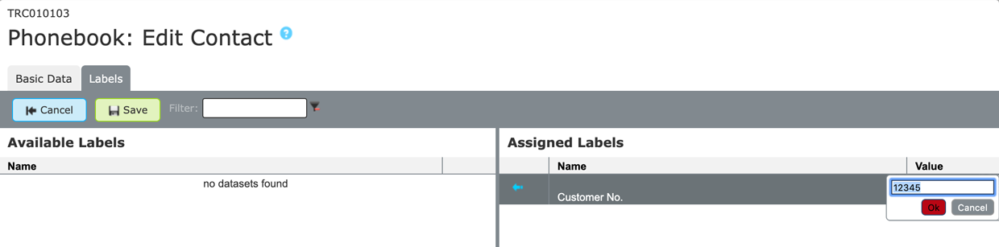
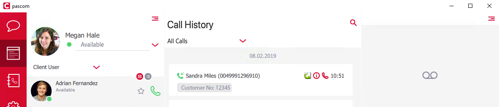

## Training Video



## Concept

pascom phone systems provide a global company telephone book which is available to all system users.

This telephone book is displayed within the pascom clients as well as on supported VoIP telephones.

### Private Telephone Book (Desktop Client + Telephone)

The global pascom telephone book refers to a company telephone book which is available to all your pascom phone system users. 
The provide telephone book is only accessible by the individual user account, meaning private telephone book entries are only visible within the client of the corresponding user. 

{}
Private telephone book entries are also included in the pascom Web UI call analysis. This is the only other point where they are visible. 
{}

### Telephone Book Entries

All telephone book entries can be found within the pascom Web UI under  > .

The only compulsory field within the telephone book is the contact's display name. All other fields are optional and must not be provided.

|Field|Description|
|---|---|
|Display name|Display names are displayed on telephone screens and within the client for inbound and outbound calls|
|Phone|Business phone number of the contact|
|First name|Contact first name|
|Last name|Contact last name|
|Organisation|Contact company or organisation|
|Fax|Contact fax number|
|E-mail|Contact e-mail address|
|Mobile Phone|Contact mobile phone number|
|Phone (private)|Contact private phone number|
|Notes|Field for further information and notes regarding this contact|

### Labels

Labels can be attached to all telephone book entries in order to be able to display additional contact information. Any number of labels can be attached to each contact entry, e.g. customer number, VIP-Status, Language and much more.

To be able to assign a label to a contact, the label must first exist i.e. be added. Go to you  >  and click  and create the new label.

Select the type **Generic label** and enter a label name e.g. "Customer number" and click .

If appropriate labels have already been added, you can assign the available labels to the desired phone book entry under the  tab and clicking the blue arrow to move specific labels to the assigned labels column. By double clicking on the field in the column  appropriate information can be added and confirmed by pressing . e.g. 12345

Apply your settings in order to roll out the configuration.

Calls from this contact will now also display the assigned label incl. the added value within the client. 

{}
If the XMPP services need to be restarted, go to  >  in order to restart all connected pascom clients and re sync their connection within the phone system in order to correctly display all configured labels.
{}

### Search Algorithms 

Per default, the pascom phone book is sorted by display name.
As the global phone book is transmitted to the telephones via LDAP, scrolling the complete phone book is not possible, but it is possible to search for a specific entry.

The search tool filters all entries according to occurrence of the entered search query. That means that when searching for an individual letter or number, not all entries beginning with the searched letter / number will be shown, but rather all entries containing the searched letter / number. 

Therefore, we recommend searching for full names and complete numbers, or at least a larger part in order to find the desired entry more quickly. 

### Additional Entries from Outlook, DATEV & Apple Contacts

If the pascom desktop client is able to find a supported phone book on the PC, for example Outlook, DATEV or Apple contacts, then these can be automatically incorporated into the desktop client as a private telephone book.

To do this, under the pascom Desktop Client  menu, select .

These entries are not available on assigned telephones and are only visible and usable from the desktop client.
