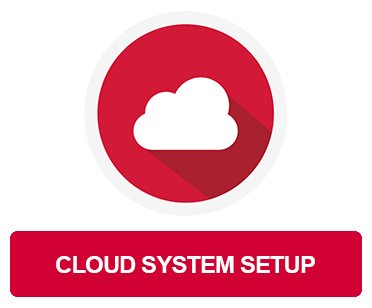
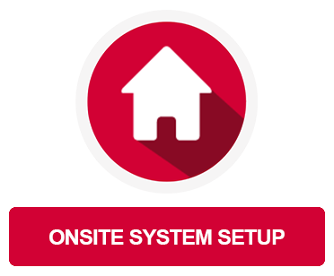
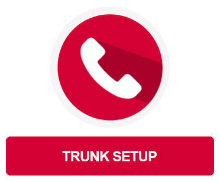
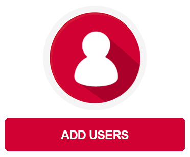
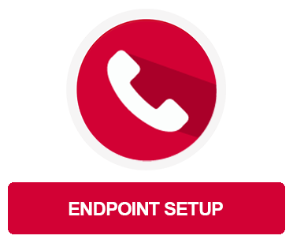
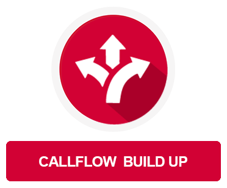
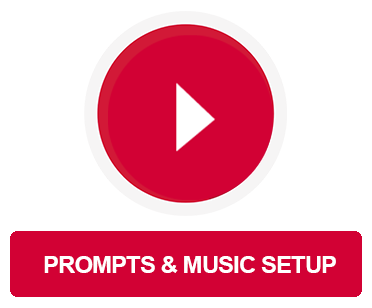



## Introduction - 10 steps to success
In this step-by-step guide you will learn everything you need to know about setting up a professional VoIP telephony environment. Use this guide to learn how to set up your pascom phone system to match your business communications requirements.

{}
**Want to achieve your goals even faster?** 
With a **pascom Premium Licence**, we can take care of the initial setup according to your wishes, freeing you up to take care of your core business. For more information please refer to <a href="https://www.pascom.net/en/voip-prices/" title="pascom prices" alt="pascom free cloud PBX edition" target="_blank" >our pricing.</a>
{}

## Where should I start?

When starting, it's normal to have list of requirements in mind that you would like to see implemented. That said, go step-by-step and taking the time to familiarise yourself with the pascom phone system is definitely the way forward, so let us guide you through the process!

### 1. Create a mypascom account
The way to your pascom phone system is via the mypascom portal. Creating a account and access our portal for managing all your customer data and phone system licences.  
 

### 2. Select deployment type and create your phone system

Already decided on how & where you want to deploy your pascom phone system? There are several options available to you, from the pascom cloud to [self hosting virtual and hardware PBX platforms](https://www.pascom.net/en/business-phone-system/ "pascom self-hosted phone systems"). 

Our Top Tip is to keep it simple and opt for a [cloud phone system](https://www.pascom.net/en/cloud-phone-system/ "pascom cloud hosted phone systems"). However, if for whatever reason you do not want to go down the cloud route, then opting for an on-premise phone system solution is for you. For more information, feel free to check out our [blog](https://www.pascom.net/en/blog/comparing-cloud-phone-system-vs-virtual-ip-pbx-providers/ "pascom cloud vs virtual PBX solutions").

 

 

 

 

{}
**Don't have on-site infrastructure to self-host your phone system?** 

  

  

The pascom appliance is the ideal platform for SOHOs and SMBs looking to self-host their phone system and is always delivered with the latest pascom server version. **Just give us a call for more info!**

{}

## Set up your pascom phone system

Once your pascom phone system has been created, it is ready to use. Now it is time to start setting up your phone system according to your business communications needs. But where to start? Simply follow this step-by-step guide to continue.

### 3. Trunk setup.

In order to ensure that your pascom phone system is reachable for telephony purposes, it is now time to configure your SIP trunk within your pascom phone system. For the setup, you will need your Account / User Credentials from your chosen VoIP provider. 

**In order to make it easier for you to set up your SIP trunk, it is worthwhile to choose a provider that is included in our SIP provider database. If a Provider Template is not available, use the Generic SIP trunk template.**  
 

 

 

 

{}
**Test your trunk!** 
To get started and test your business telephony functionality, it is time to start with the pascom software clients. The pascom clients for Windows, Linux, MacOS and Android and iOS can be found on our <a href="https://www.pascom.net/en/downloads/" title="pascom Client Downloads" alt="pascom free cloud PBX edition" target="_blank">download page</a>.
{}

### 4. Create users

Now that you can use your pascom phone system to make calls, it is time to onboard your phone system users. When it comes to adding users, you are somewhat spoilt for choice; you can either add users manually or use a connector import to automate the process. You should also think about which roles should be assigned to which users.

##### Yet more options available to you:
- Invite new pascom phone system users via e-mail.
- Import and maintain users via a [XLSX Excel list]().
- Import users via [Active Directory]().
- Import users from a [LDAP-Directory]().
   

### 5. Add and setup user endpoints

Now that you have added your users, it is likely some are already using the pascom client's integrated softphone. That said, some users prefer to have and use desktop phones. We recommend using pascom supported desktop VoIP phone manufactures as this greatly **simplifies the setup process** and ensures that the full range of pascom **CTI functionality** is available.

 

 

### 6. Configure teams (queues)

Queues are integral to any professional business communications platform. With pascom you have the option of grouping your uses into teams and add the corresponding queues for sales, support, switchboard etc. All members of these teams will then be able to receive inbound calls via the queues of which they are members. 

 

 

### 7. Plan and implement your call flows

If you haven't done so already, now is the time to start planning what should happen to inbound calls should, for example, if a user is not reachable or callers are waiting in a queue that is particularly full. This is where things start getting exciting as you are now starting to plan, configure, and optimise the **actions** needed to manage your business communications processes within the pascom phone system. A good tip is to create an overview of your call flow so that can visually map which route callers take (and should take) through your phone system.

**Example**

Once you have completed your plan, start adding the relevant actions where the as best suited. Adding announcements, call dropping on to other objects (IVR, Queues etc) and call forwards can be easily configured using the relevant parameters that match your requirements.

 

 

### 8. Styling your call flows

Create excellent customer experiences by answering and greeting your callers using your own custom prompts (announcements) and music on hold. Styling elements are the hallmark of your company and nothing is more important than your caller's first impression, so greet callers, provide them with short, appropriate information and make waiting times more pleasant with relaxing music.
 
 

 

### 9. Using actions and conditions

Do you still manually turn on announcements for lunch breaks for example? Adding yet more professionalism and automation to your call flows is great for customer service as well as reducing workloads and can be achieved using a combination of actions and conditions. Conditions can be configured for a number of scenarios from time periods (e.g. business hours), calendars (e.g. public holidays) and much more. 

An example scenario could be to greet callers with different prompts for open and closed business hours. When linked with further actions, you can then route callers to the queue during business hours and onto a voicemail box outside of your business' opening hours. 

All you need to do is plan and implement and the rest will happen automatically, freeing up your time to focus on other priorities. 

 

 

### 10. Expand and enhance your call flows

Now that you're familiar with call actions, you can go one step further and create an even better in call experience for your customers. Add IVR menus to your call flows in order further refine your call flow management and route your callers to exactly where they want to go. If done correctly, this is greater for customer service and improving first call resolution rates. Other options include setting up extension switches that start and stop certain actions when enabled.  Set up direct dial switches that start or stop certain actions when activated. A good tip is to group actions and structure them in with call routers whose sole function is to ensure the smooth call flow, react to any actions / conditions and the handle the calls accordingly.

 

##### More Information:
- Setup a [IVR Menu]().
- Using [extension switches]().

## Final Word

Every beginning is difficult, especially if you have your own implementation expectations and requirements that need to be addressed as quickly as possible. Simply take the time to go through the setup step-by-step and very quickly you will have successfully configured your pascom phone system to meet all your business communication requirements.

{}
**Looking for more support regarding your deployment requirements** 
 
Sign up to and use our free pascom support <a href="https://www.pascom.net/forum/" title="pascom forum" alt="pascom Support forum" target="_blank" >forum</a> and start benefitting from sharing input and ideas with the pascom community.   
It's completely free and gives you direct access to our support team, the pascom channel partner network and pascom phone system enthusiasts! 
{}