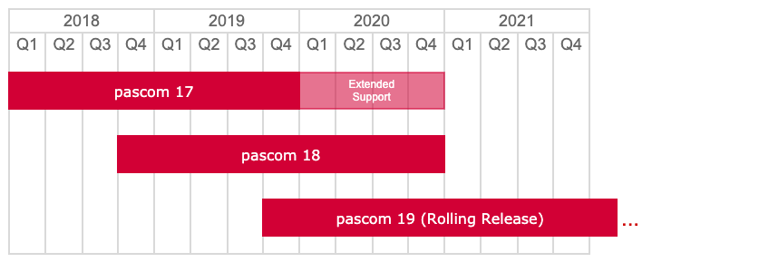



## Unterstütze Server Versionen

### Was bedeutet unterstützte Version?

Dabei handelt es sich um das jeweils aktuellste Bugfix-Release einer pascom Server Version. Nur für unterstützte Versionen gewährleistet pascom:

- Updates, Bugfixes und Securityfixes
- pascom PREMIUM Support
- Kompatibilität der pascom Desktop- und Mobile-Clients
- Kompatibilität der Server Lizenz

### Kann ich nicht unterstützte Versionen trotzdem verwenden?

pascom **blockiert** die Nutzung nicht unterstützter Versionen **in keiner Form**, jedoch müssen Sie mit folgenden Konsequenzen rechnen:

**1) Updates, Bugfixes und Securityfixes**

Nicht unterstützte Versionen erhalten weder Updates oder Bugfixes noch Securityfixes. Da die pascom Server in vielen Fällen wegen der pascom Clients mit dem Internet verbunden sein müssen ist der Betrieb einer nicht unterstützen Serverversion fahrlässig.

**2) pascom PREMIUM Support**

Unser kostenpflichtiger PREMIUM Support wird Ihnen beim Einsatz nicht unterstützter Versionen keinerlei Hilfestellung leisten und Sie bitten zuerst auf eine unterstütze Version upzudaten.

**3) Kompatibilität der pascom Desktop- und Mobile-Clients**

Die pascom Desktop- und Mobile-Clients werden zentral upgedatet. Da pascom die Kompatibilität der Clients nur gegen unterstützte Versionen testet, kann es sein, dass sich die Clients nach dem Update nicht mehr mit dem Server verbinden können oder einzelne Funktionen defekt sind. Sie können das Autoupdate für den Desktop-Client durch den **--noUpdate** Kommandozeilenparameter unterbinden jedoch gilt dies nicht für Mobile Clients die durch Drittanbieter wie Apple oder Google verteilt werden.

Zusätzlich wird jedem Benutzer permanent eine Meldung eingeblendet, dass der Client mit einem nicht unterstützen Server verbunden ist.

**4) Kompatibilität der Server Lizenz**

Bei allen **pascom 17 Servern und älter** werden die Lizenzen nicht automatisch aktualisiert. Hier kann es sein, dass pascom für nicht unterstütze Server Versionen keine Änderungen mehr an der Lizenz vornehmen kann. Beispielsweise ist dadurch eine Anpassung der Benutzerzahl (=Nachkauf) ohne update der Server-Version nicht mehr möglich.

Alle **pascom 18 Server und neuer** aktualisieren die Lizenz entsprechend dem gepairten Abonnement täglich automatisch. In Ausnahmefällen kann es dazu kommen, dass eine nicht unterstützte Server Version zu dieser Lizenz nicht mehr kompatibel ist. Als Auswirkung kann der Server nach 30 Tagen nur noch eingehende Telefonate annehmen oder Lizenzwerte (z.B. Nutzeranzahl) werden nicht mehr korrekt übernommen. Wir versuchen dies zu vermeiden garantieren die Kompatibilität jedoch nur für unterstützte Server Versionen.

### Werde ich gewarnt bevor die Unterstützung meiner Version ausläuft?

Zirka drei Monate bevor die von Ihnen verwendete Server Version nicht mehr unterstützt wird, blenden alle pascom Clients nach der Anmeldung einen kurzen Hinweis ein.

### Was ist "Extended Support"?

Wegen des Technologiewechsels von pascom 17 auf 18 und den damit verbundenen Mehraufwand für unsere Kunden und Partner verlängert pascom den Support speziell für diese Version um ein Jahr und garantiert weiterhin:

- pascom PREMIUM Support
- Kompatibilität der pascom Desktop- und Mobile-Clients

## Release Notes

### pascom Client

|Version|Release Type|Veröffentlichung|
|-------|------------|---------------:|
|[Release 54.R534]()| Bugfix Release | 12.09.2019 |
|[Release 53.R453]()| Bugfix Release | 03.07.2019 |
|[Release 52.R428]()| Bugfix Release | 18.06.2019 |
|[Release 51.R365]()| Bugfix Release | 27.05.2019 |
|[Release 50.R318]()| Bugfix Release | 24.04.2019 |
|[Release 49.R265]()| Bugfix Release | 21.03.2019 |
|[Release 48.R196]()| Bugfix Release | 08.03.2019 |
|[Release 47.R161]()| Bugfix Release - nur Desktop | 11.02.2019 |
|[Release 46.R152]()| Bugfix Release | 06.02.2019 |
|[Release 45.R93]()| Bugfix Release | 17.12.2018 |
|[Release 44.R66]()| Bugfix Release | 27.11.2018 |
|[Release 42.R34]()| Feature Release | 17.10.2018 |

### pascom Server 18

|Version|Release Type|Veröffentlichung|
|-------|------------|---------------:|
|[Release 18.11]()| Bugfix Release | 16.10.2019 |
|[Release 18.10]()| Bugfix Release | 05.08.2019 |
|[Release 18.09]()| Bugfix Release | 28.06.2019 |
|[Release 18.08]()| Bugfix Release | 13.06.2019 |
|[Release 18.07]()| Bugfix Release | 10.04.2019 |
|[Release 18.06]()| Bugfix Release | 07.03.2019 |
|[Release 18.05]()| Bugfix Release | 26.02.2019 |
|[Release 18.04]()| Bugfix Release | 16.01.2019 |
|[Release 18.03]()| Bugfix Release | 17.12.2018 | 
|[Release 18.02]()| Bugfix Release | 07.11.2018 |
|[Release 18.01]()| Bugfix Release | 09.10.2018 |
|[Release 18.00]()| Feature Release | 20.09.2018 |

### pascom Server 17

|Version|Release Type|Veröffentlichung|
|-------|------------|---------------:|
|[Release 17.12]()| Bugfix Release | 22.11.2018 |
|[Release 17.11]()| Bugfix Release | 25.09.2018 |
|[Release 17.10]()| Bugfix Release | 19.06.2018 |
|[Release 17.09]()| Bugfix Release | 24.05.2018 |
|[Release 17.08]()| Bugfix Release | 23.04.2018 |
|[Release 17.07]()| Bugfix Release | 05.04.2018 |
|[Release 17.06]()| Bugfix Release | 03.04.2018 |
|[Release 17.05]()| Bugfix Release | 12.03.2018 |
|[Release 17.04]()| Bugfix Release | 26.02.2018 |
|[Release 17.03]()| Bugfix Release | 12.02.2018 |
|[Release 17.02]()| Bugfix Release | 22.01.2018 |
|[Release 17.01]()| Bugfix Release | 08.01.2018 |
|[Release 17.00]()| Feature Release | 14.12.2017 |

### pascom TAPI Client

|Version|Release Type|Veröffentlichung|
|-------|------------|---------------:|
|[Release 4.R56]()| Bugfix Release | 08.03.2019 |
|[Release 3.R42]()| Feature Release | 09.10.2018 |