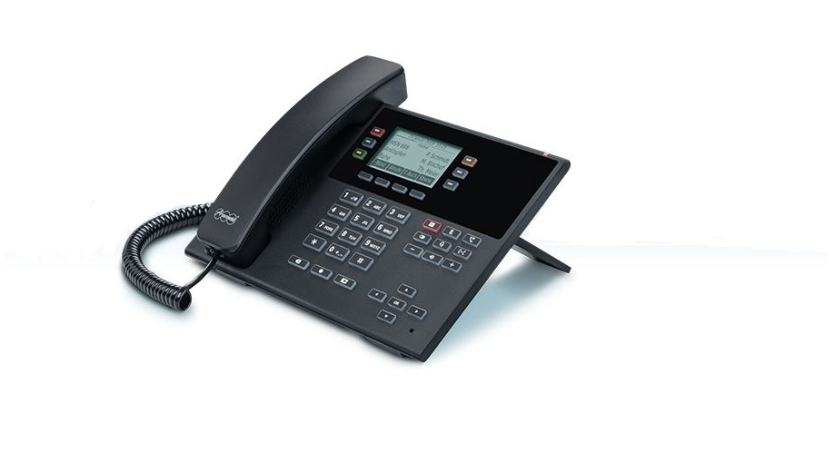

{}
Hier finden Sie eine Übersicht über Services und Dienste, die mit der aktuellen pascom Version nicht mehr funktionieren.
{}

### Support für pascom 17 & 18 endet 2020
**Service / Dienstleistung**

|Datum|mit Version|
|---|---|
|Ende 2020|---|  
**Unsere Technologie entwickelt sich stetig weiter, weshalb wir den Support für pascom 17 und 18 zum kommenden Jahreswechsel beenden, um uns nur noch auf die aktuelle pascom Version zu konzentrieren.**

1. Ersetzen Sie Ihre pascom 17/18 Vor-Ort-Telefonanlage durch eine **CLOUD-Telefonanlage** mit einem einfachen Wechsel. Nutzen Sie unser attraktives [Wechselangebot](https://www.pascom.net/de/exklusiv-angebote/zu-pascom-cloud-wechseln/).  
2. Kontaktieren Sie unseren **Vertrieb**, oder Ihren pascom **Vertriebspartner**, um Ihre Lizenzen upzugraden. Unseren Upgrade-Leitfaden finden Sie [hier]().

 

### Statische Konferenzräume entfernt
**Software**

|Datum|mit Version|
|---|---|
|September 2020|19.09|  
**Statische Konferenzräume wurden durch pascom Gruppen ersetzt**

### SNOM Support für Modelle 3XX + 7XX eingestellt
(Alle Modelle ohne dem D davor)  
**Hardware**

|Datum|mit Version|
|---|---|
|September 2020|19.09|  
**Unterstützung der generalüberholten Modelle eingestellt**  

### SNOM PA1 Durchsagesystem nicht mehr unterstützt 
**Hardware**

|Datum|mit Version|
|---|---|
|September 2020|19.09|   

### Anrufgruppen gelöscht
**Software**

|Datum|mit Version|
|---|---|
|März 2020|19.05|  
**Die Anrufgruppenfunktion wurde entfernt, und stattdessen sollten Teams konfiguriert werden**

### Trunk Failover (Ämterketten) ersatzlos gelöscht
**Software**

|Datum|mit Version|
|---|---|
|Januar 2020|19.03|  
**Keine Migration und keine direkte Problemumgehung. Der Support kann bei Bedarf mit einem ausgehenden Skript helfen.**

### IAX Amtsleitungen ersatzlos gelöscht
**Software**

|Datum|mit Version|
|---|---|
|Januar 2020|19.03|  

### Cisco SPA 112 nicht mehr unterstützt
**Hardware**

|Datum|mit Version|
|---|---|
|November 2019|19.00|  

### pascom SOHO Server nicht mehr unterstützt
**Hardware**

|Datum|mit Version|
|---|---|
|November 2019|19.00|  
**Führen Sie ein Hardwareupgrade durch.**

### Cron Job Skripte gelöscht
**Software**

|Datum|mit Version|
|---|---|
|November 2019|19.00|  
**(vorher / nachher) Skripte werden nicht mehr unterstützt**

### Auerswald Desktop Telefone
**Hardware**  

|Datum|mit Version|
|---|---|
|November 2019|19.00|    

### Beronet
**Hardware / Software**  

|Datum|mit Version|
|---|---|
|November 2019|19.00|    
**Alle Geräte, welche am selben Beronet Gateway wie das Amt laufen, werden nicht mehr unterstützt.**

### Aastra / Mitel Desktop Telefone
**Hardware**  

|Datum|mit Version|
|---|---|
|November 2019|19.00|    

