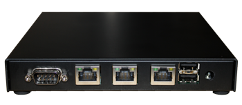
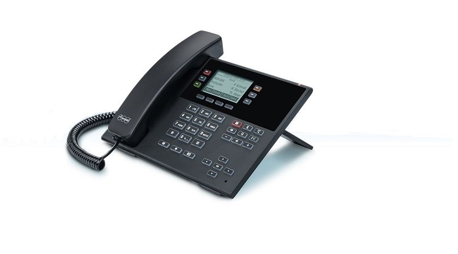

{}
Here you will find an overview of services that no longer work with the current pascom version.
{}

### Support for pascom 17 & 18 ends 2020
**Service**

|Date|with Version|
|---|---|
|End of 2020|---|  
**Our technology is constantly evolving, which is why we are ending the Support for pascom 17 and 18 at the upcoming turn of the year in order to focus soley on the current pascom version.**

1. Replace your pascom 17/18 on-site telephone system with a CLOUD telephone system. Use our attractive [Exclusive Offer](https://www.pascom.net/en/exclusive-offers/switch-to-pascom-cloud/).  
2. Contact our **Sales-Team**, or your pascom **Sales Partner** to upgrade your license. For more Informations, please read our Upgrade-Guide whitch you can find [here]().

 

### Static Conference Rooms removed
**Software**

|Date|with Version|
|---|---|
|September 2020|19.09|  
**Static conference rooms were replaced by pascom groups**

### Call Groups deleted
**Software**

|Date|with Version|
|---|---|
|March 2020|19.05|  
**The call group feature has been removed, and teams should be configured instead**

### Trunk Failover deleted
**Software**

|Date|with Version|
|---|---|
|January 2020|19.03|  
**No migration and no direct workaround. Support can help with an outgoing script if needed.**

### IAX Trunks deleted
**Software**

|Date|with Version|
|---|---|
|January 2020|19.03|  

### Cisco SPA 112 no longer supported
**Hardware**

|Date|with Version|
|---|---|
|November 2019|19.00|  

### pascom SOHO Server no longer supported
**Hardware**

|Date|with Version|
|---|---|
|November 2019|19.00|  
**Perform a hardware upgrade.**

### Cron Job Scripts removed
**Software**

|Date|with Version|
|---|---|
|November 2019|19.00|  
**(before / after) Scripts are no longer supported**

### Auerswald Desktop Phones
**Hardware**  

|Date|with Version|
|---|---|
|November 2019|19.00|    

### Beronet 
**Hardware / Software**  

|Date|with Version|
|---|---|
|November 2019|19.00|    
**All devices running on the same Beronet Gateway as the Trunk are no longer supported.**

### Aastra / Mitel Desktop Phones
**Hardware**  

|Date|with Version|
|---|---|
|November 2019|19.00|    

