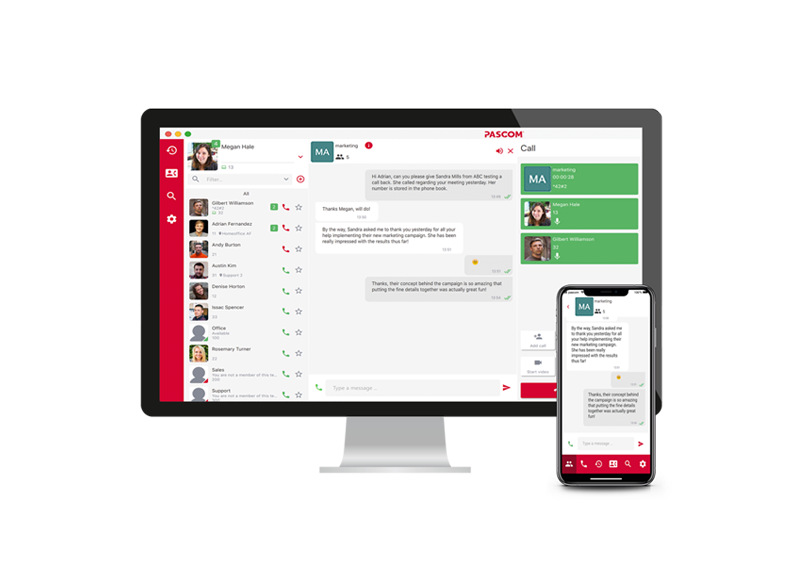

## Highlights



### pascom Video Konferenzen 

55% der Kommunikation erfolgt visuell. Mit der nativen Videointegration von pascom ist das Starten einer Konferenz auf Ihrem Desktop oder Mobilgerät nur einen Klick entfernt. Sie benötigen weder zusätzliche Software noch können Probleme mit inkompatiblen Browsern auftreten.

### pascom Web Konferenzen

Online Meetings, Remote Präsentationen und Support: Mit dem neuen pascom Web Client können pascom Nutzer ihre Kunden, Geschäftspartner und Stakeholder, direkt im bevorzugten Browser zur Teilnahme an Online Web Meetings einladen, ohne dass zusätzliche Software oder Hardware erforderlich ist. Der pascom Web Client ist mit allen führenden Webbrowsern kompatibel und ein hervorragendes Tool für Kundenservice und Kundenbindung. Profitieren Sie von einer sicheren, flexiblen und benutzerfreundlichen Videokonferenzlösung. 

### pascom Screensharing

Ein Bild sagt mehr als tausend Worte. Die neue Screensharing Funktion steht auf allen Geräten und Plattformen zur Verfügung und stellt sicher, dass auch Außendienstmitarbeiter jederzeit Dokumente und Präsentationen mit Ihren Kollegen teilen können.

### pascom Gruppen mit Audio, Video und Chat

Verbessern Sie die Teamzusammenarbeit mithilfe von Gruppen. Aufbauend auf unserem “on the fly” Gruppen-Chat ist es mit pascom 19 jetzt jedem Benutzer möglich, permanente Gruppen zu erstellen. Ermöglichen Sie Ihren Mitarbeitern sich mühelos per Chat, Audio oder Video austauschen.

## Wichtige Änderungen

{}  
In diesem Abschnitt werden die Änderungen erläutert, die Sie bei der Migration auf pascom 19 berücksichtigen müssen
{}

* **Snom Pickups** wurden auf `DURCHWAHL|*8` Notation umgestellt. Siehe [Snom Tischtelefone]().
* **Trunk Failover** (Ämterketten) ersatzlos gelöscht. Keine Migration und keine direkte Problemumgehung. Der Support kann bei Bedarf mit einem ausgehenden Skript helfen.  
* **IAX-Amtsleitungen** ersatzlos gelöscht.   
* **Swap** ist jetzt standardmäßig deaktiviert. Dadurch können virtualisierte Setups mit weniger als 1 GB Arbeitsspeicher beschädigt werden. Konfigurieren Sie in diesem Fall mehr Arbeitsspeicher.  
* **Anrufgruppen** werden automatisch in Teams umgewandelt. Die Anrufgruppenfunktion wurde entfernt, und stattdessen sollten Teams konfiguriert werden.  
* Portforwarding für **UDP 3478** ist Voraussetzung, andernfalls funktioniert **Video** nicht.
* **Beronet Gateways** müssen neu provisioniert werden.
* **pascom SOHO Server** ist nicht mehr kompatibel. Bitte führen Sie ein Hardware-Upgrade auf die [pascom Appliance]() durch oder nutzen Sie die pascom.cloud.
* **Automatische Ämter Updates** werden für Telekom, peoplefone (DE, AT, CH), HFO, Sipgate Trunking, RKom, t-m-net, sipcallch, seabix, mnet, easybell und qsc/plusnet durchgeführt. Bitte prüfen Sie Ihr Amt nach dem Update.
* **Cronjob Skript (vorher/nachher)** wird nicht mehr unterstützt
* Ämter, bei denen eine **eigene Vorlage** vorhanden ist,  bekommen diese automatisch wieder zugewiesen. Eventuelle Anpassungen über eine generische Vorlage werden verworfen.
* **Provisionierungs-URL für generische Geräte** muss nach dem Update ggf. neu gesetzt werden! Bereits vorhandene, duplizierte, generische Basis-Konfigurationen müssen auf die Regex-Pattern der neuen Standard-Basis-Konfiguration angepasst werden ("/provisioning/v1-[0-9a-zA-Z] {16}
/?$").
* **Queuemetrics** muss ggf. neu konfiguriert werden
* **Statische Konferenzräume** werden mit diesem Update ohne Migration gelöscht!
* **Clients alter als Version 65** können sich nicht mehr zu diesem Server verbinden.
* **Snom M700 3X firmware** wird nicht mehr unterstützt.
* **CDR Rest API** hat neue Datenstruktur und etwaige Implementierungen müssen angepasst werden.
* **Snom Modelle 3XX + 7XX** (ohne vorangestelltem D) werden nicht mehr unterstützt.
* **Snom PA1 Durchsagesystem** wird nicht mehr unterstützt.
* **Cisco SPA Gateway** werden nicht mehr unterstützt. Vorhandene Geräte werden in generische SIP Geräte migriert.
* pascom 18 Instanzen können nicht mehr mit dieser Host-Version betrieben werden. (CSP)
* Outbound Proxy Schnittstellen bei Ämtern werden bei manchen Vorlagen nun erzwungen.
* **Angepasste Dashboards in Analytics** werden gelöscht und müssen neu erstellt werden.
* **Grafana-Dashboards des Hosts** müssen ggf. angepasst oder neu erstellt werden

## Bekannte Probleme

{}
Diese Probleme sind uns bekannt und wir arbeiten bereits an einer Lösung
{}

* keine

## Release 19.12 (09.12.2020)

**Auf einen Blick** 

* Webclient unterstützt nun Screensharing.
* Durchwahlschalter können im Client gesteuert werden.
* Eingegangene Faxe können im Client heruntergeladen werden.
* Team Voicemails sind nun im Client abhörbar.
* DTMF Fernsteuerung via Client für Snom Desktop Telefone.
* Zurücksetzen des Management-Administrator-Passwort ermöglicht.
* Hostname und DNS im Management UI änderbar.
* Sprache des Anrufers kann als Aktion gesetzt werden.
* Externes Gerät über das Amt zeigt wieder eine Anrufaktivität.
* IP der Endgeräte kann nun über die REST API abgefragt werden.
* Exchange Connector importiert nun auch Kontakte aus Ordnern, die mit Outlook auf Mac erstellt wurden.
* Amtsvorlage für Netcologne integriert.
* Analytics Statistiken verbessert.
* Neue Grafana Version auf Host- und Instanzebene.
* Host Betriebssystem ist nun Ubuntu 18.08 LTS.

**ÄNDERUNGEN**

* [MD-12876] Improve journal for extension switch call
* [MD-12867] Restrict empty avatars on the server
* [MD-12857] Phone system UI shows 'useless' Janus WebRTC in overview
* [MD-12846] Prevent old client connections on pascom server
* [MD-12825] OpenLDAP, slapd, still hogs CPU, must be killed with -9
* [MD-12809] slapd-restart.sh should also start not running slapd.service
* [MD-12808] Group and phonebook entries are not shown as favorite
* [MD-12779] Phone instance sometimes not updated automatically during onsite appliances update
* [MD-12737] Enhance pascom Analytics Live Data
* [MD-12727] "Introduce "feature flags" for pascom clients"
* [MD-12722] Replace Openfire Connection Pool with HikariCP
* [MD-12695] Calendar action condition job fails
* [MD-12692] External phone via trunk shows no call activity in client
* [MD-12688] Refactor Exchange Save-Test feature
* [MD-12670] Upgrade pascom 19 host os to ubuntu 18.04 LTS bionic
* [MD-12658] Phone book admin gets blank page after click on username
* [MD-12653] A user should not be able to rename another user via client phonebook
* [MD-12637] Change ldap_base in Snom M700 basic configuration
* [MD-12613] Endpoint, baudisch, routing problem with loose-routed ACK messages
* [MD-12589] Yealink vendor provisioning still active after reset
* [MD-12584] instance wizard: Improve validation
* [MD-12578] SetupUI: Use correct colors everywhere
* [MD-12574] Delay of ~ 20 seconds after hangup a call if push message doesn't wake up mobile client
* [MD-12571] Prepend group display name with @ sign in users contact list
* [MD-12552] Upgrade controller container to ubuntu bionic and latest versions
* [MD-12548] Allow downloading received Fax pdf files from the client
* [MD-12543] Trim tabs and spaces from MAC address in instance wizard
* [MD-12537] Store a vendor for paired mobile device
* [MD-12536] Already deleted participants are deleted again
* [MD-12531] Remove pascom 18 compatiblity code from kamailio
* [MD-12529] Remove Cisco SPA ATA gateway support
* [MD-12503] Add icons and other downloadable content to item / trunk bundles
* [MD-12502] Separate huge template / item bundles into many small bundles
* [MD-12490] Optimize events handling
* [MD-12467] Instance wizard button logic
* [MD-12455] Analytics shows error 'division by zero'
* [MD-12449] DECT gateways can be created with a MAC outside the vendor's address range
* [MD-12447] Reduce apache and kamailio related consul / consul-template traffic in proxies
* [MD-12445] Do not create a vendor provisioning lease for insecure interfaces
* [MD-12422] Invalid call data after various actions leads to ghost calls
* [MD-12419] Show mailbox recordings for team voicemail
* [MD-12418] Device create/edit action acts wrongly on wrong entered data
* [MD-12409] phone.Enable command is broken and probably unused
* [MD-12405] Transfer with Yealink leads to invalid call data sometimes
* [MD-12392] Enforce outbound proxy usage via trunk template
* [MD-12354] Update pbx instance grafana
* [MD-12349] Handle webclient when there are no audio devices at all
* [MD-12346] Update consul version to 1.7.x
* [MD-12324] Upgrade management grafana
* [MD-12313] Include a technical pbx dashboad in the management grafana
* [MD-12305] Configurable search attrs property for LDAP connector
* [MD-12257] Xmpp sometimes prints misleading errors for MediaStreams/hanging up conference channels
* [MD-12219] Implement screensharing in WebClient
* [MD-12217] Enable groovy invokedynamic optimization
* [MD-12171] Modernize pbx system settings api, fix i18n problems
* [MD-12169] Reimplement pbx autostart logic, manage it via csd
* [MD-12164] Show device IP via REST API
* [MD-12147] Outlook (macOS) sub folders are not imported from Exchange/Office 365 as private contacts
* [MD-12108] Implement dtmf remote control for snom desktop phones
* [MD-12082] Hangup fails with "no permission" if CallerIdUpdate is sent after picking the call
* [MD-11989] Add reset management password functionality
* [MD-11913] Provide system settings to customize pjsip_wizard config
* [MD-11870] CSUI dashboard shows wrong memory size
* [MD-11859] Login form to CSUI often not shown after setup
* [MD-11785] Show if appliance pairing failed because of duplicated MAC in odoo backend
* [MD-11746] Improve version check for database backups
* [MD-11676] Improve restore backup process if 'broken' tgz gets uploaded during setup
* [MD-11649] Show more feedback if restoring a backup
* [MD-11628] Update prometheus
* [MD-11622] Use more reliant value for free disc space in prometheus
* [MD-11587] Show reconnect page after host reboot
* [MD-11515] Missing channel event if user accidentially calls fax device
* [MD-11514] Empty page after installation and automatic forwarding/reload sometimes
* [MD-11439] ldap mode handling in provisioning files is too complex and error prone
* [MD-11228] Modernize Extension Switches, expose via ContactList
* [MD-10693] Change hostname and DNS server in management ui
* [MD-10612] Roll out IVR action templates causes error
* [MD-8936]Copy to clipboard button for provisioning URLs
* [MD-6494]New action type to set a channels language
* [PT-11] Toplink Template seems to be broken
* [PT-3] - Netcologne SIP-Provider Integration
* [PT-19] - Remove community template status from sipcall.ch trunk template description
* [PT-6] - Update T-M-Net trunk template
* [PT-9] - Improve naming of basic configurations
* [PT-15] - Snom phone wallpaper URL - change to HTTPS

## Release 19.11 (28.10.2020)

**Auf einen Blick** 

* Ämter mit TLS funktionieren wieder problemlos
* Telefonie Konfig. anwenden' Task optimiert
* Ansage für externe Anrufer auf Gruppen (über Einwahlnummer) wird nun nicht mehr am Anfang abgeschnitten
* Web Client mit Firefox läuft nun stabiler

**ÄNDERUNGEN**

* [MD-12741] - Update rtpengine version to 7.5.5.2 to ensure proper outbound proxy TLS trunk handling
* [MD-12315] - Improve apply telephony configuration on huge systems
* [MD-12736] - Allow to set a waiting time between SIP OK and dialplan for call to group
* [MD-12652] - WebSocket in WebClient guest session fails after 10 minutes of inactivity

## Release 19.10 (01.10.2020)

**Auf einen Blick**

* Defekte Netzwerkkonfiguration mit bestimmten Hypervisors behoben.
* Kleinere Migrationsprobleme repariert.
* Diverse Verbesserungen im UI.

**ÄNDERUNGEN**

* [MD-12725] - Static management network configuration breaks with 19.09 and ifeth interfaces
* [MD-12581] - Instance wizard: Validators are not executed while typing
* [MD-12586] - Management UI: Mark currently shown jobs section
* [MD-12587] - Management UI: Change cursor on hovering Browse button
* [MD-12700] - Migration error with some Labels while upgrading to 19.09
* [MD-12707] - Incomplete pbx startup after update or restore, instance not reachable
* [MD-12711] - Broken Migration due to wrongly parsed timezone

## Release 19.09 (16.09.2020)

**Auf einen Blick**

* Team Journal und erweitertes Journal in Verbindung mit Client 65.
* Management UI reboot Verhalten verbessert.
* Connector Import ist nun auch mit Authentifizierung möglich.
* Wilhelm Tel Amtsvorlage hinzugefügt.
* Probleme mit Halten bei Mitel und Grandstream Geräten behoben.
* Fax Dienst funktioniert nach Updates nun wieder.
* Unterstütze Geräte werden nun mit optimieren QoS/ToS Einstellungen provisioniert.
* Gigaset N670 DECT Gateway wird nun unterstützt.
* Update PHP auf Version 7.4.
* Upgrade Proxy und Janus auf Ubuntu bionic mit den neusten Versionen.

**ÄNDERUNGEN**

* [MD-11509] - Queuemetrics spy / monitoring feature not working
* [MD-11664] - Wait for rebooting the server in a consistent way in both CSUI and SetupUI
* [MD-11891] - Update monitoring api in swagger ui
* [MD-11908] - Invitation mails to gmail accounts are broken
* [MD-11923] - Add auth method for connector import files via URL
* [MD-12038] - Integrate wilhelm.tel trunk template
* [MD-12102] - Redirect requests to setupui URL during installation
* [MD-12115] - Shutdown jobs shown as failed
* [MD-12205] - Show group display name in user's contact list activity
* [MD-12290] - Webclient audio without camera doesn't work in Chrome and Chromium Edge
* [MD-12337] - Phone instance UI: missing mac address input of device shows wrong message
* [MD-12343] - Prevent huge asterisk logfiles if somebody enables debug logging
* [MD-12355] - User instance wizard regenerates QR code for pairing too frequently
* [MD-12381] - Show proper error message if the user exceeds the upload size for backups
* [MD-12394] - Yealink can't determine downloaded logo with secure provisioning
* [MD-12398] - Randomize and cleanup cron in all containers
* [MD-12399] - Show correct device status for devices with changed display name
* [MD-12410] - Prevent pairing of the mobile device if it's already paired
* [MD-12417] - Group calls are reported as "extensions/unknown" to the new journal
* [MD-12420] - MoH still played after transfer with Mitel DECT because of 381 SIP "SIPS Required"
* [MD-12437] - Can't add device if mobile pairing is deactivated in interface
* [MD-12443] - Fax sometimes not working after update because of broken iax modems
* [MD-12459] - Queue call transferred via Snom results in wrong caller number
* [MD-12460] - Improve nginx configuration to handle /setup route
* [MD-12461] - Improve order of Yealink LDAP contacts
* [MD-12462] - Validate and send prepared MAC address to the API in instance wizard
* [MD-12468] - Grandstream phone image is missing in instance wizard
* [MD-12473] - Can not dial on a registerless trunk
* [MD-12474] - SetupUI and Instance Wizard CSS issues in latest Chrome
* [MD-12476] - Change grandstream provisioning template to avoid SIPS and fix transfers
* [MD-12477] - White screen after manual page refresh on reboot page
* [MD-12491] - Migration md_cmd_71902_01 fails while restoring older backups
* [MD-12497] - Team journal entry missing some details
* [MD-12499] - Disable unwanted systemd .timer units / cron jobs in containers based on bionic
* [MD-12521] - Pause reason of team member is empty sometimes
* [MD-12523] - Client can not connect to server if there are no teams configured
* [MD-12528] - Layout glitch in setup wizard when entering an invalid email
* [MD-12545] - "Passwords not matching" error not showing properly
* [MD-12560] - Change ldap_base in Snom M700 basic configuration
* [MD-12582] - Improve webclient name validation for joining users
* [MD-12585] - Instance wizard: Checkbox status and interaction is wrong
* [MD-12588] - Broken text during instalation in instance wizard
* [MD-12590] - Some pbx metrics are missing after container restart/reboot until asterisk reload
* [MD-12599] - OpenVPN Export broken after backup restore
* [MD-12620] - Insecure provisioning of Snom and Yealink broken because of device handler error
* [MD-12625] - Can't change password via management UI
* [MD-12639] - Rest ipdevice returns unexpected response
* [MD-12643] - Cron produces an error message every day
* [MD-8307]- Allow to enter various mac address patterns, automatically convert to our internal string format
* [MD-8644]- Enhanced and replicated journal, including Team Calls
* [MD-11737] - Implement grafana authentication proxy
* [MD-11797] - Improve timestamp format in phonecall records
* [MD-11817] - Configurable query timeout for postgresql queries
* [MD-12016] - Store detailed metrics about pushes
* [MD-12026] - Set correct TOS flags for all supported hardware devices
* [MD-12072] - Toggle xmppserver debug log via REST Api
* [MD-12081] - Cleanup call history in event stream
* [MD-12110] - Update WebUIs to angular 9.1
* [MD-12127] - Deprecate static conference room feature
* [MD-12214] - Improve pbx settings handling for php and xmppserver
* [MD-12223] - Reduce CSD log level
* [MD-12240] - Improve Yealink DECT gateway configuration template
* [MD-12251] - Upgrade Janus container to ubuntu bionic and latest versions
* [MD-12254] - Upgrade proxy container to ubuntu bionic and latest versions
* [MD-12265] - Data volumes for cloudstack lxc containers
* [MD-12284] - Upgrade php to version 7.4
* [MD-12341] - Research and implement Gigaset N670 DECT gateway
* [MD-12347] - Optimize asterisk logging
* [MD-12368] - Configure consul leader election check time
* [MD-12378] - Refactor voicemail and recording download API, use nginx secure urls
* [MD-12391] - Improve interface configuration, combine all client protocols
* [MD-12424] - Xmppserver stops doing license checks
* [MD-12430] - Refactor xmpp faxserver file upload api, use nginx
* [MD-12433] - Automatic inplace pbx update for csp / cloud hosts
* [MD-12466] - Show background/picture if QR code generating
* [MD-12495] - Improve journal and monitoring documentation
* [MD-12498] - Prohibit older clients (<v65) to connect to a 19.09 server
* [MD-12508] - Remove deprecated Task 050397
* [MD-12515] - Remove dynamically generated TLS keys between xmppserver and xmppproxy
* [MD-12595] - Provide a metric for number of created fax devices

## Release 19.08 (24.06.2020)

**Auf einen Blick**

* Gelegentliche Probleme mit eingeschränkter Funktionalität bei Mobile Clients behoben

**ÄNDERUNGEN**

- [MD-12411] XMPP error on unpair a mobile client

## Release 19.07 (10.06.2020)

**Auf einen Blick**

* Vendor Provisioning für Snom und Yealink
* Anzeigenamen für Geräte 
* Anlegen von Geräten verbessert
* Rufnummernanzeige bei Snom DECT Gateways verbessert
* Transfers mit Yealink und Grandstreams optimiert
* Probleme mit nicht angezeigten Anrufen bei Abwürfen über Aktionen behoben
* Sprache der Roaming-Ansagen ist nun richtig
* QR Code für Mobile Client Pairing bleibt wieder für den konfigurierten Zeitraum gültig
* Probleme mit Sonderzeichen im Anzeigenamen der Benutzer behoben

**ÄNDERUNGEN**

- [MD-8349] - Improve "add device" ui workflow and add clean, translated device descriptions
- [MD-11718] - Revokable provisioning urls
- [MD-11752] - Integrate vendor provisionig service for snom phones
- [MD-11928] - Push correctly resolved number to mobile apps
- [MD-11941] - CSUI shows 'Subscription paired' after moving back from mypascom
- [MD-11955] - Introduce Display Name for devices
- [MD-11958] - Status of pascom support access button in CSUI is always off
- [MD-12043] - Refactor and cleanup xmppserver internal apis and spring dependencies
- [MD-12130] - Replace apache with nginx in pbx instances
- [MD-12142] - Missing call activity after drop via action when condition is used
- [MD-12163] - Optimize xmpp API to use device id instead of name
- [MD-12165] - Apache not started after reload via certmanager
- [MD-12184] - Beronet trunk shows anonymous for incoming calls
- [MD-12186] - Snom M700 handset shows %23 instead of # and number during calls
- [MD-12229] - User can't connect client because of broken db entries in 009ext_extension
- [MD-12239] - Can't delete connector profile because operation is not permitted
- [MD-12262] - CallerID not updated after transfer with some Yealink and Grandsteam phones
- [MD-12263] - Switch to adoptopenjdk openJ9 jvm for more efficiency
- [MD-12273] - Show proper busy text instead of technical cause code on yealink phones
- [MD-12286] - Wrong prompt language when roaming to a location
- [MD-12289] - Console error if you hover over the weblient while the fadeout animation is running
- [MD-12291] - Improve webclient chat
- [MD-12297] - QR code/pairing not valid for more than ~ 60 seconds
- [MD-12299] - Additional account in SIP trunk doesn't apply trunk template
- [MD-12301] - Restrict webclient also for legacy perpetual licenses, named users
- [MD-12302] - Web client states that there is no dial-in number in error messages
- [MD-12303] - Web client can use more licenses than allowed
- [MD-12307] - Trunk Transport option has no effect
- [MD-12312] - Reduce strain on consul servers by restricting csd leadership to fewer machines
- [MD-12317] - Privilege escalation through cron jobs
- [MD-12318] - Improve user wizard desktop phone page, add vendor provisioning support
- [MD-12325] - Improve number in SIP trunk from header
- [MD-12333] - PJSIP header doesn't appear in sip traffic when set via team action
- [MD-12335] - Create a device and assign it to a user or location within the same webform
- [MD-12338] - Telekom SIP trunk Clip no screening is not working
- [MD-12339] - OpenVPN service crashes, is not restarted automatically
- [MD-12340] - Change Snom M700 provisioning template
- [MD-12345] - Can not upload and restore big backups into pbx instance
- [MD-12348] - Enforce trunk templates on each pbx update
- [MD-12351] - Deactivate sip 302 redirect for easybell trunk template
- [MD-12352] - Change sipcall.ch trunk template for CLIP no screening
- [MD-12353] - Improve mute button handling in web client
- [MD-12356] - QR code on instance UI can be used for multiple pairings
- [MD-12358] - Broken hint for *74 call forwardings
- [MD-12359] - Remove broken/unnecessary swap creation logic in md-xmppserver patchscript
- [MD-12384] - Can't leave full screen mode in web client with Safari

## Release 19.06 (28.04.2020)

**Auf einen Blick**

* pascom Web Client für Web-Konferenzen
* Gigaset DECT N870 Gateway wird unterstützt
* Ämter Vorlagen werden nun automatisch bei Updates aktualisiert
* Chat-History kann wieder beschränkt und aufgeräumt werden
* Systemsprache ist in der Instanz konfigurierbar
* Connector Performance wurde verbessert

**ÄNDERUNGEN:**

- [MD-11661] - Snom M700 provisioning restarts all multicell senders
- [MD-11960] - Payload data has wrong key
- [MD-12033] - Fax extension invalid after change via connector
- [MD-12055] - Auto created Peoplefone trunk during setup has wrong options
- [MD-12069] - Delete contact in roster (favorite) if related phonebook entry gets deleted
- [MD-12092] - Fix warnings in various jobs
- [MD-12107] - Show correct language when adding a trunk from a template
- [MD-12126] - Change mnet template pjsip options
- [MD-12144] - Instance web UI shows wrong phone state
- [MD-12155] - Improve outbound proxy, ensure to resolve internal alias ip numbers
- [MD-12159] - Php segfault because of protobuf version incompatiblity
- [MD-12161] - Different container versions are confusing CSUI version checks
- [MD-12170] - Loader pattern is invalid
- [MD-12181] - Handle SIP AOC info requests, fix dropped calls on rkom trunks
- [MD-12182] - Can't delete group participants or leave group
- [MD-12206] - Rtc media handles locking and cleanup
- [MD-12213] - Show one provisioning URL per host-name
- [MD-12236] - Stop to enforce opus for desktop client calls, fallback to alaw for trunk calls
- [MD-12242] - Lost calls after 30 minutes on outbound proxy due to session timers
- [MD-5675] - Increase Connector Performance, Step 1
- [MD-8427] - Cleanup dialplan loop warnings on apply telephony
- [MD-10779] - Unify system language, web ui language and prompts into one data model
- [MD-11169] - Rate limit API requests
- [MD-11358] - Managed, updateable, sip trunk profiles
- [MD-11455] - Implement Gigaset N870 DECT multicell system
- [MD-11925] - Add more instance level metrics to prometheus
- [MD-12027] - Cleanup chat in event stream
- [MD-12062] - Update Seabix logo in trunk template
- [MD-12116] - Xmpp resource loader could be more efficient
- [MD-12156] - Use python3 for installation process
- [MD-12157] - Upgrade go to 1.13.X
- [MD-12175] - Remove php proto generated files from git repo
- [MD-12216] - Enhance PushManager to lower priority for chat messages pushed to android devices
- [MD-12224] - Reduce idle cpu consumption in the xmppserver by reducing modules, ports
- [MD-12244] - Add a parameter for video publisher soft limit
- [MD-12252] - Change sip host in plusnet template and migrate it automatically
- [MD-12269] - Raise asterisk open file limit

## Release 19.05 (11.03.2020)

**Auf einen Blick**

* Outbound Proxy für Ämter eingeführt.
* Allgemeine Verbesserungen bei Ämtern (z. B. bei Umleitungen, Halten, Transfer).
* Vodafone NGN Trunk Unterstützung über Outbound Proxy (onsite).
* Analytics optimiert (unter anderem Teamansicht).
* Migration von Analytics läuft nun stabiler.
* Anzeige beim Heranholen und Transferieren auf Hardwaregeräten verbessert.
* Abwerfen eines Anrufes erzeugt in jedem Fall wieder eine Call Activity.

**ÄNDERUNGEN:**

- [MD-10987] - Improve Peoplefone trunk anonymous call behavior
- [MD-11541] - Broken Analytics/Grafana after fresh installations in rare cases
- [MD-11707] - Do not show warning messages during loading in CSUI
- [MD-11835] - Update xmpsserver http client
- [MD-11858] - Consul register again deleted instance
- [MD-11867] - Clean up db-schema file
- [MD-11868] - Disable yealink subscribe_register because not supported in pjsip
- [MD-11939] - Rename label for number of extension digits in trunk
- [MD-11971] - Don't add any options to generic SIP trunk
- [MD-12006] - Can't upload wav to default MoH
- [MD-12035] - Analytics can't handle dots properly
- [MD-12053] - Missing audio after outbound redirections
- [MD-12058] - Missing English silence/1 prompts
- [MD-11861] - API improvement for queue live stats
- [MD-12095] - pascom Analytics: Add counter for waiting users/agents on live dashboard
- [MD-12036] - Improve performance and restrict amount of shown teams in analytics
- [MD-12086] - Update linux kernel to 4.15
- [MD-12078] - Add container memory details (caches, buffers) to prometheus metrics
- [MD-8596] - Monitor asterisk trunk connectivity
- [MD-11914] - Update Seabix Trunk Template
- [MD-12056] - Update asterisk to 16.8.0
- [MD-12083] - Restrict default trunk codec list to alaw with ptime 20 to avoid re-invites
- [MD-11985] - Update Java 11 AdoptOpenJDK JRE/JDK
- [MD-12046] - No ringback tone with Telekom advanced template
- [MD-11708] - Prohibit sip call push in GSM only mode
- [MD-12060] - Remove hard upper memory limit from all container image descriptor
- [MD-12074] - Replace apache mod_php with php fpm
- [MD-11635] - Allow to hangup multiple channels by sending base.Hangup
- [MD-12103] - Phone status unavailable if connected via UDP interface
- [MD-12088] - Missing call activity after drop in external/before action
- [MD-11779] - Subscription valid until info in instance shows negative amount of days
- [MD-11846] - Correctly handle callerid and connectedline updates in pjsip
- [MD-12073] - Improve overlay cleanup on instance update
- [MD-11948] - SIP outbound proxy for pascom 19 pjsip trunks
- [MD-12099] - Outbound proxy support for vodafone NGN trunks
- [MD-12040] - Set ptime 20 for physical and virtual fax devices
- [MD-11935] - Hide sip peer in display of snom phones
- [MD-11980] - Update Kamailio to version 5.3.x

## Release 19.04 (03.02.2020)

**Auf einen Blick**

* Migrationsprobleme bei Ämtern mit leeren SIP Optionen behoben.
* TCP Ämter funktionieren wieder problemlos.

**ÄNDERUNGEN:**

- [MD-11973] - Apply telephony broken if trunk account contains no options
- [MD-12041] - All incoming calls on tcp trunks rejected

## Release 19.03 (29.01.2020)

**Auf einen Blick**

* Generische Geräte können nun provisioniert werden
* Beronet Gateways und Ämter funktionieren wieder
* Die Snom Basis-Konfiguration verwendet ab sofort XML-Format
* SIP-Header können wieder manuell angepasst werden 
* PJSIP-Header für Ämter werden nun direkt in den Account-Optionen des Amtes konfiguriert, nicht mehr in Skripten (z. B. def_outbound)
* Externe und intere Ruftöne (via Alert-info-header) sind nun nutzbar
* Durchsagegruppen (Intercom) funktionieren wieder
* Aastra/Mitel DECT Handsets zeigen bei laufenden Anrufen keine fehlerhafte Registrierung mehr an
* Grandstream Gateways mit neuer MAC werden ordnungsgemäß angelegt
* Migrationsprobleme mit Grafana (fehlende Weiterleitung und kaputter Login) wurden behoben 
* Die Mail-to-Fax Konfiguration kann nun zwischen SSL, StartTLS und Plain unterscheiden
* Pickup in Verbindung mit TAPI funktioniert nun auch mit mehreren Leitungen
* Modifizierte Snom Basis-Konfigurationen migrieren "Nebenstelle"-Tasten auf "BLF" um Pickup zu ermöglichen
* Auf verschiedenen Snom und Yealink Geräten werden pascom-Logos als Hintergrund provisioniert
* QSC/Plusnet Provider Template berichtigt
* T-M-Net Provider Template hinzugefügt
* magenta.at Provider Template hinzugefügt

**ÄNDERUNGEN:**

- [MD-11087] - Optimize Snom M700 config
- [MD-11721] - Easybell contact header
- [MD-11829] - Plusnet QSC trunk has wrong options in pascom 19
- [MD-11832] - Remove swap from grafana in pascom 19
- [MD-11968] - Increase maxlength of external_group_number input
- [MD-11847] - Remove 'type' column in team overview
- [MD-11856] - Mitel Aastra DECT shows that its unregistered
- [MD-11927] - Automatically configure lxc soft memory limit
- [MD-11952] - CSUI shows no error if FQDN is missing
- [MD-11863] - Asterisk opens a lot of tcp connections, saturates kamailio
- [MD-11919] - Kamailio does not rewrite Supported: header correctly
- [MD-11924] - Wrong context in sip_ipdevice.conf
- [MD-11892] - Grandstream HT802 ATA gateway (with new MAC) created as phone
- [MD-11812] - Grafana of instance not accessible after update sometimes
- [MD-11722] - Improve mail to fax configuration
- [MD-11720] - Add language selector to instance wizard admin and account pages
- [MD-11659] - Pickup is broken in multiline tapi setup
- [MD-8588] - Auto-provision logos on supported Snom and Yealink phones
- [MD-10822] - Multidial on trunks with direct transfer fails when external device is called
- [MD-11853] - Improve layout of pascom logo in login + setup view
- [MD-11762] - Update asterisk to 16.6.1
- [MD-11814] - Optimize pascom.cloud janus video traffic
- [MD-11857] - Better CLIP handling for trunks
- [MD-11230] - Simple generic provisioning
- [MD-11842] - Allow to set pjsip headers via script
- [MD-11931] - Migration to 19.X fails if broken vcard exists
- [MD-11849] - Can't use PUI menu on a Yealink phone,
- [MD-11855] - Can't create new team after importing backup of 17.12
- [MD-10725] - Improve trunk inbound anonymous handling
- [MD-11810] - Berofix SIP to ISDN trunk not working with pascom 19
- [MD-11962] - Change sip trunk template of Deutsche Telefon
- [MD-11588] - T-M-NET SIP-Provider Integration
- [MD-11658] - magenta.at sip trunk template
- [MD-11667] - Update web applications to angular 8
- [MD-11714] - Configure asterisk local_net and fake external address in pascom.cloud
- [MD-11926] - Store systemd journal on disk instead of tmpfs
- [MD-11979] - Logrotate and restart pbx apache once per night
- [MD-11850] - Snom BLF pickup is broken (pascom 19)
- [MD-11949] - Pickup from a queue doesn't work via notification
- [MD-11633] - Use XML based provisioning templates for Snom phones
- [MD-12009] - Xmpp migration fails if there is no events after mdarchive migration

## Release 19.02 (22.11.2019)

**Auf einen Blick**

- Anrufe auf dem Mobile Client können wieder zuverlässig angenommen werden.
- Let's Encrypt Zertifikate werden wieder ausgestellt.

**ÄNDERUNGEN:** 

- [MD-11874] - Internal calls softphone to mobile can't be answered
- [MD-11876] - Port let's encrypt to 19
- [MD-11866] - Configure QOS/TOS in asterisk pjsip

## Release 19.01 (21.11.2019)

**Auf einen Blick**

- Yealink BLF-Tasten zeigen wieder den richtigen Status.
- Migrationsprobleme in Verbindung mit Rufgruppen und Aktionen behoben.
- Journal der Yealink-Telefone berücksichtigten wieder die Amtsvorwahl beim Zurückwählen.
- Mikrofon wird bei externen Anrufen zuverlässig stumm geschaltet.
- Halten und Zurückholen bei mehreren Anrufen verbessert.

**ÄNDERUNGEN:** 

- [MD-11818] - Can't change password via client
- [MD-11819] - Invalid image.json configuration file for cs-proxy
- [MD-11823] - Error invalid wire type in xmpp log
- [MD-11831] - Mobile icon missing if user deactivates mobile in follow me
- [MD-11813] - Improve UI for creating the queue
- [MD-11843] - Redial on hardware phones is broken if trunk has 0 prefix
- [MD-11844] - Adapt Seabix trunk template
- [MD-11851] - Call Specific actions are broken for softphone calls
- [MD-11833] - Unreliable Yealink BLF
- [MD-11828] - Incorrect phone call data after the pickup
- [MD-11824] - pascom 19 migration bug if action of type "c" (callgroup) exists
- [MD-11821] - Error on restarting pbx containers
- [MD-11834] - Consul template service is not started in the cs-proxy container
- [MD-11380] - Export more instance level metrics to prometheus

## Release 19.00 (04.11.2019)

**Auf einen Blick**

- Kontakte/Kontaktliste überarbeitet.
- Neue Suchfunktion mit Smartfilter.
- Interaktive Anrufobjekte während einem Telefonat.
- Video und Screensharing Funktion.
- pascom Gruppen. Permanente Audio,- Video und Screensharing Gruppen.
- Asterisk Update auf Version 16 LTS.
- Zugriff auf RTP Statistiken.
- Ämtertemplates geändert auf die pjsip Syntax.

