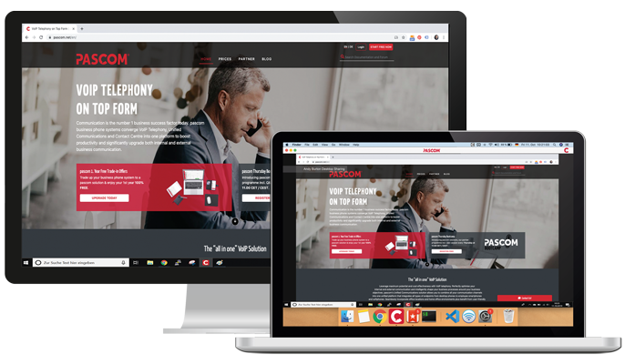
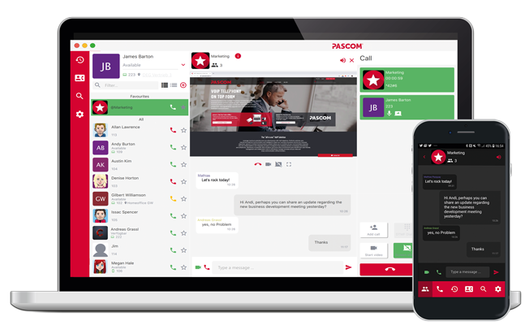

{}
**Want to test the pascom 19 BETA?** 
 
The simplest way to test the new BETA is with a new pascom.cloud FREE instance. These instances automatically use the pascom 19 BETA.  
 
**Would rather update?**  
* Onsite 18: Download the [BETA ISO file](https://www.pascom.net/en/downloads/) and perform an update.  
* Onsite 17 or older: Read the [Upgrade Guide]() and use the [BETA Iso](https://www.pascom.net/en/downloads/)  
* Cloud PREMIUM: please contact the pascom support.  
* Partner customers: please contact your pascom partner, who can support you with updating to the pascom 19 BETA.
{}

{}  

**Important Notice regarding this BETA Version:**     
1. Trunk Failover deleted without alternative tools. No migration and no direct workaround. Support can help with an outbound script, if needed.   
2. IAX trunks deleted without alternatives.   
3. beroNet is not yet supported in pascom 19 "BETA", will follow in next bugfix version.  
4. Swap is now disabled by default. This can break virtualised setups with memory lower then 1 GB, please configure more memory in this case.  
5. Call groups are automatically converted to teams. The callgroup feature has been removed and customers should configure teams instead.  
6. Public Announcement (PA) feature does not work.  
7. Port forwarding for UDP 3478 is now mandatory, otherwise video tools will not work.
{}

## Highlights
  
### pascom Video Conferencing 

55 % of communication is visual so add the personal, visual element to your face-to-face video meetings. With pascom’s native video conferencing suite, starting a video conference from your desktop, mobile device or in a huddle room is as simple as clicking a button and there’s no need for any additional software and avoids any browser compatibility issues.

### Screensharing

A picture says a thousand words and with pascom 19, adding yet more visual aids to your team collaboration and meetings is just a click away. The new screen sharing functionality is available on all devices and platforms to ensure that even remote workers are able to view shared presentations and share their own screens.

### pascom Groups with Audio, Video and Chat

Further enhance team collaboration with team messaging / team chat. Building on our “on the fly” group chat, with pascom 19 it is now possible to add “always-on” team messaging channels. Break down information silos by grouping users into departments, teams or projects and enable them to brainstorm ideas, share files and dynamically start audio / video conferences and desktop sharing sessions.

## Release 19.02 (22.11.2019)

**Auf einen Blick**

- Restabilised call pickups on the mobile client.
- Let's Encrypt certificates will once again be issued.

**ÄNDERUNGEN:** 

- [MD-11874] - Internal calls softphone to mobile can't be answered
- [MD-11876] - Port let's encrypt to 19
- [MD-11866] - Configure QOS/TOS in asterisk pjsip

## Release 19.01 (21.11.2019)

**Overview**

- Yealink BLF keys now show the correct current status.
- Resolved migration issues connected to call groups and actions.
- Yealink telephone call logs now consider the trunk prefix for call backs.
- Fixed microphone muting issues relating to external calls.
- Improved holding and retrieving / resuming multiple calls

**Modifications:** 

- [MD-11818] - Can't change password via client
- [MD-11819] - Invalid image.json configuration file for cs-proxy
- [MD-11823] - Error invalid wire type in xmpp log
- [MD-11831] - Mobile icon missing if user deactivates mobile in follow me
- [MD-11813] - Improve UI for creating the queue
- [MD-11843] - Redial on hardware phones is broken if trunk has 0 prefix
- [MD-11844] - Adapt Seabix trunk template
- [MD-11851] - Call Specific actions are broken for softphone calls
- [MD-11833] - Unreliable Yealink BLF
- [MD-11828] - Incorrect phone call data after the pickup
- [MD-11824] - pascom 19 migration bug if action of type "c" (callgroup) exists
- [MD-11821] - Error on restarting pbx containers
- [MD-11834] - Consul template service is not started in the cs-proxy container
- [MD-11380] - Export more instance level metrics to prometheus

## Release 19.00 (04.11.2019)

**Overview**

- Reworked Contacts / Contactlist
- New Searchfunction and Smartfilters
- Interactive Callobjects during a call
- Video and Screensharing functions
- pascom Groups. Permanent Audio, Video and Chat Groups
- Asterisk Update to Version 16 LTS
- Access to RTP Statistics
- Converted all trunk templates to pjsip syntax